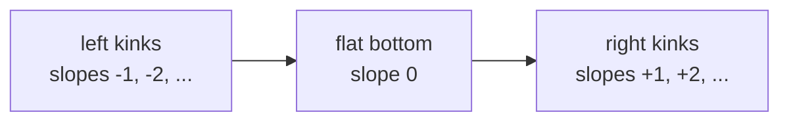
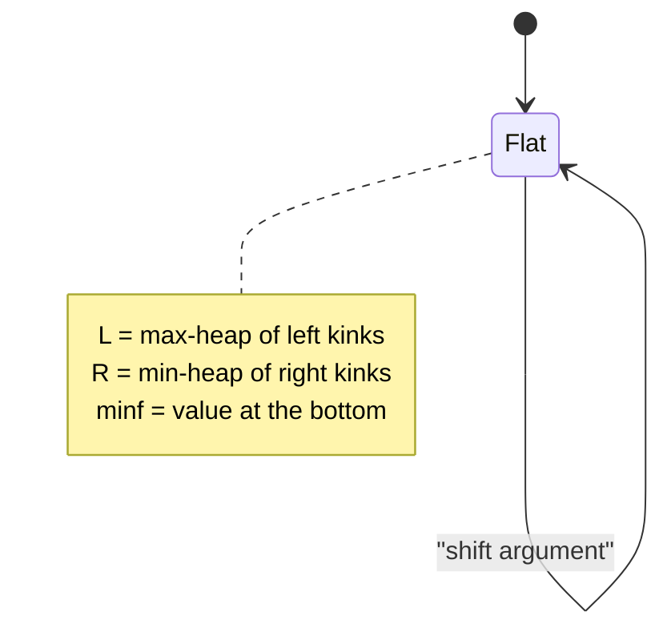
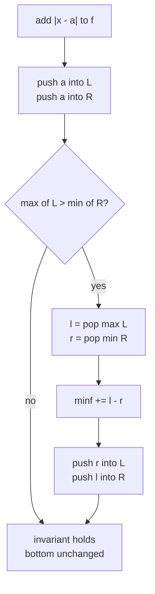
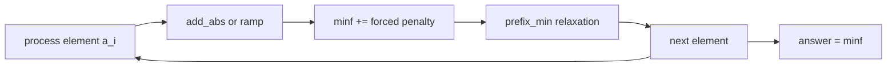
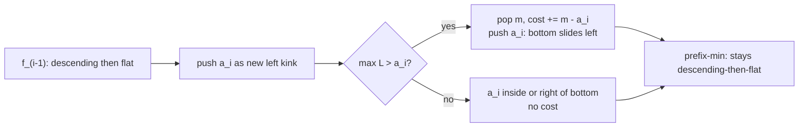

# Slope Trick

> Slope trick is a technique for dynamic programs whose value function $f(x)$ over a continuous (or integer) parameter $x$ is **convex and piecewise-linear**. Instead of storing $f$ as an array of values, we store only the **breakpoints** (the places where the slope changes) inside a priority queue or multiset. Each DP transition — adding $|x-a|$, adding a one-sided ramp $(x-a)_+$, taking a prefix/suffix minimum, or shifting the argument — becomes a cheap heap operation. This guide builds the whole machinery from scratch and applies it to the classic "make an array non-decreasing at minimum cost" problem.

## Table of Contents

1. [The Setting: Convex Piecewise-Linear DP](#the-setting-convex-piecewise-linear-dp)
2. [Representing f by Its Slope-Change Points](#representing-f-by-its-slope-change-points)
3. [Two Heaps: Left and Right of the Flat Bottom](#two-heaps-left-and-right-of-the-flat-bottom)
4. [Core Operation: Adding an Absolute Value](#core-operation-adding-an-absolute-value)
5. [Core Operation: One-Sided Ramps](#core-operation-one-sided-ramps)
6. [Core Operation: Prefix-Min Relaxation](#core-operation-prefix-min-relaxation)
7. [Core Operation: Shifting the Argument](#core-operation-shifting-the-argument)
8. [Tracking the Minimum Value](#tracking-the-minimum-value)
9. [Worked Problem: Make Array Non-Decreasing](#worked-problem-make-array-non-decreasing)
10. [Why Only the Left Heap Is Needed](#why-only-the-left-heap-is-needed)
11. [Recovering the Optimal Assignment](#recovering-the-optimal-assignment)
12. [Complexity Summary](#complexity-summary)
13. [Common Pitfalls](#common-pitfalls)
14. [Patterns](#patterns)

## The Setting: Convex Piecewise-Linear DP

Many one-dimensional optimization DPs have the shape

$$f_i(x) = \min_{y \le x} f_{i-1}(y) + \text{cost}_i(x),$$

where $x$ ranges over reals or integers and $\text{cost}_i$ is something like $|x - a_i|$. The crucial structural fact is:

> If $f_{i-1}$ is convex and piecewise-linear, and $\text{cost}_i$ is convex and piecewise-linear, then **so is $f_i$** — convexity is preserved by addition, by the prefix-minimum operation, and by argument shifts.

A convex piecewise-linear function looks like a sequence of straight segments whose slopes are **non-decreasing** from left to right. It descends (negative slopes), possibly flattens (slope $0$), then ascends (positive slopes).

```mermaid
xychart-beta
    title "A convex piecewise-linear f(x)"
    x-axis "x" [0, 1, 2, 3, 4, 5, 6, 7, 8]
    y-axis "f(x)" 0 --> 10
    line [8, 5, 3, 2, 2, 2, 4, 7, 11]
```

The function above has slopes $-3, -2, -1, 0, 0, +2, +3, +4$. They never decrease — that is exactly convexity for a piecewise-linear curve. The **flat bottom** (slope $0$) is the set of minimizers.

Because the only information that matters for these DP transitions is *where the slope changes and by how much*, we never need the explicit values. We store the breakpoints.

## Representing f by Its Slope-Change Points

For the integer / unit-slope version of slope trick (the most common competitive form), every kink changes the slope by exactly $+1$. So a convex function can be encoded by a **multiset of x-coordinates of kinks**, where a coordinate listed $k$ times means the slope jumps by $+k$ there.

Consider $f(x) = |x - a|$. Its slope is $-1$ for $x < a$ and $+1$ for $x > a$. The single point $a$ carries a slope jump of $+2$, so we record $a$ **twice** — once as the right end of the descending part and once as the left end of the ascending part.



This suggests splitting the breakpoints into two groups around the flat minimum:

- **Left group $L$** — kinks to the left of (or at) the bottom. We want fast access to the **largest** of these (the rightmost left-kink, i.e. the left edge of the bottom). Use a **max-heap**.
- **Right group $R$** — kinks to the right of the bottom. We want fast access to the **smallest** of these. Use a **min-heap**.

## Two Heaps: Left and Right of the Flat Bottom

Let $L$ be a max-heap and $R$ a min-heap. The invariant is

$$\max(L) \le \min(R),$$

meaning the flat bottom is the interval $[\max(L), \min(R)]$ and the optimum value $\text{minf}$ is stored separately.



```python
import heapq

class SlopeTrick:
    """Convex piecewise-linear f with unit slope changes."""
    def __init__(self):
        self.left = []        # max-heap (store negatives)
        self.right = []       # min-heap
        self.minf = 0         # f evaluated on the flat bottom
        self.add_l = 0        # lazy shift for left heap
        self.add_r = 0        # lazy shift for right heap

    def top_left(self):
        return -self.left[0] + self.add_l

    def top_right(self):
        return self.right[0] + self.add_r
```

```cpp
#include <bits/stdc++.h>
using namespace std;
const long long INF = 1e18;

struct SlopeTrick {
    // Convex piecewise-linear f with unit slope changes.
    priority_queue<long long> left;                                   // max-heap of left kinks
    priority_queue<long long, vector<long long>, greater<long long>> right; // min-heap
    long long minf = 0;   // f on the flat bottom
    long long add_l = 0;  // lazy shift for left heap
    long long add_r = 0;  // lazy shift for right heap

    long long top_left()  { return left.top()  + add_l; }
    long long top_right() { return right.top() + add_r; }
};
```

## Core Operation: Adding an Absolute Value

Adding $|x - a|$ to $f$ pushes one kink into each side, then repairs the invariant. The naive idea: push $a$ into $L$ and $a$ into $R$. But if $a$ falls outside the current bottom, the two new edges would violate $\max(L)\le\min(R)$, so we **swap** the offending elements and pay the gap into $\text{minf}$.

The standard "min of two heaps" insertion for $\min(f(x) + |x-a|)$ is:

1. Push $a$ into $L$ and push $a$ into $R$ (two copies of the kink, slope jump $+2$ split evenly).
2. If $\max(L) > \min(R)$, the heaps overlap. Pop $l=\max(L)$ and $r=\min(R)$, add $l-r$ to $\text{minf}$, then push $r$ back to $L$ and $l$ back to $R$.



A cleaner specialization used constantly: to compute $g(x) = \min_{y}\big(f(y) + |x-y|\big)$ is *not* what add-abs does — add-abs keeps the argument fixed. The version above is the in-place "$f \mathrel{+}= |x-a|$" update. Here is the implementation.

```python
    def add_abs(self, a):
        """f(x) += |x - a|."""
        l = self.top_left() if self.left else -10**18
        r = self.top_right() if self.right else 10**18
        self.minf += max(0, l - a) + max(0, a - r)
        heapq.heappush(self.left, -(min(a, r) - self.add_l))
        heapq.heappush(self.right, max(a, l) - self.add_r)
```

```cpp
    void add_abs(long long a) {
        // f(x) += |x - a|.
        long long l = left.empty()  ? -INF : top_left();
        long long r = right.empty() ?  INF : top_right();
        minf += max(0LL, l - a) + max(0LL, a - r);
        left.push(min(a, r) - add_l);
        right.push(max(a, l) - add_r);
    }
```

The added penalty $\max(0, l-a) + \max(0, a-r)$ is exactly the unavoidable cost: if $a$ sits left of the bottom we pay $l-a$, if right we pay $a-r$, if inside we pay $0$.

## Core Operation: One-Sided Ramps

Sometimes the cost is one-sided:

- $(x-a)_+ = \max(0, x-a)$ — slope $0$ then $+1$. Only a **right** kink at $a$.
- $(a-x)_+ = \max(0, a-x)$ — slope $-1$ then $0$. Only a **left** kink at $a$.

These are the building blocks for "you may only increase" or "you may only decrease" transitions.

```python
    def add_right_ramp(self, a):
        """f(x) += max(0, x - a)  ->  one right kink, may push the bottom left."""
        l = self.top_left() if self.left else -10**18
        self.minf += max(0, l - a)
        heapq.heappush(self.left, -(min(a, l) - self.add_l) if self.left else -(a - self.add_l))
        heapq.heappush(self.right, max(a, l) - self.add_r)

    def add_left_ramp(self, a):
        """f(x) += max(0, a - x)  ->  one left kink, may push the bottom right."""
        r = self.top_right() if self.right else 10**18
        self.minf += max(0, a - r)
        heapq.heappush(self.right, (max(a, r) - self.add_r) if self.right else (a - self.add_r))
        heapq.heappush(self.left, -(min(a, r) - self.add_l))
```

```cpp
    void add_right_ramp(long long a) {
        // f(x) += max(0, x - a): one right kink, may push the bottom left.
        long long l = left.empty() ? -INF : top_left();
        minf += max(0LL, l - a);
        left.push((left.empty() ? a : min(a, l)) - add_l);
        right.push(max(a, l) - add_r);
    }

    void add_left_ramp(long long a) {
        // f(x) += max(0, a - x): one left kink, may push the bottom right.
        long long r = right.empty() ? INF : top_right();
        minf += max(0LL, a - r);
        right.push((right.empty() ? a : max(a, r)) - add_r);
        left.push(min(a, r) - add_l);
    }
```

## Core Operation: Prefix-Min Relaxation

The transition $g(x) = \min_{y \le x} f(y)$ models *"the new value may stay the same or increase"* — typical for "make non-decreasing" DPs. Geometrically it **erases all ascending segments**: for any $x$ to the right of the bottom we are allowed to fall back to the bottom value, so the function becomes flat from the bottom onward.

$$g(x) = \begin{cases} f(x) & x \le \arg\min f \\ \min f & x > \arg\min f \end{cases}$$

Implementation: just **clear the right heap**. The left heap and $\text{minf}$ stay. Symmetrically, $\min_{y \ge x} f(y)$ clears the **left** heap.

```mermaid
xychart-beta
    title "Prefix-min: ascending part flattened"
    x-axis "x" [0, 1, 2, 3, 4, 5, 6, 7, 8]
    y-axis "value" 0 --> 10
    line [8, 5, 3, 2, 2, 2, 2, 2, 2]
```

```python
    def prefix_min(self):
        """g(x) = min_{y <= x} f(y): allow x to increase freely. Drop right kinks."""
        self.right = []
        self.add_r = 0

    def suffix_min(self):
        """g(x) = min_{y >= x} f(y): allow x to decrease freely. Drop left kinks."""
        self.left = []
        self.add_l = 0
```

```cpp
    void prefix_min() {
        // g(x) = min_{y <= x} f(y): allow x to increase freely. Drop right kinks.
        right = decltype(right)();
        add_r = 0;
    }

    void suffix_min() {
        // g(x) = min_{y >= x} f(y): allow x to decrease freely. Drop left kinks.
        left = decltype(left)();
        add_l = 0;
    }
```

## Core Operation: Shifting the Argument

A transition like $g(x) = f(x - d)$ (the next variable must exceed the previous by at least $d$, or any rigid translation) shifts **every** kink by $d$. With lazy offsets this is $O(1)$: add $d$ to both `add_l` and `add_r`. Asymmetric shifts (allow the right side to slide but not the left, e.g. $f(x-d)$ only for the increasing part) update a single offset.

```python
    def shift(self, dl, dr):
        """Shift left kinks by dl and right kinks by dr (lazy, O(1))."""
        self.add_l += dl
        self.add_r += dr
```

```cpp
    void shift(long long dl, long long dr) {
        // Shift left kinks by dl and right kinks by dr (lazy, O(1)).
        add_l += dl;
        add_r += dr;
    }
```

## Tracking the Minimum Value

Throughout, $\text{minf}$ holds $\min_x f(x)$. Every operation that forces overlap (the swap in `add_abs`, or the penalty in a ramp) adds exactly the height the bottom must rise. `prefix_min`, `suffix_min`, and `shift` never change $\min_x f$. So after processing the whole DP, the answer is simply `minf`.



## Worked Problem: Make Array Non-Decreasing

> Given $a_1,\dots,a_n$, choose $b_1 \le b_2 \le \dots \le b_n$ minimizing $\sum_i |a_i - b_i|$.

Define $f_i(x)$ = minimum cost for the prefix $a_1\dots a_i$ subject to $b_i = x$. The recurrence is

$$f_i(x) = |x - a_i| + \min_{y \le x} f_{i-1}(y).$$

The inner $\min_{y \le x}$ is a **prefix-min** (relax: $b_i$ only needs to be $\ge b_{i-1}$), and the outer term adds an absolute value. Both preserve convexity, so slope trick applies directly.

Remarkably, for this specific problem you only ever need the **left max-heap**. Here is the compact classic solution.

```python
import heapq

def min_cost_non_decreasing(a):
    """Minimum sum |a_i - b_i| with b non-decreasing. Left-heap slope trick."""
    left = []          # max-heap (store negatives)
    cost = 0
    for v in a:
        heapq.heappush(left, -v)
        if -left[0] > v:                 # current max kink exceeds v
            top = -heapq.heappop(left)   # pop it
            cost += top - v              # pay the overshoot
            heapq.heappush(left, -v)     # the bottom moves down to v
    return cost
```

```cpp
#include <bits/stdc++.h>
using namespace std;

long long min_cost_non_decreasing(const vector<long long>& a) {
    // Minimum sum |a_i - b_i| with b non-decreasing. Left-heap slope trick.
    priority_queue<long long> left; // max-heap
    long long cost = 0;
    for (long long v : a) {
        left.push(v);
        if (left.top() > v) {        // current max kink exceeds v
            long long top = left.top();
            left.pop();
            cost += top - v;         // pay the overshoot
            left.push(v);            // bottom moves down to v
        }
    }
    return cost;
}
```

## Why Only the Left Heap Is Needed

After the prefix-min step, the right (ascending) part of $f_{i-1}$ is erased — the function is flat from its bottom to $+\infty$. When we then add $|x - a_i|$, the new right kink lands on an already-flat region and contributes nothing we need to *query later*, because the **next** transition's prefix-min will erase it again. Inductively, at the start of every step the function is "descending then flat," fully described by the left heap plus $\text{minf}$.

Concretely, adding $|x-a_i|$ to a "descending-then-flat" function:

- Push $a_i$ into $L$.
- If $\max(L) > a_i$, the bottom was to the right of $a_i$; pop $\max(L)=m$, pay $m - a_i$, and push $a_i$ so the bottom slides left to $a_i$.

That is precisely the loop body above — the right heap is implicit and discarded each round.



## Recovering the Optimal Assignment

The heap version gives the optimal **cost** directly. To recover the actual $b_i$ values, run a second backward pass: the optimal $b_n$ is the left edge of the final bottom (the current $\max(L)$), and going backward each $b_{i}$ is clamped to be $\le b_{i+1}$:

$$b_i = \min(b_{i+1}, \; \text{left-edge of bottom after step } i).$$

Storing the popped/pushed left edge per step during the forward pass lets the backward clamp reconstruct a valid non-decreasing optimum.

```python
def reconstruct(a):
    """Return optimal non-decreasing b minimizing sum |a_i - b_i|."""
    left = []
    edges = []
    for v in a:
        heapq.heappush(left, -v)
        if -left[0] > v:
            heapq.heappop(left)
            heapq.heappush(left, -v)
        edges.append(-left[0])           # current bottom-left edge
    b = [0] * len(a)
    cur = edges[-1]
    for i in range(len(a) - 1, -1, -1):
        cur = min(cur, edges[i])
        b[i] = cur
    return b
```

```cpp
#include <bits/stdc++.h>
using namespace std;

vector<long long> reconstruct(const vector<long long>& a) {
    // Return optimal non-decreasing b minimizing sum |a_i - b_i|.
    priority_queue<long long> left;
    vector<long long> edges;
    for (long long v : a) {
        left.push(v);
        if (left.top() > v) { left.pop(); left.push(v); }
        edges.push_back(left.top());     // current bottom-left edge
    }
    int n = (int)a.size();
    vector<long long> b(n);
    long long cur = edges[n - 1];
    for (int i = n - 1; i >= 0; --i) {
        cur = min(cur, edges[i]);
        b[i] = cur;
    }
    return b;
}
```

## Complexity Summary

| Operation | Cost | Notes |
| --- | --- | --- |
| `add_abs` | $O(\log n)$ | two pushes, one possible swap |
| one-sided ramp | $O(\log n)$ | single kink + penalty |
| `prefix_min` / `suffix_min` | $O(1)$ amortized | drop one heap |
| `shift` | $O(1)$ | lazy offsets |
| query $\min_x f$ | $O(1)$ | read `minf` |
| Full non-decreasing DP | $O(n \log n)$ | $n$ pushes/pops |
| Space | $O(n)$ | heap of kinks |

## Common Pitfalls

- **Forgetting the slope is unit.** Classic slope trick assumes each kink changes slope by $\pm 1$. For weighted slope changes, push the coordinate with multiplicity or store `(coord, weight)`.
- **Wrong heap orientation.** Left side needs a **max**-heap (rightmost left-kink = left edge of bottom); right side needs a **min**-heap. In Python, negate for the max-heap.
- **Not paying `minf`.** Every time you pop-and-swap because $\max(L) > \min(R)$ (or a ramp lands outside the bottom), you must add the gap to `minf`; otherwise the cost is wrong.
- **Applying prefix-min on the wrong side.** "May increase" $\Rightarrow$ drop the **right** heap. "May decrease" $\Rightarrow$ drop the **left** heap. Mixing them silently gives wrong answers.
- **Lazy-offset sign errors.** When pushing a real coordinate $c$ into a heap with offset `add`, push $c - \text{add}$ so that reading back gives $c$ again.
- **Integer overflow in C++.** Costs accumulate; use `long long` and `const long long INF = 1e18`.

## Patterns

- **Convex + prefix-min DP** $\to$ slope trick with two heaps; whenever a "monotone constraint" (non-decreasing / non-increasing) appears, the prefix-min relaxation drops a heap.
- **Sum of absolute deviations** $\to$ medians and max-heaps; the bottom edge tracks a running (weighted) median.
- **One-directional edits** ("only increase," "only decrease," "buy/sell with fee") $\to$ one-sided ramps $(x-a)_+$.
- **Rigid translations / minimum gaps between consecutive choices** $\to$ lazy `shift` on the heaps.
- When the recurrence is $f_i(x) = \text{cost}_i(x) + \min_{y \le x} f_{i-1}(y)$ with convex $\text{cost}_i$, suspect slope trick before reaching for segment trees.
