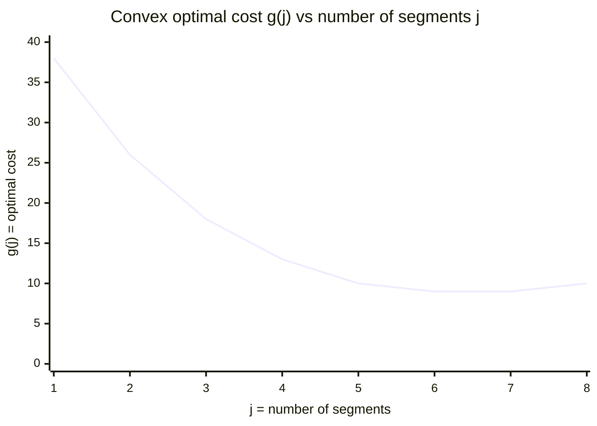
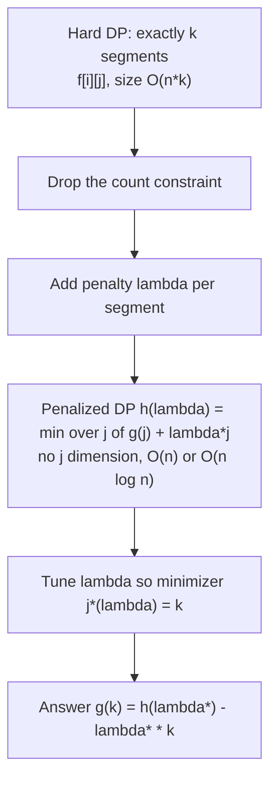
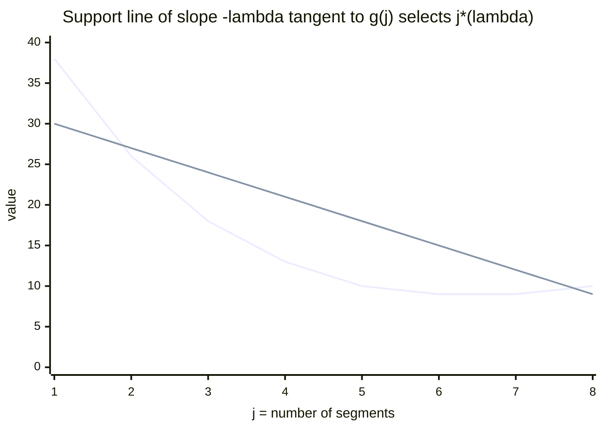
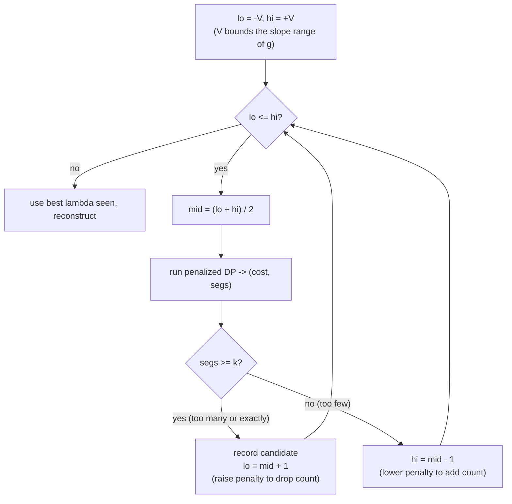
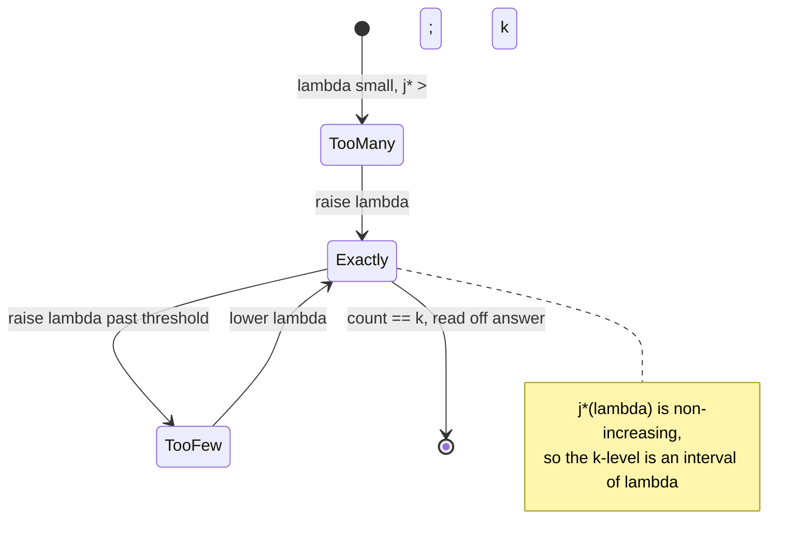
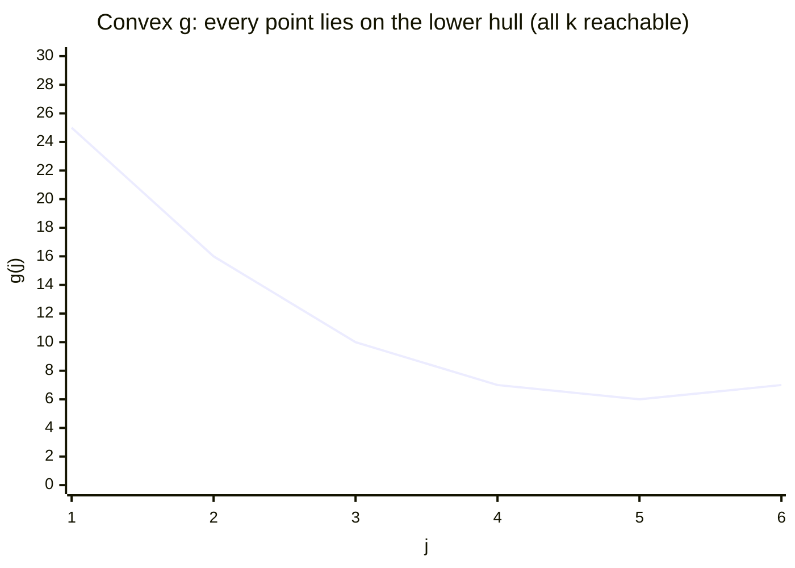
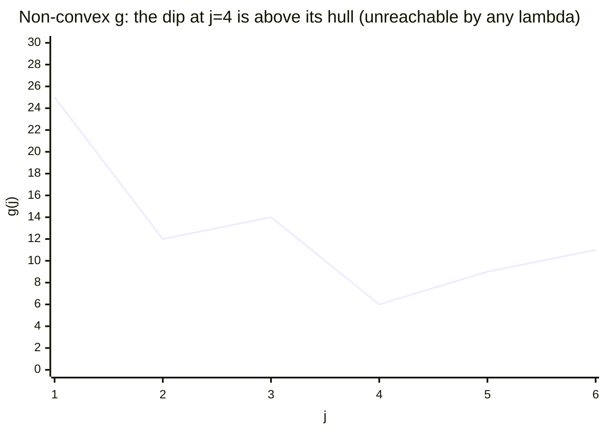
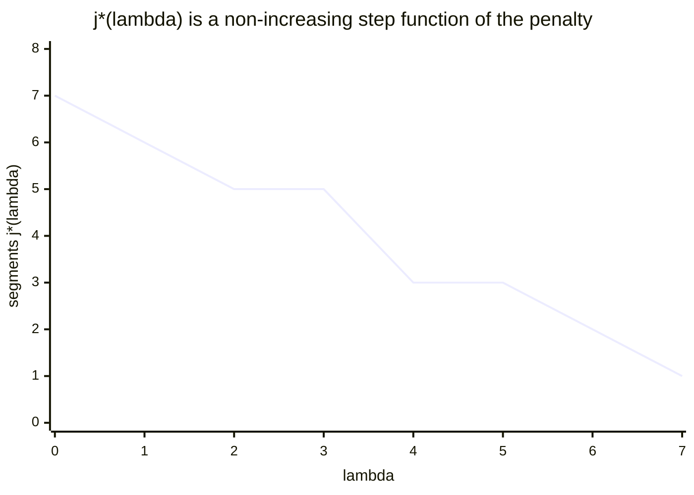
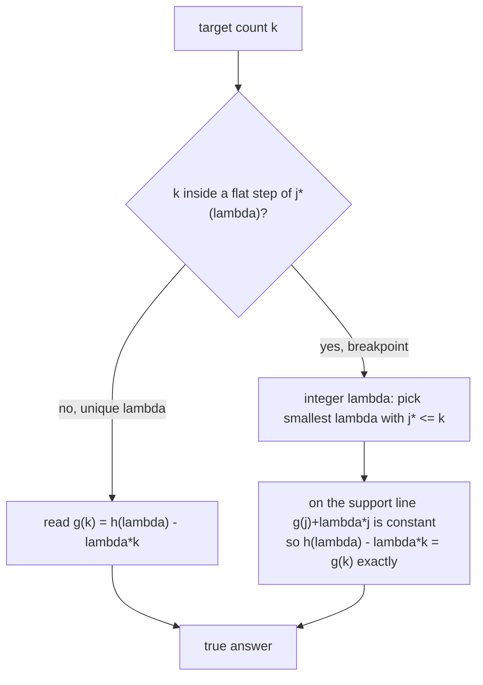

# Aliens Trick (Lagrangian / Aliens Optimization)

> The **Aliens trick** (named after IOI 2016 "Aliens") solves a DP that is forced to use **exactly $k$** items — $k$ segments, $k$ transactions, $k$ partitions — when the optimal cost as a function of $k$ is **convex**. Instead of carrying a second DP dimension over the count (which costs an extra factor of $k$), we *relax* the hard count constraint by attaching a **Lagrangian penalty** $\lambda$ to every used segment. The penalized DP has no count dimension and runs fast; we then **binary-search $\lambda$** until the unconstrained optimum happens to use exactly $k$ segments, and finally subtract the penalty to recover the true answer. This guide builds the technique rigorously, proves the monotonicity that makes the binary search valid, and handles the integer-$\lambda$ tie-breaking that is the usual source of bugs.

## Table of Contents

1. [The Setting: A DP Constrained to Exactly k](#the-setting-a-dp-constrained-to-exactly-k)
2. [The Idea: Attach a Lagrangian Penalty](#the-idea-attach-a-lagrangian-penalty)
3. [Solving the Penalized DP Quickly](#solving-the-penalized-dp-quickly)
4. [Binary-Searching Lambda](#binary-searching-lambda)
5. [The Convexity Requirement and Why It Is Needed](#the-convexity-requirement-and-why-it-is-needed)
6. [Monotonicity: Segment Count Is Non-Increasing in Lambda](#monotonicity-segment-count-is-non-increasing-in-lambda)
7. [Integer vs Real Lambda and Tie-Breaking to Hit Exactly k](#integer-vs-real-lambda-and-tie-breaking-to-hit-exactly-k)
8. [Recovering the True Answer](#recovering-the-true-answer)
9. [Reference Implementation](#reference-implementation)
10. [Complexity Summary](#complexity-summary)
11. [Common Pitfalls](#common-pitfalls)
12. [Patterns](#patterns)

## The Setting: A DP Constrained to Exactly k

Many problems have the shape: *partition / cover / process an array of length $n$ using **exactly $k$** structural units, minimizing (or maximizing) a separable cost.* The natural DP carries the count as a dimension:

$$f[i][j] = \text{best cost using the first } i \text{ elements with exactly } j \text{ segments.}$$

This is correct but the table is $O(nk)$ in size and each transition may scan back, giving $O(n^2 k)$ or, with optimizations (divide-and-conquer / Knuth / convex-hull), $O(nk\log n)$ or $O(nk)$. When $k$ is large (up to $n$), the extra $j$-dimension is the bottleneck.

Define

$$g(j) = f[n][j] = \text{optimal cost using exactly } j \text{ segments.}$$

The Aliens trick applies precisely when $g$ is a **convex** function of $j$. Convexity means the marginal benefit of adding one more segment is *diminishing* (for minimization, the marginal *cost* of the constraint is non-decreasing): the cost curve bends one consistent way.



Because $g$ is convex, its discrete slopes $g(j) - g(j-1)$ are **monotone**. That single fact is the engine of the whole method: a line of slope $\lambda$ can be slid until it is *tangent* to the curve, and the tangent point tells us which $j$ a given penalty selects.

## The Idea: Attach a Lagrangian Penalty

Hard constraint "use exactly $k$ segments" is awkward because it couples the whole DP. **Lagrangian relaxation** removes it: we drop the constraint and instead **pay a fixed penalty $\lambda$ for every segment used**. Define the penalized objective (for a minimization problem)

$$g_\lambda(j) = g(j) + \lambda \, j, \qquad h(\lambda) = \min_{j} \big( g(j) + \lambda\, j \big).$$

Here $h(\lambda)$ is the value of an **unconstrained** DP: it freely chooses how many segments to use, but each one costs an extra $\lambda$. Geometrically, $g(j) + \lambda j$ is the original convex curve with a line of slope $-\lambda$ added; minimizing over $j$ slides a support line of slope $-\lambda$ up against the curve and reads off the touching point.

$$\underbrace{\min_j g(j) \ \text{s.t.}\ j = k}_{\text{hard, expensive}} \quad\longrightarrow\quad \underbrace{\min_j \big(g(j) + \lambda j\big)}_{\text{free, cheap}} \ \text{tuned so the minimizer is } j^\*(\lambda) = k.$$

The Lagrangian dual bound is $h(\lambda) - \lambda k \le g(k)$ for every $\lambda$, with **equality** at the right $\lambda$ exactly because $g$ is convex (no duality gap for convex $g$). So if we find $\lambda^\*$ whose penalized DP uses $k$ segments, then

$$g(k) = h(\lambda^\*) - \lambda^\* k.$$



The tangent-line picture: the penalized optimum at penalty $\lambda$ touches the convex curve where its slope equals $-\lambda$. Changing $\lambda$ rotates which point is selected.



## Solving the Penalized DP Quickly

Once the count constraint is gone, the penalized DP is a plain "cut the array into some number of segments" DP where opening a segment costs an extra $\lambda$. We track **two values together**: the best penalized cost, and (for tie-breaking) the number of segments achieving it.

A typical 1-D form: let $dp[i]$ be the best penalized cost for the prefix of length $i$, and $cnt[i]$ the number of segments used to achieve $dp[i]$.

$$dp[i] = \min_{0 \le p < i} \Big( dp[p] + \mathrm{cost}(p, i) + \lambda \Big).$$

The $+\lambda$ is the penalty for the one new segment $(p, i]$. This inner minimization is often $O(1)$ amortized via convex-hull trick, divide-and-conquer, monotonic pointers, or — for problems like buy/sell stock — collapses to an $O(n)$ greedy state machine. The crucial bookkeeping is that **when two transitions tie on cost, we pick the one with the smaller (or larger) segment count** consistently, which lets the returned $j^\*(\lambda)$ land on either end of the optimal-count interval.

```python
def penalized_dp(cost_prefix, n, lam):
    """Generic O(n^2) penalized split DP (replace inner loop with CHT/DnC to speed up).
    Returns (best_penalized_cost, segments_used). Ties broken toward FEWER segments."""
    INF = float("inf")
    dp = [INF] * (n + 1)
    cnt = [0] * (n + 1)
    dp[0] = 0
    for i in range(1, n + 1):
        for p in range(0, i):
            seg = cost_prefix(p, i) + lam          # cost of segment (p, i] plus penalty
            cand = dp[p] + seg
            # tie-break: prefer fewer segments, so use < (strict) and >= for equal-cost fewer
            if cand < dp[i] or (cand == dp[i] and cnt[p] + 1 < cnt[i]):
                dp[i] = cand
                cnt[i] = cnt[p] + 1
    return dp[n], cnt[n]
```

```cpp
#include <bits/stdc++.h>
using namespace std;
const long long INF = 1e18;

// Generic O(n^2) penalized split DP (replace inner loop with CHT/DnC to speed up).
// Returns {best_penalized_cost, segments_used}. Ties broken toward FEWER segments.
pair<long long,long long> penalized_dp(
        const function<long long(long long,long long)>& cost, long long n, long long lam) {
    vector<long long> dp(n + 1, INF), cnt(n + 1, 0);
    dp[0] = 0;
    for (long long i = 1; i <= n; ++i) {
        for (long long p = 0; p < i; ++p) {
            long long seg = cost(p, i) + lam;       // cost of segment (p, i] plus penalty
            long long cand = dp[p] + seg;
            // tie-break: prefer fewer segments
            if (cand < dp[i] || (cand == dp[i] && cnt[p] + 1 < cnt[i])) {
                dp[i] = cand;
                cnt[i] = cnt[p] + 1;
            }
        }
    }
    return {dp[n], cnt[n]};
}
```

## Binary-Searching Lambda

Let $j^\*(\lambda)$ be the number of segments the penalized DP uses at penalty $\lambda$. As proven below, $j^\*(\lambda)$ is **non-increasing** in $\lambda$: a bigger penalty discourages segments. Therefore we can binary-search $\lambda$ to make $j^\*(\lambda) = k$.

- Penalty too small ($\lambda$ low) $\Rightarrow$ segments are "cheap" $\Rightarrow$ the DP uses **too many** ($j^\* > k$).
- Penalty too large ($\lambda$ high) $\Rightarrow$ segments are "expensive" $\Rightarrow$ the DP uses **too few** ($j^\* < k$).

We search for the threshold $\lambda$ where the count crosses $k$.





## The Convexity Requirement and Why It Is Needed

The trick is **only valid when $g(j)$ is convex** (for minimization; concave for maximization). Two distinct things break without convexity:

1. **The dual has a gap.** The relaxation only ever computes $h(\lambda) - \lambda k = \min_j\big(g(j) - \lambda(k - j)\big)$, which is the value of $g$ read along its **lower convex hull**. If $g$ is non-convex, some $j$ — possibly $j = k$ — lies *strictly above* its hull and is **never** the minimizer of $g(j) + \lambda j$ for *any* $\lambda$. No penalty selects it, so the method cannot return $g(k)$.

2. **Monotonicity of $j^\*(\lambda)$ fails.** The binary search relies on the count moving in one direction as $\lambda$ grows. Without convex slopes, $j^\*(\lambda)$ can oscillate and the search has no well-defined target.

The picture: a support line of slope $-\lambda$ can only ever touch points **on the convex hull** of the graph of $g$. Convex $g$ ⇒ every $j$ is on its own hull ⇒ every $k$ is reachable.





Convexity is usually argued by an **exchange / SMAWL** argument on the cost function, or by the fact that the cost of a segment satisfies the **quadrangle (Monge) inequality** $\mathrm{cost}(a,c) + \mathrm{cost}(b,d) \le \mathrm{cost}(a,d) + \mathrm{cost}(b,c)$ for $a \le b \le c \le d$, which forces $g$ to be convex in the number of segments.

## Monotonicity: Segment Count Is Non-Increasing in Lambda

**Claim.** If $g$ is convex, then a minimizer $j^\*(\lambda)$ of $g(j) + \lambda j$ is non-increasing in $\lambda$.

**Proof.** Take $\lambda_1 < \lambda_2$ and let $j_1 = j^\*(\lambda_1)$, $j_2 = j^\*(\lambda_2)$ be respective minimizers. Optimality gives

$$g(j_1) + \lambda_1 j_1 \le g(j_2) + \lambda_1 j_2, \qquad g(j_2) + \lambda_2 j_2 \le g(j_1) + \lambda_2 j_1.$$

Add the two inequalities and cancel $g(j_1) + g(j_2)$:

$$\lambda_1 j_1 + \lambda_2 j_2 \le \lambda_1 j_2 + \lambda_2 j_1 \;\Longrightarrow\; (\lambda_2 - \lambda_1)(j_2 - j_1) \le 0.$$

Since $\lambda_2 - \lambda_1 > 0$, we get $j_2 - j_1 \le 0$, i.e. $j_2 \le j_1$. The minimizing segment count does not increase as the penalty grows. $\blacksquare$

This is the exact property the binary search exploits: define the predicate $P(\lambda) = [\,j^\*(\lambda) \ge k\,]$. It is **true for small $\lambda$** and **false for large $\lambda$** with a single crossing, so it is binary-searchable. Note $j^\*(\lambda)$ is a *step* function — flat over intervals of $\lambda$ and dropping at slope-change points — which is why exact-$k$ may require care at a step (next section).



## Integer vs Real Lambda and Tie-Breaking to Hit Exactly k

Because $g$ is convex but **piecewise-linear** in $j$, the dual function $h(\lambda)$ is piecewise linear in $\lambda$, and $j^\*(\lambda)$ jumps at the **breakpoints** (the slopes $g(j+1) - g(j)$). At a breakpoint $\lambda_0$, *multiple* segment counts are simultaneously optimal — exactly the interval $[j_{\text{lo}}, j_{\text{hi}}]$ whose costs lie on the same support line. If our target $k$ falls in that flat interval, **no single $\lambda$ uniquely yields $j^\* = k$** unless we control the tie-break.

Two standard remedies:

- **Real $\lambda$ + tie-break the count.** Run the penalized DP so that, among cost-optimal solutions, it returns the **minimum** segment count $j_{\min}(\lambda)$ (or the maximum $j_{\max}(\lambda)$). Binary-search the smallest $\lambda$ with $j_{\min}(\lambda) \le k \le j_{\max}(\lambda)$; both bounds are computable by running the DP twice with opposite tie-break rules.

- **Integer $\lambda$.** When costs are integers and slopes are integers, search $\lambda$ over integers. Pick the smallest integer $\lambda$ with $j^\*(\lambda) \le k$ (using the *fewer-segments* tie-break). At that $\lambda$ the answer is

$$g(k) = \big(h(\lambda) - \lambda k\big),$$

valid even when $k$ sits inside a flat step, because along a single support line $g(j) + \lambda j$ is **constant**, so $h(\lambda) - \lambda k = g(k)$ for every $k$ in the interval. This is the cleanest and most common implementation.



## Recovering the True Answer

The penalized DP returns $h(\lambda) = \min_j\big(g(j) + \lambda j\big)$, which **includes** the artificial penalty $\lambda$ per segment. We never wanted that penalty; it was scaffolding to dissolve the constraint. Once $\lambda^\*$ makes the DP use $k$ segments, **subtract the total penalty $\lambda^\* k$** to get back the genuine cost:

$$\boxed{\,g(k) = h(\lambda^\*) - \lambda^\* \, k\,.}$$

For a **maximization** problem the curve is concave, the penalty is *subtracted* per segment ($g(j) - \lambda j$), $j^\*(\lambda)$ is non-decreasing in $\lambda$, and we add the penalty back. The structure is identical; only signs flip.

## Reference Implementation

A complete template: penalized DP with count tie-break, plus the integer binary search on $\lambda$, plus answer recovery.

```python
def aliens_trick(n, k, cost, slope_bound):
    """Split [0, n) into exactly k segments minimizing total segment cost.
    `cost(p, i)` = cost of segment covering [p, i). g(j) must be convex in j.
    `slope_bound` V bounds |g(j) - g(j-1)|. Returns the exact minimum cost for k segments."""
    INF = float("inf")

    def solve(lam):
        # Penalized DP: every segment costs an extra `lam`.
        # Ties broken toward FEWER segments so solve returns j_min(lam).
        dp = [INF] * (n + 1)
        cnt = [0] * (n + 1)
        dp[0] = 0
        for i in range(1, n + 1):
            for p in range(i):
                if dp[p] == INF:
                    continue
                cand = dp[p] + cost(p, i) + lam
                if cand < dp[i] or (cand == dp[i] and cnt[p] + 1 < cnt[i]):
                    dp[i] = cand
                    cnt[i] = cnt[p] + 1
        return dp[n], cnt[n]

    lo, hi = -slope_bound, slope_bound
    best = None
    # Find the smallest lambda whose penalized optimum uses <= k segments.
    while lo <= hi:
        mid = (lo + hi) // 2
        pen_cost, segs = solve(mid)
        if segs <= k:
            best = (pen_cost, mid)
            hi = mid - 1            # try a smaller penalty (allows more segments)
        else:
            lo = mid + 1            # too many segments, raise penalty
    pen_cost, lam = best
    return pen_cost - lam * k       # subtract the k * lambda penalty back out
```

```cpp
#include <bits/stdc++.h>
using namespace std;
const long long INF = 1e18;

// Split [0, n) into exactly k segments minimizing total segment cost.
// cost(p, i) = cost of segment covering [p, i). g(j) must be convex in j.
// slope_bound V bounds |g(j) - g(j-1)|. Returns the exact minimum cost for k segments.
long long aliens_trick(long long n, long long k,
                       const function<long long(long long,long long)>& cost,
                       long long slope_bound) {
    // Penalized DP: every segment costs an extra `lam`.
    // Ties broken toward FEWER segments so solve returns j_min(lam).
    auto solve = [&](long long lam) -> pair<long long,long long> {
        vector<long long> dp(n + 1, INF), cnt(n + 1, 0);
        dp[0] = 0;
        for (long long i = 1; i <= n; ++i) {
            for (long long p = 0; p < i; ++p) {
                if (dp[p] == INF) continue;
                long long cand = dp[p] + cost(p, i) + lam;
                if (cand < dp[i] || (cand == dp[i] && cnt[p] + 1 < cnt[i])) {
                    dp[i] = cand;
                    cnt[i] = cnt[p] + 1;
                }
            }
        }
        return {dp[n], cnt[n]};
    };

    long long lo = -slope_bound, hi = slope_bound;
    long long best_cost = INF, best_lam = 0;
    // Find the smallest lambda whose penalized optimum uses <= k segments.
    while (lo <= hi) {
        long long mid = (lo + hi) / 2;          // floor division toward -inf in C++ for negatives: see note
        auto [pen_cost, segs] = solve(mid);
        if (segs <= k) {
            best_cost = pen_cost; best_lam = mid;
            hi = mid - 1;                        // try a smaller penalty (allows more segments)
        } else {
            lo = mid + 1;                        // too many segments, raise penalty
        }
    }
    return best_cost - best_lam * k;             // subtract the k * lambda penalty back out
}
```

## Complexity Summary

| Quantity | Naive count DP | Aliens trick |
| --- | --- | --- |
| State / objective | $f[i][j]$, exactly $j$ segments | penalized $dp[i]$, no $j$ dimension |
| One penalized DP | — | $T(n)$ (often $O(n)$ or $O(n\log n)$) |
| Lambda search | — | $O(\log V)$ iterations, $V$ = slope range |
| Total time | $O(n^2 k)$ / $O(nk\log n)$ | $O\big(T(n)\,\log V\big)$ |
| Total space | $O(nk)$ | $O(n)$ |
| Requirement | none | $g(j)$ **convex** in $j$ |

## Common Pitfalls

- **Forgetting convexity.** Verify $g(j)$ is convex (Monge / exchange argument). If it is not, the trick silently returns a wrong (hull) value — there is no error, just an incorrect answer.
- **Not subtracting the penalty.** The DP returns $h(\lambda) = g(k) + \lambda k$. The final answer is $h(\lambda) - \lambda k$; forgetting this off-by-$\lambda k$ is the most common bug.
- **No tie-break on segment count.** When $k$ lands on a breakpoint, the DP must consistently return the min (or max) segment count; otherwise the binary search may never report `segs == k` and you cannot pin $\lambda$.
- **Integer search with non-integer slopes.** Integer $\lambda$ only works when slopes are integers. With fractional costs, either scale to integers or binary-search real $\lambda$ with the two-tie-break bracketing.
- **Wrong sign for maximization.** For maximization $g$ is concave, the penalty is subtracted, and $j^\*(\lambda)$ is non-decreasing. Mixing the minimization template with a max objective inverts the search direction.
- **Lambda bounds too tight.** `slope_bound` $V$ must exceed $\max_j |g(j) - g(j-1)|$; too small a range clips the tangent and the search fails to reach `segs == k`.
- **C++ integer division of negatives.** `(lo + hi) / 2` truncates toward zero; for safe midpoint over a signed range prefer `lo + (hi - lo) / 2` to avoid overflow and asymmetric rounding.

## Patterns

- **Exactly-$k$ partition with convex cost** → Aliens trick over $\lambda$, penalized split DP inside.
- **At-most-$k$ transactions / segments** → same trick; "at most" relaxes to "exactly" since extra segments never help once penalized, or clamp $k \le j^\*(0)$.
- **Convex cost via Monge** → if segment cost is Monge, $g(j)$ is convex automatically; pairs with divide-and-conquer or convex-hull optimization for the inner DP.
- **Tangent / support-line intuition** → whenever a problem asks "best with exactly $k$ of something" and the unconstrained version is fast, suspect Aliens.
- **Penalty recovery** → any Lagrangian relaxation: solve cheap penalized problem, then correct by the known penalty total.
