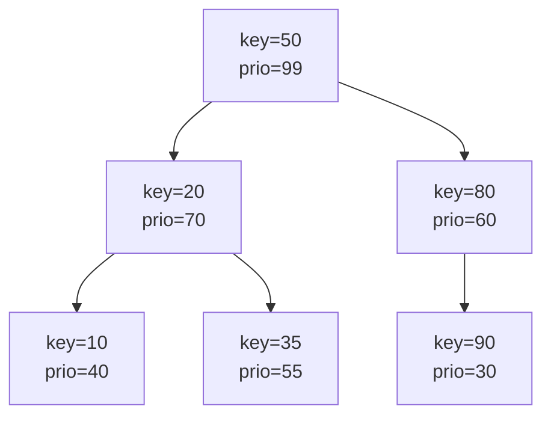
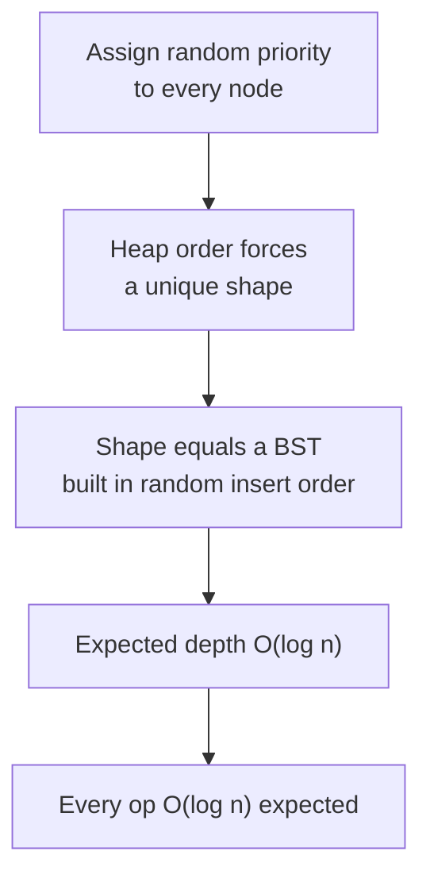
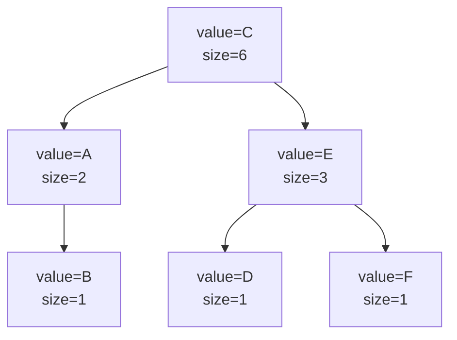
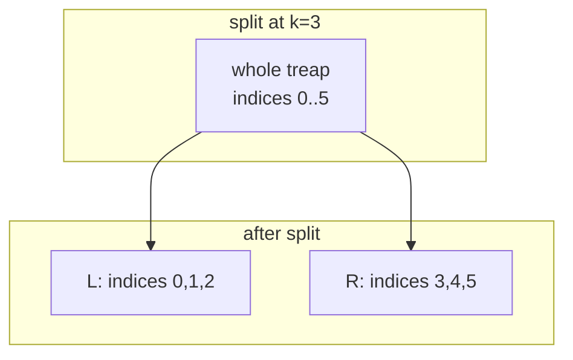
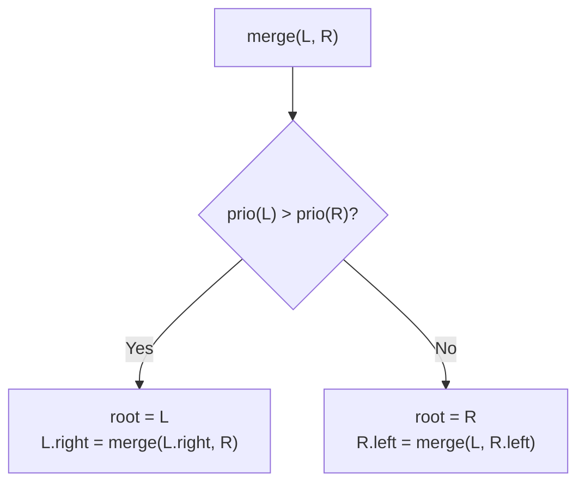
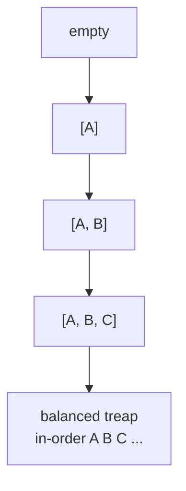
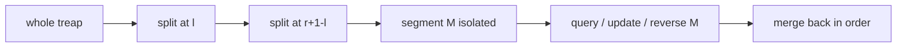
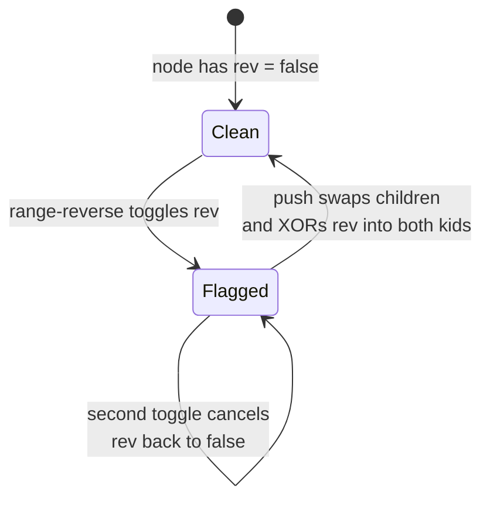
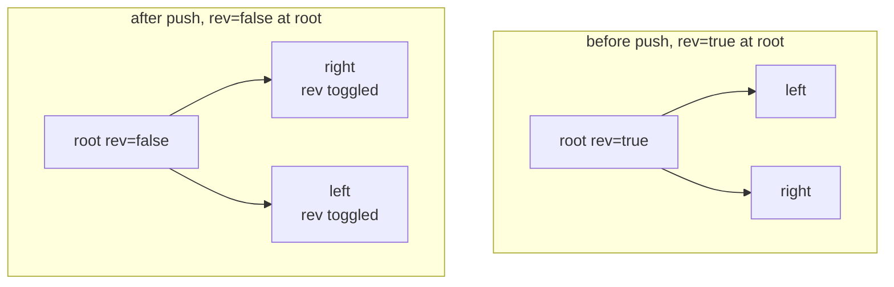
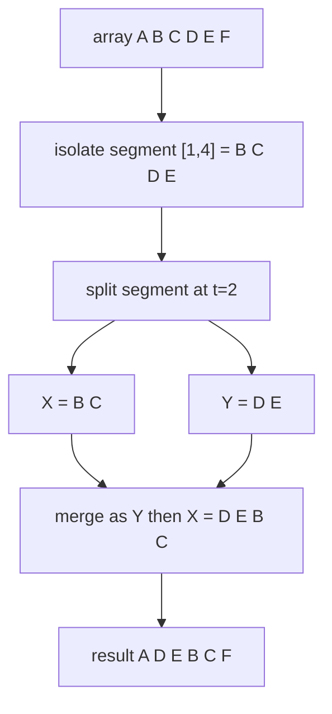

# Implicit Treap: A Balanced Array with Logarithmic Surgery

> A treap is a binary search tree whose shape is randomized so it stays balanced *in expectation*. An **implicit treap** throws away the stored keys and instead treats each node's **position in the in-order traversal** as its key — a key that is never stored but **reconstructed from subtree sizes**. The payoff is a data structure that behaves like an array yet supports `insert`, `erase`, range queries, range updates, **range reverse**, and **cut-and-paste of subarrays**, all in $O(\log n)$ expected time.

## Table of Contents

1. [Recap: What Is a Treap?](#recap-what-is-a-treap)
2. [Why Random Priorities Keep It Balanced](#why-random-priorities-keep-it-balanced)
3. [The Implicit Key Idea](#the-implicit-key-idea)
4. [The Two Primitives: Split and Merge](#the-two-primitives-split-and-merge)
5. [Building an Array as a Treap](#building-an-array-as-a-treap)
6. [Point and Range Operations](#point-and-range-operations)
7. [Maintaining Subtree Aggregates with Pull](#maintaining-subtree-aggregates-with-pull)
8. [Lazy Propagation and Range Reverse](#lazy-propagation-and-range-reverse)
9. [Rotating and Cutting-and-Pasting Subarrays](#rotating-and-cutting-and-pasting-subarrays)
10. [A Complete Implicit Treap](#a-complete-implicit-treap)
11. [Complexity Summary](#complexity-summary)
12. [Common Pitfalls](#common-pitfalls)
13. [Patterns](#patterns)

---

## Recap: What Is a Treap?

A **treap** (tree + heap) is a binary tree where every node carries two values:

- a **key**, by which the tree is a **binary search tree** (in-order traversal yields keys in sorted order), and
- a **priority**, by which the tree is a **max-heap** (every node's priority is $\ge$ both children's priorities).

Given a fixed *set* of (key, priority) pairs with distinct keys and distinct priorities, the treap shape is **uniquely determined**: the node with the maximum priority must be the root (heap rule), the keys smaller than the root form the left subtree, the larger keys form the right subtree (BST rule), and we recurse.



Read the keys in-order: $10, 20, 35, 50, 80, 90$ — sorted. Read priorities top-down: each parent dominates its children. Both invariants hold simultaneously.

---

## Why Random Priorities Keep It Balanced

Here is the trick: if we choose each node's priority **uniformly at random**, then the resulting tree is *exactly* the binary search tree we would have built by inserting the keys in a **random order** (the order being the sorted-by-priority order). A randomly built BST has expected depth $O(\log n)$.

Formally, let the keys be $x_1 < x_2 < \dots < x_n$. Node $x_j$ is an ancestor of node $x_i$ **iff** $x_j$ has the largest priority among all keys in the contiguous range between them. There are $|i - j| + 1$ such candidates, each equally likely to be the max, so

$$
\Pr[x_j \text{ is an ancestor of } x_i] = \frac{1}{|i - j| + 1}.
$$

The expected depth of $x_i$ is the sum over all $j$ of this probability, which is two partial harmonic sums:

$$
\mathbb{E}[\text{depth}(x_i)] = \sum_{j \ne i} \frac{1}{|i-j|+1} \le 2 H_n = 2\big(\ln n + O(1)\big) = O(\log n).
$$

Because each operation walks a root-to-node path, every operation costs $O(\log n)$ **in expectation** — no rotations, no rebalancing rules, just randomness. The worst case is $O(n)$ but occurs with probability astronomically small.



---

## The Implicit Key Idea

In an ordinary treap the key is *stored* and used for comparisons. In an **implicit treap** we want the structure to behave like an **array** indexed by position $0, 1, 2, \dots$. The position of a node is simply **how many nodes precede it in the in-order traversal** — which equals the size of its left subtree plus the number of preceding elements contributed by ancestors.

So the "key" of a node is its **in-order index**, and we never store it. Instead each node stores the **size of its subtree**:

$$
\text{size}(v) = \text{size}(\text{left}(v)) + 1 + \text{size}(\text{right}(v)).
$$

When we descend looking for position $k$ inside a subtree rooted at $v$, we compare $k$ against $\text{size}(\text{left}(v))$:

- if $k < \text{size}(\text{left}(v))$, go left (the index lives in the left subtree);
- if $k = \text{size}(\text{left}(v))$, $v$ itself is the $k$-th element;
- otherwise go right, searching for position $k - \text{size}(\text{left}(v)) - 1$.

This is the only change from a normal treap, and it is profound: **inserting or deleting an element shifts the implicit keys of everything to its right by one, automatically**, because indices are computed from sizes rather than stored. No re-labeling is ever needed.



In-order reads $A, B, C, D, E, F$ — that is array index $0,1,2,3,4,5$. The root `C` sits at index $2$ because its left subtree has size $2$.

---

## The Two Primitives: Split and Merge

Everything an implicit treap does is built from two operations.

**`merge(L, R)`** assumes *every* index in treap `L` comes before *every* index in treap `R` (i.e. `L` holds the left segment, `R` the right). It returns one treap containing all elements, choosing the root by priority: whichever of the two roots has the higher priority becomes the new root, and we recurse on the appropriate side. Heap order is preserved; in-order order is the concatenation.

**`split(T, k)`** splits treap `T` into `(L, R)` where `L` holds the **first $k$ elements** (indices $0 \dots k-1$) and `R` holds the rest (indices $k \dots n-1$). We descend using the implicit-key comparison: at node `v` with left size $s$, if $k \le s$ the whole right side of `v` (and `v` itself) belongs to `R`, so we recurse left; otherwise `v` and its left subtree stay in `L` and we recurse right with $k$ reduced by $s + 1$.

> **Split semantics matter.** `split(T, k)` puts **exactly $k$ elements** in the left result. So `split(T, 0)` gives `(empty, T)` and `split(T, n)` gives `(T, empty)`. To isolate the half-open range $[l, r)$, do `split(T, l) -> (A, B)` then `split(B, r - l) -> (M, C)`; now `M` is the range, and the original is `merge(A, merge(M, C))`.



Here is `merge` viewed as choosing the higher-priority root:



The paired primitives:

```python
def split(t, k):
    # left gets the first k elements, right gets the rest
    if t is None:
        return None, None
    push(t)
    left_size = size(t.left)
    if left_size >= k:
        l, t.left = split(t.left, k)
        pull(t)
        return l, t
    else:
        t.right, r = split(t.right, k - left_size - 1)
        pull(t)
        return t, r

def merge(l, r):
    # every index in l precedes every index in r
    if l is None:
        return r
    if r is None:
        return l
    if l.prio > r.prio:
        push(l)
        l.right = merge(l.right, r)
        pull(l)
        return l
    else:
        push(r)
        r.left = merge(l, r.left)
        pull(r)
        return r
```

```cpp
#include <bits/stdc++.h>
using namespace std;

// split: left gets the first k elements, right gets the rest
void split(Node* t, int k, Node*& l, Node*& r) {
    if (t == nullptr) { l = r = nullptr; return; }
    push(t);
    int leftSize = size(t->left);
    if (leftSize >= k) {
        split(t->left, k, l, t->left);
        r = t;
    } else {
        split(t->right, k - leftSize - 1, t->right, r);
        l = t;
    }
    pull(t);
}

// merge: every index in l precedes every index in r
Node* merge(Node* l, Node* r) {
    if (l == nullptr) return r;
    if (r == nullptr) return l;
    if (l->prio > r->prio) {
        push(l);
        l->right = merge(l->right, r);
        pull(l);
        return l;
    } else {
        push(r);
        r->left = merge(l, r->left);
        pull(r);
        return r;
    }
}
```

---

## Building an Array as a Treap

The simplest build is to `merge` single-node treaps left to right, giving an $O(n \log n)$ construction. A linear-time build uses a **stack** (each value's priority is random; we attach using the monotonic-stack Cartesian-tree trick), but $O(n \log n)$ is fine for nearly all problems.

```python
import random

def build(values):
    root = None
    for v in values:
        node = Node(v)
        root = merge(root, node)   # append at the end
    return root
```

```cpp
#include <bits/stdc++.h>
using namespace std;

Node* build(const vector<long long>& values) {
    Node* root = nullptr;
    for (long long v : values) {
        Node* node = new_node(v);
        root = merge(root, node);  // append at the end
    }
    return root;
}
```

Conceptually each value enters at the right end and the random priorities reshuffle the tree into a balanced shape:



---

## Point and Range Operations

Every operation reduces to **split out the affected piece, do something, merge back**.

- **Insert value `x` at position `p`.** `split(T, p) -> (A, B)`, then `T = merge(A, merge(node(x), B))`.
- **Erase the element at position `p`.** `split(T, p) -> (A, B)`, `split(B, 1) -> (mid, C)`, then `T = merge(A, C)` (and free `mid`).
- **Range query / update on $[l, r]$.** Isolate the segment `M` with the split-split shown earlier, operate on `M` (read its aggregate, or set a lazy tag), then `merge(A, merge(M, C))`.



```python
def insert_at(root, pos, value):
    a, b = split(root, pos)
    return merge(a, merge(Node(value), b))

def erase_at(root, pos):
    a, b = split(root, pos)
    _, c = split(b, 1)
    return merge(a, c)

def range_sum(root, l, r):
    a, b = split(root, l)
    m, c = split(b, r - l + 1)
    result = m.sum if m else 0
    root = merge(a, merge(m, c))
    return root, result
```

```cpp
#include <bits/stdc++.h>
using namespace std;

Node* insert_at(Node* root, int pos, long long value) {
    Node *a, *b;
    split(root, pos, a, b);
    return merge(a, merge(new_node(value), b));
}

Node* erase_at(Node* root, int pos) {
    Node *a, *b, *m, *c;
    split(root, pos, a, b);
    split(b, 1, m, c);
    return merge(a, c);  // m is dropped
}

Node* range_sum(Node* root, int l, int r, long long& result) {
    Node *a, *b, *m, *c;
    split(root, l, a, b);
    split(b, r - l + 1, m, c);
    result = (m ? m->sum : 0LL);
    return merge(a, merge(m, c));
}
```

---

## Maintaining Subtree Aggregates with Pull

To answer range queries we keep an **aggregate** in every node summarizing its whole subtree — here a subtree **sum** (a **min** works identically). The function `pull(v)` recomputes a node's `size` and `sum` from its children **after** the children are correct. It is called at the end of every `split` and `merge` because those are the only places structure changes.

$$
\text{sum}(v) = \text{sum}(\text{left}(v)) + \text{value}(v) + \text{sum}(\text{right}(v)).
$$

```python
def size(t):
    return t.size if t else 0

def sub_sum(t):
    return t.sum if t else 0

def pull(t):
    if t is None:
        return
    t.size = 1 + size(t.left) + size(t.right)
    t.sum = t.value + sub_sum(t.left) + sub_sum(t.right)
```

```cpp
#include <bits/stdc++.h>
using namespace std;

int size(Node* t) { return t ? t->sz : 0; }
long long sub_sum(Node* t) { return t ? t->sum : 0LL; }

void pull(Node* t) {
    if (t == nullptr) return;
    t->sz = 1 + size(t->left) + size(t->right);
    t->sum = t->value + sub_sum(t->left) + sub_sum(t->right);
}
```

---

## Lazy Propagation and Range Reverse

To support **range updates** (add a constant to a range, or reverse a range) we attach a **lazy tag** to each node describing a pending transformation for its **entire subtree**. The tag is *applied* to the node and *pushed down* to children only when we are about to descend into them — this is `push(v)`. The discipline is: `push` before you recurse down, `pull` after you come back up.

The star of the show is **range reverse**. Reversing a subarray means flipping its in-order order. In a treap that is equivalent to **swapping the left and right child of every node in the range** — but doing so lazily. We keep a boolean `rev` flag meaning "this subtree should be read reversed". When `push` reaches a flagged node, it physically swaps that node's two children and propagates the flag (XOR) to both children, then clears its own flag.

$$
\text{reverse a range} \;\equiv\; \text{toggle the swap-children flag on the range's root.}
$$



Visualizing one `push` of a reverse flag — children are physically swapped and the flag flows down:



```python
def push(t):
    if t is None:
        return
    if t.rev:
        t.left, t.right = t.right, t.left  # swap children
        if t.left:
            t.left.rev ^= True
        if t.right:
            t.right.rev ^= True
        t.rev = False

def reverse_range(root, l, r):
    a, b = split(root, l)
    m, c = split(b, r - l + 1)
    if m:
        m.rev ^= True          # lazily mark the whole segment reversed
    return merge(a, merge(m, c))
```

```cpp
#include <bits/stdc++.h>
using namespace std;

void push(Node* t) {
    if (t == nullptr) return;
    if (t->rev) {
        swap(t->left, t->right);                 // swap children
        if (t->left)  t->left->rev  ^= true;
        if (t->right) t->right->rev ^= true;
        t->rev = false;
    }
}

Node* reverse_range(Node* root, int l, int r) {
    Node *a, *b, *m, *c;
    split(root, l, a, b);
    split(b, r - l + 1, m, c);
    if (m) m->rev ^= true;                        // lazily mark reversed
    return merge(a, merge(m, c));
}
```

Because the flag describes the whole subtree, marking the **single root** of an isolated segment reverses an arbitrarily long range in $O(\log n)$.

---

## Rotating and Cutting-and-Pasting Subarrays

A **cyclic rotation** of a subarray, or a **cut-and-paste** that moves a block from one place to another, is pure split/merge surgery — no per-element work.

To rotate the subarray $[l, r]$ left by $t$ positions: isolate the segment `M`, split `M` into its first $t$ elements `X` and the rest `Y`, then re-merge as `Y` followed by `X`.

$$
[\,\underbrace{m_0 \dots m_{t-1}}_{X}\; \underbrace{m_t \dots m_{r-l}}_{Y}\,] \;\longrightarrow\; [\,Y\; X\,].
$$

To **cut** block $[l, r]$ and **paste** it before position $p$ (with $p$ outside the block): split out the block, then split the remainder at the paste point and merge in the desired order.



```python
def rotate_left(root, l, r, t):
    length = r - l + 1
    t %= length
    if t == 0:
        return root
    a, b = split(root, l)
    m, c = split(b, length)
    x, y = split(m, t)          # X = first t, Y = the rest
    rotated = merge(y, x)       # paste Y before X
    return merge(a, merge(rotated, c))
```

```cpp
#include <bits/stdc++.h>
using namespace std;

Node* rotate_left(Node* root, int l, int r, int t) {
    int length = r - l + 1;
    t %= length;
    if (t == 0) return root;
    Node *a, *b, *m, *c, *x, *y;
    split(root, l, a, b);
    split(b, length, m, c);
    split(m, t, x, y);          // X = first t, Y = the rest
    Node* rotated = merge(y, x);// paste Y before X
    return merge(a, merge(rotated, c));
}
```

---

## A Complete Implicit Treap

Putting the node definition together with `pull`, `push`, `split`, and `merge` yields a full implicit treap supporting build, insert, erase, range sum, and range reverse.

```python
import random

class Node:
    __slots__ = ("value", "prio", "size", "sum", "rev", "left", "right")
    def __init__(self, value):
        self.value = value
        self.prio = random.getrandbits(30)   # random priority -> balance
        self.size = 1
        self.sum = value
        self.rev = False
        self.left = None
        self.right = None

def size(t):
    return t.size if t else 0

def sub_sum(t):
    return t.sum if t else 0

def pull(t):
    if t is None:
        return
    t.size = 1 + size(t.left) + size(t.right)
    t.sum = t.value + sub_sum(t.left) + sub_sum(t.right)

def push(t):
    if t is None or not t.rev:
        return
    t.left, t.right = t.right, t.left
    if t.left:
        t.left.rev ^= True
    if t.right:
        t.right.rev ^= True
    t.rev = False

def split(t, k):
    if t is None:
        return None, None
    push(t)
    if size(t.left) >= k:
        l, t.left = split(t.left, k)
        pull(t)
        return l, t
    else:
        t.right, r = split(t.right, k - size(t.left) - 1)
        pull(t)
        return t, r

def merge(l, r):
    if l is None:
        return r
    if r is None:
        return l
    if l.prio > r.prio:
        push(l)
        l.right = merge(l.right, r)
        pull(l)
        return l
    else:
        push(r)
        r.left = merge(l, r.left)
        pull(r)
        return r

def build(values):
    root = None
    for v in values:
        root = merge(root, Node(v))
    return root

def to_list(t, out):
    if t is None:
        return
    push(t)
    to_list(t.left, out)
    out.append(t.value)
    to_list(t.right, out)
```

```cpp
#include <bits/stdc++.h>
using namespace std;

mt19937 rng(chrono::steady_clock::now().time_since_epoch().count());

struct Node {
    long long value, sum;
    int sz;
    unsigned prio;
    bool rev;
    Node *left, *right;
    Node(long long v)
        : value(v), sum(v), sz(1), prio(rng()), rev(false),
          left(nullptr), right(nullptr) {}
};

int size(Node* t) { return t ? t->sz : 0; }
long long sub_sum(Node* t) { return t ? t->sum : 0LL; }

void pull(Node* t) {
    if (t == nullptr) return;
    t->sz = 1 + size(t->left) + size(t->right);
    t->sum = t->value + sub_sum(t->left) + sub_sum(t->right);
}

void push(Node* t) {
    if (t == nullptr || !t->rev) return;
    swap(t->left, t->right);
    if (t->left)  t->left->rev  ^= true;
    if (t->right) t->right->rev ^= true;
    t->rev = false;
}

void split(Node* t, int k, Node*& l, Node*& r) {
    if (t == nullptr) { l = r = nullptr; return; }
    push(t);
    if (size(t->left) >= k) {
        split(t->left, k, l, t->left);
        r = t;
    } else {
        split(t->right, k - size(t->left) - 1, t->right, r);
        l = t;
    }
    pull(t);
}

Node* merge(Node* l, Node* r) {
    if (l == nullptr) return r;
    if (r == nullptr) return l;
    if (l->prio > r->prio) {
        push(l);
        l->right = merge(l->right, r);
        pull(l);
        return l;
    } else {
        push(r);
        r->left = merge(l, r->left);
        pull(r);
        return r;
    }
}

Node* build(const vector<long long>& values) {
    Node* root = nullptr;
    for (long long v : values) root = merge(root, new Node(v));
    return root;
}

void to_list(Node* t, vector<long long>& out) {
    if (t == nullptr) return;
    push(t);
    to_list(t->left, out);
    out.push_back(t->value);
    to_list(t->right, out);
}
```

---

## Complexity Summary

| Operation | Time (expected) | Notes |
| --- | --- | --- |
| `split` / `merge` | $O(\log n)$ | One root-to-leaf path |
| `insert at index` | $O(\log n)$ | split + merge + merge |
| `erase at index` | $O(\log n)$ | split + split + merge |
| `range sum` / `range min` | $O(\log n)$ | split-split, read root aggregate |
| `range add` (lazy) | $O(\log n)$ | tag the segment root |
| `range reverse` | $O(\log n)$ | toggle swap-children flag |
| `rotate / cut-paste subarray` | $O(\log n)$ | a handful of splits and merges |
| `build` | $O(n \log n)$ | merge nodes one by one |
| `to_list` (in-order) | $O(n)$ | must `push` while traversing |
| Space | $O(n)$ | one node per element |

The $O(\log n)$ bounds are **expected**, taken over the random priorities — they hold for every input.

---

## Common Pitfalls

- **Forgetting `push` before descending.** Any function that looks at or recurses through children (`split`, `merge`, in-order traversal) must `push` the lazy tag down first. Skipping it reads stale structure after a reverse.
- **Forgetting `pull` after structural change.** `size` and `sum` go stale if you do not recompute on the way back up; then index math (which relies on `size`) silently corrupts.
- **Off-by-one in split semantics.** `split(T, k)` puts **exactly $k$** elements left. To get range $[l, r]$ inclusive, split at $l$ then at $r - l + 1$, **not** $r$.
- **Non-distinct priorities.** With a small priority range, ties make the balance argument weaker. Use 30+ random bits (or 64-bit) so collisions are negligible.
- **Recomputing aggregates through a pending lazy flag.** Always `push` before `pull`-dependent reads; for `rev` the order of children is wrong until pushed.
- **Mutating during traversal without pushing.** Even read-only in-order output must `push`, because the reverse flag changes which child is "first".

---

## Patterns

- **Split-do-merge.** Almost every range task is: isolate the range with two splits, act on its root (read aggregate, set lazy tag, toggle reverse), merge back. Internalize this skeleton.
- **Indices from sizes.** Whenever you need positional access in a dynamic sequence (insert/delete shifting everything), reach for the implicit key = subtree size trick instead of an array.
- **Lazy = subtree-wide promise.** A lazy tag is a promise about an entire subtree, paid off exactly when you descend. Reverse, range-add, range-assign all fit this mold.
- **Reverse = swap children lazily.** The single most distinctive treap trick: a range reverse is just a deferred child-swap on the segment root.
- **Cut-and-paste = pure split/merge.** Moving blocks of a sequence costs $O(\log n)$, not $O(\text{block size})$ — splits and merges relabel positions implicitly.
- **Randomness buys simplicity.** No rotations, no color rules — just random priorities and two recursive primitives.
