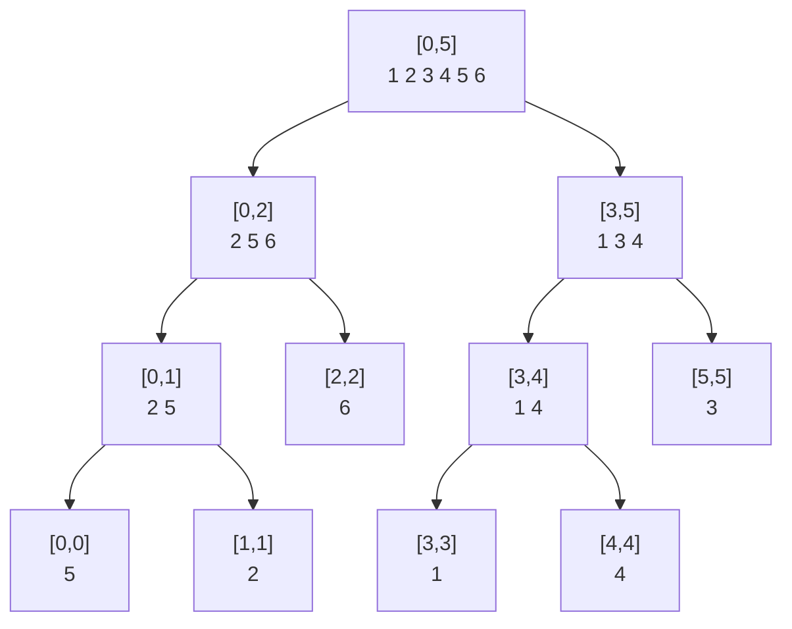
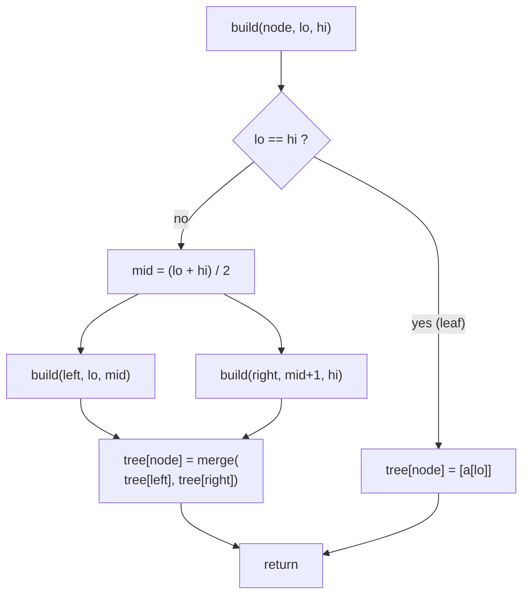
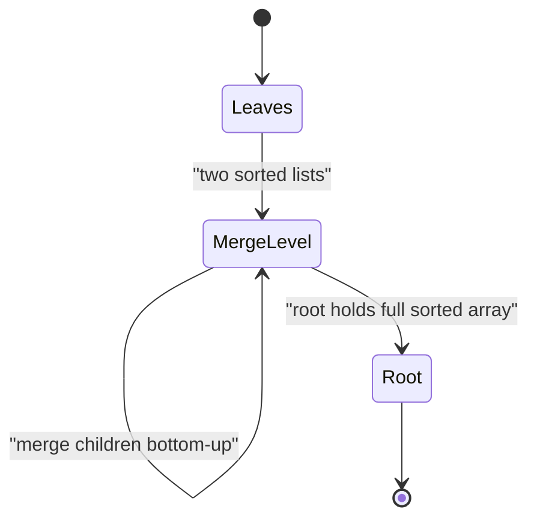
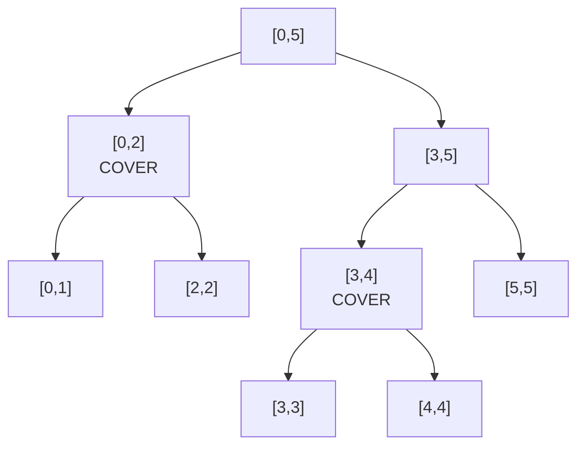
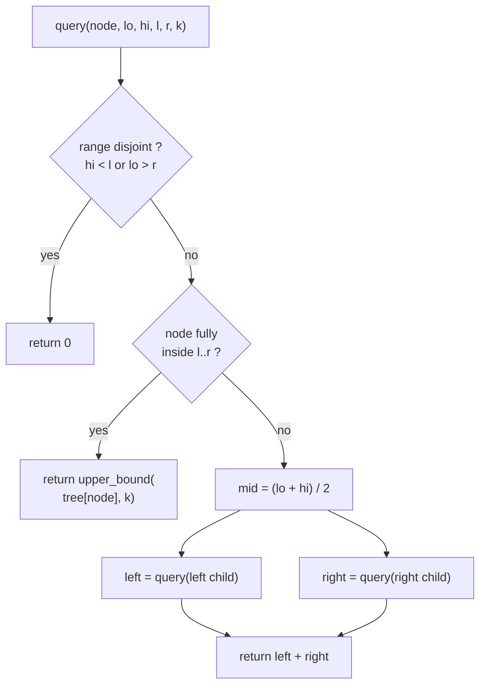
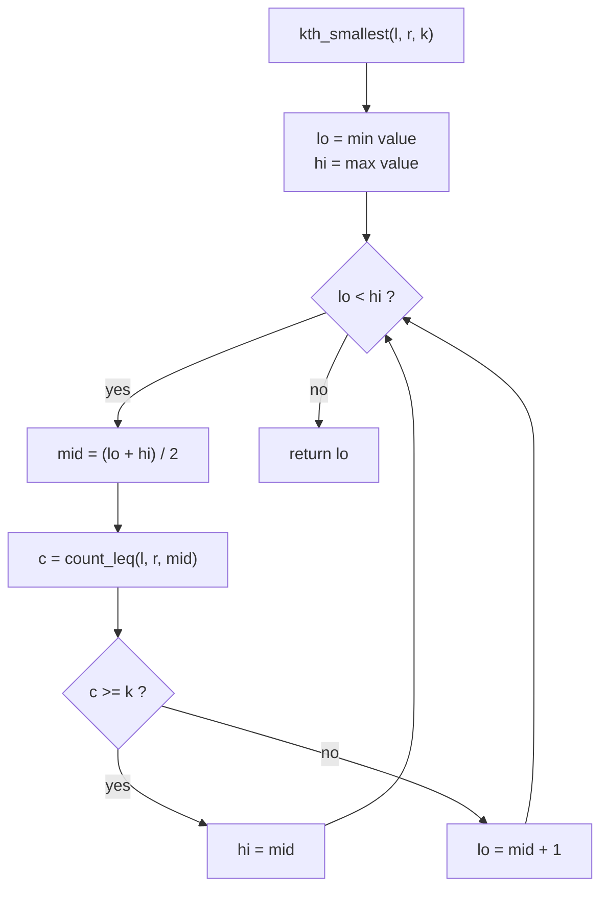
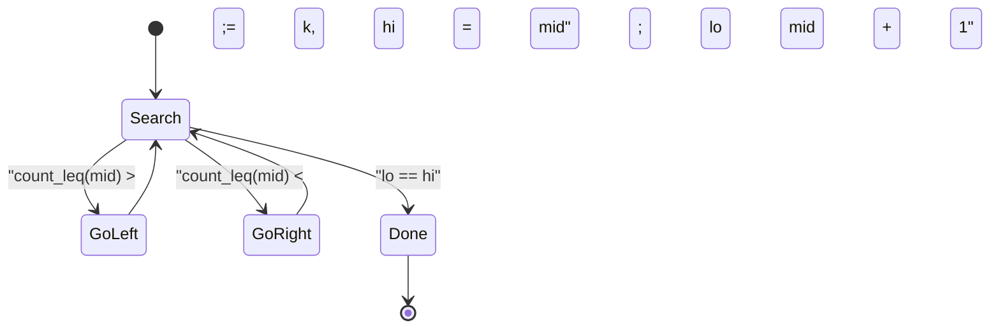

# Merge Sort Tree

> A **merge sort tree** is a segment tree in which **every node stores the sorted list of all elements in its range**. It is built exactly like the merge phase of merge sort, and it answers questions such as *"how many elements in `a[l..r]` are `<= k`"* or *"what is the k-th smallest value in `a[l..r]`"* without ever modifying the array. Think of it as a static, easy-to-code cousin of the wavelet tree and the persistent segment tree.

## Table of Contents

- [The Structure](#the-structure)
- [Building in O(n log n)](#building-in-on-log-n)
- [Counting Elements &lt;= k in a Range](#counting-elements--k-in-a-range)
- [Finding the k-th Smallest in a Range](#finding-the-k-th-smallest-in-a-range)
- [Space and Why It Is Static](#space-and-why-it-is-static)
- [Comparison With Other Structures](#comparison-with-other-structures)
- [Fractional Cascading](#fractional-cascading)
- [Build and Count-LEQ Code](#build-and-count-leq-code)
- [K-th Smallest Code](#k-th-smallest-code)
- [Complexity Summary](#complexity-summary)
- [Common Pitfalls](#common-pitfalls)
- [Patterns](#patterns)

## The Structure

Take the usual segment tree over an array of length $n$. Each node covers a contiguous index range $[\text{lo}, \text{hi}]$. In a plain segment tree a node stores a single aggregate (a sum, a max). In a **merge sort tree** the node stores the **entire multiset of values** in that range, kept in **sorted order**.

Consider $a = [5, 2, 6, 1, 4, 3]$. The root covers all six indices and stores the sorted list $[1, 2, 3, 4, 5, 6]$. Its left child covers indices $[0, 2]$ (values $5, 2, 6$) and stores $[2, 5, 6]$; its right child covers $[3, 5]$ (values $1, 4, 3$) and stores $[1, 3, 4]$.



A leaf stores a single value. Every level of the tree stores **a permutation of the whole array**, partitioned across the nodes of that level. Because there are $O(\log n)$ levels and each level holds $n$ values, the total storage is $O(n \log n)$.

The key invariant: **the sorted list inside a node lets us binary search inside that node's range**. That is the whole trick.

## Building in O(n log n)

A node's sorted list is the **merge of its two children's sorted lists** — precisely the merge step of merge sort. We build bottom-up: a leaf's list is a singleton, and an internal node merges the two already-sorted child lists in linear time.

$$T(\text{node}) = \big|\text{left}\big| + \big|\text{right}\big| \quad\Rightarrow\quad \sum_{\text{level}} O(n) = O(n \log n)$$

Each of the $O(\log n)$ levels costs $O(n)$ to merge, so the build is $O(n \log n)$ time and $O(n \log n)$ space.





## Counting Elements &lt;= k in a Range

To answer *"how many elements of `a[l..r]` are `<= k`"* we descend the segment tree the usual way. A query range $[l, r]$ is **covered by $O(\log n)$ nodes** whose index ranges are disjoint and union to $[l, r]$. For each covering node we do **not** scan its values — we run an `upper_bound(k)` binary search on its sorted list, which returns the count of values $\le k$ inside that node in $O(\log n)$.

$$\text{answer} = \sum_{\text{covering node } v} \big(\text{number of elements} \le k \text{ in } v\big)$$

There are $O(\log n)$ covering nodes and each costs $O(\log n)$, giving $O(\log^2 n)$ per query.



Above, a query over $[0, 4]$ is fully covered by node $[0,2]$ and node $[3,4]$. We `upper_bound(k)` inside each of those two sorted lists and add the two counts.



## Finding the k-th Smallest in a Range

There are two standard ways to find the **k-th smallest value in `a[l..r]`**.

**1. Binary search on the answer (value).** The function $f(x) = $ *"count of elements `<= x` in `a[l..r]`"* is monotone non-decreasing in $x$. The k-th smallest is the **smallest value $x$ with $f(x) \ge k$**. Binary search $x$ over the value domain (or over the sorted distinct values) and evaluate $f$ with the count-leq query above.

$$\text{kth} = \min\{\, x : \text{count\_leq}(l, r, x) \ge k \,\}$$

If we binary search over $V$ distinct values, that is $O(\log V)$ outer steps, each a full $O(\log^2 n)$ count query, for $O(\log V \cdot \log^2 n)$ — often written $O(\log^3 n)$.

**2. Parallel descent.** Walk the segment tree from the root toward a leaf. At each node, look at how many of the in-range elements fall in the **left child**; if that count is $\ge k$ go left, otherwise subtract it from $k$ and go right. This resembles a persistent-segment-tree k-th query and runs in $O(\log^2 n)$ (the inner factor comes from counting the in-range contribution at each node).





## Space and Why It Is Static

Each level stores $n$ values across its nodes and there are $\lceil \log_2 n \rceil + 1$ levels, so total memory is

$$\sum_{\text{level } d} n = n \cdot (\lfloor \log_2 n \rfloor + 1) = O(n \log n).$$

The structure is naturally **static**: a single point update `a[i] = v` would have to be reflected in **every node on the root-to-leaf path** (there are $O(\log n)$ of them), and each such node's sorted list would need an erase plus an insert at an arbitrary position — $O(n)$ work per list because arrays do not shift cheaply. So a naive merge sort tree does **not** support efficient updates; treat it as a build-once, query-many structure. If updates are required, reach for a wavelet tree with a BIT layer, a persistent segment tree with a Fenwick of trees, or a sqrt-decomposition variant instead.

## Comparison With Other Structures

| Structure | Build | count `<= k` / k-th in range | Updates | Space |
| --- | --- | --- | --- | --- |
| Merge sort tree | $O(n\log n)$ | $O(\log^2 n)$ / $O(\log^2 n)$–$O(\log^3 n)$ | No (static) | $O(n\log n)$ |
| Persistent segment tree | $O(n\log n)$ | $O(\log n)$ k-th | Append-only versions | $O(n\log n)$ |
| Wavelet tree | $O(n\log\sigma)$ | $O(\log\sigma)$ | Hard / specialized | $O(n\log\sigma)$ |

A **persistent segment tree** keeps a version per prefix and answers k-th in $O(\log n)$ — faster, but with a heavier implementation. A **wavelet tree** is asymptotically better and very compact, but trickier to code and to extend. The merge sort tree wins on **simplicity**: it is essentially "segment tree + `bisect`". For deeper treatment of persistent and wavelet structures, see the `ds_advanced` module.

## Fractional Cascading

The $O(\log^2 n)$ count query repeats a binary search for the **same key `k`** at each of the $O(\log n)$ visited nodes. **Fractional cascading** removes one log factor: store with each element in a parent's list a pointer to where it would land in each child's list. After one binary search at the root, every subsequent node is reached by following a pointer in $O(1)$, dropping the query to $O(\log n)$. It complicates the build and is rarely needed in contests, but it is the standard optimization note for merge sort trees.

## Build and Count-LEQ Code

```python
from bisect import bisect_right

class MergeSortTree:
    def __init__(self, a):
        self.n = len(a)
        self.tree = [[] for _ in range(4 * self.n)]
        self._build(1, 0, self.n - 1, a)

    def _build(self, node, lo, hi, a):
        if lo == hi:
            self.tree[node] = [a[lo]]
            return
        mid = (lo + hi) // 2
        self._build(2 * node, lo, mid, a)
        self._build(2 * node + 1, mid + 1, hi, a)
        # merge the two already-sorted child lists
        left, right = self.tree[2 * node], self.tree[2 * node + 1]
        merged, i, j = [], 0, 0
        while i < len(left) and j < len(right):
            if left[i] <= right[j]:
                merged.append(left[i]); i += 1
            else:
                merged.append(right[j]); j += 1
        merged.extend(left[i:]); merged.extend(right[j:])
        self.tree[node] = merged

    def count_leq(self, l, r, k):
        return self._query(1, 0, self.n - 1, l, r, k)

    def _query(self, node, lo, hi, l, r, k):
        if hi < l or lo > r:
            return 0
        if l <= lo and hi <= r:
            return bisect_right(self.tree[node], k)  # elements <= k
        mid = (lo + hi) // 2
        return (self._query(2 * node, lo, mid, l, r, k) +
                self._query(2 * node + 1, mid + 1, hi, l, r, k))

if __name__ == "__main__":
    mst = MergeSortTree([5, 2, 6, 1, 4, 3])
    print(mst.count_leq(0, 4, 4))  # values 5,2,6,1,4 with <=4 -> 3
```

```cpp
#include <bits/stdc++.h>
using namespace std;

struct MergeSortTree {
    int n;
    vector<vector<long long>> tree;

    MergeSortTree(const vector<long long>& a) {
        n = (int)a.size();
        tree.assign(4 * n, {});
        build(1, 0, n - 1, a);
    }

    void build(int node, int lo, int hi, const vector<long long>& a) {
        if (lo == hi) {
            tree[node] = {a[lo]};
            return;
        }
        int mid = (lo + hi) / 2;
        build(2 * node, lo, mid, a);
        build(2 * node + 1, mid + 1, hi, a);
        // merge the two already-sorted child lists
        const auto& left = tree[2 * node];
        const auto& right = tree[2 * node + 1];
        tree[node].resize(left.size() + right.size());
        merge(left.begin(), left.end(), right.begin(), right.end(),
              tree[node].begin());
    }

    long long count_leq(int l, int r, long long k) {
        return query(1, 0, n - 1, l, r, k);
    }

    long long query(int node, int lo, int hi, int l, int r, long long k) {
        if (hi < l || lo > r) return 0;
        if (l <= lo && hi <= r) {
            // elements <= k
            return upper_bound(tree[node].begin(), tree[node].end(), k)
                   - tree[node].begin();
        }
        int mid = (lo + hi) / 2;
        return query(2 * node, lo, mid, l, r, k) +
               query(2 * node + 1, mid + 1, hi, l, r, k);
    }
};

int main() {
    MergeSortTree mst({5, 2, 6, 1, 4, 3});
    cout << mst.count_leq(0, 4, 4) << "\n";  // 3
    return 0;
}
```

## K-th Smallest Code

```python
from bisect import bisect_right

class KthMergeSortTree:
    def __init__(self, a):
        self.n = len(a)
        self.tree = [[] for _ in range(4 * self.n)]
        self.vals = sorted(set(a))
        self._build(1, 0, self.n - 1, a)

    def _build(self, node, lo, hi, a):
        if lo == hi:
            self.tree[node] = [a[lo]]
            return
        mid = (lo + hi) // 2
        self._build(2 * node, lo, mid, a)
        self._build(2 * node + 1, mid + 1, hi, a)
        l, r = self.tree[2 * node], self.tree[2 * node + 1]
        self.tree[node] = sorted(l + r)  # merge (sorted inputs)

    def _count_leq(self, node, lo, hi, l, r, k):
        if hi < l or lo > r:
            return 0
        if l <= lo and hi <= r:
            return bisect_right(self.tree[node], k)
        mid = (lo + hi) // 2
        return (self._count_leq(2 * node, lo, mid, l, r, k) +
                self._count_leq(2 * node + 1, mid + 1, hi, l, r, k))

    def kth_smallest(self, l, r, k):  # 1-indexed k
        lo, hi = 0, len(self.vals) - 1
        while lo < hi:
            mid = (lo + hi) // 2
            c = self._count_leq(1, 0, self.n - 1, l, r, self.vals[mid])
            if c >= k:
                hi = mid
            else:
                lo = mid + 1
        return self.vals[lo]

if __name__ == "__main__":
    t = KthMergeSortTree([5, 2, 6, 1, 4, 3])
    print(t.kth_smallest(0, 4, 3))  # sorted(1,2,4,5,6)[2] -> 4
```

```cpp
#include <bits/stdc++.h>
using namespace std;

struct KthMergeSortTree {
    int n;
    vector<vector<long long>> tree;
    vector<long long> vals;

    KthMergeSortTree(const vector<long long>& a) {
        n = (int)a.size();
        tree.assign(4 * n, {});
        vals = a;
        sort(vals.begin(), vals.end());
        vals.erase(unique(vals.begin(), vals.end()), vals.end());
        build(1, 0, n - 1, a);
    }

    void build(int node, int lo, int hi, const vector<long long>& a) {
        if (lo == hi) {
            tree[node] = {a[lo]};
            return;
        }
        int mid = (lo + hi) / 2;
        build(2 * node, lo, mid, a);
        build(2 * node + 1, mid + 1, hi, a);
        const auto& l = tree[2 * node];
        const auto& r = tree[2 * node + 1];
        tree[node].resize(l.size() + r.size());
        merge(l.begin(), l.end(), r.begin(), r.end(), tree[node].begin());
    }

    long long count_leq(int node, int lo, int hi, int l, int r, long long k) {
        if (hi < l || lo > r) return 0;
        if (l <= lo && hi <= r)
            return upper_bound(tree[node].begin(), tree[node].end(), k)
                   - tree[node].begin();
        int mid = (lo + hi) / 2;
        return count_leq(2 * node, lo, mid, l, r, k) +
               count_leq(2 * node + 1, mid + 1, hi, l, r, k);
    }

    long long kth_smallest(int l, int r, long long k) {  // 1-indexed k
        int lo = 0, hi = (int)vals.size() - 1;
        while (lo < hi) {
            int mid = (lo + hi) / 2;
            long long c = count_leq(1, 0, n - 1, l, r, vals[mid]);
            if (c >= k) hi = mid;
            else lo = mid + 1;
        }
        return vals[lo];
    }
};

int main() {
    KthMergeSortTree t({5, 2, 6, 1, 4, 3});
    cout << t.kth_smallest(0, 4, 3) << "\n";  // 4
    return 0;
}
```

## Complexity Summary

| Operation | Time | Space |
| --- | --- | --- |
| Build | $O(n\log n)$ | $O(n\log n)$ |
| Count `<= k` in `[l, r]` | $O(\log^2 n)$ | $O(\log n)$ stack |
| Count `> k` in `[l, r]` | $O(\log^2 n)$ | $O(\log n)$ stack |
| K-th smallest (binary search value) | $O(\log V\,\log^2 n)$ | $O(\log n)$ stack |
| K-th smallest (parallel descent) | $O(\log^2 n)$ | $O(\log n)$ stack |
| Point update | not supported efficiently | — |

## Common Pitfalls

- **Using the wrong bound.** `upper_bound` / `bisect_right` counts elements $\le k$; `lower_bound` / `bisect_left` counts elements $< k$. Counting "$> k$" is `len(list) - upper_bound(k)`, and "$\ge k$" is `len(list) - lower_bound(k)`. Mixing these up is the most common bug.
- **Forgetting the structure is static.** Do not try to apply point updates; the lists do not shift cheaply. Rebuild or pick a different structure.
- **Allocating $4n$ but indexing past it.** Use $4n$ nodes for safety, or iterative sizing; an off-by-one in `mid` breaks the partition.
- **Sorting instead of merging during build.** Children are already sorted, so merge in $O(\text{size})$; calling a full sort at every node degrades the build to $O(n\log^2 n)$.
- **Index base confusion.** Decide once whether `k` in k-th smallest is 1-indexed and whether `[l, r]` is inclusive, and keep it consistent across queries.

## Patterns

- **"Count values in a range satisfying a value predicate."** Whenever a query asks how many elements of `a[l..r]` are `<= k`, `>= k`, in `[x, y]`, etc., and there are **no updates**, a merge sort tree is the simplest fit.
- **"K-th smallest / order statistic on a subarray."** Binary search the value and count, or descend in parallel.
- **"Offline alternative."** If queries can be read up front, the same answers come from sorting queries by `k` and sweeping with a Fenwick tree — often faster in practice. The merge sort tree shines when queries are **online** (you must answer each before seeing the next).
- **"Upgrade path."** Need updates or a tighter log factor? Move to a wavelet tree or a persistent segment tree (see `ds_advanced`).
