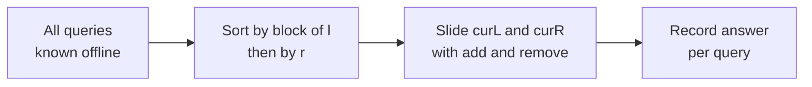
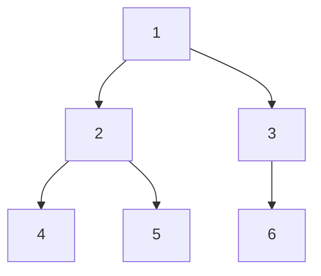
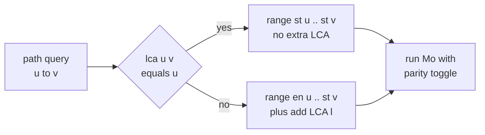
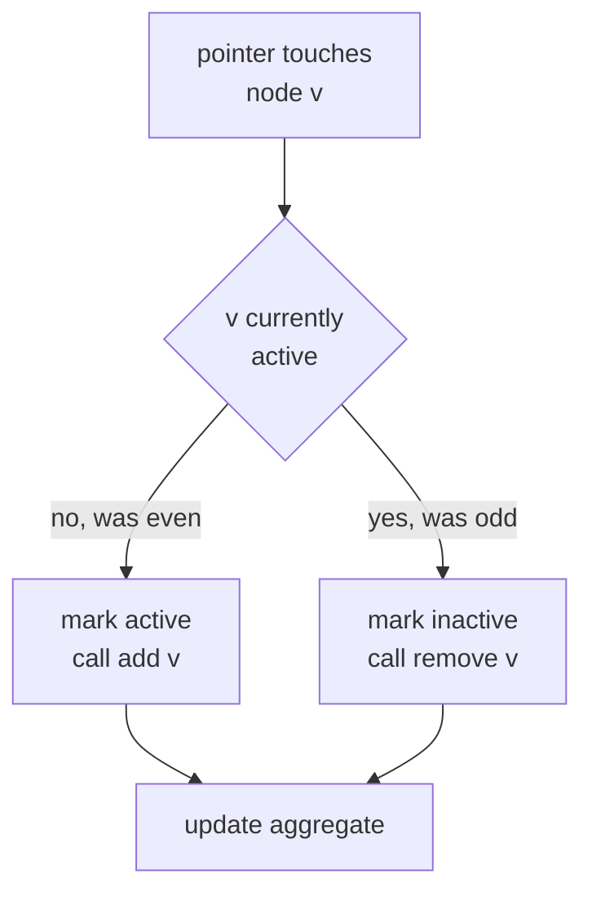
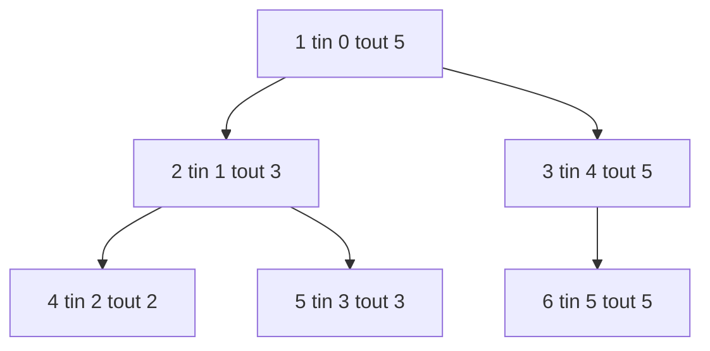
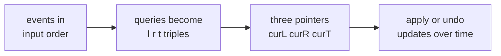
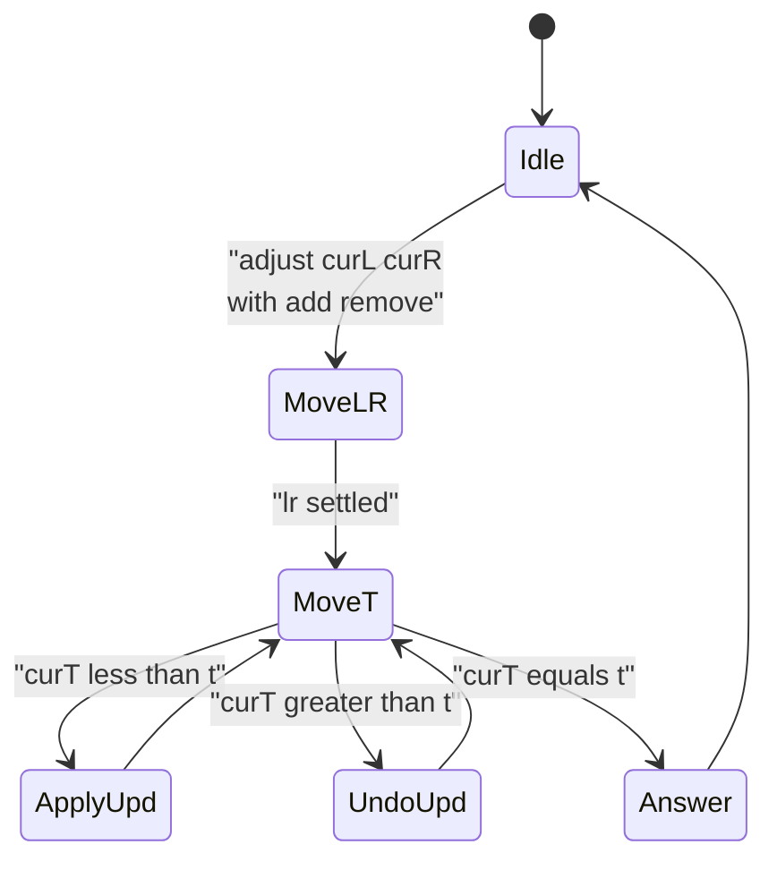
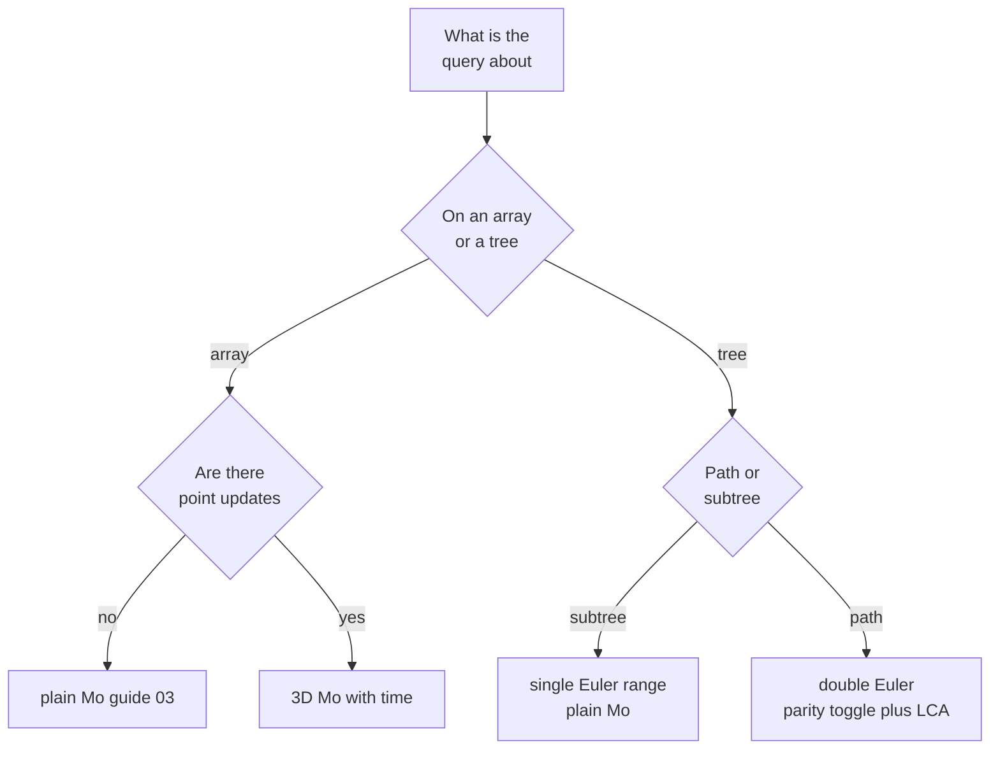

# Mo's Algorithm on Trees & Mo's with Updates

> This guide picks up exactly where the basic **Mo's algorithm** from [guide 03](03-offline-query-processing.md) leaves off. There we learned the core trick: read all range queries offline, sort them by $\sqrt n$ blocks, and slide two pointers with `add`/`remove`. Here we extend that same machinery into two powerful directions — **Mo's on trees** (answering queries about *paths* and *subtrees*) and **Mo's with point updates** (the so‑called *3D Mo's*, where queries and modifications are interleaved over a time axis). Both reuse the identical `add`/`remove` aggregate; only the *ordering* and the *index space* change.

## Table of Contents

- [Recap of Plain Mo's](#recap-of-plain-mos)
- [The Euler Tour Flattening](#the-euler-tour-flattening)
- [Mo's on Trees Path Queries](#mos-on-trees-path-queries)
- [Mo's on Subtree Queries](#mos-on-subtree-queries)
- [Mo's with Updates 3D Mo's](#mos-with-updates-3d-mos)
- [Comparison of the Three Variants](#comparison-of-the-three-variants)
- [Complexity Summary](#complexity-summary)
- [Common Pitfalls](#common-pitfalls)
- [Patterns](#patterns)

## Recap of Plain Mo's

Plain Mo's answers offline range queries $[l, r]$ on an array by maintaining a window $[\text{curL}, \text{curR}]$ and an aggregate (distinct count, frequency sum, etc.) that can be updated in $O(1)$ via `add(x)` and `remove(x)`. Queries are sorted by the **block of `l`** (block width $B = \Theta(\sqrt n)$) and then by `r`; the right pointer sweeps monotonically inside each block while the left pointer wanders at most $B$ per query. The total pointer travel is $O\!\left(\tfrac{n^2}{B} + qB\right)$, minimized at $B = \sqrt n$ to give $O((n + q)\sqrt n)$. Everything below keeps this exact `add`/`remove` core and changes only **what index space** the pointers move through and **how** the queries are ordered.



## The Euler Tour Flattening

A tree has no natural left/right order, so before Mo's can touch it we must **flatten** it into a linear array. The tool is an **Euler tour** built by a DFS that records each node's entry and exit. There are two flavors depending on the query type.

For **subtree** queries we use the classic single‑occurrence tour: record `tin[v]` when we first enter `v` and `tout[v]` when we finish it. Every node in `v`'s subtree occupies a contiguous slice `[tin[v], tout[v]]`.

For **path** queries we use a *double‑occurrence* tour: we append `v` to the Euler array **twice** — once on entry (`st[v]`) and once on exit (`en[v]`). This is the key that lets an arbitrary path collapse into a contiguous range, as the next section shows.



For the tree above, a path‑style DFS that writes each node on entry **and** on exit produces an Euler array of length $2n$. Each value `st[v]`/`en[v]` marks the two positions where node `v` appears:

```text
node : 1  2  4  4  5  5  2  3  6  6  3   1
pos  : 0  1  2  3  4  5  6  7  8  9  10  11
        ^entry        ^exit pairs interleave by DFS nesting

st = {1:0, 2:1, 4:2, 5:4, 3:7, 6:8}
en = {4:3, 5:5, 2:6, 6:9, 3:10, 1:11}
```

The defining property: a node `v` is **inside the current window an odd number of times** exactly when the window covers one of its two occurrences but not both. That parity is what we exploit next.

## Mo's on Trees Path Queries

Consider a query that asks something about all nodes on the **path** from `u` to `v` (for example, *how many distinct values appear on that path*). Using the double‑occurrence Euler array we map the path to a contiguous range as follows. Assume without loss of generality that `st[u] <= st[v]`. Let `l = lca(u, v)`.

- **Case A — `l == u`** (one endpoint is an ancestor of the other): the path corresponds to the Euler range $[\,\text{st}[u],\ \text{st}[v]\,]$, and the LCA `u` is already included correctly.
- **Case B — `l != u`** (the path bends through a deeper LCA): the path corresponds to $[\,\text{en}[u],\ \text{st}[v]\,]$, **plus** the LCA node `l` handled separately (added once at the end and removed after).

Why does this work? Inside the chosen Euler range, a node that lies **on the path** appears exactly **once** (odd parity), while a node hanging **off the path** appears either **zero or two times** (even parity). So if `add`/`remove` is driven by *occurrence parity* — toggle a node *in* when it has been seen an odd number of times and *out* when even — the window automatically contains precisely the path's node set.



The **toggle** add/remove is the heart of tree‑Mo's. Instead of "entering the window means add", we track how many times each node is currently *visited* by the pointer span and flip its contribution:



The block size stays $B = \Theta(\sqrt{2n}) = \Theta(\sqrt n)$ because the Euler array has length $2n$, and the overall complexity is the familiar $O((n + q)\sqrt n)$ (plus an $O(\log n)$ or $O(1)$ LCA per query). Here is the full flatten + tree‑Mo's routine.

```python
import sys
from math import isqrt

def mos_on_tree_path(n, adj, values, queries):
    # adj: adjacency list (0-indexed). values[v]: node value.
    # queries: list of (u, v). Returns distinct count on each path.

    # ---- iterative DFS to build double-occurrence Euler tour ----
    euler = []            # length 2n, each node appears twice
    st = [0] * n          # first occurrence index
    en = [0] * n          # second occurrence index
    parent = [-1] * n
    depth = [0] * n
    LOG = max(1, n.bit_length())
    up = [[-1] * n for _ in range(LOG)]

    order_stack = [(0, -1, False)]
    while order_stack:
        node, par, processed = order_stack.pop()
        if processed:
            en[node] = len(euler)
            euler.append(node)
            continue
        parent[node] = par
        up[0][node] = par
        st[node] = len(euler)
        euler.append(node)
        # schedule the exit, then push children
        order_stack.append((node, par, True))
        for nxt in adj[node]:
            if nxt != par:
                depth[nxt] = depth[node] + 1
                order_stack.append((nxt, node, False))

    # ---- binary-lifting LCA ----
    for k in range(1, LOG):
        for v in range(n):
            mid = up[k - 1][v]
            up[k][v] = up[k - 1][mid] if mid != -1 else -1

    def lca(a, b):
        if depth[a] < depth[b]:
            a, b = b, a
        diff = depth[a] - depth[b]
        for k in range(LOG):
            if (diff >> k) & 1:
                a = up[k][a]
        if a == b:
            return a
        for k in range(LOG - 1, -1, -1):
            if up[k][a] != up[k][b]:
                a, b = up[k][a], up[k][b]
        return parent[a]

    # ---- build Mo's queries on the Euler array ----
    m = len(euler)                       # == 2n
    block = max(1, isqrt(m))
    Q = []                               # (l, r, extra_lca_or_-1, idx)
    for i, (u, v) in enumerate(queries):
        if st[u] > st[v]:
            u, v = v, u
        w = lca(u, v)
        if w == u:
            Q.append((st[u], st[v], -1, i))
        else:
            Q.append((en[u], st[v], w, i))
    Q.sort(key=lambda x: (x[0] // block, x[1] if (x[0] // block) % 2 == 0 else -x[1]))

    # ---- Mo's core with parity toggle ----
    cnt = [0] * (n + 1)                  # frequency of each value in window
    active = [False] * n                # is node currently counted
    distinct = 0
    ans = [0] * len(queries)

    def add_value(val):
        nonlocal distinct
        if cnt[val] == 0:
            distinct += 1
        cnt[val] += 1

    def remove_value(val):
        nonlocal distinct
        cnt[val] -= 1
        if cnt[val] == 0:
            distinct -= 1

    def toggle(node):
        # flip node's membership based on parity
        if active[node]:
            active[node] = False
            remove_value(values[node])
        else:
            active[node] = True
            add_value(values[node])

    curL, curR = 0, -1
    for l, r, extra, idx in Q:
        while curR < r:
            curR += 1
            toggle(euler[curR])
        while curL > l:
            curL -= 1
            toggle(euler[curL])
        while curR > r:
            toggle(euler[curR])
            curR -= 1
        while curL < l:
            toggle(euler[curL])
            curL += 1
        if extra != -1:
            add_value(values[extra])
        ans[idx] = distinct
        if extra != -1:
            remove_value(values[extra])
    return ans
```

```cpp
#include <bits/stdc++.h>
using namespace std;

vector<int> mosOnTreePath(int n,
                          const vector<vector<int>>& adj,
                          const vector<int>& values,
                          const vector<pair<int,int>>& queries) {
    // ---- iterative DFS to build double-occurrence Euler tour ----
    vector<int> euler;            // length 2n
    euler.reserve(2 * n);
    vector<int> st(n), en(n), parent(n, -1), depth(n, 0);
    int LOG = 1;
    while ((1 << LOG) < n) ++LOG;
    LOG = max(LOG, 1);
    vector<vector<int>> up(LOG, vector<int>(n, -1));

    // stack frame: node, parent, processed-flag
    struct Frame { int node, par; bool processed; };
    vector<Frame> stk;
    stk.push_back({0, -1, false});
    while (!stk.empty()) {
        Frame f = stk.back();
        stk.pop_back();
        if (f.processed) {
            en[f.node] = (int)euler.size();
            euler.push_back(f.node);
            continue;
        }
        parent[f.node] = f.par;
        up[0][f.node] = f.par;
        st[f.node] = (int)euler.size();
        euler.push_back(f.node);
        stk.push_back({f.node, f.par, true});
        for (int nxt : adj[f.node]) {
            if (nxt != f.par) {
                depth[nxt] = depth[f.node] + 1;
                stk.push_back({nxt, f.node, false});
            }
        }
    }

    // ---- binary-lifting LCA ----
    for (int k = 1; k < LOG; ++k)
        for (int v = 0; v < n; ++v) {
            int mid = up[k - 1][v];
            up[k][v] = (mid != -1) ? up[k - 1][mid] : -1;
        }

    auto lca = [&](int a, int b) -> int {
        if (depth[a] < depth[b]) swap(a, b);
        int diff = depth[a] - depth[b];
        for (int k = 0; k < LOG; ++k)
            if ((diff >> k) & 1) a = up[k][a];
        if (a == b) return a;
        for (int k = LOG - 1; k >= 0; --k)
            if (up[k][a] != up[k][b]) { a = up[k][a]; b = up[k][b]; }
        return parent[a];
    };

    // ---- build Mo's queries on the Euler array ----
    int m = (int)euler.size();           // == 2n
    int block = max(1, (int)sqrt((double)m));
    struct Q { int l, r, extra, idx; };
    vector<Q> qs;
    qs.reserve(queries.size());
    for (int i = 0; i < (int)queries.size(); ++i) {
        int u = queries[i].first, v = queries[i].second;
        if (st[u] > st[v]) swap(u, v);
        int w = lca(u, v);
        if (w == u) qs.push_back({st[u], st[v], -1, i});
        else        qs.push_back({en[u], st[v], w, i});
    }
    sort(qs.begin(), qs.end(), [&](const Q& a, const Q& b) {
        int ba = a.l / block, bb = b.l / block;
        if (ba != bb) return ba < bb;
        return (ba & 1) ? (a.r > b.r) : (a.r < b.r);
    });

    // ---- Mo's core with parity toggle ----
    vector<long long> cnt(n + 1, 0);
    vector<char> active(n, 0);
    long long distinct = 0;
    vector<int> ans(queries.size(), 0);

    auto addValue = [&](int val) {
        if (cnt[val] == 0) ++distinct;
        ++cnt[val];
    };
    auto removeValue = [&](int val) {
        --cnt[val];
        if (cnt[val] == 0) --distinct;
    };
    auto toggle = [&](int node) {
        if (active[node]) { active[node] = 0; removeValue(values[node]); }
        else              { active[node] = 1; addValue(values[node]); }
    };

    int curL = 0, curR = -1;
    for (const Q& cur : qs) {
        int l = cur.l, r = cur.r;
        while (curR < r) { ++curR; toggle(euler[curR]); }
        while (curL > l) { --curL; toggle(euler[curL]); }
        while (curR > r) { toggle(euler[curR]); --curR; }
        while (curL < l) { toggle(euler[curL]); ++curL; }
        if (cur.extra != -1) addValue(values[cur.extra]);
        ans[cur.idx] = (int)distinct;
        if (cur.extra != -1) removeValue(values[cur.extra]);
    }
    return ans;
}
```

## Mo's on Subtree Queries

Subtree queries are the *easy* tree case: there is no LCA dance and no parity toggle. Using the **single‑occurrence** Euler tour, the subtree of node `v` is exactly the contiguous interval $[\text{tin}[v], \text{tout}[v]]$ of the flat array. So a subtree query is *literally* a plain array range query and ordinary Mo's from guide 03 applies unchanged — `add`/`remove` are called once per element as the window slides.



The subtree of node `2` above spans flat positions $[1, 3]$, which holds exactly nodes `2, 4, 5`. We flatten with the value at each `tin` slot and run vanilla Mo's:

```python
from math import isqrt

def mos_on_subtree(n, adj, values, queries):
    # queries: list of root-of-subtree nodes. Returns distinct count per subtree.
    flat = [0] * n
    tin = [0] * n
    tout = [0] * n
    timer = 0
    stk = [(0, -1, False)]
    while stk:
        node, par, processed = stk.pop()
        if processed:
            tout[node] = timer - 1
            continue
        tin[node] = timer
        flat[timer] = values[node]
        timer += 1
        stk.append((node, par, True))
        for nxt in adj[node]:
            if nxt != par:
                stk.append((nxt, node, False))

    block = max(1, isqrt(n))
    Q = []
    for i, v in enumerate(queries):
        Q.append((tin[v], tout[v], i))
    Q.sort(key=lambda x: (x[0] // block, x[1] if (x[0] // block) % 2 == 0 else -x[1]))

    cnt = {}
    distinct = 0
    ans = [0] * len(queries)

    def add(x):
        nonlocal distinct
        c = cnt.get(x, 0)
        if c == 0:
            distinct += 1
        cnt[x] = c + 1

    def remove(x):
        nonlocal distinct
        cnt[x] -= 1
        if cnt[x] == 0:
            distinct -= 1

    curL, curR = 0, -1
    for l, r, idx in Q:
        while curR < r:
            curR += 1
            add(flat[curR])
        while curL > l:
            curL -= 1
            add(flat[curL])
        while curR > r:
            remove(flat[curR])
            curR -= 1
        while curL < l:
            remove(flat[curL])
            curL += 1
        ans[idx] = distinct
    return ans
```

```cpp
#include <bits/stdc++.h>
using namespace std;

vector<int> mosOnSubtree(int n,
                         const vector<vector<int>>& adj,
                         const vector<int>& values,
                         const vector<int>& queries) {
    vector<int> flat(n), tin(n), tout(n);
    int timer = 0;
    struct Frame { int node, par; bool processed; };
    vector<Frame> stk;
    stk.push_back({0, -1, false});
    while (!stk.empty()) {
        Frame f = stk.back();
        stk.pop_back();
        if (f.processed) { tout[f.node] = timer - 1; continue; }
        tin[f.node] = timer;
        flat[timer] = values[f.node];
        ++timer;
        stk.push_back({f.node, f.par, true});
        for (int nxt : adj[f.node])
            if (nxt != f.par) stk.push_back({nxt, f.node, false});
    }

    int block = max(1, (int)sqrt((double)n));
    struct Q { int l, r, idx; };
    vector<Q> qs;
    for (int i = 0; i < (int)queries.size(); ++i) {
        int v = queries[i];
        qs.push_back({tin[v], tout[v], i});
    }
    sort(qs.begin(), qs.end(), [&](const Q& a, const Q& b) {
        int ba = a.l / block, bb = b.l / block;
        if (ba != bb) return ba < bb;
        return (ba & 1) ? (a.r > b.r) : (a.r < b.r);
    });

    unordered_map<int, long long> cnt;
    long long distinct = 0;
    vector<int> ans(queries.size(), 0);
    auto add = [&](int x) { if (cnt[x] == 0) ++distinct; ++cnt[x]; };
    auto remove = [&](int x) { --cnt[x]; if (cnt[x] == 0) --distinct; };

    int curL = 0, curR = -1;
    for (const Q& cur : qs) {
        int l = cur.l, r = cur.r;
        while (curR < r) add(flat[++curR]);
        while (curL > l) add(flat[--curL]);
        while (curR > r) remove(flat[curR--]);
        while (curL < l) remove(flat[curL++]);
        ans[cur.idx] = (int)distinct;
    }
    return ans;
}
```

## Mo's with Updates 3D Mo's

So far the array (or tree values) was **static**. Now suppose **point updates** are interleaved with queries: `update(p, newVal)` changes a single position, and a query `[l, r]` must reflect all updates that came *before it in input order*. Online range‑distinct with updates is hard, but offline we can add a **time dimension** and run *3D Mo's*.

Number the events in input order. Each query gets a timestamp `t` = the number of updates that precede it. A query is now a triple $(l, r, t)$: answer the range $[l, r]$ **as the array looked after exactly `t` updates have been applied**. We maintain three pointers — `curL`, `curR`, and `curT` — and move `curT` forward by **applying** an update and backward by **undoing** it.



An update stores the position and the *old* value so it can be reversed. Applying an update at time `i`: if the position currently lies inside `[curL, curR]`, `remove` the old value and `add` the new one, then swap stored old/new so the next toggle reverses it; undoing is the identical operation (which is why we just swap and re‑apply).

The cost analysis changes. With block width $B$:

$$\text{l/r moves} = O\!\left(\frac{n}{B}\right)\text{ per step},\qquad \text{t moves} = O\!\left(\frac{n}{B^2}\cdot \text{(updates)}\right).$$

Balancing the three terms with $n$, $q$, and the update count all $\Theta(n)$ gives the optimal block size

$$B = \Theta\!\left(n^{2/3}\right),$$

and the total work becomes

$$O\!\left(n^{5/3}\right).$$

Queries are sorted by the triple **(block of `l`, block of `r`, `t`)**, so within a fixed $(l\text{-block}, r\text{-block})$ pair the time pointer sweeps monotonically.



```python
from math import floor

def mos_with_updates(arr, ops):
    # ops in input order: ("Q", l, r) or ("U", pos, newVal).
    # Returns answers for the queries in their original query order.
    a = arr[:]                      # working copy
    n = len(a)

    updates = []                    # (pos, newVal)
    queries = []                    # (l, r, t, idx)
    qidx = 0
    for op in ops:
        if op[0] == "U":
            updates.append((op[1], op[2]))
        else:
            _, l, r = op
            queries.append((l, r, len(updates), qidx))
            qidx += 1

    block = max(1, int(round(n ** (2.0 / 3.0))))

    def key(q):
        l, r, t, _ = q
        return (l // block, r // block, t)
    queries.sort(key=key)

    cnt = [0] * (max(a) + 2 if a else 2)
    # widen cnt to also cover update values
    maxv = max([v for v in a] + [u[1] for u in updates] + [0])
    cnt = [0] * (maxv + 2)
    distinct = 0

    def add(x):
        nonlocal distinct
        if cnt[x] == 0:
            distinct += 1
        cnt[x] += 1

    def remove(x):
        nonlocal distinct
        cnt[x] -= 1
        if cnt[x] == 0:
            distinct -= 1

    curL, curR, curT = 0, -1, 0
    ans = [0] * len(queries)

    def apply_time(i, l, r):
        # apply update i; if inside window, swap contribution
        pos, newVal = updates[i]
        if l <= pos <= r:
            remove(a[pos])
            add(newVal)
        a[pos], updates[i] = newVal, (pos, a[pos])

    for l, r, t, idx in queries:
        while curR < r:
            curR += 1
            add(a[curR])
        while curL > l:
            curL -= 1
            add(a[curL])
        while curR > r:
            remove(a[curR])
            curR -= 1
        while curL < l:
            remove(a[curL])
            curL += 1
        while curT < t:
            apply_time(curT, l, r)
            curT += 1
        while curT > t:
            curT -= 1
            apply_time(curT, l, r)
        ans[idx] = distinct
    return ans
```

```cpp
#include <bits/stdc++.h>
using namespace std;

// ops: each is {type, x, y}; type 0 = query (x=l, y=r), type 1 = update (x=pos, y=newVal).
vector<int> mosWithUpdates(vector<int> a, const vector<array<int,3>>& ops) {
    int n = (int)a.size();

    vector<pair<int,int>> updates;        // (pos, newVal)
    struct Q { int l, r, t, idx; };
    vector<Q> queries;
    int qidx = 0, maxv = 0;
    for (int v : a) maxv = max(maxv, v);
    for (const auto& op : ops) {
        if (op[0] == 1) {
            updates.push_back({op[1], op[2]});
            maxv = max(maxv, op[2]);
        } else {
            queries.push_back({op[1], op[2], (int)updates.size(), qidx});
            ++qidx;
        }
    }

    int block = max(1, (int)llround(pow((double)n, 2.0 / 3.0)));
    sort(queries.begin(), queries.end(), [&](const Q& x, const Q& y) {
        int bx = x.l / block, by = y.l / block;
        if (bx != by) return bx < by;
        int rx = x.r / block, ry = y.r / block;
        if (rx != ry) return rx < ry;
        return x.t < y.t;
    });

    vector<long long> cnt(maxv + 2, 0);
    long long distinct = 0;
    auto add = [&](int x) { if (cnt[x] == 0) ++distinct; ++cnt[x]; };
    auto remove = [&](int x) { --cnt[x]; if (cnt[x] == 0) --distinct; };

    int curL = 0, curR = -1, curT = 0;
    vector<int> ans(queries.size(), 0);

    auto applyTime = [&](int i, int l, int r) {
        int pos = updates[i].first, newVal = updates[i].second;
        if (l <= pos && pos <= r) { remove(a[pos]); add(newVal); }
        int old = a[pos];
        a[pos] = newVal;
        updates[i] = {pos, old};      // store old so reverse undoes it
    };

    for (const Q& cur : queries) {
        int l = cur.l, r = cur.r, t = cur.t;
        while (curR < r) add(a[++curR]);
        while (curL > l) add(a[--curL]);
        while (curR > r) remove(a[curR--]);
        while (curL < l) remove(a[curL++]);
        while (curT < t) { applyTime(curT, l, r); ++curT; }
        while (curT > t) { --curT; applyTime(curT, l, r); }
        ans[cur.idx] = (int)distinct;
    }
    return ans;
}
```

## Comparison of the Three Variants

| Variant | Index space | Ordering key | Add/remove style | Block size | Complexity | Use when |
| --- | --- | --- | --- | --- | --- | --- |
| Plain Mo's (guide 03) | array $[0, n)$ | block of `l`, then `r` | once per element | $\sqrt n$ | $O((n+q)\sqrt n)$ | static array range queries |
| Mo's on tree path | Euler $2n$ (double occ.) | block of `l`, then `r` | parity toggle + LCA fix | $\sqrt{2n}$ | $O((n+q)\sqrt n)$ | queries over a path `u`–`v` |
| Mo's on subtree | Euler $n$ (single occ.) | block of `l`, then `r` | once per element | $\sqrt n$ | $O((n+q)\sqrt n)$ | queries over a subtree of `v` |
| Mo's with updates (3D) | array $[0, n)$ + time | block `l`, block `r`, then `t` | once per element + apply/undo | $n^{2/3}$ | $O(n^{5/3})$ | range queries with point updates |



## Complexity Summary

| Operation | Time | Space |
| --- | --- | --- |
| Euler flatten (single or double) | $O(n)$ | $O(n)$ |
| Binary‑lifting LCA preprocess | $O(n \log n)$ | $O(n \log n)$ |
| Per LCA query | $O(\log n)$ | — |
| Mo's on tree path (total) | $O((n + q)\sqrt n)$ | $O(n + q)$ |
| Mo's on subtree (total) | $O((n + q)\sqrt n)$ | $O(n + q)$ |
| Mo's with updates (total) | $O\!\left(n^{5/3}\right)$ | $O(n + q + u)$ |

For 3D Mo's, with $n \approx q \approx u$, the block size $B = n^{2/3}$ balances $\frac{n^2}{B}$ (l/r travel) against $\frac{n^2}{B^2}\cdot u$ (time travel), both equal to $n^{5/3}$.

## Common Pitfalls

- **Forgetting the LCA in path queries.** In Case B (`lca != u`) the LCA node sits *outside* the Euler range and must be added before reading the answer and removed afterward. Skipping it silently undercounts.
- **Wrong Euler flavor.** Path queries need the *double‑occurrence* tour (`st`/`en`); subtree queries need the *single‑occurrence* tour (`tin`/`tout`). Mixing them breaks the parity argument.
- **Parity toggle confusion.** In tree‑path Mo's, `add`/`remove` is decided by whether a node is *currently active*, **not** by the direction of pointer movement. Always route through `toggle`.
- **3D Mo's: applying an out‑of‑window update.** Only mutate the aggregate if the updated position lies inside `[curL, curR]`; otherwise just rewrite the array cell and swap old/new for reversibility.
- **3D Mo's: stale block size.** Use $n^{2/3}$, not $\sqrt n$. The $\sqrt n$ block makes time travel blow up to $O(n^2)$.
- **Recursion depth.** A recursive DFS on a path‑shaped tree of $n \approx 10^5$ overflows the stack; use the iterative Euler tour shown above.
- **Even/odd `r` sorting.** The snake‑order trick (sort `r` ascending in even blocks, descending in odd blocks) shaves a constant factor; keep it consistent with the block parity.

## Patterns

- **Flatten then forget the tree.** Once the Euler array exists, every tree variant reduces to "Mo's on an array" — the only differences are the index range and the toggle.
- **Path = symmetric difference of two root paths.** The double‑occurrence range encodes exactly the nodes whose two root‑paths differ, which is the `u`–`v` path plus the separately handled LCA.
- **Add a dimension for updates.** Whenever a static offline technique meets point updates, try promoting time to an explicit coordinate and re‑balancing the block size (here $\sqrt n \to n^{2/3}$).
- **Reversible operations.** 3D Mo's works because each update is its own inverse after swapping old/new — design `apply`/`undo` to be the same function.
- **When *not* to use Mo's.** If updates are frequent and online answers are required, prefer Euler‑tour + segment tree / BIT (subtree) or HLD (path). Mo's wins only in the offline, $O(1)$‑transition setting.
```

