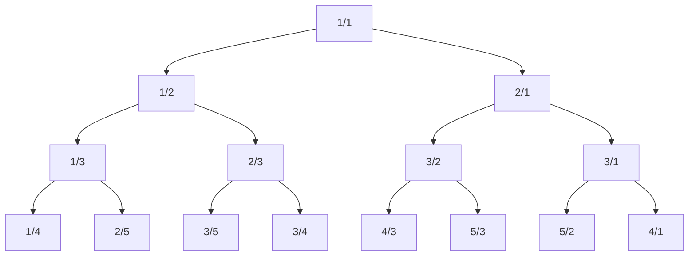
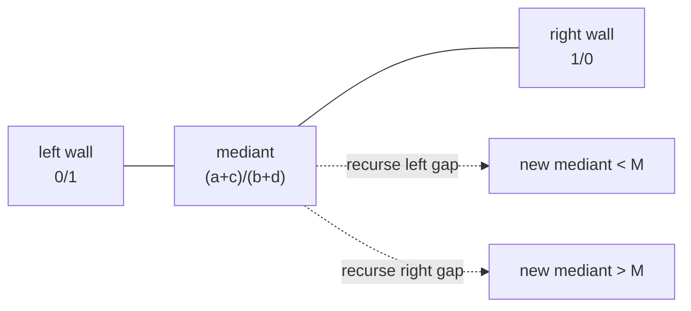
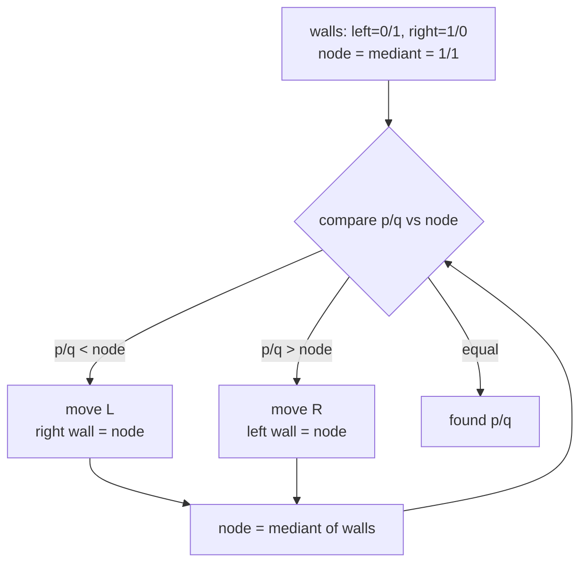
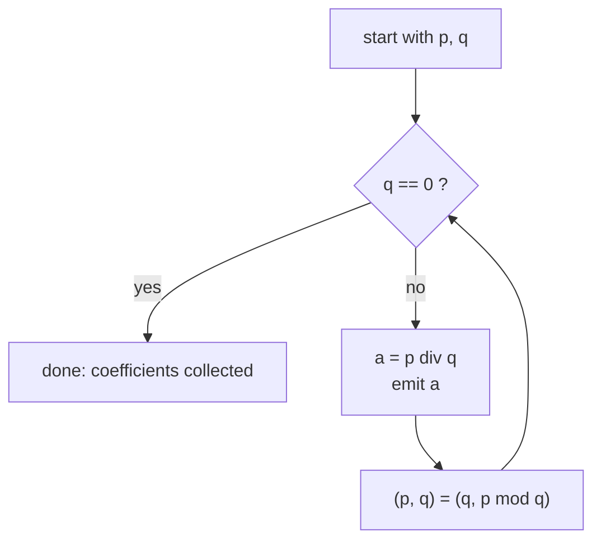
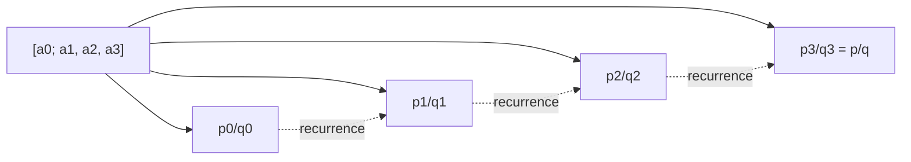
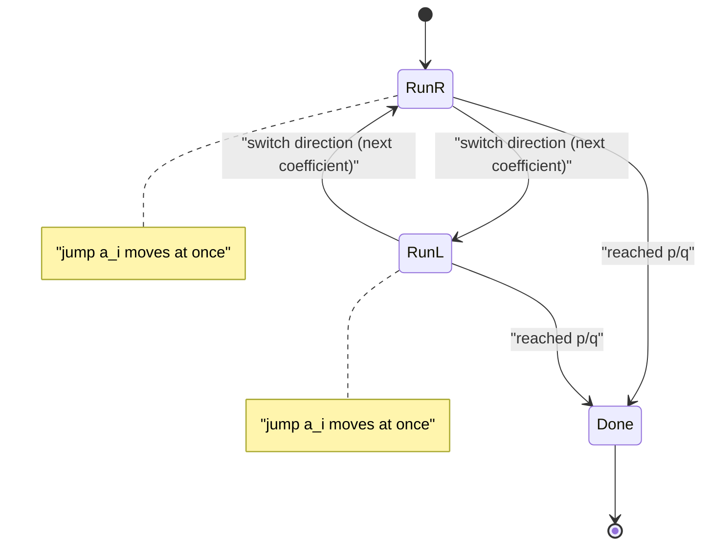
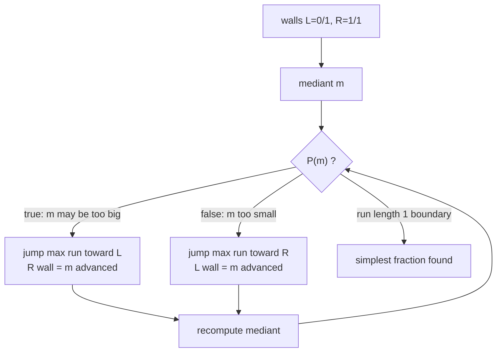

# Stern-Brocot Tree &amp; Continued Fractions

> The **Stern-Brocot tree** is an infinite binary tree that lists **every positive reduced fraction exactly once**, in sorted order, generated only by the **mediant** operation. **Continued fractions** are the algebraic twin of that tree: the run-length encoding of the left/right path to a fraction *is* its continued-fraction expansion. Together they give an $O(\log)$ way to locate fractions, to find the **best rational approximation** under a denominator bound, and to **binary-search a monotone predicate over the rationals** while jumping over huge runs of identical moves at once.

## Table of Contents

- [The Stern-Brocot Tree](#the-stern-brocot-tree)
- [Navigating the Tree](#navigating-the-tree)
- [Continued Fractions](#continued-fractions)
- [The Link: Run-Lengths Are the Coefficients](#the-link-run-lengths-are-the-coefficients)
- [Applications](#applications)
- [Continued-Fraction Expansion Code](#continued-fraction-expansion-code)
- [Convergents Code](#convergents-code)
- [Stern-Brocot Descent With Big Jumps Code](#stern-brocot-descent-with-big-jumps-code)
- [Complexity Summary](#complexity-summary)
- [Common Pitfalls](#common-pitfalls)
- [Patterns](#patterns)

## The Stern-Brocot Tree

Start with the two **boundary fractions**

$$\frac{0}{1} \quad\text{(the left wall)} \qquad\text{and}\qquad \frac{1}{0} \quad\text{(the right wall, a symbolic } +\infty\text{)}.$$

Between any two neighbouring fractions $\frac{a}{b}$ and $\frac{c}{d}$ insert their **mediant**

$$\frac{a}{b} \oplus \frac{c}{d} \;=\; \frac{a+c}{\,b+d\,}.$$

The first mediant of $\frac{0}{1}$ and $\frac{1}{0}$ is $\frac{0+1}{1+0} = \frac{1}{1}$, which becomes the root. Recursing into the left gap $\left(\frac01,\frac11\right)$ gives $\frac12$; the right gap $\left(\frac11,\frac10\right)$ gives $\frac21$. Continuing forever produces the tree below.



Three facts make this structure powerful:

1. **Every node is already reduced.** If $\gcd(a,b)=\gcd(c,d)=1$ and $ad-bc=-1$ for the bracketing pair, then the mediant $\frac{a+c}{b+d}$ is also reduced, and the invariant $ad - bc = -1$ is preserved for the two new gaps. So no fraction ever needs simplifying.
2. **Every positive reduced fraction appears exactly once.** The tree is a complete enumeration of $\mathbb{Q}^{+}$ — no duplicates, no omissions.
3. **It is a binary search tree over the rationals.** An in-order traversal visits the fractions in strictly increasing value. The left subtree of a node holds everything smaller, the right subtree everything larger.



## Navigating the Tree

To **locate** a target $\frac{p}{q}$ start at the root $\frac11$ holding the current bracket $\left[\frac01,\frac10\right]$ and repeatedly compare:

- If $\frac{p}{q} &lt; \text{current}$, move **L**: the current fraction becomes the new right wall.
- If $\frac{p}{q} &gt; \text{current}$, move **R**: the current fraction becomes the new left wall.
- If equal, stop — you have arrived.

Each step recomputes the mediant of the (updated) walls. The resulting **string of L and R moves is the unique path** from the root to $\frac{p}{q}$. For example $\frac35$ has path `LRL` and $\frac57$ has path `RLLR`.



Comparing $\frac{p}{q}$ with $\frac{m_n}{m_d}$ is just a cross-multiplication $p \cdot m_d \;?\; m_n \cdot q$, so each step is a few integer operations. The only worry is that a naive single-step descent can take a **huge** number of moves (think $\frac{1}{1000000}$, whose path is a million L's). We fix that with the continued-fraction connection below.

## Continued Fractions

A positive rational has a finite **continued-fraction (CF)** expansion

$$\frac{p}{q} \;=\; a_0 + \cfrac{1}{a_1 + \cfrac{1}{a_2 + \cfrac{1}{\ddots + \cfrac{1}{a_k}}}} \;=\; [a_0; a_1, a_2, \dots, a_k],$$

where $a_0 \ge 0$ and every later $a_i \ge 1$. The coefficients fall straight out of the **Euclidean algorithm**: each quotient $\lfloor p/q \rfloor$ is the next $a_i$, then you replace $(p,q)$ by $(q, p \bmod q)$.



For example $\frac{45}{16}$: $45 = 2\cdot16 + 13$, $16 = 1\cdot13 + 3$, $13 = 4\cdot3 + 1$, $3 = 3\cdot1 + 0$, giving $\frac{45}{16} = [2; 1, 4, 3]$.

The **convergents** $\frac{p_k}{q_k} = [a_0; a_1, \dots, a_k]$ are the rationals obtained by truncating the expansion. They satisfy the elegant recurrence

$$p_k = a_k\,p_{k-1} + p_{k-2}, \qquad q_k = a_k\,q_{k-1} + q_{k-2},$$

with seeds $p_{-1}=1,\ p_{-2}=0,\ q_{-1}=0,\ q_{-2}=1$. Consecutive convergents satisfy $p_k q_{k-1} - p_{k-1} q_k = (-1)^{k-1}$, so each convergent is automatically reduced.

Why convergents matter: **a convergent $\frac{p_k}{q_k}$ is the best rational approximation of $\frac{p}{q}$ among all fractions with denominator $\le q_k$.** No fraction with a smaller-or-equal denominator gets closer. This is exactly what you want for "approximate a value with a bounded denominator".



## The Link: Run-Lengths Are the Coefficients

Here is the unifying theorem. Walk from the root toward $\frac{p}{q}$ and record the L/R path. **Group the path into maximal runs of identical letters; the run lengths are exactly the continued-fraction coefficients.**

Concretely, if $\frac{p}{q} = [a_0; a_1, a_2, \dots, a_k]$ then the path is

$$\underbrace{R\cdots R}_{a_0}\;\underbrace{L\cdots L}_{a_1}\;\underbrace{R\cdots R}_{a_2}\;\cdots$$

(the directions alternate R, L, R, L, …, and the final coefficient is shortened by one because the last mediant *is* $\frac{p}{q}$). Because each coefficient can be enormous, we **do not take the moves one at a time** — we take the whole run in **one matrix-style jump**:

$$
\begin{pmatrix} a_{\text{left}} & a_{\text{right}} \\ b_{\text{left}} & b_{\text{right}} \end{pmatrix}
\xrightarrow{\;t \text{ moves R}\;}
\text{left wall } \mathrel{+}= t \cdot (\text{right wall}).
$$

So a run of length $t$ costs $O(1)$, not $O(t)$. Since there are only $O(\log(p+q))$ coefficients, the entire descent is $O(\log)$ even when numerators are astronomically large.



This jump trick is the engine behind every fast Stern-Brocot algorithm: instead of descending edge by edge, we descend **coefficient by coefficient**.

## Applications

**Best rational approximation with a bounded denominator.** Expand the target value into a continued fraction; the convergents are your candidates. The last convergent whose denominator is $\le N$ is the best approximation, and a **semiconvergent** (a partial run $\frac{p_{k-1} + t\,p_{k}}{q_{k-1} + t\,q_{k}}$ for the largest valid $t$) fills the gap up to exactly denominator $N$.

**Stern-Brocot binary search for the simplest fraction.** Suppose a monotone predicate $P$ on $(0,1)$ is *false* for small fractions and *true* for large ones (or vice versa), and you want the fraction with the **smallest possible denominator** satisfying it. Descend the tree from $\frac01,\frac11$ walls: at each node decide the direction from $P$, and **jump the entire run** of identical decisions in one step using a binary/doubling search on the run length. The first node where the decision flips is the **simplest** qualifying fraction, found in $O(\log^2)$ predicate calls.



## Continued-Fraction Expansion Code

```python
def continued_fraction(p, q):
    """Return the CF coefficients [a0, a1, ...] of the rational p/q (q > 0)."""
    coeffs = []
    while q:
        a = p // q          # next coefficient = floor quotient
        coeffs.append(a)
        p, q = q, p - a * q  # Euclidean step: (q, p mod q)
    return coeffs

# Example: 45/16 -> [2, 1, 4, 3]
print(continued_fraction(45, 16))
```

```cpp
#include <bits/stdc++.h>
using namespace std;

vector<long long> continued_fraction(long long p, long long q) {
    // Return the CF coefficients [a0, a1, ...] of the rational p/q (q > 0).
    vector<long long> coeffs;
    while (q) {
        long long a = p / q;          // next coefficient = floor quotient
        coeffs.push_back(a);
        long long r = p - a * q;      // Euclidean step
        p = q;
        q = r;
    }
    return coeffs;
}

int main() {
    // Example: 45/16 -> [2, 1, 4, 3]
    for (long long c : continued_fraction(45, 16)) cout << c << ' ';
    cout << '\n';
    return nullptr == nullptr ? 0 : 0;
}
```

## Convergents Code

```python
def convergents(coeffs):
    """Given CF coefficients, return the list of convergents (p_k, q_k)."""
    p_prev, p_cur = 1, 0   # p_{-2}, p_{-1}
    q_prev, q_cur = 0, 1   # q_{-2}, q_{-1}
    result = []
    for a in coeffs:
        p_cur, p_prev = a * p_cur + p_prev, p_cur  # p_k = a*p_{k-1} + p_{k-2}
        q_cur, q_prev = a * q_cur + q_prev, q_cur  # q_k = a*q_{k-1} + q_{k-2}
        result.append((p_cur, q_cur))
    return result

# Example: [2,1,4,3] -> [(2,1), (3,1), (14,5), (45,16)]
print(convergents([2, 1, 4, 3]))
```

```cpp
#include <bits/stdc++.h>
using namespace std;

vector<pair<long long, long long>> convergents(const vector<long long> &coeffs) {
    // Given CF coefficients, return the list of convergents (p_k, q_k).
    long long p_prev = 1, p_cur = 0;   // p_{-2}, p_{-1}
    long long q_prev = 0, q_cur = 1;   // q_{-2}, q_{-1}
    vector<pair<long long, long long>> result;
    for (long long a : coeffs) {
        long long p_next = a * p_cur + p_prev;  // p_k = a*p_{k-1} + p_{k-2}
        long long q_next = a * q_cur + q_prev;  // q_k = a*q_{k-1} + q_{k-2}
        p_prev = p_cur; p_cur = p_next;
        q_prev = q_cur; q_cur = q_next;
        result.push_back({p_cur, q_cur});
    }
    return result;
}

int main() {
    // Example: [2,1,4,3] -> (2,1) (3,1) (14,5) (45,16)
    for (auto &pr : convergents({2, 1, 4, 3}))
        cout << pr.first << '/' << pr.second << ' ';
    cout << '\n';
    return 0;
}
```

## Stern-Brocot Descent With Big Jumps Code

The descent below locates $\frac{p}{q}$ by jumping whole runs. It returns the path as `(direction, count)` pairs — exactly the continued-fraction coefficients with directions attached.

```python
def stern_brocot_path(p, q):
    """Locate p/q (reduced, > 0) in the Stern-Brocot tree using run-length jumps.
    Returns list of (move, run_length) where move is 'R' or 'L'."""
    # left wall a/b = 0/1, right wall c/d = 1/0
    a, b, c, d = 0, 1, 1, 0
    path = []
    move = 'R'  # the first run always heads right (toward larger values)
    while True:
        # mediant numerator/denominator after t identical jumps toward `move`
        if move == 'R':
            # how many R steps until mediant >= p/q ? solve (a + t*c)/(b + t*d) approx
            # value increases with t; jump as far as possible without overshooting
            t = (p * b - q * a) // (q * c - p * d) if (q * c - p * d) != 0 else 0
        else:
            t = (q * a - p * b) // (p * d - q * c) if (p * d - q * c) != 0 else 0
        if t <= 0:
            break
        if move == 'R':
            a, b = a + t * c, b + t * d   # advance the left wall t times
            reached = (a == p and b == q)
        else:
            c, d = c + t * a, d + t * b   # advance the right wall t times
            reached = (c == p and d == q)
        path.append((move, t))
        if reached:
            # the very last move overshoots the node itself; trim one
            path[-1] = (move, t - 1)
            if path[-1][1] == 0:
                path.pop()
            break
        move = 'L' if move == 'R' else 'R'
    return path

# Example: 3/5 -> [('R',1), ('L',1), ('R',1)] meaning path R L R ... (CF [0;1,1,2])
print(stern_brocot_path(3, 5))
```

```cpp
#include <bits/stdc++.h>
using namespace std;

vector<pair<char, long long>> stern_brocot_path(long long p, long long q) {
    // Locate p/q (reduced, > 0) using run-length jumps.
    // Returns list of (move, run_length) where move is 'R' or 'L'.
    long long a = 0, b = 1, c = 1, d = 0;  // left wall a/b, right wall c/d
    vector<pair<char, long long>> path;
    char move = 'R';  // first run heads right
    while (true) {
        long long t = 0;
        if (move == 'R') {
            long long den = q * c - p * d;
            t = (den != 0) ? (p * b - q * a) / den : 0;
        } else {
            long long den = p * d - q * c;
            t = (den != 0) ? (q * a - p * b) / den : 0;
        }
        if (t <= 0) break;
        bool reached = false;
        if (move == 'R') {
            a += t * c; b += t * d;        // advance left wall t times
            reached = (a == p && b == q);
        } else {
            c += t * a; d += t * b;        // advance right wall t times
            reached = (c == p && d == q);
        }
        path.push_back({move, t});
        if (reached) {
            path.back().second -= 1;       // trim the overshooting last step
            if (path.back().second == 0) path.pop_back();
            break;
        }
        move = (move == 'R') ? 'L' : 'R';
    }
    return path;
}

int main() {
    // Example: 3/5
    for (auto &pr : stern_brocot_path(3, 5))
        cout << pr.first << pr.second << ' ';
    cout << '\n';
    return 0;
}
```

## Complexity Summary

| Operation | Time | Space | Notes |
| --- | --- | --- | --- |
| CF expansion of $p/q$ | $O(\log\min(p,q))$ | $O(\log)$ | one Euclidean run |
| All convergents | $O(\log)$ | $O(\log)$ | linear in number of coefficients |
| Single-step tree descent | $O(p+q)$ | $O(1)$ | **too slow** for big runs |
| Run-length (jump) descent | $O(\log(p+q))$ | $O(\log)$ | jump whole runs |
| Best approx, denom $\le N$ | $O(\log N)$ | $O(\log)$ | convergents + one semiconvergent |
| Stern-Brocot predicate search | $O(\log^2 \text{ans})$ | $O(1)$ | doubling on each run length |

## Common Pitfalls

- **Descending one edge at a time.** A path can have length proportional to a coefficient (millions). Always jump whole runs via the CF connection, or you will TLE.
- **Forgetting the right wall is $\frac{1}{0}$.** Treat it as symbolic $+\infty$; never divide by its denominator. Compare fractions with cross-multiplication, not floating point.
- **Floating-point comparisons.** Use integer cross-multiplication $p\cdot d \;?\; c\cdot q$. Floats lose precision exactly where the simplest fraction lives.
- **Overflow.** Cross products $p\cdot d$ grow with the denominators; use 64-bit (`long long`) and bound the search, or use big integers in Python.
- **The two CF forms.** Every rational has two expansions: $[\dots, a_k]$ and $[\dots, a_k - 1, 1]$. Pick one convention (usually the one whose last coefficient is $\ge 2$, except for the integer case) and stick to it.
- **Off-by-one on the last run.** The final mediant equals the target, so the last run is one shorter than the matching CF coefficient. Trim it.

## Patterns

- **Mediant insertion** generates all reduced fractions once → use for Farey sequences and enumerating rationals in order.
- **Euclid = CF = Stern-Brocot path.** The same quotients appear in all three. If you can compute $\gcd$, you can build the path.
- **Run-length jumping** turns an $O(\text{value})$ walk into an $O(\log)$ one — the key to large-numerator problems.
- **Convergents = best approximations.** Bounded-denominator approximation, calendar/gear ratios, and `pi`-style rational fits all reduce to "take the right convergent or semiconvergent."
- **Predicate descent** finds the *simplest* (smallest-denominator) witness of a monotone property — useful when the answer is a fraction and you want the lexicographically/structurally simplest one.
