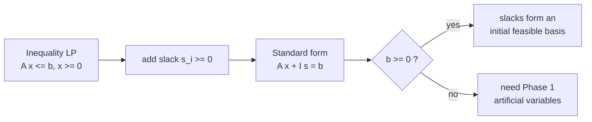
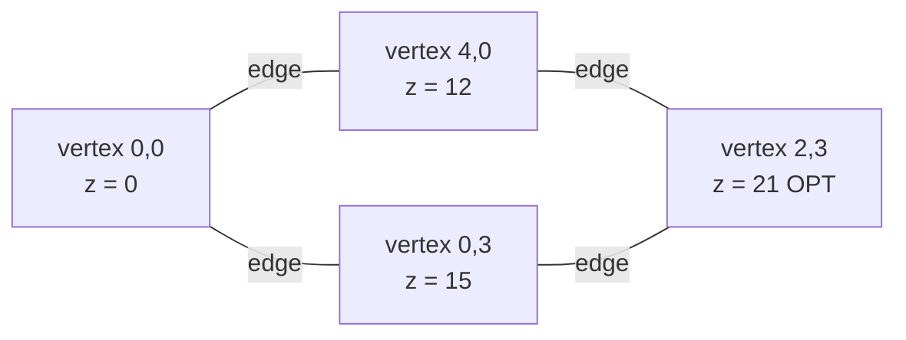
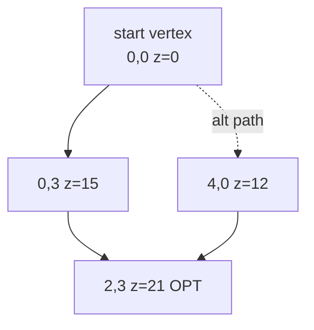
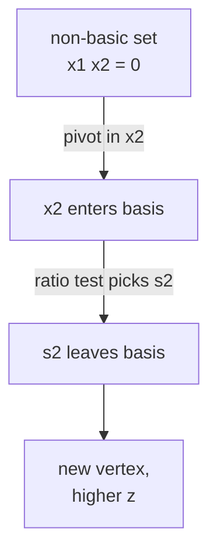
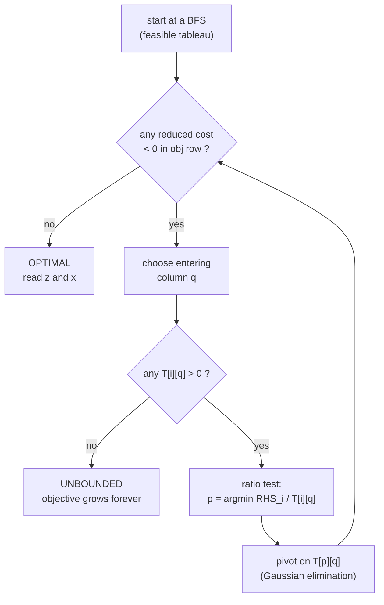
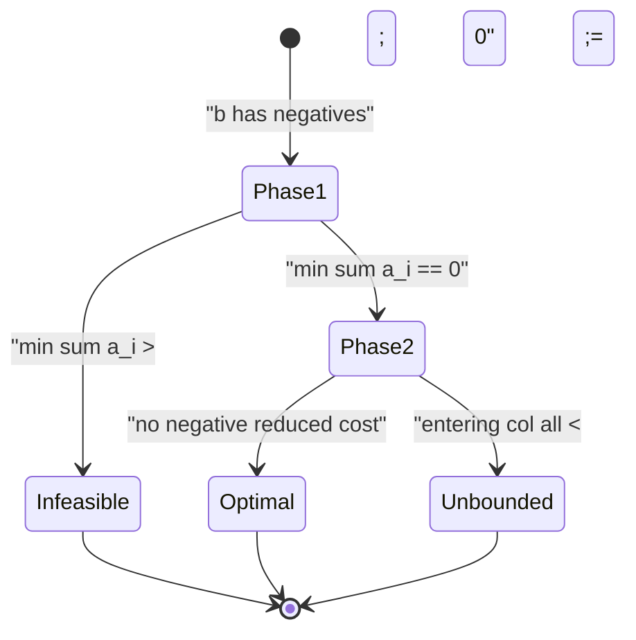
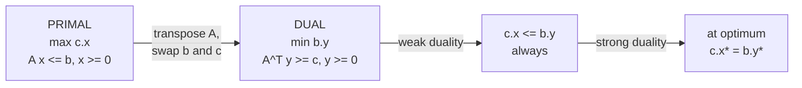

# Simplex Method &amp; Linear Programming

> A **linear program (LP)** asks you to maximize (or minimize) a *linear* objective subject to *linear* inequality constraints. The feasible set is a convex polytope, the optimum always sits at a **vertex**, and the **simplex method** walks from vertex to vertex along the edges of that polytope, improving the objective at every step until no improving move remains. This guide builds the geometry, the tableau mechanics, the pivot rules, two-phase initialization, Bland's rule, and LP duality — then gives a self-contained dense simplex in Python and C++.

## Table of Contents

- [What a Linear Program Is](#what-a-linear-program-is)
- [Standard Form and Slack Variables](#standard-form-and-slack-variables)
- [The Geometry: a Convex Polytope](#the-geometry-a-convex-polytope)
- [The Simplex Method: Tableau and Pivoting](#the-simplex-method-tableau-and-pivoting)
- [The Ratio Test and the Pivot Loop](#the-ratio-test-and-the-pivot-loop)
- [Two-Phase Method and Bland's Rule](#two-phase-method-and-blands-rule)
- [LP Duality](#lp-duality)
- [Unbounded and Infeasible Detection](#unbounded-and-infeasible-detection)
- [LP in Competitive Programming](#lp-in-competitive-programming)
- [A Self-Contained Dense Simplex](#a-self-contained-dense-simplex)
- [Complexity Summary](#complexity-summary)
- [Common Pitfalls](#common-pitfalls)
- [Patterns](#patterns)

## What a Linear Program Is

A linear program in **canonical maximization form** is

$$\max \; c^\top x \quad \text{subject to} \quad A x \le b, \;\; x \ge 0,$$

where $x \in \mathbb{R}^n$ is the vector of decision variables, $c \in \mathbb{R}^n$ is the objective (cost) vector, $A \in \mathbb{R}^{m \times n}$ is the constraint matrix, and $b \in \mathbb{R}^m$ is the right-hand side. Spelled out:

$$\max \; \sum_{j=1}^{n} c_j x_j \quad \text{s.t.} \quad \sum_{j=1}^{n} a_{ij} x_j \le b_i \;\; (i = 1, \dots, m), \quad x_j \ge 0.$$

Every linear function is both convex and concave, and every constraint $a_i^\top x \le b_i$ defines a **half-space**. The intersection of finitely many half-spaces is a convex region, so an LP is *maximize a linear function over a convex polyhedron*. That single fact drives everything below.

A minimization problem $\min c^\top x$ is the same as $\max (-c)^\top x$, and a constraint $a^\top x \ge b$ is $(-a)^\top x \le -b$, so canonical form loses no generality.

## Standard Form and Slack Variables

To run the simplex method we convert every inequality into an **equality** by adding a non-negative **slack variable** $s_i \ge 0$ that absorbs the gap:

$$\sum_{j=1}^{n} a_{ij} x_j + s_i = b_i, \qquad s_i \ge 0.$$

With slacks the LP becomes the **standard form**

$$\max \; c^\top x \quad \text{s.t.} \quad A x + I s = b, \;\; x \ge 0, \;\; s \ge 0,$$

a system of $m$ equations in $n + m$ non-negative variables. If $b \ge 0$, the slacks themselves give an obvious starting point: set every original $x_j = 0$, and then $s_i = b_i \ge 0$ is feasible. That is the seed the simplex grows from.



A **basic feasible solution (BFS)** picks $m$ of the $n + m$ variables to be **basic** (their columns form an invertible $m \times m$ submatrix $B$); the other $n$ variables are **non-basic** and fixed at $0$. Solving $B x_B = b$ gives the basic values. If $x_B \ge 0$ the basis is feasible, and — crucially — **every BFS corresponds to a vertex of the polytope.**

## The Geometry: a Convex Polytope

The feasible region $P = \{ x : A x \le b, \; x \ge 0 \}$ is a **convex polytope**. Three geometric facts justify the whole algorithm:

1. **Convexity.** If $x$ and $y$ are feasible then so is every point on the segment between them, because each half-space is convex and intersections of convex sets are convex.
2. **The optimum is attained at a vertex.** A linear objective on a bounded polytope reaches its maximum at an extreme point (a vertex). Intuitively, if you were in the interior or on the relative interior of a face, the objective gradient $c$ would point along some edge toward a better point.
3. **Vertices are exactly the basic feasible solutions.** A vertex is a feasible point where $n$ of the constraints (including the $x_j \ge 0$ bounds) hold with equality. That is precisely a BFS.



Simplex starts at one vertex and **hops to an adjacent vertex along an edge** that increases the objective. Because there are finitely many vertices and the objective strictly improves (under an anti-cycling rule), the walk terminates at an optimal vertex.



## The Simplex Method: Tableau and Pivoting

We store the standard-form system as a **tableau** — a dense matrix encoding the equations plus the objective row. With $m$ constraints and $N = n + m$ variables, a common layout is:

| basis | $x_1$ | $x_2$ | $s_1$ | $s_2$ | RHS |
| --- | --- | --- | --- | --- | --- |
| $s_1$ | 1 | 1 | 1 | 0 | 4 |
| $s_2$ | 1 | 3 | 0 | 1 | 6 |
| **z** | -3 | -5 | 0 | 0 | 0 |

The bottom **objective row** holds the *reduced costs*. We write the objective row so that a **negative entry means that increasing that non-basic variable would increase $z$** (this is the convention used by the code below, which keeps the row as $-c$ over non-basic columns). The RHS of the objective row holds the current objective value (here $0$, since we start at the origin).

A **pivot** swaps one non-basic variable **into** the basis (the *entering* variable) and one basic variable **out** (the *leaving* variable), then performs Gaussian elimination so the entering column becomes a unit column. Geometrically a pivot is one **edge traversal** from the current vertex to an adjacent one.



## The Ratio Test and the Pivot Loop

**Entering variable.** Pick a column $q$ whose objective-row entry is negative (reduced cost says it can improve $z$). Dantzig's rule chooses the *most negative* reduced cost; Bland's rule (below) chooses the *smallest index* to guarantee termination.

**Leaving variable (ratio test).** Increasing $x_q$ from $0$ raises the entering column's value, and each basic variable $x_{B_i}$ changes by $-t \cdot T_{iq}$ as $x_q = t$ grows. A basic variable hits $0$ first when

$$t^\star = \min_{i \,:\, T_{iq} > 0} \frac{T_{i,\text{RHS}}}{T_{iq}}.$$

Only rows with a **strictly positive** pivot entry $T_{iq} > 0$ constrain the step; the row achieving the minimum ratio is the **leaving** row $p$. We then pivot on $T_{pq}$: divide row $p$ by $T_{pq}$, and subtract multiples of it from every other row (including the objective row) to zero out column $q$ elsewhere.



If **no** ratio is finite (no positive entry in the entering column) the step can grow without bound, so the LP is **unbounded**. If every reduced cost is $\ge 0$, no improving move exists and the current vertex is **optimal**.

## Two-Phase Method and Bland's Rule

When some $b_i < 0$, the slack basis is *infeasible* (a slack would be negative), so we cannot start. The **two-phase method** fixes this:

- **Phase 1.** Add one **artificial variable** $a_i \ge 0$ to each offending equation and minimize $\sum_i a_i$ (equivalently maximize $-\sum a_i$). If the optimal Phase-1 value is $0$, all artificials are driven out and we have a genuine feasible basis; if it is positive, the **original LP is infeasible**.
- **Phase 2.** Discard the artificials, restore the real objective, and run simplex from the feasible basis Phase 1 produced.



**Degeneracy and cycling.** When a basic variable is already $0$, the ratio test can give $t^\star = 0$: the basis changes but the vertex (and objective) does not move. A poorly chosen pivot sequence can then loop forever. **Bland's rule** prevents this: among eligible entering columns choose the **smallest index**, and break ratio-test ties by the **smallest basic-variable index**. Under Bland's rule no basis repeats, so simplex terminates in finitely many pivots.

## LP Duality

Every primal LP has a **dual** LP built from the same data. For the canonical primal

$$\text{(P)} \quad \max \; c^\top x \;\; \text{s.t.} \;\; A x \le b, \; x \ge 0,$$

the dual is

$$\text{(D)} \quad \min \; b^\top y \;\; \text{s.t.} \;\; A^\top y \ge c, \; y \ge 0.$$

Each dual variable $y_i$ is a "price" on primal constraint $i$. Three theorems tie them together.

**Weak duality.** For *any* primal-feasible $x$ and dual-feasible $y$,

$$c^\top x \;\le\; y^\top A x \;\le\; y^\top b = b^\top y.$$

The first inequality uses $A^\top y \ge c$ and $x \ge 0$; the second uses $Ax \le b$ and $y \ge 0$. So **every dual-feasible objective is an upper bound on every primal objective.** Consequently, if the primal is unbounded the dual is infeasible, and vice versa.

**Strong duality.** If the primal has a finite optimum then so does the dual, and the two optimal values are **equal**: $c^\top x^\star = b^\top y^\star$. There is no gap. This is the deep theorem — the upper bound from weak duality is actually achieved.

**Complementary slackness.** At a pair of optimal solutions $(x^\star, y^\star)$,

$$y_i^\star \big(b_i - a_i^\top x^\star\big) = 0 \quad \forall i, \qquad x_j^\star \big(a_j^{\top} y^\star - c_j\big) = 0 \quad \forall j.$$

Intuitively: if a primal constraint is **slack** (not tight, $a_i^\top x^\star < b_i$) then its dual price is $0$; and if a primal variable is **positive** ($x_j^\star > 0$) then its dual constraint is **tight**. This is the certificate you use to *verify* optimality without re-solving.



## Unbounded and Infeasible Detection

The simplex run reports the LP's status directly:

- **Optimal.** No reduced cost is negative; the objective row RHS is the optimum and the basic values give $x^\star$.
- **Unbounded.** An entering column has **no positive entry**, so the chosen variable can increase forever while staying feasible: $z \to +\infty$.
- **Infeasible.** Phase 1 ends with $\sum a_i > 0$, meaning the constraints cannot be satisfied simultaneously.

By weak duality these statuses are linked across primal and dual: *primal unbounded* $\Rightarrow$ *dual infeasible*, and a feasible bounded primal forces a feasible dual with matching value.

## LP in Competitive Programming

Full general LP is rare in contests, but the ideas appear often:

- **Small LPs.** When $m$ and $n$ are tiny (a handful of variables and constraints) a dense tableau simplex solves them in microseconds — useful for resource-allocation or mixing subproblems.
- **Fractional relaxations.** Many integer problems become tractable when you *relax* integrality; the LP optimum bounds the integer optimum and sometimes (totally unimodular constraints) is already integral.
- **Two-variable LP, $O(n)$ geometric method (brief note).** With only **two** decision variables, the feasible region is a 2D polygon and the optimum is a polygon vertex. Seidel's randomized incremental algorithm solves a 2D LP with $n$ half-plane constraints in **expected $O(n)$** time: add constraints in random order, keep the current optimum, and only re-optimize on the new constraint's line when it is violated. This is the go-to when the problem is literally "two unknowns, many linear constraints."
- **Duality as a proof tool.** Weak duality gives a clean way to *certify* an upper bound (max-flow / min-cut is the textbook special case).

## A Self-Contained Dense Simplex

The implementations below solve the canonical maximization LP $\max c^\top x$ s.t. $A x \le b$, $x \ge 0$ with $b \ge 0$, using slack variables and Dantzig's most-negative-reduced-cost rule. Both solve the **same** example

$$\max \; 3 x_1 + 5 x_2 \quad \text{s.t.} \quad x_1 + x_2 \le 4, \;\; x_1 + 3 x_2 \le 6, \;\; x_1, x_2 \ge 0,$$

whose optimum is $z = 17$ at $x = (3, 1)$.

```python
EPS = 1e-9

def simplex_max(A, b, c):
    """max c.x s.t. A x <= b, x >= 0, assuming b >= 0.
    Returns (optimum_value, x_vector)."""
    m = len(A)
    n = len(c)
    N = n + m                      # original vars + slacks
    # Tableau: m constraint rows + 1 objective row, N+1 columns (last = RHS).
    T = [[0.0] * (N + 1) for _ in range(m + 1)]
    basis = [n + i for i in range(m)]   # start: slacks are basic
    for i in range(m):
        for j in range(n):
            T[i][j] = float(A[i][j])
        T[i][n + i] = 1.0          # slack column
        T[i][N] = float(b[i])      # RHS
    for j in range(n):
        T[m][j] = -float(c[j])     # objective row holds -c (minimize -z)

    while True:
        # Entering column: most negative reduced cost (Dantzig).
        q = -1
        best = -EPS
        for j in range(N):
            if T[m][j] < best:
                best = T[m][j]
                q = j
        if q == -1:
            break                  # optimal: no negative reduced cost

        # Ratio test: leaving row with smallest RHS / T[i][q], T[i][q] > 0.
        p = -1
        ratio = float("inf")
        for i in range(m):
            if T[i][q] > EPS:
                r = T[i][N] / T[i][q]
                if r < ratio - EPS:
                    ratio = r
                    p = i
        if p == -1:
            raise ValueError("unbounded")

        # Pivot on T[p][q].
        piv = T[p][q]
        for j in range(N + 1):
            T[p][j] /= piv
        for i in range(m + 1):
            if i != p and abs(T[i][q]) > EPS:
                factor = T[i][q]
                for j in range(N + 1):
                    T[i][j] -= factor * T[p][j]
        basis[p] = q

    x = [0.0] * n
    for i in range(m):
        if basis[i] < n:
            x[basis[i]] = T[i][N]
    return T[m][N], x             # objective-row RHS is the optimum


if __name__ == "__main__":
    A = [[1, 1], [1, 3]]
    b = [4, 6]
    c = [3, 5]
    opt, x = simplex_max(A, b, c)
    print(f"optimum = {opt:.4f}")          # 17.0000
    print("x =", [round(v, 4) for v in x]) # [3.0, 1.0]
```

```cpp
#include <bits/stdc++.h>
using namespace std;
const double EPS = 1e-9;

// max c.x s.t. A x <= b, x >= 0, assuming b >= 0.
// Returns {optimum, x}. Throws on unbounded.
pair<double, vector<double>> simplex_max(
        const vector<vector<double>> &A,
        const vector<double> &b,
        const vector<double> &c) {
    int m = (int)A.size();
    int n = (int)c.size();
    int N = n + m;                         // original vars + slacks
    vector<vector<double>> T(m + 1, vector<double>(N + 1, 0.0));
    vector<int> basis(m);
    for (int i = 0; i < m; i++) {
        for (int j = 0; j < n; j++) T[i][j] = A[i][j];
        T[i][n + i] = 1.0;                 // slack column
        T[i][N] = b[i];                    // RHS
        basis[i] = n + i;                  // slacks start basic
    }
    for (int j = 0; j < n; j++) T[m][j] = -c[j];   // objective row = -c

    while (true) {
        int q = -1;
        double best = -EPS;
        for (int j = 0; j < N; j++)
            if (T[m][j] < best) { best = T[m][j]; q = j; }
        if (q == -1) break;                // optimal

        int p = -1;
        double ratio = numeric_limits<double>::infinity();
        for (int i = 0; i < m; i++) {
            if (T[i][q] > EPS) {
                double r = T[i][N] / T[i][q];
                if (r < ratio - EPS) { ratio = r; p = i; }
            }
        }
        if (p == -1) throw runtime_error("unbounded");

        double piv = T[p][q];
        for (int j = 0; j <= N; j++) T[p][j] /= piv;
        for (int i = 0; i <= m; i++) {
            if (i != p && fabs(T[i][q]) > EPS) {
                double factor = T[i][q];
                for (int j = 0; j <= N; j++) T[i][j] -= factor * T[p][j];
            }
        }
        basis[p] = q;
    }

    vector<double> x(n, 0.0);
    for (int i = 0; i < m; i++)
        if (basis[i] < n) x[basis[i]] = T[i][N];
    return {T[m][N], x};
}

int main() {
    vector<vector<double>> A = {{1, 1}, {1, 3}};
    vector<double> b = {4, 6};
    vector<double> c = {3, 5};
    auto [opt, x] = simplex_max(A, b, c);
    printf("optimum = %.4f\n", opt);       // 17.0000
    printf("x = [%.4f, %.4f]\n", x[0], x[1]); // 3.0000, 1.0000
    return 0;
}
```

## Complexity Summary

| Aspect | Cost / Fact |
| --- | --- |
| One pivot (dense tableau) | $O(m \cdot (n + m))$ to update all rows |
| Practical pivots to optimum | typically $O(m)$ to $O(m + n)$ |
| Worst case (Klee–Minty cubes) | exponential pivots |
| Memory | $O(m \cdot (n + m))$ for the tableau |
| Two-variable LP (Seidel) | expected $O(n)$ for $n$ half-planes |
| Polynomial alternatives | ellipsoid / interior-point methods: $\text{poly}(n, m)$ |

## Common Pitfalls

- **Forgetting $b \ge 0$.** The one-phase code above seeds with slacks and *requires* $b \ge 0$. If any $b_i < 0$ you must run Phase 1 with artificial variables first, or the initial basis is infeasible.
- **Wrong objective-row sign.** Decide one convention (here the row stores $-c$ so a **negative** entry means "can improve") and apply the entering test consistently. Mixing conventions silently solves a minimization instead.
- **Ratio test on non-positive entries.** Only rows with $T_{iq} > 0$ are eligible. Including $T_{iq} \le 0$ produces a negative or infinite "ratio" and a wrong (or infeasible) pivot.
- **Cycling on degenerate LPs.** With ties at $0$ in the ratio test, Dantzig's rule can loop forever. Switch to **Bland's rule** (smallest-index entering and leaving) to guarantee termination.
- **Floating-point comparisons.** Compare against `EPS`, never against exact `0.0`, when testing reduced costs and pivot entries; otherwise round-off makes optimal look improvable or vice versa.
- **Reading the wrong cell for the answer.** The optimum lives in the **objective-row RHS**; the solution vector comes from the **basic rows**, with every non-basic variable equal to $0$.

## Patterns

- **"Maximize a linear payoff under linear limits"** $\Rightarrow$ set up canonical LP, add slacks, run simplex.
- **Tight bound / certificate needed** $\Rightarrow$ build the **dual** and use weak/strong duality and complementary slackness.
- **Only two unknowns, many constraints** $\Rightarrow$ 2D LP via Seidel's expected $O(n)$ method, not a full tableau.
- **Integer problem too hard** $\Rightarrow$ solve the **LP relaxation** for a bound; check for total unimodularity to hope for an integral optimum.
- **"Is it even feasible?"** $\Rightarrow$ Phase 1: minimize the sum of artificials; positive optimum means **infeasible**.
- **Objective grows without limit** $\Rightarrow$ an entering column with no positive entry signals **unbounded**.
