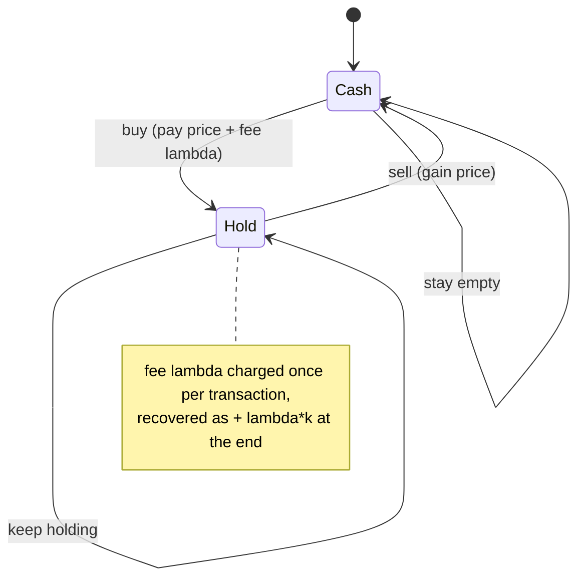
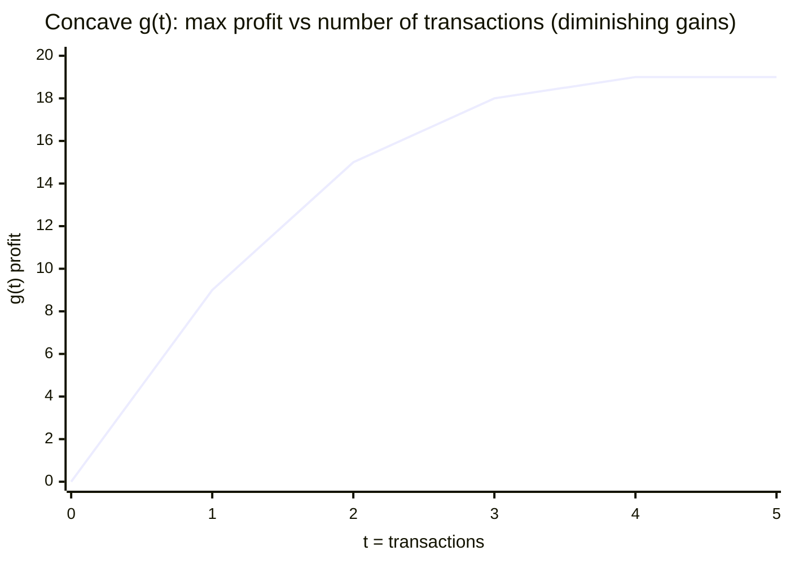
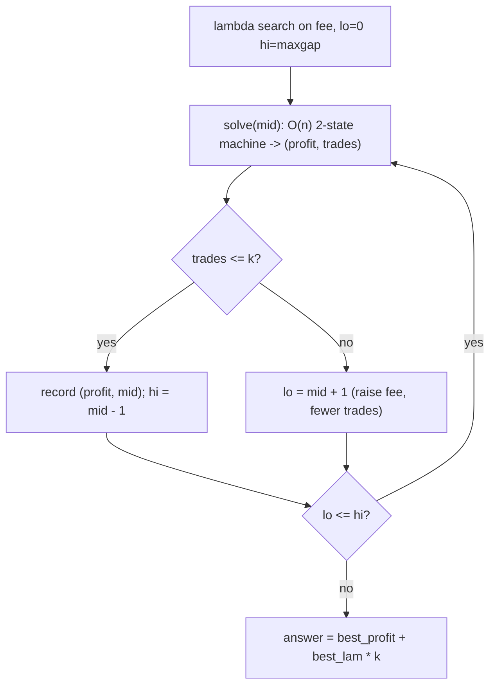

# LeetCode 188 — Best Time to Buy and Sell Stock IV (k Transactions)

| Meta | Value |
| --- | --- |
| Problem | Maximize profit with **at most $k$** buy/sell transactions |
| Source | LeetCode 188 |
| Reference | [misc/guide/08-aliens-trick.md](../guide/08-aliens-trick.md) |
| Difficulty | Hard |
| Topics | DP, state machine, Lagrangian relaxation, convexity, binary search |
| Time | $O(nk)$ standard DP; $O(n \log V)$ Aliens trick |
| Space | $O(k)$ standard; $O(1)$ Aliens trick |

## Problem Statement

Given an array `prices` where `prices[i]` is the price of a stock on day $i$, and an integer $k$, find the **maximum profit** achievable with **at most $k$** transactions. You must sell before buying again (hold at most one share at a time).

```text
Example 1:
prices = [2, 4, 1],  k = 2
Buy at 2, sell at 4 -> profit 2.  Only one profitable trade. Answer = 2

Example 2:
prices = [3, 2, 6, 5, 0, 3],  k = 2
Buy 2 sell 6 -> 4 ; buy 0 sell 3 -> 3 ; total = 7. Answer = 7
```

## Approach (WHY)

### Standard O(nk) DP

Track, for each allowed transaction count $t$, the best profit while **holding** (`hold`) and while **empty** (`cash`):

$$\text{hold}[t] = \max(\text{hold}[t],\ \text{cash}[t-1] - p_i), \qquad \text{cash}[t] = \max(\text{cash}[t],\ \text{hold}[t] + p_i).$$

We count a transaction when we **buy** (move from $t-1$ to $t$). This is $O(nk)$ time, $O(k)$ space — fine when $k$ is small, but $k$ can be up to $n/2$.

### Aliens trick O(n log V)

Let $g(t)$ = max profit using **exactly** $t$ transactions. Each additional transaction captures the next-most-profitable disjoint price increase, so the marginal gains are **non-increasing** — $g(t)$ is **concave** in $t$. (This is the maximization mirror of convexity.) That is exactly the Aliens-trick precondition.

Charge a **fee $\lambda \ge 0$ per transaction** and solve the *unconstrained* problem (any number of trades) in $O(n)$ with a 2-state machine. Because $g$ is concave, the number of transactions used, $t^\*(\lambda)$, is **non-increasing in $\lambda$**: a higher fee discourages trading. Binary-search the smallest $\lambda$ with $t^\*(\lambda) \le k$, then recover

$$g(k) = h(\lambda) + \lambda k, \qquad h(\lambda) = \max_t\big(g(t) - \lambda t\big).$$

(For maximization the penalty is **subtracted** in the DP and **added back** at the end.) Since "at most $k$" — if the unconstrained optimum at $\lambda = 0$ already uses $\le k$ trades, that profit is the answer directly; otherwise the constraint binds and the binary search finds the right fee.





## Implementation

### Standard O(nk) DP

```python
def maxProfit_dp(k, prices):
    """At most k transactions, O(n*k). Counts a transaction on each BUY."""
    n = len(prices)
    if n == 0 or k == 0:
        return 0
    if k >= n // 2:                      # unbounded transactions case
        return sum(max(0, prices[i] - prices[i - 1]) for i in range(1, n))
    NEG = float("-inf")
    hold = [NEG] * (k + 1)
    cash = [0] * (k + 1)
    for p in prices:
        for t in range(1, k + 1):
            hold[t] = max(hold[t], cash[t - 1] - p)   # buy: opens transaction t
            cash[t] = max(cash[t], hold[t] + p)       # sell: closes transaction t
    return cash[k]
```

```cpp
#include <bits/stdc++.h>
using namespace std;
const long long INF = 1e18;

// At most k transactions, O(n*k). Counts a transaction on each BUY.
long long maxProfit_dp(long long k, const vector<long long>& prices) {
    long long n = (long long)prices.size();
    if (n == 0 || k == 0) return 0;
    if (k >= n / 2) {                    // unbounded transactions case
        long long s = 0;
        for (long long i = 1; i < n; ++i) s += max(0LL, prices[i] - prices[i - 1]);
        return s;
    }
    vector<long long> hold(k + 1, -INF), cash(k + 1, 0);
    for (long long p : prices) {
        for (long long t = 1; t <= k; ++t) {
            hold[t] = max(hold[t], cash[t - 1] - p);  // buy: opens transaction t
            cash[t] = max(cash[t], hold[t] + p);      // sell: closes transaction t
        }
    }
    return cash[k];
}
```

### Aliens trick O(n log V)

```python
def maxProfit_aliens(k, prices):
    """At most k transactions via Lagrangian relaxation, O(n log V).
    g(t) is concave; charge fee lambda per transaction, then add lambda*k back."""
    n = len(prices)
    if n == 0 or k == 0:
        return 0
    NEG = float("-inf")

    def solve(lam):
        # Unconstrained DP with a per-transaction fee `lam`. Returns (profit, num_transactions).
        # cash/hold carry (value, transaction_count). Charge the fee + count on BUY.
        # Tie-break: among equal profit prefer FEWER transactions.
        cash_v, cash_c = 0, 0
        hold_v, hold_c = NEG, 0
        for p in prices:
            # buy: open a transaction, pay price and fee lambda
            nv = cash_v - p - lam
            nc = cash_c + 1
            if nv > hold_v or (nv == hold_v and nc < hold_c):
                hold_v, hold_c = nv, nc
            # sell: close, gain price
            sv = hold_v + p
            sc = hold_c
            if sv > cash_v or (sv == cash_v and sc < cash_c):
                cash_v, cash_c = sv, sc
        return cash_v, cash_c

    lo, hi = 0, max(prices) - min(prices)   # fee range bounds the slope of g
    best_profit, best_lam = 0, 0
    while lo <= hi:
        mid = (lo + hi) // 2
        profit, cnt = solve(mid)
        if cnt <= k:                        # fee high enough to keep trades <= k
            best_profit, best_lam = profit, mid
            hi = mid - 1                     # try a smaller fee (allows more trades)
        else:
            lo = mid + 1
    return best_profit + best_lam * k       # add the k * fee back
```

```cpp
#include <bits/stdc++.h>
using namespace std;
const long long INF = 1e18;

// At most k transactions via Lagrangian relaxation, O(n log V).
// g(t) is concave; charge fee lambda per transaction, then add lambda*k back.
long long maxProfit_aliens(long long k, const vector<long long>& prices) {
    long long n = (long long)prices.size();
    if (n == 0 || k == 0) return 0;

    // Unconstrained DP with a per-transaction fee `lam`. Returns {profit, num_transactions}.
    auto solve = [&](long long lam) -> pair<long long,long long> {
        long long cash_v = 0, cash_c = 0;
        long long hold_v = -INF, hold_c = 0;
        for (long long p : prices) {
            // buy: open a transaction, pay price and fee lambda
            long long nv = cash_v - p - lam, nc = cash_c + 1;
            if (nv > hold_v || (nv == hold_v && nc < hold_c)) { hold_v = nv; hold_c = nc; }
            // sell: close, gain price
            long long sv = hold_v + p, sc = hold_c;
            if (sv > cash_v || (sv == cash_v && sc < cash_c)) { cash_v = sv; cash_c = sc; }
        }
        return {cash_v, cash_c};
    };

    long long mx = *max_element(prices.begin(), prices.end());
    long long mn = *min_element(prices.begin(), prices.end());
    long long lo = 0, hi = mx - mn;          // fee range bounds the slope of g
    long long best_profit = 0, best_lam = 0;
    while (lo <= hi) {
        long long mid = lo + (hi - lo) / 2;
        auto [profit, cnt] = solve(mid);
        if (cnt <= k) {                      // fee high enough to keep trades <= k
            best_profit = profit; best_lam = mid;
            hi = mid - 1;                     // try a smaller fee (allows more trades)
        } else {
            lo = mid + 1;
        }
    }
    return best_profit + best_lam * k;        // add the k * fee back
}
```

## Trace

`prices = [3, 2, 6, 5, 0, 3]`, `k = 2`. Max price gap range $= 6 - 0 = 6$, so $\lambda \in [0, 6]$.

```text
Unconstrained (lambda = 0): trades = {buy2 sell6 (+4), buy0 sell3 (+3)} -> g_inf = 7 with t = 2.
g(0)=0, g(1)=4, g(2)=7, g(3)=7   -> concave: 4 >= 3 >= 0

Binary search smallest lambda with t*(lambda) <= 2:

lambda=3 : each trade must net > 3 to be worth it.
           buy2 sell6 nets 4-3=1 (worth), buy0 sell3 nets 3-3=0 (tie, dropped by tie-break)
           t = 1 (<= 2) -> record, hi=2
lambda=1 : both trades net > fee -> t = 2 (<= 2) -> record (profit', 1), hi=0
lambda=0 : t = 2 (<= 2) -> record (7, 0), hi=-1  -> loop ends

best_lam = 0, best_profit = 7  ->  answer = 7 + 0*2 = 7
```

Here the unconstrained optimum already uses $\le k$ trades, so the smallest fee $\lambda = 0$ wins and the answer is the raw profit. When the constraint binds (e.g. many profitable trades but small $k$), the search settles on a positive fee that trims the trade count to exactly $k$, and `+ lambda*k` restores the profit lost to the fee.



## Complexity

| Method | Time | Space | When to use |
| --- | --- | --- | --- |
| State-machine DP | $O(nk)$ | $O(k)$ | small $k$ |
| Aliens trick | $O(n \log V)$, $V = \max p - \min p$ | $O(1)$ | large $k$ (up to $n/2$) |

## Takeaway

"At most $k$ transactions" is the canonical Aliens-trick problem because profit-vs-transactions is **concave** (diminishing returns from each extra trade). Replace the $k$ DP dimension with a per-transaction **fee $\lambda$**, solve the fee-charged problem in $O(n)$ with a two-state machine, binary-search $\lambda$ until the trade count drops to $k$, and add $\lambda k$ back. Keep the standard $O(nk)$ DP in your pocket for small $k$; reach for Aliens when $k$ is large.
