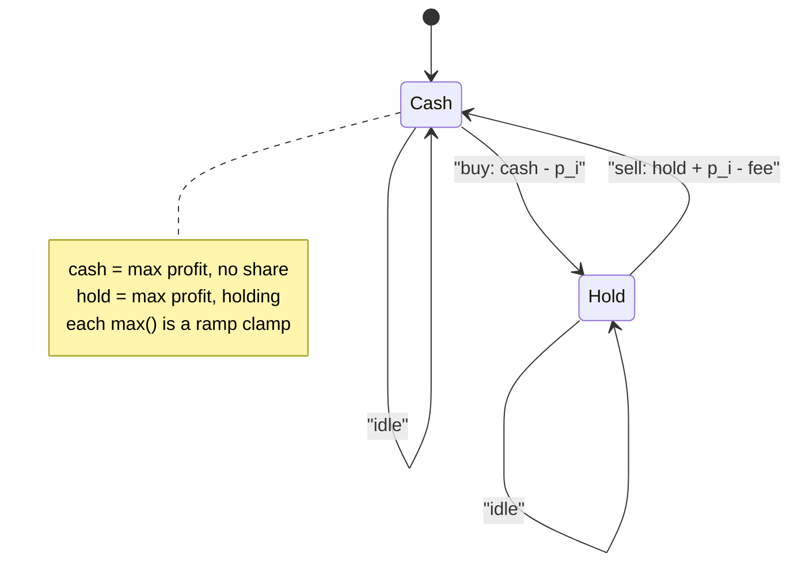
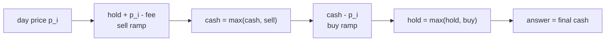

# Best Time to Buy and Sell Stock with Transaction Fee — A Slope/Convex View

| Meta | Value |
| --- | --- |
| Problem | Maximize profit trading one share, paying a fee per transaction |
| Source | LeetCode 714 |
| Reference | [misc/guide/07-slope-trick.md](../guide/07-slope-trick.md) |
| Difficulty | Medium |
| Topics | Slope trick perspective, convex value functions, one-sided ramps, DP |
| Time | $O(n)$ |
| Space | $O(1)$ |

## Problem Statement

You are given an array `prices` where `prices[i]` is the price of a stock on day $i$, and an integer `fee`. You may complete as many transactions as you like, but you pay `fee` for each completed transaction (buy then sell). You may not hold more than one share at a time (you must sell before buying again). Return the maximum profit.

```text
Example
  prices = [1, 3, 2, 8, 4, 9], fee = 2
  Buy at 1, sell at 8 -> profit 8-1-2 = 5
  Buy at 4, sell at 9 -> profit 9-4-2 = 3
  total = 7

Example
  prices = [1, 3, 7, 5, 10, 3], fee = 3
  answer = 6
```

## Approach (WHY)

The textbook DP keeps two states per day:

- $\text{cash}_i$ = max profit on day $i$ holding **no** share.
- $\text{hold}_i$ = max profit on day $i$ holding **one** share.

Transitions:

$$\text{cash}_i = \max\big(\text{cash}_{i-1},\; \text{hold}_{i-1} + p_i - \text{fee}\big),$$
$$\text{hold}_i = \max\big(\text{hold}_{i-1},\; \text{cash}_{i-1} - p_i\big).$$

**The slope/convex perspective.** Think of profit as a function of the *threshold price* at which you act. Each `max` against a linear term $p_i - \text{fee}$ or $-p_i$ is a **one-sided ramp** clamp — the same convex building block that slope trick manipulates. The value functions $\text{cash}_i$ and $\text{hold}_i$ are non-decreasing, piecewise-linear envelopes of the price stream, and each day either extends a flat segment (no action) or introduces a new ramp (a profitable buy/sell, paying the `fee` kink). Because here the two states are scalars rather than full curves, the heap of kinks degenerates to a constant-space running optimum, giving $O(1)$ memory. Taking the elementwise max is precisely the "relax / prefix-style" step that keeps the envelope convex.



## Solution

```python
def max_profit(prices, fee):
    """Max profit with per-transaction fee. O(n) time, O(1) space."""
    cash = 0                       # best profit holding no share
    hold = float("-inf")           # best profit holding a share
    for p in prices:
        # each line is a one-sided ramp clamp keeping the envelope convex
        cash = max(cash, hold + p - fee)
        hold = max(hold, cash - p)
    return cash

if __name__ == "__main__":
    print(max_profit([1, 3, 2, 8, 4, 9], 2))    # 7
    print(max_profit([1, 3, 7, 5, 10, 3], 3))   # 6
```

```cpp
#include <bits/stdc++.h>
using namespace std;
const long long INF = 1e18;

long long max_profit(const vector<long long>& prices, long long fee) {
    // Max profit with per-transaction fee. O(n) time, O(1) space.
    long long cash = 0;            // best profit holding no share
    long long hold = -INF;         // best profit holding a share
    for (long long p : prices) {
        // each line is a one-sided ramp clamp keeping the envelope convex
        cash = max(cash, hold + p - fee);
        hold = max(hold, cash - p);
    }
    return cash;
}

int main() {
    cout << max_profit({1, 3, 2, 8, 4, 9}, 2) << "\n";    // 7
    cout << max_profit({1, 3, 7, 5, 10, 3}, 3) << "\n";   // 6
    return 0;
}
```

## Iteration / Trace

We can read `hold` as the left edge of the current "buy" envelope and `cash` as the realized-profit bottom. Each `max` that fires is a kink entering the convex envelope. Trace on `prices = [1, 3, 2, 8, 4, 9]`, `fee = 2`:

```text
p   cash before  hold+p-fee   cash after   cash-p   hold after
1     0           -inf          0           -1       -1     (buy kink at 1)
3     0           -1+3-2=0      0           -3       -1
2     0           -1+2-2=-1     0           -2       -1
8     0           -1+8-2=5      5  <-sell    5-8=-3   -1
4     5            -1+4-2=1     5           5-4=1     1   (buy kink at 4)
9     5            1+9-2=8      8  <-sell    8-9=-1    1
final cash = 7
```

Two kinks fired as sells (at price 8 and 9), each absorbing one `fee`; the envelope of `cash` only ever rises, mirroring the non-decreasing convex value function.



## Complexity

- **Time:** one pass, constant work per day, $O(n)$.
- **Space:** two scalars, $O(1)$.

## Takeaway

LeetCode 714 is the degenerate, constant-space face of slope trick: the convex value functions reduce to two running maxima, and every `max(...)` is a one-sided ramp clamp that keeps the profit envelope convex. Seeing the `fee` as the height of a kink makes it obvious why each completed transaction costs it exactly once.
