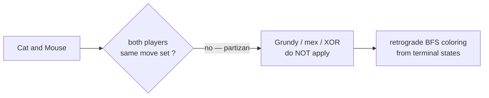
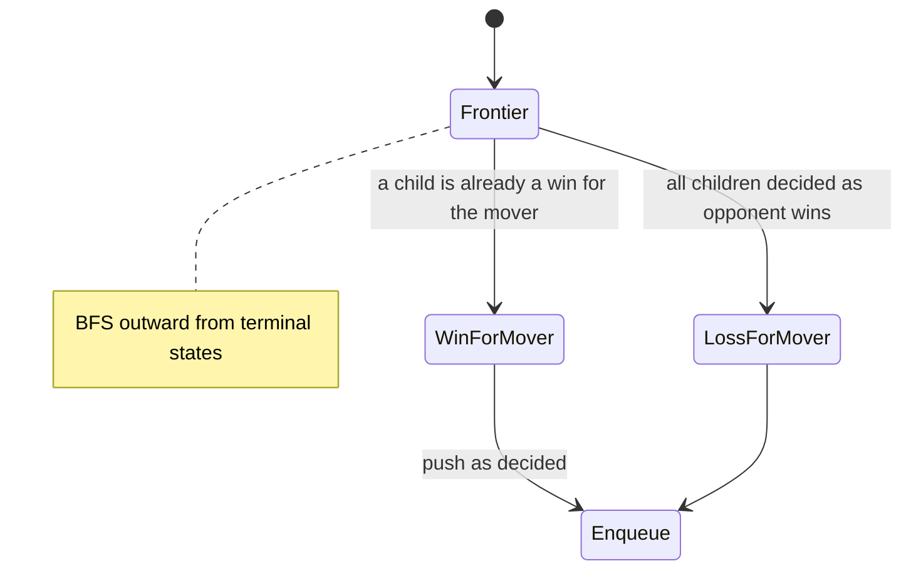
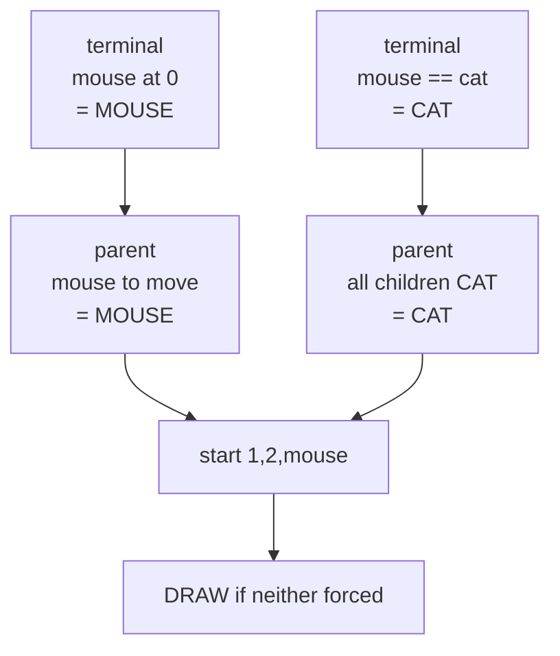

# LeetCode 913 — Cat and Mouse (Why Grundy Fails, Use Retrograde Analysis)

| Meta | Value |
|------|-------|
| Problem | Cat and Mouse on a graph; mouse wins by reaching hole 0, cat wins by catching mouse, else draw |
| Source | LeetCode 913 — Cat and Mouse |
| Reference | https://leetcode.com/problems/cat-and-mouse/ |
| Difficulty | Hard |
| Topics | Game Theory, Partizan Games, Retrograde Analysis, BFS Coloring, State-Space Search |
| Time | $O(n^3)$ |
| Space | $O(n^2)$ |

---

## Problem Statement

An undirected graph has `n` nodes; `graph[i]` lists neighbors of `i`. The **mouse** starts at node
`1`, the **cat** at node `2`, the **hole** is node `0`. Mouse moves first, then they alternate. On a
turn the player **must** move along an edge to an adjacent node. The **cat cannot enter node 0**.

- Mouse wins if it reaches node `0`.
- Cat wins if it ever occupies the same node as the mouse.
- If a position **repeats** (forced cycle), the game is a **draw**.

Return `1` if the mouse wins, `2` if the cat wins, `0` for a draw, assuming optimal play.

```text
Input:
  graph = [[2,5],[3],[0,4,5],[1,4,5],[2,3],[0,2,3]]
Output:
  0            # draw
```

---

## Approach (WHY)

### Why plain Sprague-Grundy does **not** apply

Sprague-Grundy requires an **impartial** game: from a position, *both players have the same legal
moves*. Cat and Mouse is **partizan / pursuit**: the mouse only moves the mouse, the cat only moves
the cat, their **win conditions differ**, and draws exist. There is no single Nim-pile equivalent
and no `mex`/XOR shortcut. We instead solve the **full game graph** directly with **retrograde
analysis** (backward induction / BFS coloring).



### State and terminal coloring

A state is `(mouse, cat, turn)` with `turn = 0` (mouse to move) or `1` (cat to move). Color each
state `MOUSE`, `CAT`, or `DRAW`.

- Any state with `mouse == 0` → **MOUSE** wins.
- Any state with `mouse == cat` → **CAT** wins.

Then propagate **backward**: a state where it is player `X`'s turn is a win for `X` if **some** move
leads to an `X`-win; it is a loss for `X` (win for the opponent) only once **all** moves lead to
opponent wins. We track, per state, how many successor moves remain undecided (`degree`). When that
count hits zero with no winning move found, the state is the opponent's win.

$$
\text{color}(s) =
\begin{cases}
X & \exists\, s \to t,\ \text{color}(t) = X\ \text{(}X\text{ to move)}\\[2pt]
\bar X & \forall\, s \to t,\ \text{color}(t) = \bar X
\end{cases}
$$

Unreached states stay `DRAW`.



```python
from collections import deque

DRAW, MOUSE, CAT = 0, 1, 2

def catMouseGame(graph):
    n = len(graph)
    # color[mouse][cat][turn] ; turn 0 = mouse moves, 1 = cat moves
    color = [[[DRAW] * 2 for _ in range(n)] for _ in range(n)]
    degree = [[[0] * 2 for _ in range(n)] for _ in range(n)]

    for m in range(n):
        for c in range(n):
            degree[m][c][0] = len(graph[m])             # mouse's options
            degree[m][c][1] = len(graph[c])             # cat's options
            for x in graph[c]:
                if x == 0:                              # cat may not move to the hole
                    degree[m][c][1] -= 1

    q = deque()
    for c in range(1, n):                               # mouse==cat handled below; cat never 0
        for t in range(2):
            color[0][c][t] = MOUSE                      # mouse at hole -> mouse wins
            q.append((0, c, t, MOUSE))
    for a in range(1, n):                               # mouse == cat -> cat wins
        for t in range(2):
            color[a][a][t] = CAT
            q.append((a, a, t, CAT))

    def parents(m, c, t):
        # states that can move INTO (m, c, t); previous mover is the other turn
        prev = t ^ 1
        if prev == 1:                                   # cat moved last -> vary cat's prev node
            for pc in graph[c]:
                if pc != 0:                             # cat could not have come from hole
                    yield (m, pc, prev)
        else:                                           # mouse moved last -> vary mouse's prev node
            for pm in graph[m]:
                yield (pm, c, prev)

    while q:
        m, c, t, result = q.popleft()
        for pm, pc, pt in parents(m, c, t):
            if color[pm][pc][pt] != DRAW:
                continue
            mover_wins = MOUSE if pt == 0 else CAT
            if result == mover_wins:                    # parent's mover can choose this win
                color[pm][pc][pt] = result
                q.append((pm, pc, pt, result))
            else:
                degree[pm][pc][pt] -= 1                 # one more child is bad for mover
                if degree[pm][pc][pt] == 0:             # all children lose -> opponent wins
                    color[pm][pc][pt] = result
                    q.append((pm, pc, pt, result))

    return color[1][2][0]                               # mouse at 1, cat at 2, mouse to move
```

```cpp
#include <bits/stdc++.h>
using namespace std;

static const int DRAW = 0, MOUSE = 1, CAT = 2;

int catMouseGame(vector<vector<int>>& graph) {
    int n = (int)graph.size();
    // color[mouse][cat][turn]; turn 0 = mouse moves, 1 = cat moves
    vector<vector<array<int,2>>> color(n, vector<array<int,2>>(n, {DRAW, DRAW}));
    vector<vector<array<int,2>>> degree(n, vector<array<int,2>>(n, {0, 0}));

    for (int m = 0; m < n; ++m) {
        for (int c = 0; c < n; ++c) {
            degree[m][c][0] = (int)graph[m].size();     // mouse's options
            degree[m][c][1] = (int)graph[c].size();     // cat's options
            for (int x : graph[c]) if (x == 0) degree[m][c][1] -= 1;  // cat cannot enter hole
        }
    }

    // queue of decided states: (mouse, cat, turn, result)
    queue<array<int,4>> q;
    for (int c = 1; c < n; ++c)
        for (int t = 0; t < 2; ++t) {
            color[0][c][t] = MOUSE;                     // mouse at hole -> mouse wins
            q.push({0, c, t, MOUSE});
        }
    for (int a = 1; a < n; ++a)
        for (int t = 0; t < 2; ++t) {
            color[a][a][t] = CAT;                       // mouse == cat -> cat wins
            q.push({a, a, t, CAT});
        }

    while (!q.empty()) {
        auto [m, c, t, result] = q.front(); q.pop();
        int prev = t ^ 1;                               // previous mover's turn flag
        // enumerate parents that can move INTO (m, c, t)
        vector<array<int,3>> par;
        if (prev == 1) {                                // cat moved last
            for (int pc : graph[c]) if (pc != 0) par.push_back({m, pc, prev});
        } else {                                        // mouse moved last
            for (int pm : graph[m]) par.push_back({pm, c, prev});
        }
        for (auto& s : par) {
            int pm = s[0], pc = s[1], pt = s[2];
            if (color[pm][pc][pt] != DRAW) continue;
            int mover_wins = (pt == 0) ? MOUSE : CAT;
            if (result == mover_wins) {                 // parent's mover picks this win
                color[pm][pc][pt] = result;
                q.push({pm, pc, pt, result});
            } else {
                if (--degree[pm][pc][pt] == 0) {        // all children lose -> opponent wins
                    color[pm][pc][pt] = result;
                    q.push({pm, pc, pt, result});
                }
            }
        }
    }
    return color[1][2][0];                              // mouse at 1, cat at 2, mouse to move
}
```

---

## Trace

Take the tiny graph `[[2,3],[3],[0],[0]]` style intuition (hole 0). Terminal coloring then backward
propagation decides the start `(mouse=1, cat=2, turn=0)`:

```text
seed terminals:
  (0, c, *)  = MOUSE   for every cat c >= 1
  (a, a, *)  = CAT     for every node a >= 1
propagate backward:
  a state with mouse to move is MOUSE-win if ANY child is MOUSE-win
  a state with mouse to move is CAT-win  only if ALL children are CAT-win
unreached states remain DRAW (forced infinite play)
answer = color[1][2][0]
```

These are **win/lose/draw labels**, not Grundy numbers — there is no `mex` and no XOR anywhere,
which is exactly the point: partizan pursuit games need retrograde analysis.



---

## Complexity

- States: $O(n^2)$ positions $\times\ 2$ turns.
- Each state's incoming edges processed once → total $O(n^3)$ time over all transitions.
- Space: $O(n^2)$ for the `color` and `degree` tables.

---

## Takeaway

When a game is **partizan** (different moves/goals per player) or admits **draws**, Sprague-Grundy
is the wrong tool — Grundy numbers, `mex`, and XOR all assume an *impartial* game. Solve it instead
by **retrograde analysis**: seed terminal states, then BFS backward, marking a state decided once a
winning child exists (for the mover) or all children are losing (degree hits zero).
