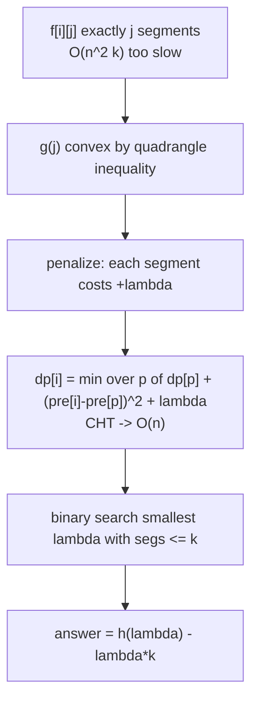
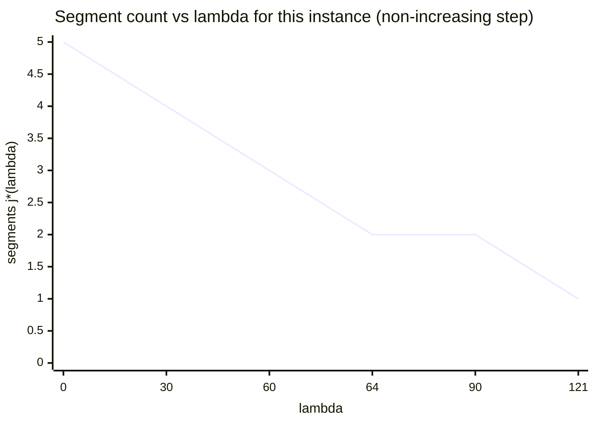

# Split Array into Exactly K Segments (Aliens Trick)

| Meta | Value |
| --- | --- |
| Problem | Partition an array into exactly $k$ contiguous segments minimizing total segment cost |
| Source | Self-contained (IOI 2016 "Aliens" style) |
| Reference | [misc/guide/08-aliens-trick.md](../guide/08-aliens-trick.md) |
| Difficulty | Hard |
| Topics | DP, Lagrangian relaxation, convexity, binary search |
| Time | $O(n \log V)$ with an $O(n)$ penalized DP |
| Space | $O(n)$ |

## Problem Statement

You are given an array $a$ of $n$ non-negative integers and an integer $k$. Partition $a$ into **exactly $k$** contiguous non-empty segments. The cost of a segment is the **square of its sum**, and the total cost is the sum of segment costs. Minimize the total cost.

Formally, choose cut points $0 = c_0 < c_1 < \dots < c_k = n$; the cost is

$$\sum_{t=1}^{k} \Big(\sum_{i=c_{t-1}}^{c_t - 1} a_i\Big)^2.$$

```text
Example:
a = [1, 3, 2, 1, 4],  k = 2

Try [1,3,2] | [1,4]  -> 6^2 + 5^2 = 36 + 25 = 61
Try [1,3]   | [2,1,4]-> 4^2 + 7^2 = 16 + 49 = 65
Try [1]     | [3,2,1,4]-> 1 + 100 = 101
Try [1,3,2,1] | [4]  -> 7^2 + 16 = 49 + 16 = 65

Minimum = 61  (split after index 2)
```

## Approach (WHY)

The natural DP $f[i][j]$ = best cost to cover the prefix of length $i$ with exactly $j$ segments costs $O(n^2 k)$. Let $g(j) = f[n][j]$. Splitting one segment into two can only **lower** squared-sum cost (since $(x+y)^2 \ge x^2 + y^2$), and the marginal gain diminishes — $g(j)$ is **convex** in $j$. (Formally the segment cost $\mathrm{cost}(p,i) = (\text{prefix}[i]-\text{prefix}[p])^2$ satisfies the Monge/quadrangle inequality, forcing convexity.)

Convexity ⇒ apply the **Aliens trick**: penalize each segment by $\lambda$ and solve the unconstrained

$$h(\lambda) = \min_{j}\big(g(j) + \lambda j\big), \qquad dp[i] = \min_{p<i}\big(dp[p] + (\text{pre}[i]-\text{pre}[p])^2 + \lambda\big).$$

The minimizer's segment count $j^\*(\lambda)$ is non-increasing in $\lambda$, so binary-search the smallest integer $\lambda$ with $j^\*(\lambda) \le k$, then recover $g(k) = h(\lambda) - \lambda k$.

The inner DP is a classic convex-hull-trick minimization: writing $\text{pre}[i]^2 - 2\,\text{pre}[i]\,\text{pre}[p] + \text{pre}[p]^2$, each $p$ contributes a line of slope $-2\,\text{pre}[p]$ evaluated at $\text{pre}[i]$, giving $O(n)$ per penalized DP.



## Implementation

```python
def min_cost_k_segments(a, k):
    """Partition a into exactly k segments minimizing sum of (segment sum)^2."""
    n = len(a)
    pre = [0] * (n + 1)
    for i in range(n):
        pre[i + 1] = pre[i] + a[i]
    INF = float("inf")

    def solve(lam):
        # Penalized DP with convex-hull trick. Returns (penalized_cost, segment_count).
        # Tie-break toward FEWER segments.
        dp = [INF] * (n + 1)
        cnt = [0] * (n + 1)
        dp[0] = 0
        # Lower-hull of lines y = m*x + b; line for index p: m = -2*pre[p], b = dp[p] + pre[p]^2
        from collections import deque
        hull = deque()  # store (m, b, cnt_at_p)

        def bad(l1, l2, l3):
            # l2 unnecessary if intersection of l1,l3 is left of l1,l2
            m1, b1, _ = l1; m2, b2, _ = l2; m3, b3, _ = l3
            return (b3 - b1) * (m1 - m2) <= (b2 - b1) * (m1 - m3)

        def add_line(m, b, c):
            while len(hull) >= 2 and bad(hull[-2], hull[-1], (m, b, c)):
                hull.pop()
            hull.append((m, b, c))

        def query(x):
            # query min over lines at x; lines added with decreasing slope, x increasing
            while len(hull) >= 2:
                m1, b1, _ = hull[0]; m2, b2, _ = hull[1]
                if m1 * x + b1 >= m2 * x + b2:
                    hull.popleft()
                else:
                    break
            m, b, c = hull[0]
            return m * x + b, c

        add_line(-2 * pre[0], dp[0] + pre[0] * pre[0], cnt[0])
        for i in range(1, n + 1):
            val, c = query(pre[i])
            dp[i] = val + pre[i] * pre[i] + lam
            cnt[i] = c + 1
            if i < n:
                add_line(-2 * pre[i], dp[i] + pre[i] * pre[i], cnt[i])
        return dp[n], cnt[n]

    total = pre[n]
    lo, hi = 0, total * total  # |slope of g| bounded by total^2
    best_cost, best_lam = None, 0
    while lo <= hi:
        mid = (lo + hi) // 2
        c, segs = solve(mid)
        if segs <= k:
            best_cost, best_lam = c, mid
            hi = mid - 1
        else:
            lo = mid + 1
    return best_cost - best_lam * k
```

```cpp
#include <bits/stdc++.h>
using namespace std;
const long long INF = 1e18;

// Partition a into exactly k segments minimizing sum of (segment sum)^2.
long long min_cost_k_segments(const vector<long long>& a, long long k) {
    long long n = (long long)a.size();
    vector<long long> pre(n + 1, 0);
    for (long long i = 0; i < n; ++i) pre[i + 1] = pre[i] + a[i];

    // Penalized DP with convex-hull trick. Returns {penalized_cost, segment_count}.
    auto solve = [&](long long lam) -> pair<long long,long long> {
        vector<long long> dp(n + 1, INF), cnt(n + 1, 0);
        dp[0] = 0;
        // Lower hull of lines: line for index p is m = -2*pre[p], b = dp[p] + pre[p]^2.
        vector<long long> M, B, C;  // slope, intercept, count
        int head = 0;

        auto bad = [&](int i1, int i2, int i3) {
            // l2 unnecessary
            return (long double)(B[i3] - B[i1]) * (M[i1] - M[i2])
                <= (long double)(B[i2] - B[i1]) * (M[i1] - M[i3]);
        };
        auto add_line = [&](long long m, long long b, long long c) {
            M.push_back(m); B.push_back(b); C.push_back(c);
            while ((int)M.size() - head >= 3 &&
                   bad((int)M.size() - 3, (int)M.size() - 2, (int)M.size() - 1)) {
                M.erase(M.end() - 2); B.erase(B.end() - 2); C.erase(C.end() - 2);
            }
        };
        auto query = [&](long long x) -> pair<long long,long long> {
            while ((int)M.size() - head >= 2 &&
                   M[head] * x + B[head] >= M[head + 1] * x + B[head + 1]) {
                ++head;
            }
            return {M[head] * x + B[head], C[head]};
        };

        add_line(-2 * pre[0], dp[0] + pre[0] * pre[0], cnt[0]);
        for (long long i = 1; i <= n; ++i) {
            auto [val, c] = query(pre[i]);
            dp[i] = val + pre[i] * pre[i] + lam;
            cnt[i] = c + 1;
            if (i < n) add_line(-2 * pre[i], dp[i] + pre[i] * pre[i], cnt[i]);
        }
        return {dp[n], cnt[n]};
    };

    long long total = pre[n];
    long long lo = 0, hi = total * total;  // |slope of g| bounded by total^2
    long long best_cost = INF, best_lam = 0;
    while (lo <= hi) {
        long long mid = lo + (hi - lo) / 2;
        auto [c, segs] = solve(mid);
        if (segs <= k) { best_cost = c; best_lam = mid; hi = mid - 1; }
        else            { lo = mid + 1; }
    }
    return best_cost - best_lam * k;
}
```

## Trace

For `a = [1, 3, 2, 1, 4]`, `k = 2`, `total = 11`, so $\lambda \in [0, 121]$.

```text
g(1) = 11^2          = 121
g(2) = 61            (best 2-split, found above)
g(3) = ... < g(2)    (more cuts only help)   convex: g(1)-g(2)=60 >= g(2)-g(3)

Binary search for smallest lambda with segs <= 2:

lambda=60 : penalized dp -> minimizer balances; segs = 3  (> 2) -> raise, lo=61
lambda=90 : segs = 2  (<= 2) -> record (cost, 90), hi=89
lambda=75 : segs = 2  -> record, hi=74
lambda=67 : segs = 2  -> record, hi=66
lambda=63 : segs = 3  -> lo=64
lambda=65 : segs = 2  -> record, hi=64
lambda=64 : segs = 2  -> record, hi=63  -> loop ends, best_lam settles in step

At a settled lambda the penalized optimum uses exactly k=2 segments:
h(lambda) = g(2) + 2*lambda
answer    = h(lambda) - lambda*2 = g(2) = 61
```



The step where the count drops through $k = 2$ is the binary-search target; reading $h(\lambda) - 2\lambda$ at any $\lambda$ on the flat level $j^\* = 2$ yields the true $g(2) = 61$.

## Complexity

- **Penalized DP:** $O(n)$ with the convex-hull trick (each line added and removed once).
- **Lambda search:** $O(\log V)$ with $V = (\sum a)^2$.
- **Total:** $O(n \log V)$ time, $O(n)$ space — versus $O(n^2 k)$ for the plain count DP.

## Takeaway

When an *exactly-$k$* partition has a **convex** cost-vs-$k$ curve, drop the count dimension entirely: penalize each segment by $\lambda$, solve the cheap unconstrained DP, binary-search $\lambda$ until the optimal solution naturally uses $k$ segments, and subtract $\lambda k$ to recover the true cost. The $k$ factor in time and space disappears, replaced by a $\log V$ factor.
