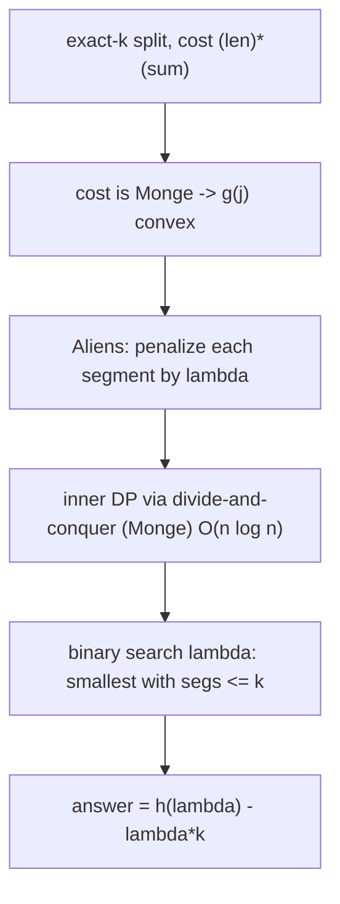
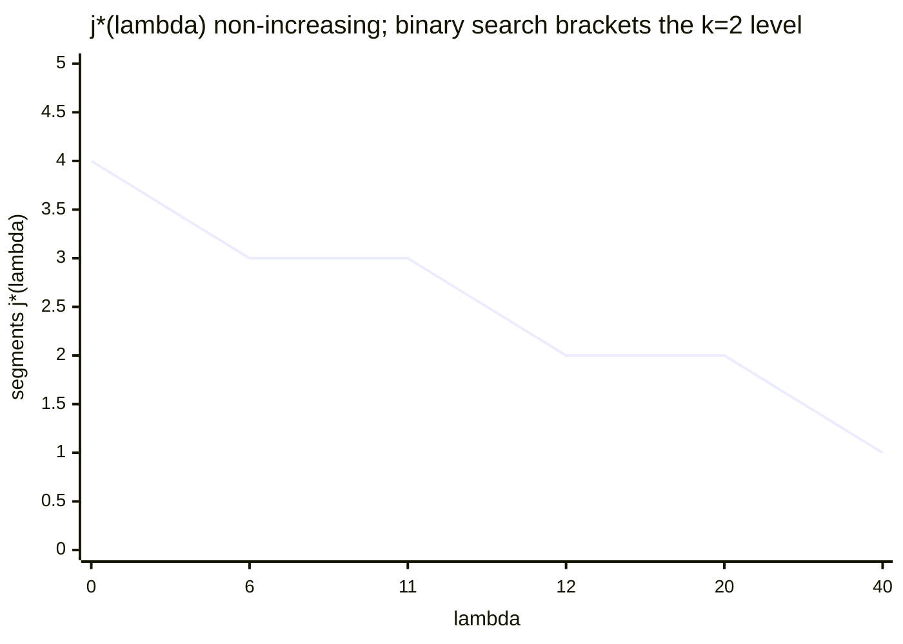
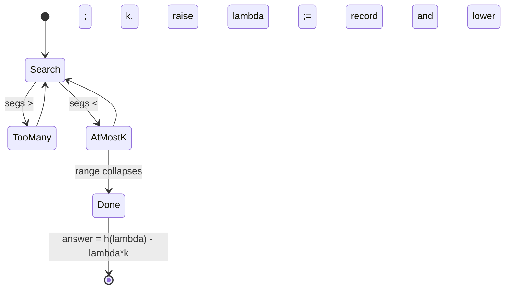

# Minimize Largest-Sum Split into K Segments via Aliens Trick (Variant)

| Meta | Value |
| --- | --- |
| Problem | Split an array into exactly $k$ contiguous segments minimizing the **sum of per-segment costs** with a convex per-element penalty |
| Source | Self-contained (Aliens-trick variant) |
| Reference | [misc/guide/08-aliens-trick.md](../guide/08-aliens-trick.md) |
| Difficulty | Hard |
| Topics | DP, Lagrangian relaxation, convexity, binary search, divide-and-conquer DP |
| Time | $O(n \log n \log V)$ |
| Space | $O(n)$ |

## Problem Statement

Given an array $a$ of $n$ positive integers and an integer $k$, split $a$ into **exactly $k$** contiguous non-empty segments. The cost of a segment spanning $[p, i)$ is

$$\mathrm{cost}(p, i) = \big(\text{len}\big)\cdot\big(\text{sum}\big) = (i - p)\cdot\!\!\sum_{t=p}^{i-1} a_t,$$

a length-weighted sum (a convex "work" measure that rewards short, balanced pieces). Minimize the total cost over all valid $k$-splits.

```text
Example:
a = [1, 2, 3, 4],  k = 2

[1,2,3] | [4]   -> 3*6 + 1*4 = 18 + 4 = 22
[1,2]   | [3,4] -> 2*3 + 2*7 = 6 + 14 = 20
[1]     | [2,3,4]-> 1*1 + 3*9 = 1 + 27 = 28

Minimum = 20  (split after index 2)
```

## Approach (WHY)

Let $g(j)$ be the optimal total cost with exactly $j$ segments. The cost function $\mathrm{cost}(p,i) = (i-p)(\text{pre}[i]-\text{pre}[p])$ satisfies the **quadrangle (Monge) inequality**

$$\mathrm{cost}(a,c) + \mathrm{cost}(b,d) \le \mathrm{cost}(a,d) + \mathrm{cost}(b,c), \quad a \le b \le c \le d,$$

which makes $g(j)$ **convex** in $j$. So the **Aliens trick** applies: add a penalty $\lambda$ per segment and minimize the unconstrained

$$dp[i] = \min_{0 \le p < i}\Big(dp[p] + \mathrm{cost}(p, i) + \lambda\Big).$$

The cost is *not* of CHT form (length factor couples both endpoints), but it **is Monge**, so the inner DP admits the **divide-and-conquer optimization**: the optimal split point $\mathrm{opt}[i]$ is non-decreasing in $i$, giving $O(n \log n)$ per penalized solve. Binary-search the smallest integer $\lambda$ with $j^\*(\lambda) \le k$ (segment count non-increasing in $\lambda$ by convexity), then recover $g(k) = h(\lambda) - \lambda k$.



$$\text{Monge} \;\Rightarrow\; \mathrm{opt}[i]\ \text{monotone} \;\Rightarrow\; \text{D\&C DP } O(n\log n) \quad\text{and}\quad g(j)\ \text{convex} \;\Rightarrow\; \text{Aliens valid.}$$

## Implementation

```python
def min_cost_k_split(a, k):
    """Split a into exactly k segments minimizing sum of (len)*(sum) per segment."""
    n = len(a)
    pre = [0] * (n + 1)
    for i in range(n):
        pre[i + 1] = pre[i] + a[i]
    INF = float("inf")

    def cost(p, i):
        # cost of segment [p, i): length * sum
        return (i - p) * (pre[i] - pre[p])

    def solve(lam):
        # Penalized DP via divide-and-conquer optimization (Monge cost).
        # Returns (penalized_cost, segment_count). Tie-break toward FEWER segments.
        dp = [INF] * (n + 1)
        cnt = [0] * (n + 1)
        dp[0] = 0

        # compute dp[i] for i in [lo, hi], optimal p in [plo, phi]
        def dnc(lo, hi, plo, phi):
            if lo > hi:
                return
            mid = (lo + hi) // 2
            best_val, best_cnt, best_p = INF, 0, plo
            up = min(mid - 1, phi)
            for p in range(plo, up + 1):
                if dp[p] == INF:
                    continue
                cand = dp[p] + cost(p, mid) + lam
                if cand < best_val or (cand == best_val and cnt[p] + 1 < best_cnt):
                    best_val, best_cnt, best_p = cand, cnt[p] + 1, p
            dp[mid], cnt[mid] = best_val, best_cnt
            dnc(lo, mid - 1, plo, best_p)
            dnc(mid + 1, hi, best_p, phi)

        dnc(1, n, 0, n - 1)
        return dp[n], cnt[n]

    total = pre[n]
    lo, hi = 0, n * total                 # |slope of g| bounded by n * total
    best_cost, best_lam = None, 0
    while lo <= hi:
        mid = (lo + hi) // 2
        c, segs = solve(mid)
        if segs <= k:
            best_cost, best_lam = c, mid
            hi = mid - 1
        else:
            lo = mid + 1
    return best_cost - best_lam * k
```

```cpp
#include <bits/stdc++.h>
using namespace std;
const long long INF = 1e18;

// Split a into exactly k segments minimizing sum of (len)*(sum) per segment.
long long min_cost_k_split(const vector<long long>& a, long long k) {
    long long n = (long long)a.size();
    vector<long long> pre(n + 1, 0);
    for (long long i = 0; i < n; ++i) pre[i + 1] = pre[i] + a[i];

    auto cost = [&](long long p, long long i) -> long long {
        // cost of segment [p, i): length * sum
        return (i - p) * (pre[i] - pre[p]);
    };

    // Penalized DP via divide-and-conquer optimization (Monge cost).
    auto solve = [&](long long lam) -> pair<long long,long long> {
        vector<long long> dp(n + 1, INF), cnt(n + 1, 0);
        dp[0] = 0;

        // compute dp[i] for i in [lo, hi], optimal p in [plo, phi]
        function<void(long long,long long,long long,long long)> dnc =
            [&](long long lo, long long hi, long long plo, long long phi) {
            if (lo > hi) return;
            long long mid = (lo + hi) / 2;
            long long best_val = INF, best_cnt = 0, best_p = plo;
            long long up = min(mid - 1, phi);
            for (long long p = plo; p <= up; ++p) {
                if (dp[p] == INF) continue;
                long long cand = dp[p] + cost(p, mid) + lam;
                if (cand < best_val || (cand == best_val && cnt[p] + 1 < best_cnt)) {
                    best_val = cand; best_cnt = cnt[p] + 1; best_p = p;
                }
            }
            dp[mid] = best_val; cnt[mid] = best_cnt;
            dnc(lo, mid - 1, plo, best_p);
            dnc(mid + 1, hi, best_p, phi);
        };

        dnc(1, n, 0, n - 1);
        return {dp[n], cnt[n]};
    };

    long long total = pre[n];
    long long lo = 0, hi = n * total;     // |slope of g| bounded by n * total
    long long best_cost = INF, best_lam = 0;
    while (lo <= hi) {
        long long mid = lo + (hi - lo) / 2;
        auto [c, segs] = solve(mid);
        if (segs <= k) { best_cost = c; best_lam = mid; hi = mid - 1; }
        else            { lo = mid + 1; }
    }
    return best_cost - best_lam * k;
}
```

## Trace

For `a = [1, 2, 3, 4]`, `k = 2`, `total = 10`, so $\lambda \in [0, 40]$.

```text
g(1) = 4*10            = 40
g(2) = 20              (best 2-split: [1,2] | [3,4])
g(3), g(4) < g(2)      convex: g(1)-g(2)=20 >= g(2)-g(3)

Binary search smallest lambda with segs <= 2:

lambda=20 : penalty per segment large-ish -> minimizer uses segs = 2 (<= 2) -> record, hi=19
lambda=10 : cheaper segments -> segs = 3 (> 2) -> lo=11
lambda=15 : segs = 2 -> record, hi=14
lambda=13 : segs = 2 -> record, hi=12
lambda=11 : segs = 3 -> lo=12
lambda=12 : segs = 2 -> record, hi=11 -> loop ends

Settled lambda has penalized optimum using exactly k=2 segments:
h(lambda) = g(2) + 2*lambda
answer    = h(lambda) - lambda*2 = g(2) = 20
```





## Complexity

- **Penalized DP:** $O(n \log n)$ via divide-and-conquer (Monge cost ⇒ monotone `opt`).
- **Lambda search:** $O(\log V)$ with $V = n \cdot \sum a$.
- **Total:** $O(n \log n \log V)$ time, $O(n)$ space.

## Takeaway

This variant shows the Aliens trick **composing** with another DP optimization: the per-segment cost is Monge, which simultaneously (1) makes $g(j)$ convex so the Lagrangian relaxation is valid, and (2) makes the inner penalized DP solvable in $O(n \log n)$ by divide-and-conquer. Penalize each segment by $\lambda$, solve the unconstrained Monge DP, binary-search $\lambda$ to land on exactly $k$ segments, and subtract $\lambda k$. Convexity from Monge is the single hypothesis powering both layers.
