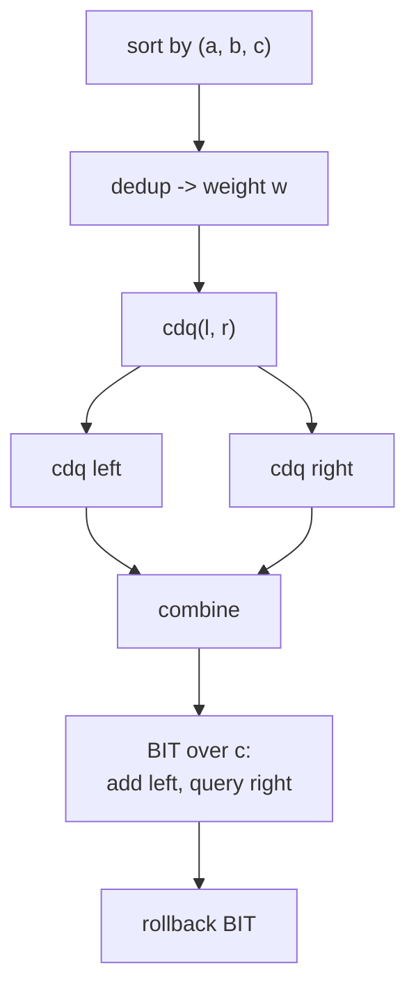
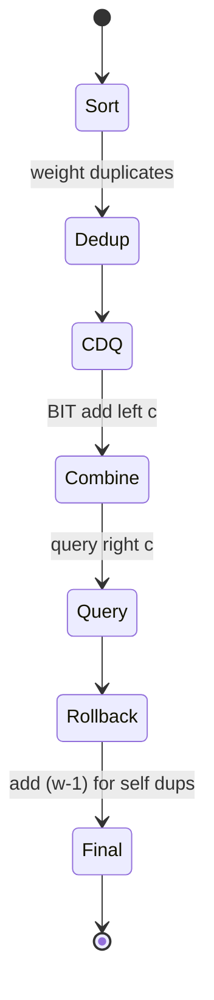

# CDQ Divide and Conquer: 3D Partial Order (Dominance Counting)

| Meta | Value |
| ---- | ----- |
| Topic | Divide &amp; Conquer / CDQ |
| Technique | Sort + CDQ merge + Fenwick (BIT) |
| Difficulty | Hard |
| Time | $O(n \log^2 n)$ |
| Space | $O(n + k)$ |

## Problem Statement

You are given $n$ elements. Element $i$ has three attributes $(a_i, b_i, c_i)$. For each element $i$ define

$$
f(i) = \bigl|\{\, j : a_j \le a_i \;\land\; b_j \le b_i \;\land\; c_j \le c_i \;\land\; j \ne i \,\}\bigr|.
$$

Element $j$ is said to be **dominated by** $i$ when all three coordinates are $\le$. For each $d$ from $0$ to $n-1$, output how many elements $i$ have exactly $f(i) = d$.

```text
Input:
n = 4, max coordinate k = 7
elements (a, b, c):
  1 1 1
  1 1 1
  3 3 3
  2 2 2

For element (3,3,3): the two (1,1,1), the (2,2,2), and the other (3,3,3) are all dominated -> but only count distinct others.
Output (counts of f-values d = 0..3):
f = 0 : 0
f = 1 : 2     # the two identical (1,1,1) each dominate the other
f = 2 : 1     # (2,2,2) dominates both (1,1,1)
f = 3 : 1     # (3,3,3) dominates the other three
```

## Approach (WHY)

Three nested $\le$ constraints. We peel them one dimension at a time:

1. **Dimension $a$ — sort.** Order all elements by $a$ (ties by $b$, then $c$). After sorting, any element appearing earlier in the array has $a \le$ a later element. So if we only ever let *earlier array positions* contribute to *later positions*, the first constraint is free.
2. **Dimension $b$ — CDQ merge.** Recurse on halves. During the combine of $[l,m]$ (left, smaller $a$) onto $[m{+}1,r]$ (right), walk both halves in increasing $b$ order with two pointers, inserting a left element into a BIT exactly when its $b \le$ the current right element's $b$.
3. **Dimension $c$ — Fenwick tree.** The BIT is indexed by $c$. For a right element with coordinate $c_j$, a prefix query $\text{sum}(c_j)$ returns how many already-inserted left elements have $c \le c_j$ — the third constraint.

**Equal triples** need care: identical $(a,b,c)$ elements would never count each other across the divide because the constraint is $\le$ on all three. We deduplicate, store a multiplicity $w$, and add $w-1$ to each duplicate so they count one another.

$$
f(\text{unique tuple } t) = \underbrace{(\text{CDQ dominance count})}_{\text{strictly earlier tuples}} + \underbrace{(w_t - 1)}_{\text{its own duplicates}}.
$$



## Implementation

```python
import sys

class BIT:
    def __init__(self, n):
        self.n = n
        self.t = [0] * (n + 1)
    def add(self, i, v):
        while i <= self.n:
            self.t[i] += v
            i += i & (-i)
    def query(self, i):
        s = 0
        while i > 0:
            s += self.t[i]
            i -= i & (-i)
        return s

def solve(points, k):
    # points: list of (a, b, c). Dedup with multiplicity.
    points.sort()
    uniq = []
    weight = []
    for p in points:
        if uniq and uniq[-1] == p:
            weight[-1] += 1
        else:
            uniq.append(list(p))
            weight.append(1)
    n = len(uniq)
    ans = [0] * n               # dominance count per unique tuple
    bit = BIT(k)

    def cdq(l, r):
        if l == r:
            return
        m = (l + r) // 2
        cdq(l, m)
        cdq(m + 1, r)
        # both halves sorted by (b, c); merge by b, BIT on c
        i = l
        for j in range(m + 1, r + 1):
            while i <= m and uniq[i][1] <= uniq[j][1]:
                bit.add(uniq[i][2], weight[i])
                i += 1
            ans[j] += bit.query(uniq[j][2])
        for t in range(l, i):
            bit.add(uniq[t][2], -weight[t])     # rollback
        # stable merge of [l, m] and [m+1, r] by (b, c)
        merged_u, merged_w = [], []
        i, j = l, m + 1
        while i <= m and j <= r:
            if (uniq[i][1], uniq[i][2]) <= (uniq[j][1], uniq[j][2]):
                merged_u.append(uniq[i]); merged_w.append(weight[i]); i += 1
            else:
                merged_u.append(uniq[j]); merged_w.append(weight[j]); j += 1
        while i <= m:
            merged_u.append(uniq[i]); merged_w.append(weight[i]); i += 1
        while j <= r:
            merged_u.append(uniq[j]); merged_w.append(weight[j]); j += 1
        for off, (u, w) in enumerate(zip(merged_u, merged_w)):
            uniq[l + off] = u
            weight[l + off] = w

    cdq(0, n - 1)

    res = [0] * (len(points))
    for idx in range(n):
        f = ans[idx] + weight[idx] - 1      # plus its own duplicates
        res[f] += weight[idx]               # each duplicate shares f
    return res

if __name__ == "__main__":
    pts = [(1, 1, 1), (1, 1, 1), (3, 3, 3), (2, 2, 2)]
    print(solve(pts, 7))
```

```cpp
#include <bits/stdc++.h>
using namespace std;

struct BIT {
    int n;
    vector<long long> t;
    BIT(int n_) : n(n_), t(n_ + 1, 0) {}
    void add(int i, long long v) {
        for (; i <= n; i += i & (-i)) t[i] += v;
    }
    long long query(int i) {
        long long s = 0;
        for (; i > 0; i -= i & (-i)) s += t[i];
        return s;
    }
};

int n, K;
vector<array<int,3>> uq;     // unique tuples
vector<long long> wt;        // weights
vector<long long> ans;       // dominance count per unique tuple

void cdq(int l, int r, BIT &bit) {
    if (l == r) return;
    int m = (l + r) / 2;
    cdq(l, m, bit);
    cdq(m + 1, r, bit);
    int i = l;
    for (int j = m + 1; j <= r; ++j) {
        while (i <= m && uq[i][1] <= uq[j][1]) {
            bit.add(uq[i][2], wt[i]);
            ++i;
        }
        ans[j] += bit.query(uq[j][2]);
    }
    for (int t = l; t < i; ++t)
        bit.add(uq[t][2], -wt[t]);            // rollback
    // stable merge by (b, c)
    vector<array<int,3>> mu;
    vector<long long> mw;
    int a = l, b = m + 1;
    while (a <= m && b <= r) {
        if (make_pair(uq[a][1], uq[a][2]) <= make_pair(uq[b][1], uq[b][2])) {
            mu.push_back(uq[a]); mw.push_back(wt[a]); ++a;
        } else {
            mu.push_back(uq[b]); mw.push_back(wt[b]); ++b;
        }
    }
    while (a <= m) { mu.push_back(uq[a]); mw.push_back(wt[a]); ++a; }
    while (b <= r) { mu.push_back(uq[b]); mw.push_back(wt[b]); ++b; }
    for (int off = 0; off < (int)mu.size(); ++off) {
        uq[l + off] = mu[off];
        wt[l + off] = mw[off];
    }
}

int main() {
    vector<array<int,3>> pts = {{1,1,1},{1,1,1},{3,3,3},{2,2,2}};
    K = 7;
    sort(pts.begin(), pts.end());
    for (auto &p : pts) {
        if (!uq.empty() && uq.back() == p) wt.back() += 1;
        else { uq.push_back(p); wt.push_back(1); }
    }
    n = (int)uq.size();
    ans.assign(n, 0);
    BIT bit(K);
    cdq(0, n - 1, bit);
    vector<long long> res(pts.size(), 0);
    for (int idx = 0; idx < n; ++idx) {
        long long f = ans[idx] + wt[idx] - 1;
        res[f] += wt[idx];
    }
    for (size_t d = 0; d < res.size(); ++d)
        cout << "f = " << d << " : " << res[d] << "\n";
    return nullptr == &cout ? 1 : 0;
}
```

## Trace

Sorted &amp; deduped tuples (with weights):

```text
index 0: (1,1,1) w=2
index 1: (2,2,2) w=1
index 2: (3,3,3) w=1

cdq(0,2): m=1
  cdq(0,1): m=0
    cdq(0,0), cdq(1,1) -> base
    combine [0,0] onto [1,1]:
      right j=1 (2,2,2): left i=0 (1,1,1) b=1<=2 -> BIT.add(c=1, w=2); i=1
        ans[1] += BIT.query(c=2) = 2
      rollback BIT
  cdq(2,2) -> base
  combine [0,1] onto [2,2]:
    right j=2 (3,3,3):
      left i=0 (1,1,1) b<=3 -> BIT.add(1,2)
      left i=1 (2,2,2) b<=3 -> BIT.add(2,1)
      ans[2] += BIT.query(3) = 3
    rollback

dominance: ans = [0, 2, 3]
f-values: idx0 -> 0 + (2-1) = 1   (contributes 2 elements)
          idx1 -> 2 + 0     = 2   (1 element)
          idx2 -> 3 + 0     = 3   (1 element)
res: f0=0, f1=2, f2=1, f3=1
```



## Complexity

- Sorting: $O(n \log n)$.
- CDQ recursion: $O(\log n)$ depth, each level does a merge plus $O(n)$ BIT operations costing $O(\log k)$ each.
- **Total: $O(n \log n \log k)$**, commonly written $O(n \log^2 n)$ when $k = O(n)$.
- Space: $O(n + k)$ for tuples and the Fenwick tree.

## Takeaway

Three nested $\le$ constraints collapse into **one sort, one CDQ merge, one Fenwick tree**. Always remember to (1) deduplicate equal tuples with multiplicity, (2) roll the BIT back after each combine instead of clearing it, and (3) sort only once at the top so the merge can preserve the second dimension's order.
