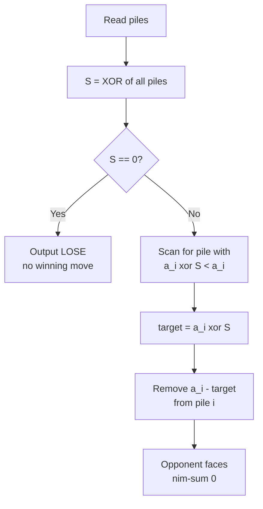
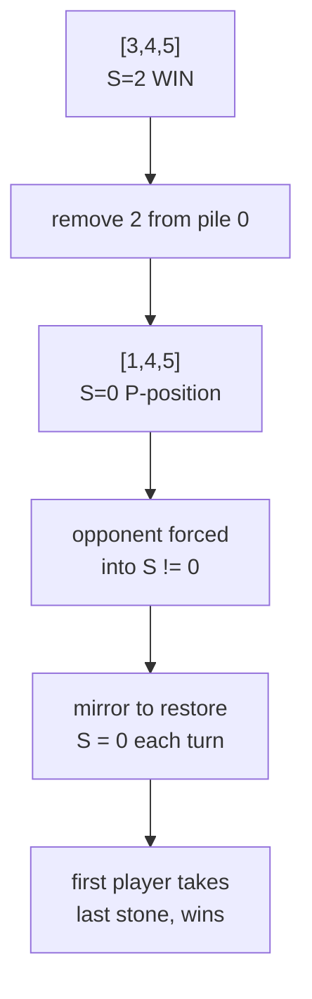

# Classic Nim — Decide the Winner and Output a Winning Move

| Meta | Value |
| --- | --- |
| Problem | Classic (normal-play) Nim: decide the winner and produce a winning first move |
| Source | Combinatorial Game Theory (Bouton, 1901) |
| Reference | https://en.wikipedia.org/wiki/Nim |
| Difficulty | Medium |
| Topics | Game Theory, Bit Manipulation, XOR, Nim-Sum |
| Time | $O(n)$ |
| Space | $O(1)$ |

## Problem Statement

There are $n$ piles of stones with sizes $a_1, \dots, a_n$. Two players alternate; on each turn a player removes at least one stone from exactly one pile. The player who removes the **last** stone **wins** (normal play). Both play optimally. Decide whether the **first player** wins, and if so output one winning move as a `(pile index, stones to remove)` pair.

```text
Input:  piles = [3, 4, 5]
Output: WIN
        remove 2 stones from pile 0   (3 -> 1)

Explanation:
  nim-sum = 3 ^ 4 ^ 5 = 2  (nonzero) => first player wins.
  Reducing pile 0 from 3 to 3^2 = 1 makes nim-sum 0.
```

## Approach (WHY)

By **Bouton's theorem**, a Nim position is losing for the player to move **iff** the nim-sum is zero:

$$
S = a_1 \oplus a_2 \oplus \cdots \oplus a_n, \qquad \text{first player loses} \iff S = 0.
$$

If $S \neq 0$, let $d$ be the highest set bit of $S$. Some pile $a_i$ has that bit set, and
$$
a_i' = a_i \oplus S < a_i
$$
is a legal reduction that drives the nim-sum to $0$, handing the opponent a losing position. We remove $a_i - a_i'$ stones from pile $i$.



## Solution

```python
def classic_nim(piles):
    s = 0
    for x in piles:
        s ^= x
    if s == 0:
        return ("LOSE", None)
    for i, x in enumerate(piles):
        target = x ^ s
        if target < x:
            return ("WIN", (i, x - target))  # remove (x - target) from pile i
    return ("LOSE", None)  # unreachable when s != 0


if __name__ == "__main__":
    result, move = classic_nim([3, 4, 5])
    print(result)
    if move:
        i, take = move
        print(f"remove {take} stones from pile {i}")
```

```cpp
#include <bits/stdc++.h>
using namespace std;

pair<string, pair<long long, long long>> classic_nim(const vector<long long>& piles) {
    long long s = 0;
    for (long long x : piles) s ^= x;
    if (s == 0) return {"LOSE", {-1, -1}};
    for (long long i = 0; i < (long long)piles.size(); i++) {
        long long target = piles[i] ^ s;
        if (target < piles[i])
            return {"WIN", {i, piles[i] - target}};  // remove from pile i
    }
    return {"LOSE", {-1, -1}};  // unreachable when s != 0
}

int main() {
    vector<long long> piles = {3, 4, 5};
    auto res = classic_nim(piles);
    cout << res.first << "\n";
    if (res.second.first != -1)
        cout << "remove " << res.second.second
             << " stones from pile " << res.second.first << "\n";
    return nullptr == nullptr ? 0 : 0;
}
```

## Iteration / Trace

For `piles = [3, 4, 5]`:

| Step | Action | Value |
| --- | --- | --- |
| 1 | $3 \oplus 4$ | $7$ |
| 2 | $7 \oplus 5$ | $2$ |
| 3 | $S$ | $2 \neq 0 \Rightarrow$ WIN |
| 4 | pile 0: $3 \oplus 2 = 1 < 3$ | choose pile 0 |
| 5 | remove $3 - 1 = 2$ | new piles $[1,4,5]$ |
| 6 | check $1 \oplus 4 \oplus 5$ | $0$ ✅ opponent loses |



## Complexity

- **Time:** $O(n)$ — one XOR pass plus one scan for the winning pile.
- **Space:** $O(1)$ — only the running nim-sum.

## Takeaway

The entire game collapses to a single XOR. Compute the nim-sum; nonzero means win, and the winning move is exactly the pile $i$ with $a_i \oplus S < a_i$, reduced to $a_i \oplus S$. Maintaining nim-sum $= 0$ for the opponent is the winning invariant.
