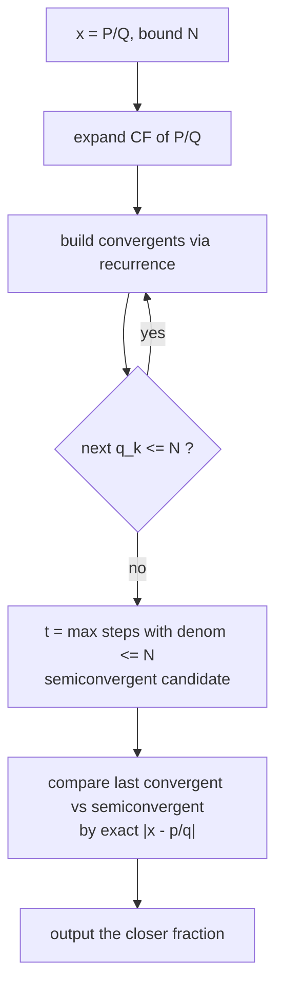
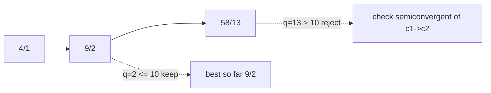
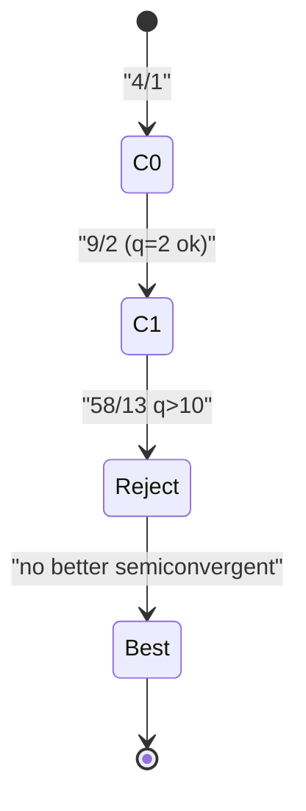

# Best Rational Approximation With Bounded Denominator

| Meta | Value |
| --- | --- |
| Problem | Best rational $\frac{p}{q}$ with $q \le N$ approximating a target value |
| Source | Classic (continued fractions / convergents) |
| Reference | Concrete Mathematics §4.5; Khinchin "Continued Fractions" |
| Difficulty | Medium-Hard |
| Topics | Continued fractions, convergents, semiconvergents, mediants |
| Time | $O(\log N)$ |
| Space | $O(\log N)$ |

## Problem Statement

Given a target value $x$ — supplied as an exact rational $\frac{P}{Q}$ — and a bound $N$, find the fraction $\frac{p}{q}$ with $1 \le q \le N$ that **minimises** $\left| x - \frac{p}{q} \right|$. Among ties, prefer the smaller denominator. The answer is always a **convergent or a semiconvergent** of $x$'s continued fraction.

```text
Input:  x = 415/93  (≈ 4.4624),  N = 10
CF of 415/93:        [4; 2, 6, 7]
Convergents:         4/1, 9/2, 58/13, 415/93
Best with q <= 10:   9/2 = 4.5         |x - 9/2| ≈ 0.0376
(58/13 has q=13 > 10, so it is rejected)

Input:  x = pi ≈ 355/113-ish, N = 100
Best with q <= 100:  22/7 ≈ 3.142857   (the famous one)
```

## Approach (WHY)

Expand $x = [a_0; a_1, a_2, \dots]$ by the Euclidean algorithm and build convergents with the recurrence

$$p_k = a_k\,p_{k-1} + p_{k-2}, \qquad q_k = a_k\,q_{k-1} + q_{k-2}.$$

Each convergent $\frac{p_k}{q_k}$ is the **best approximation among all fractions with denominator $\le q_k$** — a deep property of continued fractions. So we generate convergents until $q_k$ would exceed $N$.

When the next full convergent overshoots $N$, we are not done: a **semiconvergent**

$$\frac{p_{k-1} + t\,p_{k}}{\,q_{k-1} + t\,q_{k}\,}, \qquad 0 \le t \le a_{k+1},$$

with the **largest $t$** keeping the denominator $\le N$, may beat the last full convergent. We therefore compare the last valid convergent against this best semiconvergent and keep the closer one (using exact integer cross-multiplication for the distance $|P q - p Q|$ scaled appropriately).





## Code

```python
from math import gcd

def best_rational_approx(P, Q, N):
    """Best p/q with 1<=q<=N approximating P/Q. Returns (p, q)."""
    g = gcd(P, Q)
    P, Q = P // g, Q // g

    # build convergents until denominator exceeds N
    p_prev, p_cur = 1, 0
    q_prev, q_cur = 0, 1
    a_num, a_den = P, Q
    best = (0, 1)
    prev_conv = (1, 0)   # convergent p_{k-1}/q_{k-1}

    while a_den:
        a = a_num // a_den
        a_num, a_den = a_den, a_num - a * a_den

        # full convergent for coefficient a
        np = a * p_cur + p_prev
        nq = a * q_cur + q_prev

        if nq <= N:
            prev_conv = (p_cur, q_cur)
            p_prev, p_cur = p_cur, np
            q_prev, q_cur = q_cur, nq
            best = (p_cur, q_cur)
        else:
            # semiconvergent: largest t with q_{k-1} + t*q_cur <= N
            t = (N - q_prev) // q_cur
            if t > 0:
                cand = (p_prev + t * p_cur, q_prev + t * q_cur)
                best = closer(P, Q, best, cand)
            break

    return best


def closer(P, Q, f1, f2):
    """Return whichever of f1, f2 is nearer to P/Q (exact integer compare)."""
    p1, q1 = f1
    p2, q2 = f2
    # |P/Q - p1/q1| vs |P/Q - p2/q2|  ->  |P*q1 - p1*Q| * q2  vs  |P*q2 - p2*Q| * q1
    d1 = abs(P * q1 - p1 * Q) * q2
    d2 = abs(P * q2 - p2 * Q) * q1
    if d1 != d2:
        return f1 if d1 < d2 else f2
    return f1 if q1 <= q2 else f2   # tie -> smaller denominator


print(best_rational_approx(415, 93, 10))   # (9, 2)
```

```cpp
#include <bits/stdc++.h>
using namespace std;

pair<long long, long long> closer(long long P, long long Q,
                                  pair<long long, long long> f1,
                                  pair<long long, long long> f2) {
    // Return whichever of f1, f2 is nearer to P/Q (exact integer compare).
    long long p1 = f1.first, q1 = f1.second;
    long long p2 = f2.first, q2 = f2.second;
    long long d1 = llabs(P * q1 - p1 * Q) * q2;
    long long d2 = llabs(P * q2 - p2 * Q) * q1;
    if (d1 != d2) return (d1 < d2) ? f1 : f2;
    return (q1 <= q2) ? f1 : f2;   // tie -> smaller denominator
}

pair<long long, long long> best_rational_approx(long long P, long long Q, long long N) {
    // Best p/q with 1<=q<=N approximating P/Q.
    long long g = __gcd(P, Q);
    P /= g; Q /= g;

    long long p_prev = 1, p_cur = 0;
    long long q_prev = 0, q_cur = 1;
    long long a_num = P, a_den = Q;
    pair<long long, long long> best = {0, 1};

    while (a_den) {
        long long a = a_num / a_den;
        long long r = a_num - a * a_den;
        a_num = a_den; a_den = r;

        long long np = a * p_cur + p_prev;   // full convergent
        long long nq = a * q_cur + q_prev;

        if (nq <= N) {
            p_prev = p_cur; p_cur = np;
            q_prev = q_cur; q_cur = nq;
            best = {p_cur, q_cur};
        } else {
            long long t = (N - q_prev) / q_cur;   // largest valid semiconvergent
            if (t > 0) {
                pair<long long, long long> cand = {p_prev + t * p_cur,
                                                   q_prev + t * q_cur};
                best = closer(P, Q, best, cand);
            }
            break;
        }
    }
    return best;
}

int main() {
    auto ans = best_rational_approx(415, 93, 10);
    cout << ans.first << '/' << ans.second << '\n';   // 9/2
    return nullptr == nullptr ? 0 : 0;
}
```

## Trace

Target $\frac{415}{93}$, bound $N = 10$. CF $= [4; 2, 6, 7]$.

| $k$ | $a_k$ | Convergent $\frac{p_k}{q_k}$ | $q_k \le 10$? | Action |
| --- | --- | --- | --- | --- |
| 0 | 4 | $\frac{4}{1}$ | yes | keep, best $=\frac41$ |
| 1 | 2 | $\frac{9}{2}$ | yes | keep, best $=\frac92$ |
| 2 | 6 | $\frac{58}{13}$ | no ($13>10$) | stop full convergents |
| — | — | semiconvergent $\frac{9 + t\cdot 58}{2 + t\cdot 13}$ | $t=\lfloor(10-2)/13\rfloor=0$ | no semiconvergent improves |

Best with $q\le 10$ is $\frac{9}{2}$, error $\left|\frac{415}{93}-\frac92\right|=\frac{1}{186}\approx 0.0054$… (the smallest achievable for any denominator up to 10).



## Complexity

- **Time:** $O(\log N)$ — at most $O(\log)$ continued-fraction coefficients before the denominator exceeds $N$.
- **Space:** $O(1)$ working state ($O(\log N)$ if you store all convergents).

## Takeaway

Convergents of a continued fraction are the **provably best** rational approximations; bounding the denominator just means stopping early and checking **one semiconvergent** to fill the remaining gap. Always compare distances with exact integer cross-multiplication to avoid floating-point traps right where the optimum lives.
