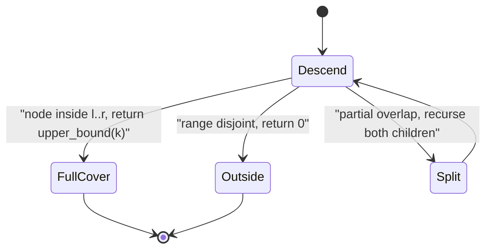
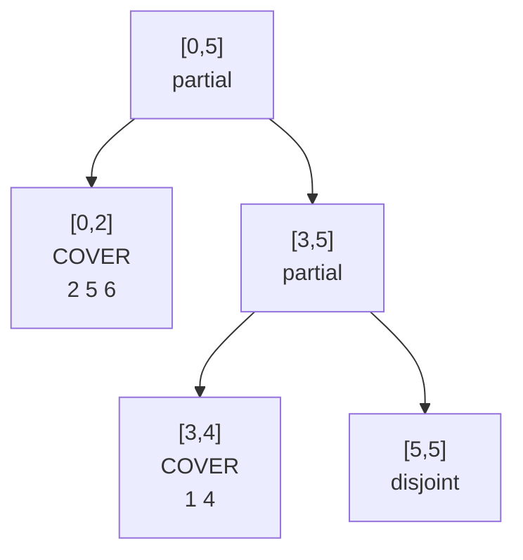

# Count Elements &lt;= k in a Range (Merge Sort Tree)

| Meta | Value |
| --- | --- |
| Topic | Merge sort tree |
| Technique | Segment tree of sorted lists + `upper_bound` |
| Queries | Offline or online, no updates |
| Time | $O(n\log n)$ build, $O(\log^2 n)$ per query |
| Space | $O(n\log n)$ |

## Problem Statement

You are given a static array `a` of length `n` and many queries. Each query is a triple `(l, r, k)` and asks: **how many elements of `a[l..r]` are `<= k`?** Indices are inclusive and 0-indexed; the array never changes between queries.

```text
a = [5, 2, 6, 1, 4, 3]   (indices 0..5)

query (l=0, r=4, k=4) -> subarray [5,2,6,1,4], values <= 4 are {2,1,4} -> 3
query (l=1, r=5, k=3) -> subarray [2,6,1,4,3], values <= 3 are {2,1,3} -> 3
query (l=2, r=2, k=6) -> subarray [6],          values <= 6 are {6}     -> 1
```

## Approach (WHY)

Scanning each subarray costs $O(n)$ per query — too slow for many queries. Instead, build a **merge sort tree**: a segment tree where each node stores the **sorted list** of the values in its index range. A query range $[l, r]$ decomposes into $O(\log n)$ **covering nodes** whose ranges are disjoint and union to $[l, r]$. Inside each covering node we do not scan — we binary search.

For a single covering node holding sorted list $S$, the number of elements $\le k$ is exactly `upper_bound(S, k)` (the count of values $\le k$). Summing over all covering nodes:

$$\text{answer}(l, r, k) = \sum_{\text{covering node } v} \big|\{\, x \in S_v : x \le k \,\}\big|.$$

With $O(\log n)$ covering nodes and an $O(\log n)$ binary search each, every query costs $O(\log^2 n)$.




## Code

```python
from bisect import bisect_right

class MergeSortTree:
    def __init__(self, a):
        self.n = len(a)
        self.tree = [[] for _ in range(4 * self.n)]
        self._build(1, 0, self.n - 1, a)

    def _build(self, node, lo, hi, a):
        if lo == hi:
            self.tree[node] = [a[lo]]
            return
        mid = (lo + hi) // 2
        self._build(2 * node, lo, mid, a)
        self._build(2 * node + 1, mid + 1, hi, a)
        left, right = self.tree[2 * node], self.tree[2 * node + 1]
        merged, i, j = [], 0, 0
        while i < len(left) and j < len(right):
            if left[i] <= right[j]:
                merged.append(left[i]); i += 1
            else:
                merged.append(right[j]); j += 1
        merged.extend(left[i:]); merged.extend(right[j:])
        self.tree[node] = merged

    def count_leq(self, l, r, k):
        return self._query(1, 0, self.n - 1, l, r, k)

    def _query(self, node, lo, hi, l, r, k):
        if hi < l or lo > r:
            return 0
        if l <= lo and hi <= r:
            return bisect_right(self.tree[node], k)  # count of values <= k
        mid = (lo + hi) // 2
        return (self._query(2 * node, lo, mid, l, r, k) +
                self._query(2 * node + 1, mid + 1, hi, l, r, k))

if __name__ == "__main__":
    mst = MergeSortTree([5, 2, 6, 1, 4, 3])
    print(mst.count_leq(0, 4, 4))  # 3
    print(mst.count_leq(1, 5, 3))  # 3
    print(mst.count_leq(2, 2, 6))  # 1
```

```cpp
#include <bits/stdc++.h>
using namespace std;

struct MergeSortTree {
    int n;
    vector<vector<long long>> tree;

    MergeSortTree(const vector<long long>& a) {
        n = (int)a.size();
        tree.assign(4 * n, {});
        build(1, 0, n - 1, a);
    }

    void build(int node, int lo, int hi, const vector<long long>& a) {
        if (lo == hi) {
            tree[node] = {a[lo]};
            return;
        }
        int mid = (lo + hi) / 2;
        build(2 * node, lo, mid, a);
        build(2 * node + 1, mid + 1, hi, a);
        const auto& left = tree[2 * node];
        const auto& right = tree[2 * node + 1];
        tree[node].resize(left.size() + right.size());
        merge(left.begin(), left.end(), right.begin(), right.end(),
              tree[node].begin());
    }

    long long count_leq(int l, int r, long long k) {
        return query(1, 0, n - 1, l, r, k);
    }

    long long query(int node, int lo, int hi, int l, int r, long long k) {
        if (hi < l || lo > r) return 0;
        if (l <= lo && hi <= r)
            // count of values <= k
            return upper_bound(tree[node].begin(), tree[node].end(), k)
                   - tree[node].begin();
        int mid = (lo + hi) / 2;
        return query(2 * node, lo, mid, l, r, k) +
               query(2 * node + 1, mid + 1, hi, l, r, k);
    }
};

int main() {
    MergeSortTree mst({5, 2, 6, 1, 4, 3});
    cout << mst.count_leq(0, 4, 4) << "\n";  // 3
    cout << mst.count_leq(1, 5, 3) << "\n";  // 3
    cout << mst.count_leq(2, 2, 6) << "\n";  // 1
    return 0;
}
```

## Trace

`a = [5, 2, 6, 1, 4, 3]`, query `(l=0, r=4, k=4)`.

The segment tree over indices `[0,5]` splits `[0,4]` into the covering nodes `[0,2]` and `[3,4]` (note `[0,5]` partially overlaps so we recurse; `[5,5]` is disjoint and contributes 0).

| Covering node | index range | sorted list | `upper_bound(4)` | contribution |
| --- | --- | --- | --- | --- |
| node A | [0,2] | [2, 5, 6] | 1 (only 2) | 1 |
| node B | [3,4] | [1, 4] | 2 (1 and 4) | 2 |

Sum $= 1 + 2 = 3$. ✔



The two covering nodes each run one binary search for the key `k = 4`; the disjoint node `[5,5]` returns 0 without searching.

## Complexity

- **Build**: $O(n\log n)$ time and $O(n\log n)$ space — each of the $O(\log n)$ levels merges $n$ values.
- **Per query**: $O(\log^2 n)$ — $O(\log n)$ covering nodes, each with an $O(\log n)$ binary search.
- **Recursion stack**: $O(\log n)$.

## Takeaway

A merge sort tree turns "count elements satisfying a value threshold in a subarray" into a sum of binary searches over $O(\log n)$ precomputed sorted lists. Build once in $O(n\log n)$, then answer each `(l, r, k)` online in $O(\log^2 n)$. The same threshold key is searched at every covering node, which is exactly what fractional cascading later optimizes away.
