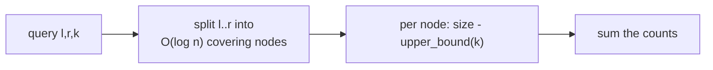
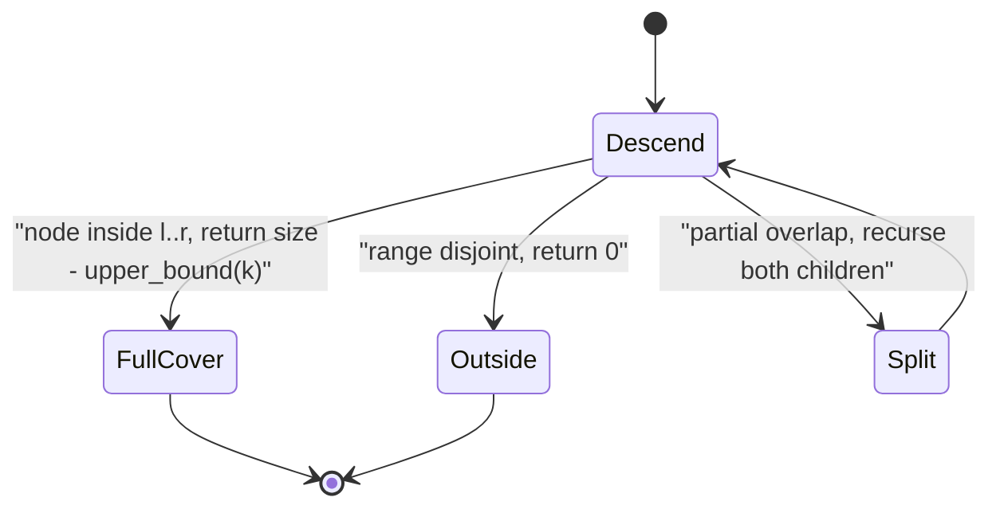
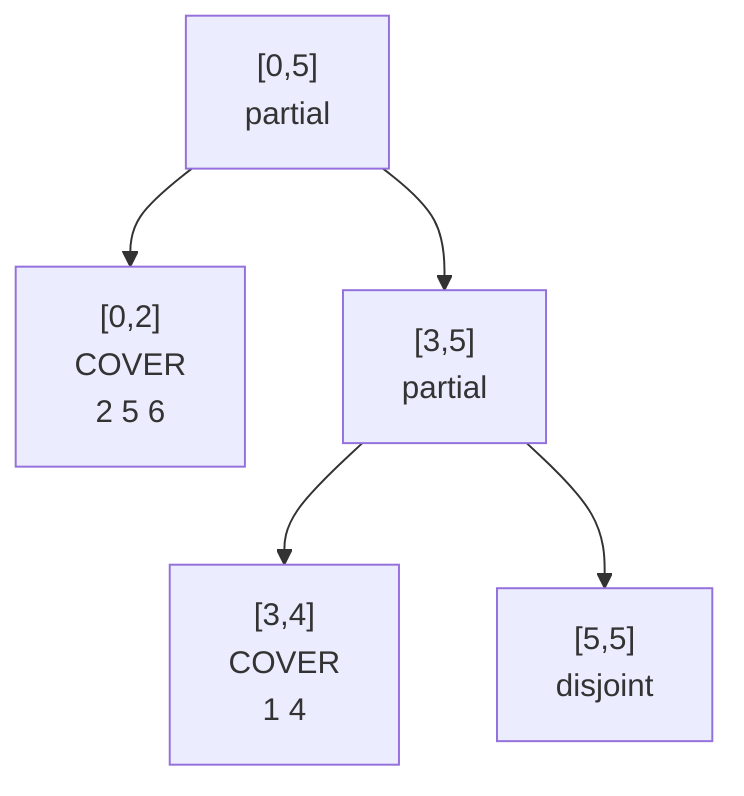

# Count Elements &gt; k in a Range (Merge Sort Tree)

| Meta | Value |
| --- | --- |
| Topic | Merge sort tree |
| Technique | Segment tree of sorted lists + complement of `upper_bound` |
| Queries | Online, no updates |
| Time | $O(n\log n)$ build, $O(\log^2 n)$ per query |
| Space | $O(n\log n)$ |

## Problem Statement

You are given a static array `a` of length `n`. Answer many queries `(l, r, k)`: **how many elements of `a[l..r]` are strictly greater than `k`?** Indices are inclusive and 0-indexed; the array never changes between queries.

```text
a = [5, 2, 6, 1, 4, 3]   (indices 0..5)

query (l=0, r=4, k=4) -> subarray [5,2,6,1,4], values > 4 are {5,6}   -> 2
query (l=1, r=5, k=2) -> subarray [2,6,1,4,3], values > 2 are {6,4,3} -> 3
query (l=2, r=2, k=6) -> subarray [6],          values > 6 are {}      -> 0
```

## Approach (WHY)

"Greater than `k`" is the **complement** of "less than or equal to `k`". For any range, if the range holds `m` elements and `c` of them are `<= k`, then exactly `m - c` are `> k`. So we reuse a **merge sort tree** (a segment tree whose nodes store sorted lists) and, at each covering node, subtract the `upper_bound(k)` count from the node's size:

$$\text{answer}(l, r, k) = \sum_{\text{covering node } v} \Big(|S_v| - \big|\{\, x \in S_v : x \le k \,\}\big|\Big).$$

Each covering node contributes `size - upper_bound(k)`, which equals the count of values strictly greater than `k`. With $O(\log n)$ covering nodes and an $O(\log n)$ binary search at each, a query is $O(\log^2 n)$.





## Code

```python
from bisect import bisect_right

class MergeSortTree:
    def __init__(self, a):
        self.n = len(a)
        self.tree = [[] for _ in range(4 * self.n)]
        self._build(1, 0, self.n - 1, a)

    def _build(self, node, lo, hi, a):
        if lo == hi:
            self.tree[node] = [a[lo]]
            return
        mid = (lo + hi) // 2
        self._build(2 * node, lo, mid, a)
        self._build(2 * node + 1, mid + 1, hi, a)
        left, right = self.tree[2 * node], self.tree[2 * node + 1]
        merged, i, j = [], 0, 0
        while i < len(left) and j < len(right):
            if left[i] <= right[j]:
                merged.append(left[i]); i += 1
            else:
                merged.append(right[j]); j += 1
        merged.extend(left[i:]); merged.extend(right[j:])
        self.tree[node] = merged

    def count_gt(self, l, r, k):
        return self._query(1, 0, self.n - 1, l, r, k)

    def _query(self, node, lo, hi, l, r, k):
        if hi < l or lo > r:
            return 0
        if l <= lo and hi <= r:
            lst = self.tree[node]
            return len(lst) - bisect_right(lst, k)  # count of values > k
        mid = (lo + hi) // 2
        return (self._query(2 * node, lo, mid, l, r, k) +
                self._query(2 * node + 1, mid + 1, hi, l, r, k))

if __name__ == "__main__":
    mst = MergeSortTree([5, 2, 6, 1, 4, 3])
    print(mst.count_gt(0, 4, 4))  # 2
    print(mst.count_gt(1, 5, 2))  # 3
    print(mst.count_gt(2, 2, 6))  # 0
```

```cpp
#include <bits/stdc++.h>
using namespace std;

struct MergeSortTree {
    int n;
    vector<vector<long long>> tree;

    MergeSortTree(const vector<long long>& a) {
        n = (int)a.size();
        tree.assign(4 * n, {});
        build(1, 0, n - 1, a);
    }

    void build(int node, int lo, int hi, const vector<long long>& a) {
        if (lo == hi) {
            tree[node] = {a[lo]};
            return;
        }
        int mid = (lo + hi) / 2;
        build(2 * node, lo, mid, a);
        build(2 * node + 1, mid + 1, hi, a);
        const auto& left = tree[2 * node];
        const auto& right = tree[2 * node + 1];
        tree[node].resize(left.size() + right.size());
        merge(left.begin(), left.end(), right.begin(), right.end(),
              tree[node].begin());
    }

    long long count_gt(int l, int r, long long k) {
        return query(1, 0, n - 1, l, r, k);
    }

    long long query(int node, int lo, int hi, int l, int r, long long k) {
        if (hi < l || lo > r) return 0;
        if (l <= lo && hi <= r) {
            const auto& lst = tree[node];
            long long leq = upper_bound(lst.begin(), lst.end(), k)
                            - lst.begin();
            return (long long)lst.size() - leq;  // count of values > k
        }
        int mid = (lo + hi) / 2;
        return query(2 * node, lo, mid, l, r, k) +
               query(2 * node + 1, mid + 1, hi, l, r, k);
    }
};

int main() {
    MergeSortTree mst({5, 2, 6, 1, 4, 3});
    cout << mst.count_gt(0, 4, 4) << "\n";  // 2
    cout << mst.count_gt(1, 5, 2) << "\n";  // 3
    cout << mst.count_gt(2, 2, 6) << "\n";  // 0
    return 0;
}
```

## Trace

`a = [5, 2, 6, 1, 4, 3]`, query `(l=0, r=4, k=4)`.

The range `[0,4]` decomposes into covering nodes `[0,2]` and `[3,4]`; `[5,5]` is disjoint and contributes 0.

| Covering node | index range | sorted list | size | `upper_bound(4)` | size - upper_bound = `> 4` |
| --- | --- | --- | --- | --- | --- |
| node A | [0,2] | [2, 5, 6] | 3 | 1 (only 2) | 2 (5, 6) |
| node B | [3,4] | [1, 4] | 2 | 2 (1 and 4) | 0 |

Sum $= 2 + 0 = 2$. ✔ (subarray `[5,2,6,1,4]`, values `> 4` are `{5, 6}`.)



Each covering node runs one binary search for `k = 4` and returns its size minus the `<= k` count; the disjoint node returns 0 without searching.

## Complexity

- **Build**: $O(n\log n)$ time and $O(n\log n)$ space.
- **Per query**: $O(\log^2 n)$ — $O(\log n)$ covering nodes, each with an $O(\log n)$ binary search.
- **Recursion stack**: $O(\log n)$.

## Takeaway

Counting elements strictly greater than `k` is just the complement of counting `<= k`: subtract `upper_bound(k)` from each covering node's size. The merge sort tree needs no change — only the per-node formula flips. Remember the bound choices: `size - upper_bound(k)` gives "$> k$", while `size - lower_bound(k)` would give "$\ge k$".
