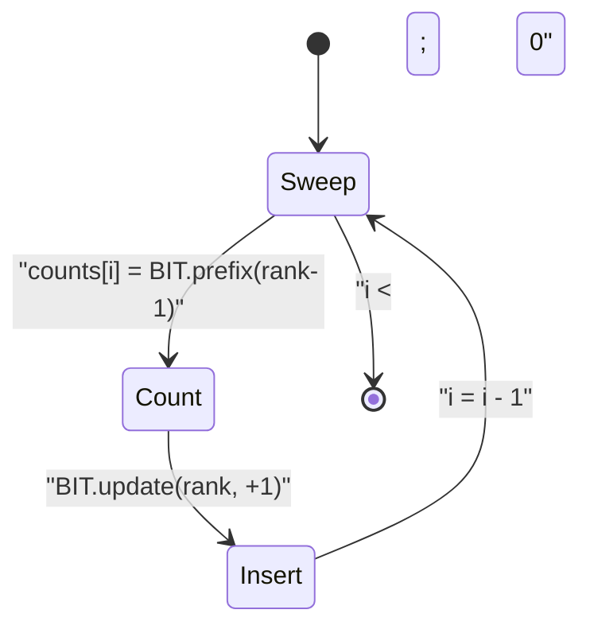
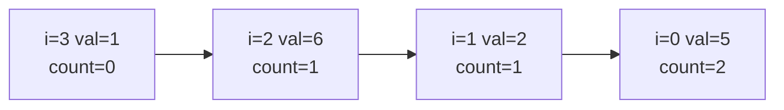

# Count of Smaller Numbers After Self (Offline BIT)

| Meta | Value |
| --- | --- |
| Topic | Offline query processing |
| Technique | Coordinate compression + Fenwick/BIT (right-to-left sweep) |
| Equivalent to | LeetCode 315 |
| Time | $O(n\log n)$ |
| Space | $O(n)$ |

## Problem Statement

Given an integer array `nums`, return an array `counts` where `counts[i]` is the number of elements to the **right** of `nums[i]` that are **strictly smaller** than `nums[i]`.

```text
nums   = [5, 2, 6, 1]
counts = [2, 1, 1, 0]

i=0 -> 5: right side {2,6,1}, smaller {2,1} -> 2
i=1 -> 2: right side {6,1},   smaller {1}   -> 1
i=2 -> 6: right side {1},     smaller {1}   -> 1
i=3 -> 1: right side {},      smaller {}    -> 0
```

## Approach (WHY)

For each `i` we need: how many already-seen elements (those to its right) are strictly smaller. If we sweep **right to left** and maintain a frequency structure keyed by value, then at index `i` the answer is the count of stored values strictly less than `nums[i]`.

A Fenwick tree gives that prefix count in $O(\log n)$. Values can be large or negative, so we **coordinate-compress** them into ranks $1..k$. Then:

$$\text{counts}[i] = \text{BIT.prefix}\big(\text{rank}(nums[i]) - 1\big)$$

followed by inserting `nums[i]`:

$$\text{BIT.update}\big(\text{rank}(nums[i]), +1\big)$$

This is an **offline** technique: we read the whole array, compress all values together, then process. (An equivalent $O(n\log n)$ solution is a modified merge sort that counts cross-pair inversions; the BIT version is shown here.)




## Code

```python
class BIT:
    def __init__(self, n):
        self.n = n
        self.tree = [0] * (n + 1)

    def update(self, i, delta=1):  # i is 1-indexed rank
        while i <= self.n:
            self.tree[i] += delta
            i += i & (-i)

    def prefix(self, i):  # sum over ranks [1, i]
        s = 0
        while i > 0:
            s += self.tree[i]
            i -= i & (-i)
        return s

def count_smaller(nums):
    n = len(nums)
    sorted_vals = sorted(set(nums))
    rank = {v: i + 1 for i, v in enumerate(sorted_vals)}  # 1-indexed

    bit = BIT(len(sorted_vals))
    counts = [0] * n
    for i in range(n - 1, -1, -1):
        r = rank[nums[i]]
        counts[i] = bit.prefix(r - 1)  # strictly smaller
        bit.update(r, 1)
    return counts

if __name__ == "__main__":
    print(count_smaller([5, 2, 6, 1]))  # [2, 1, 1, 0]
```

```cpp
#include <bits/stdc++.h>
using namespace std;

struct BIT {
    int n;
    vector<long long> tree;
    BIT(int n) : n(n), tree(n + 1, 0) {}

    void update(int i, long long delta = 1) {  // i is 1-indexed rank
        for (; i <= n; i += i & (-i)) tree[i] += delta;
    }
    long long prefix(int i) {  // sum over ranks [1, i]
        long long s = 0;
        for (; i > 0; i -= i & (-i)) s += tree[i];
        return s;
    }
};

vector<long long> countSmaller(const vector<int>& nums) {
    int n = (int)nums.size();
    vector<int> sortedVals(nums);
    sort(sortedVals.begin(), sortedVals.end());
    sortedVals.erase(unique(sortedVals.begin(), sortedVals.end()),
                    sortedVals.end());

    auto rankOf = [&](int v) {
        return (int)(lower_bound(sortedVals.begin(), sortedVals.end(), v)
                    - sortedVals.begin()) + 1;  // 1-indexed
    };

    BIT bit((int)sortedVals.size());
    vector<long long> counts(n, 0);
    for (int i = n - 1; i >= 0; --i) {
        int r = rankOf(nums[i]);
        counts[i] = bit.prefix(r - 1);  // strictly smaller
        bit.update(r, 1);
    }
    return counts;
}

int main() {
    vector<int> nums = {5, 2, 6, 1};
    vector<long long> res = countSmaller(nums);
    for (long long x : res) cout << x << " ";   // 2 1 1 0
    cout << "\n";
    return 0;
}
```

## Trace

`nums = [5, 2, 6, 1]`. Sorted unique values `[1, 2, 5, 6]` ⇒ ranks `1->1, 2->2, 5->3, 6->4`.

Sweep right to left:

| i | nums[i] | rank | prefix(rank-1) → counts[i] | BIT after update |
| --- | --- | --- | --- | --- |
| 3 | 1 | 1 | prefix(0)=0 | {1} |
| 2 | 6 | 4 | prefix(3)=1 (rank 1 present) | {1, 6} |
| 1 | 2 | 2 | prefix(1)=1 (rank 1 present) | {1, 2, 6} |
| 0 | 5 | 3 | prefix(2)=2 (ranks 1,2 present) | {1, 2, 5, 6} |

Result `counts = [2, 1, 1, 0]`.



## Complexity

- **Time**: $O(n\log n)$ — coordinate compression sort plus $n$ BIT operations at $O(\log n)$ each.
- **Space**: $O(n)$ for the BIT, the compression table, and the output.

## Takeaway

"Count smaller to the right" is an inversion-counting problem. Going offline lets you compress all values once and sweep right-to-left with a Fenwick tree: at each step read `prefix(rank - 1)` for strictly-smaller, then insert. The same answer can be produced by a count-tracking merge sort, but the BIT version is short and easy to reason about.
