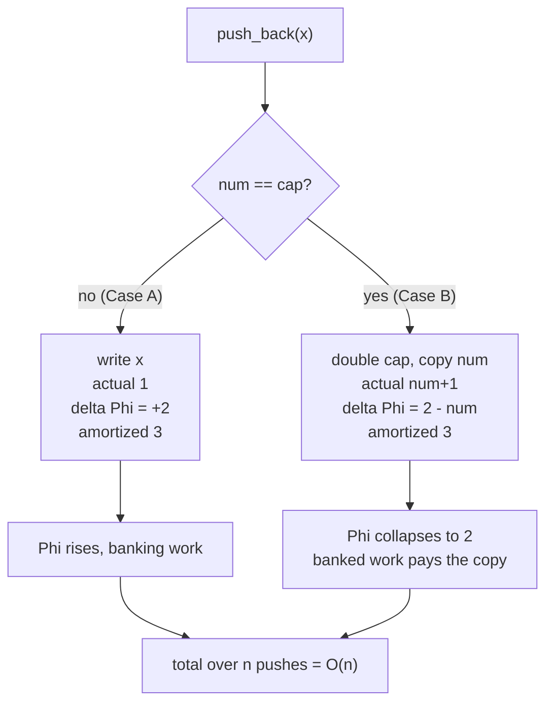
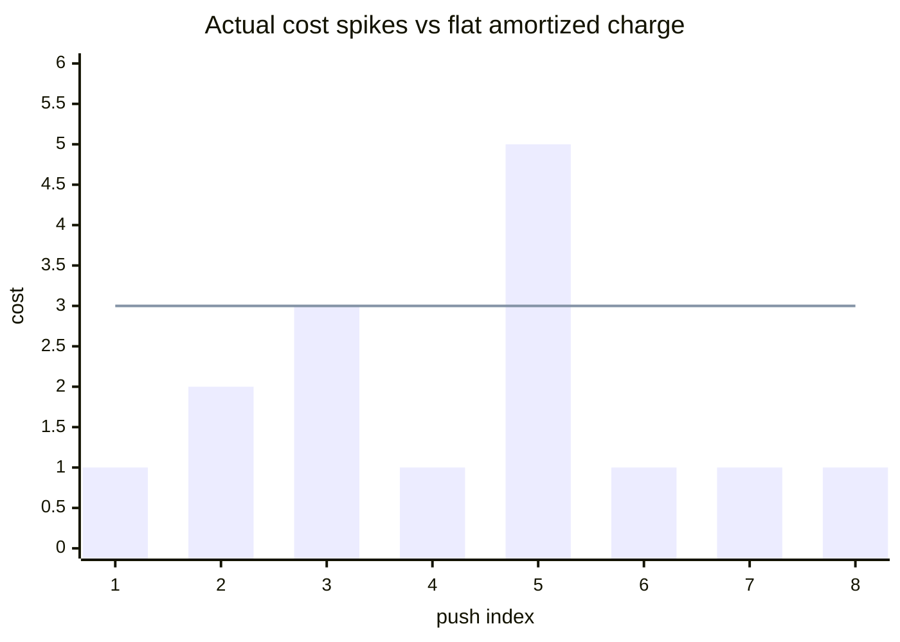

# Dynamic Array `push_back` Is O(1) Amortized

| Meta | Value |
| --- | --- |
| Topic | Amortization &amp; Potential Arguments |
| Module | misc |
| Difficulty | Medium |
| Technique | Potential method |
| Key idea | $\Phi = 2\,\text{num} - \text{cap}$ |

## Problem Statement

Implement a growable array (like C++ `vector` or Python `list`) supporting `push_back(x)`. The backing buffer has a fixed capacity; when it is full, allocate a new buffer of **double** the size and copy all elements over. A single `push_back` that triggers a resize copies all $n$ current elements and is therefore $\Theta(n)$. **Prove that, starting from an empty array, any sequence of $n$ `push_back` operations runs in $O(n)$ total time** — i.e. `push_back` is $O(1)$ *amortized* — using the potential method.

```text
Start: capacity = 1, num = 0

push 'a' -> [a]                 actual cost 1   (no resize)
push 'b' -> resize to cap 2, copy 1, write -> [a b]   actual cost 2
push 'c' -> resize to cap 4, copy 2, write -> [a b c] actual cost 3
push 'd' -> [a b c d]           actual cost 1   (no resize)
push 'e' -> resize to cap 8, copy 4, write             actual cost 5

Naive worst case: n * max_single_cost = n * Theta(n) = Theta(n^2)  -- too pessimistic
Claim:            total cost = Theta(n)                            -- to be proven
```

## Approach (WHY)

Let the structure after operation $i$ have `num` stored elements and capacity `cap`. We maintain the invariant that immediately after any operation $\text{num} \ge \text{cap}/2$ (true because we only double when full, making $\text{num} = \text{cap}/2$ right after, and pushes only raise `num`). Define the **potential function**

$$\Phi = 2 \cdot \text{num} - \text{cap}.$$

Check the two requirements of a valid potential:

- $\Phi_0 = 2 \cdot 0 - \text{cap}_0$. Modeling the initial empty array as $\Phi_0 = 0$ (we treat the base capacity as already paid for), and
- $\Phi_i \ge 0$ because $\text{num} \ge \text{cap}/2 \Rightarrow 2\,\text{num} \ge \text{cap}$.

The amortized cost is $\hat{c}_i = c_i + \Phi_i - \Phi_{i-1}$.

**Case A — no resize** ($\text{num} < \text{cap}$ before push). Actual $c_i = 1$. `num` rises by 1, `cap` fixed, so $\Delta\Phi = 2$. Thus

$$\hat{c}_i = 1 + 2 = 3.$$

**Case B — resize** ($\text{num} = \text{cap}$ before push). Actual $c_i = \text{num} + 1$ (copy `num`, then write). Before: $\Phi_{i-1} = 2\,\text{num} - \text{cap} = 2\,\text{num} - \text{num} = \text{num}$. After: $\text{cap} \to 2\,\text{num}$, $\text{num} \to \text{num}+1$, so $\Phi_i = 2(\text{num}+1) - 2\,\text{num} = 2$. Thus

$$\hat{c}_i = (\text{num}+1) + (2 - \text{num}) = 3.$$

Both cases yield $\hat{c}_i = 3$. Telescoping,

$$\sum_{i=1}^{n} c_i \le \sum_{i=1}^{n} \hat{c}_i = 3n + \Phi_0 - \Phi_n \le 3n = O(n).$$



## Implementation

```python
class DynamicArray:
    def __init__(self):
        self.cap = 1
        self.data = [None] * self.cap
        self.num = 0

    def potential(self):
        return 2 * self.num - self.cap

    def push_back(self, x):
        actual = 1
        if self.num == self.cap:               # Case B: resize
            self.cap *= 2
            new_data = [None] * self.cap
            for i in range(self.num):          # copy all elements
                new_data[i] = self.data[i]
            actual += self.num                 # copy cost
            self.data = new_data
        self.data[self.num] = x                # write new element
        self.num += 1
        return actual                          # amortized is always 3
```

```cpp
#include <bits/stdc++.h>
using namespace std;

struct DynamicArray {
    long long cap = 1;
    long long num = 0;
    vector<long long> data;

    DynamicArray() { data.assign(cap, 0); }

    long long potential() const { return 2 * num - cap; }

    long long push_back(long long x) {
        long long actual = 1;
        if (num == cap) {                       // Case B: resize
            cap *= 2;
            vector<long long> new_data(cap, 0);
            for (long long i = 0; i < num; ++i) // copy all elements
                new_data[i] = data[i];
            actual += num;                      // copy cost
            data = move(new_data);
        }
        data[num] = x;                          // write new element
        num += 1;
        return actual;                          // amortized is always 3
    }
};
```

## Trace: Actual vs Amortized Cost

Pushing 8 elements into an array that starts with capacity 1. `cap` after each op, actual cost, $\Phi$ after, and amortized cost $\hat{c}=c+\Delta\Phi$ (running totals confirm $\sum c \le \sum \hat{c}$):

| Op # | resize? | cap | actual $c_i$ | num | $\Phi_i$ | $\Delta\Phi$ | amortized $\hat{c}_i$ | $\sum c$ | $\sum \hat{c}$ |
| --- | --- | --- | --- | --- | --- | --- | --- | --- | --- |
| 1 | no  | 1 | 1 | 1 | 1 | +1 | 2 | 1 | 2 |
| 2 | yes | 2 | 2 | 2 | 2 | +1 | 3 | 3 | 5 |
| 3 | yes | 4 | 3 | 3 | 2 | 0  | 3 | 6 | 8 |
| 4 | no  | 4 | 1 | 4 | 4 | +2 | 3 | 7 | 11 |
| 5 | yes | 8 | 5 | 5 | 2 | -2 | 3 | 12 | 14 |
| 6 | no  | 8 | 1 | 6 | 4 | +2 | 3 | 13 | 17 |
| 7 | no  | 8 | 1 | 7 | 6 | +2 | 3 | 14 | 20 |
| 8 | no  | 8 | 1 | 8 | 8 | +2 | 3 | 15 | 23 |

The amortized charge per op never exceeds 3, and $\sum \hat{c} - \sum c = \Phi_n \ge 0$ throughout. Total actual cost 15 for 8 pushes — comfortably $\le 3 \cdot 8 = 24$.



The bars (actual) jump on every power-of-two resize; the line (amortized) stays flat at 3. The area under the line always dominates the area under the bars by exactly $\Phi_n$.

## Complexity

| Measure | Value |
| --- | --- |
| Single `push_back` (worst case) | $O(n)$ (on resize) |
| `push_back` amortized | $O(1)$ (exactly 3) |
| $n$ pushes total time | $O(n)$ |
| Extra space | $O(n)$, never more than $2n$ |

## Takeaway

Doubling the buffer makes expensive resizes geometrically rare, and the potential $\Phi = 2\,\text{num} - \text{cap}$ banks exactly the work each cheap push needs to later pay for its share of a copy. Both push cases collapse to a constant amortized cost of 3, proving $O(1)$ amortized `push_back`. The geometric growth factor is essential — growing by a constant increment would make it $\Theta(n)$ amortized.
