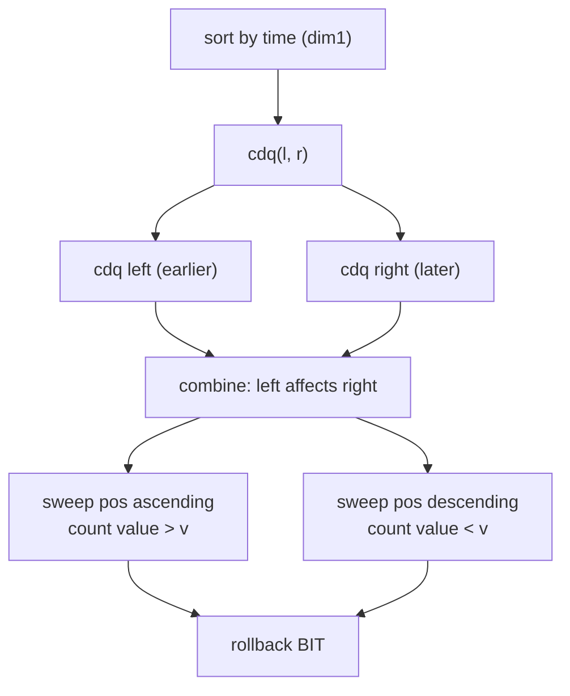
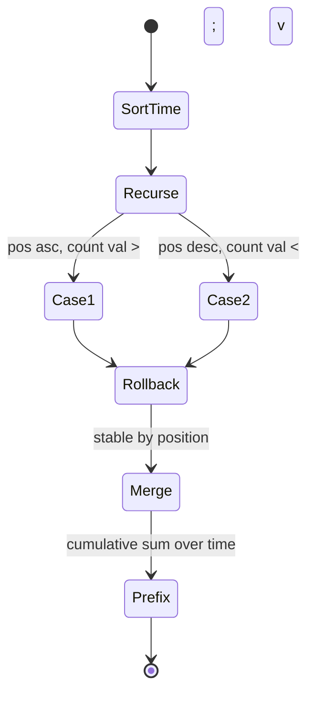

# Dynamic Inversions via CDQ Divide and Conquer

| Meta | Value |
| ---- | ----- |
| Topic | Divide &amp; Conquer / CDQ |
| Technique | CDQ on time + Fenwick (BIT) over values |
| Difficulty | Hard |
| Time | $O(n \log^2 n)$ |
| Space | $O(n)$ |

## Problem Statement

Elements are inserted into an array **over time**. Element $e$ is described by a triple $(t_e, p_e, v_e)$:

- $t_e$ — the **time** it is inserted ($1, 2, \dots, n$, all distinct).
- $p_e$ — its fixed **position** in the array (distinct).
- $v_e$ — its **value** (distinct).

An **inversion** among the currently-present elements is a pair $\{x, y\}$ with

$$
p_x < p_y \quad\text{and}\quad v_x > v_y .
$$

After each insertion, report the **total number of inversions** among all elements inserted so far.

```text
Insertions (time order):
  t=1 -> position 2, value 3
  t=2 -> position 1, value 2
  t=3 -> position 3, value 1

After t=1: only one element            -> 0 inversions
After t=2: positions [1:2][2:3] sorted, 2 < 3 -> 0 inversions
After t=3: by position pos1=2, pos2=3, pos3=1
           pairs: (2,3) ok, (2,1) inversion, (3,1) inversion -> 2 inversions

Output (cumulative after each insertion): 0 0 2
```

## Approach (WHY)

A new element inserted at time $t$ creates inversions only with **already-present** elements (smaller time). The number of new inversions contributed by element $e$ is

$$
\text{contrib}(e) = \underbrace{|\{f : t_f < t_e,\; p_f < p_e,\; v_f > v_e\}|}_{f \text{ is left with larger value}} + \underbrace{|\{f : t_f < t_e,\; p_f > p_e,\; v_f < v_e\}|}_{f \text{ is right with smaller value}} .
$$

That is a **3D problem**: time, position, value. We use CDQ with **time as the first dimension**:

1. **Time — CDQ split.** Sort elements by time (they already are). Recurse on halves. In combine, only **left** elements (earlier time) contribute to **right** elements (later time).
2. **Position — merge sweep.** Inside combine, walk both halves in position order with two pointers.
3. **Value — Fenwick tree.** A BIT indexed by value answers "how many inserted lefts have value $> v_e$" (case 1) or "$< v_e$" (case 2).

Because both positional directions matter, the combine performs **two sweeps**: one ascending in position (counting larger values to the left) and one descending (counting smaller values to the right), each rolling the BIT back afterward.



The cumulative answer after each insertion is the **prefix sum** of $\text{contrib}$ taken in time order:

$$
\text{inversions after time } t = \sum_{t_e \le t} \text{contrib}(e).
$$

## Implementation

```python
import sys

class BIT:
    def __init__(self, n):
        self.n = n
        self.t = [0] * (n + 1)
    def add(self, i, v):
        while i <= self.n:
            self.t[i] += v
            i += i & (-i)
    def query(self, i):
        s = 0
        while i > 0:
            s += self.t[i]
            i -= i & (-i)
        return s

def dynamic_inversions(events):
    # events[k] = (pos, val); time order is the list order (t = k + 1)
    n = len(events)
    maxv = max(v for _, v in events)
    # node = [time_index, pos, val]; starts sorted by time
    nodes = [[k, events[k][0], events[k][1]] for k in range(n)]
    contrib = [0] * n           # contrib indexed by time index
    bit = BIT(maxv)

    def cdq(l, r):
        if l == r:
            return
        m = (l + r) // 2
        cdq(l, m)
        cdq(m + 1, r)
        # both halves now sorted by position
        # case 1: position ascending, count inserted values > v_j
        i = l
        added = 0
        touched = []
        for j in range(m + 1, r + 1):
            while i <= m and nodes[i][1] < nodes[j][1]:
                bit.add(nodes[i][2], 1)
                touched.append(nodes[i][2])
                added += 1
                i += 1
            contrib[nodes[j][0]] += added - bit.query(nodes[j][2])
        for val in touched:
            bit.add(val, -1)                 # rollback
        # case 2: position descending, count inserted values < v_j
        i = m
        touched = []
        for j in range(r, m, -1):
            while i >= l and nodes[i][1] > nodes[j][1]:
                bit.add(nodes[i][2], 1)
                touched.append(nodes[i][2])
                i -= 1
            contrib[nodes[j][0]] += bit.query(nodes[j][2] - 1)
        for val in touched:
            bit.add(val, -1)                 # rollback
        # stable merge by position for the parent call
        merged = []
        a, b = l, m + 1
        while a <= m and b <= r:
            if nodes[a][1] <= nodes[b][1]:
                merged.append(nodes[a]); a += 1
            else:
                merged.append(nodes[b]); b += 1
        while a <= m:
            merged.append(nodes[a]); a += 1
        while b <= r:
            merged.append(nodes[b]); b += 1
        for off, node in enumerate(merged):
            nodes[l + off] = node

    cdq(0, n - 1)
    # cumulative inversions in time order
    result = []
    running = 0
    for k in range(n):
        running += contrib[k]
        result.append(running)
    return result

if __name__ == "__main__":
    events = [(2, 3), (1, 2), (3, 1)]    # (pos, val) in time order
    print(dynamic_inversions(events))    # [0, 0, 2]
```

```cpp
#include <bits/stdc++.h>
using namespace std;

struct BIT {
    int n;
    vector<long long> t;
    BIT(int n_) : n(n_), t(n_ + 1, 0) {}
    void add(int i, long long v) {
        for (; i <= n; i += i & (-i)) t[i] += v;
    }
    long long query(int i) {
        long long s = 0;
        for (; i > 0; i -= i & (-i)) s += t[i];
        return s;
    }
};

struct Node { int time, pos, val; };

vector<long long> dynamic_inversions(vector<pair<int,int>> &events) {
    int n = (int)events.size();
    int maxv = 0;
    for (auto &e : events) maxv = max(maxv, e.second);
    vector<Node> nodes(n);
    for (int k = 0; k < n; ++k)
        nodes[k] = {k, events[k].first, events[k].second};
    vector<long long> contrib(n, 0);
    BIT bit(maxv);

    function<void(int,int)> cdq = [&](int l, int r) {
        if (l == r) return;
        int m = (l + r) / 2;
        cdq(l, m);
        cdq(m + 1, r);
        // case 1: position ascending, count inserted values > v_j
        int i = l;
        long long added = 0;
        vector<int> touched;
        for (int j = m + 1; j <= r; ++j) {
            while (i <= m && nodes[i].pos < nodes[j].pos) {
                bit.add(nodes[i].val, 1);
                touched.push_back(nodes[i].val);
                ++added;
                ++i;
            }
            contrib[nodes[j].time] += added - bit.query(nodes[j].val);
        }
        for (int v : touched) bit.add(v, -1);   // rollback
        // case 2: position descending, count inserted values < v_j
        i = m;
        touched.clear();
        for (int j = r; j > m; --j) {
            while (i >= l && nodes[i].pos > nodes[j].pos) {
                bit.add(nodes[i].val, 1);
                touched.push_back(nodes[i].val);
                --i;
            }
            contrib[nodes[j].time] += bit.query(nodes[j].val - 1);
        }
        for (int v : touched) bit.add(v, -1);   // rollback
        // stable merge by position
        vector<Node> merged;
        merged.reserve(r - l + 1);
        int a = l, b = m + 1;
        while (a <= m && b <= r) {
            if (nodes[a].pos <= nodes[b].pos) merged.push_back(nodes[a++]);
            else                              merged.push_back(nodes[b++]);
        }
        while (a <= m) merged.push_back(nodes[a++]);
        while (b <= r) merged.push_back(nodes[b++]);
        for (int off = 0; off < (int)merged.size(); ++off)
            nodes[l + off] = merged[off];
    };

    cdq(0, n - 1);
    vector<long long> result(n);
    long long running = 0;
    for (int k = 0; k < n; ++k) {
        running += contrib[k];
        result[k] = running;
    }
    return result;
}

int main() {
    vector<pair<int,int>> events = {{2, 3}, {1, 2}, {3, 1}};
    vector<long long> res = dynamic_inversions(events);
    for (size_t i = 0; i < res.size(); ++i)
        cout << res[i] << (i + 1 < res.size() ? ' ' : '\n');
    return nullptr == &events ? 1 : 0;
}
```

## Trace

```text
events (time -> pos, val):
  t0: pos2 val3
  t1: pos1 val2
  t2: pos3 val1

cdq(0,2): m=1
  cdq(0,1): m=0
    cdq(0,0), cdq(1,1) -> base
    combine [0,0] onto [1,1]:
      node0 = (t0,pos2,val3), node1 = (t1,pos1,val2)
      case1 ascending: right j=node1 pos1; left node0 pos2 NOT < 1 -> none added
            contrib[t1] += 0
      case2 descending: right j=node1 pos1; left node0 pos2 > 1 -> add val3
            count values < val2 -> bit.query(1) = 0; contrib[t1] += 0
    merge by pos -> [node1(pos1), node0(pos2)]
  cdq(2,2) -> base
  combine [0,1] onto [2,2]:
    left sorted by pos: node1(pos1,val2), node0(pos2,val3); right node2(pos3,val1)
    case1 ascending: j=node2 pos3
        node1 pos1 < 3 -> add val2 ; node0 pos2 < 3 -> add val3 ; added=2
        count values > val1 -> 2 - bit.query(1) = 2 - 0 = 2
        contrib[t2] += 2
    rollback
    case2 descending: j=node2 pos3; left with pos > 3 -> none
        contrib[t2] += 0

contrib by time = [t0:0, t1:0, t2:2]
cumulative = [0, 0, 2]
```



## Complexity

- CDQ recursion depth $O(\log n)$; each level performs $O(n)$ Fenwick operations of cost $O(\log n)$.
- **Total: $O(n \log^2 n)$** time.
- Space: $O(n)$ for nodes, contributions, and the Fenwick tree.

## Takeaway

"Inversions appearing over time" is a **3D CDQ** problem: time is the divide axis, position drives the merge sweep, and value lives in the Fenwick tree. Because inversions span both positional directions, run two rolled-back sweeps per combine. Cumulative answers fall out as a prefix sum of per-element contributions in time order.
