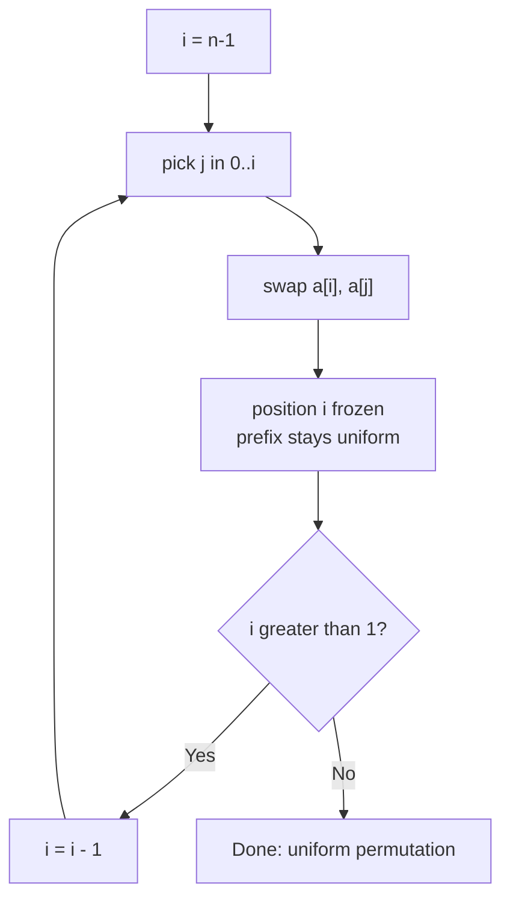

# Fisher-Yates Shuffle (Provably Unbiased)

| Meta | Value |
| --- | --- |
| Topic | Randomization / Shuffling |
| Difficulty | Easy–Medium |
| Time | $O(n)$ |
| Space | $O(1)$ extra |
| Key idea | Swap each suffix position with a uniform partner in the unshuffled prefix |

## Problem Statement

Given an array, produce a **uniformly random permutation** of its elements: every one of the $n!$ orderings must occur with probability exactly $\frac{1}{n!}$. Shuffle in place using $O(1)$ extra memory.

```text
Input:  [10, 20, 30, 40]
Output: one of the 4! = 24 permutations, each with probability 1/24
        e.g. [30, 10, 40, 20]
```

## Approach (WHY)

Walk from the last index $i = n-1$ down to $1$. At each step pick $j$ uniformly in the **inclusive** range $[0, i]$ and swap $a[i]$ with $a[j]$. This "freezes" the element at position $i$ — it is never touched again — while the prefix $a[0 \ldots i-1]$ remains a uniformly random arrangement of the not-yet-frozen elements.

**Uniformity proof.** Consider any target permutation $\pi$. Element that must land at position $n-1$: it sits somewhere in $[0, n-1]$ and is chosen with probability $\frac{1}{n}$. Given that, the element that must land at $n-2$ is chosen from the remaining $n-1$ with probability $\frac{1}{n-1}$, and so on. The probability of producing $\pi$ is

$$
\frac{1}{n} \cdot \frac{1}{n-1} \cdots \frac{1}{2} \cdot \frac{1}{1} = \frac{1}{n!}.
$$

Because this holds for *every* $\pi$ and there are exactly $n!$ of them summing to $1$, the distribution is uniform. The choice-sequences form a bijection with permutations: $n \cdot (n-1) \cdots 1 = n!$ sequences, $n!$ permutations.



The crucial contrast with the **biased naive shuffle** (random partner in $[0, n-1]$ every step): that generates $n^n$ equally likely choice-sequences, but $n^n$ is not divisible by $n!$ for $n \ge 3$, so by pigeonhole the permutations cannot all be equally likely.

$$
n^n \bmod n! \neq 0 \;\Rightarrow\; \text{some permutations strictly more likely.}
$$

## Implementation

```python
import random

def shuffle(a):
    """Uniformly random in-place shuffle (Fisher-Yates)."""
    n = len(a)
    for i in range(n - 1, 0, -1):
        j = random.randint(0, i)        # inclusive [0, i]
        a[i], a[j] = a[j], a[i]
    return a
```

```cpp
#include <bits/stdc++.h>
using namespace std;

mt19937_64 rng(chrono::steady_clock::now().time_since_epoch().count());

void shuffle_array(vector<long long>& a) {
    int n = (int)a.size();
    for (int i = n - 1; i > 0; --i) {
        uniform_int_distribution<int> dist(0, i); // inclusive [0, i]
        int j = dist(rng);
        swap(a[i], a[j]);
    }
}
```

### Empirical Uniformity Check

A quick way to *see* uniformity: shuffle many times and tally permutation frequencies — they converge to equal counts.

```python
from collections import Counter
import random

def empirical_check(trials=600000):
    counts = Counter()
    for _ in range(trials):
        a = [1, 2, 3]
        for i in range(len(a) - 1, 0, -1):
            j = random.randint(0, i)
            a[i], a[j] = a[j], a[i]
        counts[tuple(a)] += 1
    return counts   # all six entries ~ trials/6
```

```cpp
#include <bits/stdc++.h>
using namespace std;

mt19937_64 rng2(chrono::steady_clock::now().time_since_epoch().count());

map<vector<long long>, long long> empirical_check(long long trials = 600000) {
    map<vector<long long>, long long> counts;
    for (long long t = 0; t < trials; ++t) {
        vector<long long> a = {1, 2, 3};
        for (int i = (int)a.size() - 1; i > 0; --i) {
            uniform_int_distribution<int> dist(0, i);
            int j = dist(rng);
            swap(a[i], a[j]);
        }
        counts[a]++;            // all six entries approx trials/6
    }
    return counts;
}
```

## Trace

Shuffling `[10, 20, 30, 40]` with sampled choices $j = 1, 0, 1$:

```text
start:           [10, 20, 30, 40]
i=3, j=1 swap a3,a1 -> [10, 40, 30, 20]   (20 frozen at index 3)
i=2, j=0 swap a2,a0 -> [30, 40, 10, 20]   (10 frozen at index 2)
i=1, j=1 swap a1,a1 -> [30, 40, 10, 20]   (40 frozen at index 1)
i=0:             [30, 40, 10, 20]         (30 fixed)
result:          [30, 40, 10, 20]
```


## Complexity

- **Time:** $O(n)$ — a single pass with $O(1)$ work per index.
- **Space:** $O(1)$ extra — fully in place.
- **Quality:** Exactly uniform over all $n!$ permutations, assuming an unbiased RNG.

## Takeaway

Fisher-Yates is the canonical correct shuffle: always draw the swap partner from the **shrinking** range $[0, i]$, never the full array. The uniformity follows from a clean bijection between $n!$ choice-sequences and $n!$ permutations. Seed the RNG from the clock so results vary per run and resist prediction.
