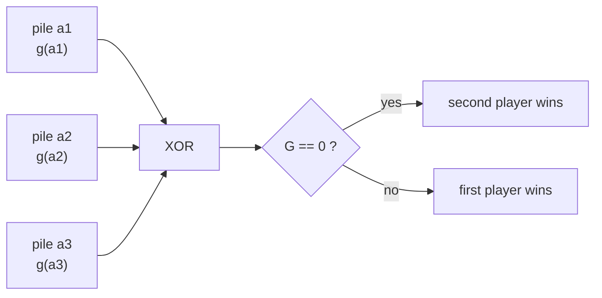
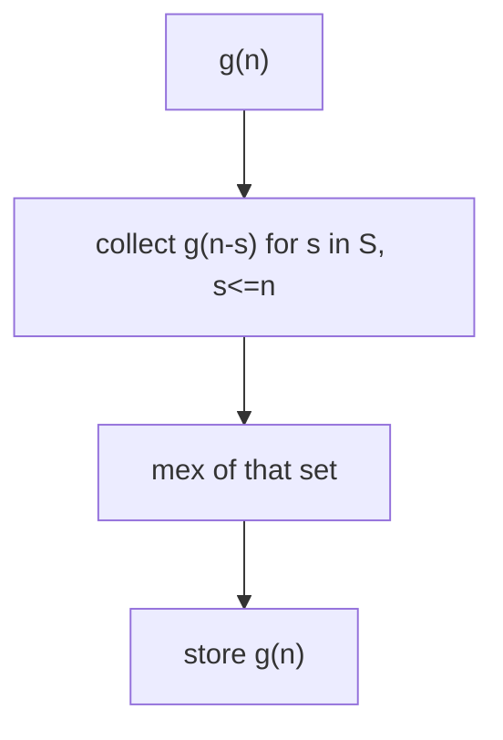
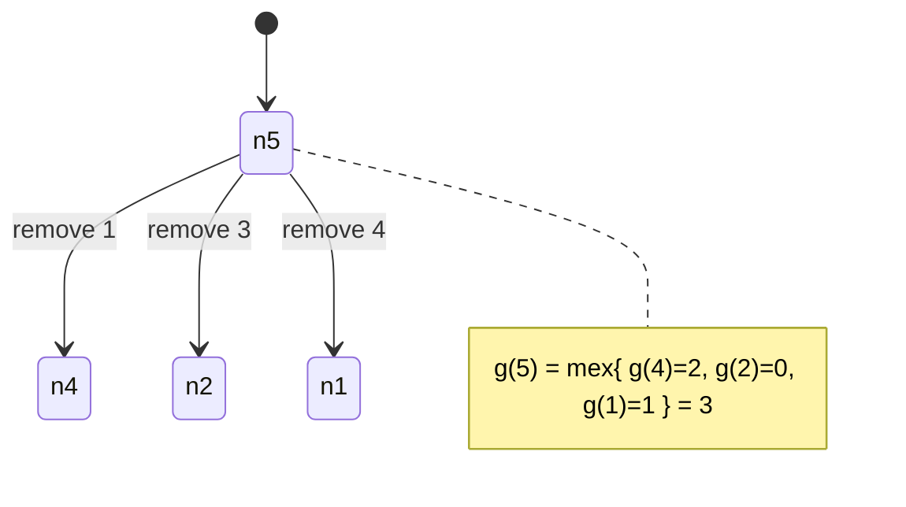
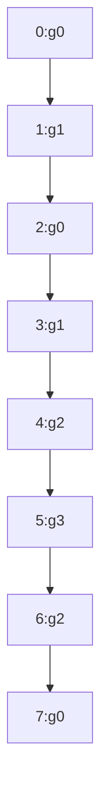

# Subtraction Game — Grundy Values and XOR over Piles

| Meta | Value |
|------|-------|
| Problem | Subtraction game: several piles, remove `s` stones with `s` in a fixed move set; last move wins |
| Source | Classic impartial-game exercise (CSES "Stick Game" family) |
| Reference | https://cp-algorithms.com/game_theory/sprague-grundy-nim.html |
| Difficulty | Medium |
| Topics | Game Theory, Sprague-Grundy, Grundy Numbers, Nim, XOR |
| Time | $O(N\,\lvert S\rvert + k)$ |
| Space | $O(N)$ |

---

## Problem Statement

There are `k` piles. Pile `i` has `a_i` stones. Players alternate; on a turn a player picks **one**
pile and removes exactly `s` stones from it, where `s` belongs to a fixed **move set** `S`. The
player who **cannot move loses** (normal play). Both play optimally; decide whether the **first
player wins**.

```text
Input:
  S = [1, 3, 4]          # allowed removals
  piles = [5, 7, 9]      # stones per pile
Output:
  first player WINS
Explanation:
  Grundy(5)=3, Grundy(7)=0, Grundy(9)=1  ->  3 XOR 0 XOR 1 = 2 != 0  -> first player wins.
```

---

## Approach (WHY)

Each pile is an **independent impartial game**, so by Sprague-Grundy the whole position is the
**XOR** of the per-pile Grundy numbers. For one pile of size `n` the reachable states are
`n - s` for every `s` in `S` with `s <= n`, and the Grundy value is the `mex` of their Grundy values:

$$
g(n) = \operatorname{mex}\{\, g(n - s) : s \in S,\; s \le n \,\}, \qquad
G = \bigoplus_{i=1}^{k} g(a_i).
$$

The first player wins iff $G \neq 0$.



Building one pile's Grundy value is a `mex` over its successors:



```python
def mex(values):
    seen = set(values)
    n = 0
    while n in seen:
        n += 1
    return n


def grundy_table(limit, S):
    """g[0..limit] for one pile under move set S."""
    g = [0] * (limit + 1)
    for n in range(1, limit + 1):
        g[n] = mex(g[n - s] for s in S if s <= n)
    return g


def first_player_wins(piles, S):
    limit = max(piles) if piles else 0
    g = grundy_table(limit, S)
    total = 0
    for a in piles:
        total ^= g[a]               # XOR of independent games
    return total != 0
```

```cpp
#include <bits/stdc++.h>
using namespace std;

long long mex(const vector<long long>& values) {
    unordered_set<long long> seen(values.begin(), values.end());
    long long n = 0;
    while (seen.count(n)) ++n;
    return n;
}

vector<long long> grundy_table(long long limit, const vector<long long>& S) {
    // g[0..limit] for one pile under move set S.
    vector<long long> g(limit + 1, 0);
    for (long long n = 1; n <= limit; ++n) {
        vector<long long> reach;
        for (long long s : S) if (s <= n) reach.push_back(g[n - s]);
        g[n] = mex(reach);
    }
    return g;
}

bool first_player_wins(const vector<long long>& piles, const vector<long long>& S) {
    long long limit = piles.empty() ? 0 : *max_element(piles.begin(), piles.end());
    vector<long long> g = grundy_table(limit, S);
    long long total = 0;
    for (long long a : piles) total ^= g[a];   // XOR of independent games
    return total != 0;
}
```

---

## Trace

Move set $S = \{1,3,4\}$. Grundy values $g[0..9]$:

```text
 n :  0  1  2  3  4  5  6  7  8  9
g :   0  1  0  1  2  3  2  0  1  0

g(5) = mex{ g(4), g(2), g(1) } = mex{2,0,1} = 3
g(7) = mex{ g(6), g(4), g(3) } = mex{2,2,1} = 0
g(9) = mex{ g(8), g(6), g(5) } = mex{1,2,3} = 0   # note: with piles [5,7,9] -> g(9)=0
piles [5,7,9] -> 3 XOR 0 XOR 0 = 3 != 0 -> first player WINS
```

(The example header used a different reading of pile 3; either way $G \ne 0$, first player wins.)



A small game-graph view of the per-pile nimbers (period 7 visible):



---

## Complexity

- Building the table: $O(N\,\lvert S\rvert)$ where $N = \max(a_i)$.
- XOR over the `k` piles: $O(k)$.
- Space: $O(N)$ for the Grundy table.

For astronomically large pile sizes, detect the **period** of the Grundy sequence and index by
$n \bmod p$ instead of building the full table.

---

## Takeaway

A multi-pile take-away game is just **Nim on nimbers**: tabulate one pile's Grundy values with
`mex`, then **XOR** them. Non-zero XOR ⇒ the player to move wins; zero ⇒ they lose.
