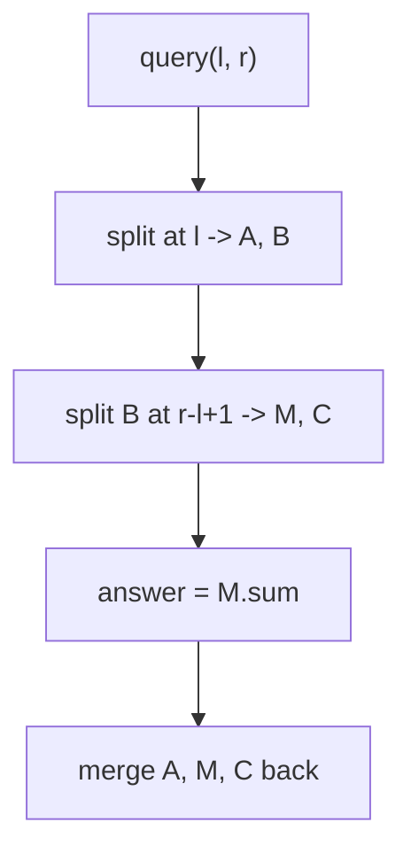
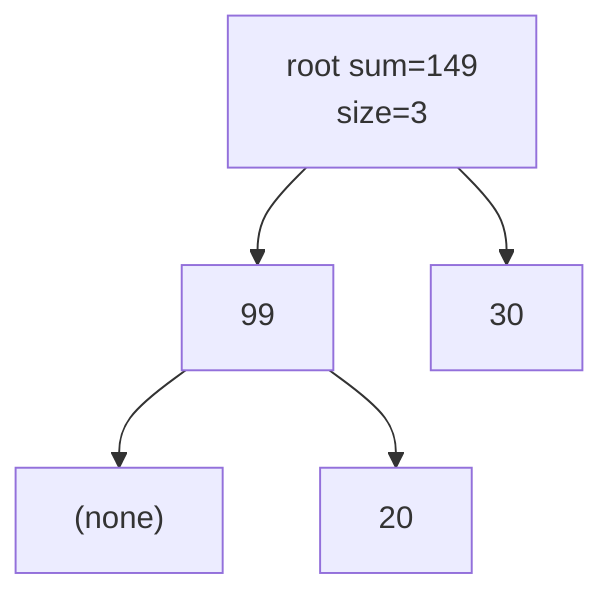

# Implicit Treap: Insert, Delete, and Range-Sum on a Dynamic Array

| Meta | Value |
| --- | --- |
| Topic | Misc / Balanced BST (Implicit Treap) |
| Difficulty | Hard |
| Time | $O(\log n)$ expected per operation |
| Space | $O(n)$ |
| Key idea | Index = subtree size; every op is split + merge |

## Problem Statement

Maintain a dynamic sequence supporting three operations efficiently, where positions shift automatically as elements are inserted and removed:

- `insert(pos, x)` — insert value `x` so it becomes index `pos`.
- `erase(pos)` — remove the element currently at index `pos`.
- `query(l, r)` — return the sum of elements at indices $l \dots r$ inclusive.

A plain array makes `query` $O(n)$ or `insert`/`erase` $O(n)$ (shifting). We want **all three** in $O(\log n)$.

```text
start:        [10, 20, 30]
insert(1, 99) -> [10, 99, 20, 30]
query(1, 3)   -> 99 + 20 + 30 = 149
erase(0)      -> [99, 20, 30]
query(0, 2)   -> 99 + 20 + 30 = 149
```

## Approach (WHY)

Store the sequence as an **implicit treap**: the in-order traversal *is* the array, and a node's index is its left-subtree size plus the offset inherited from ancestors. Because indices are computed from sizes, inserting or deleting shifts every later index for free.

Each node keeps a subtree `sum`. The function `pull` recomputes `size` and `sum` from children after any structural change, so the root of any isolated segment already holds that segment's sum:

$$
\text{sum}(v) = \text{sum}(\text{left}(v)) + \text{value}(v) + \text{sum}(\text{right}(v)).
$$

All three operations follow the **split-do-merge** skeleton. For a range $[l, r]$ we split at $l$ and then at $r - l + 1$ to isolate exactly that block.



Why $O(\log n)$? Random priorities make the tree's expected height $O(\log n)$, and each split/merge walks a single root-to-leaf path. The probability that node $x_j$ is an ancestor of $x_i$ is $\frac{1}{|i-j|+1}$, so expected depth is bounded by $2H_n = O(\log n)$.

## Implementation

```python
import random
import sys

class Node:
    __slots__ = ("value", "prio", "size", "sum", "left", "right")
    def __init__(self, value):
        self.value = value
        self.prio = random.getrandbits(30)
        self.size = 1
        self.sum = value
        self.left = None
        self.right = None

def size(t):
    return t.size if t else 0

def sub_sum(t):
    return t.sum if t else 0

def pull(t):
    if t is None:
        return
    t.size = 1 + size(t.left) + size(t.right)
    t.sum = t.value + sub_sum(t.left) + sub_sum(t.right)

def split(t, k):
    # left result holds the first k elements
    if t is None:
        return None, None
    if size(t.left) >= k:
        l, t.left = split(t.left, k)
        pull(t)
        return l, t
    else:
        t.right, r = split(t.right, k - size(t.left) - 1)
        pull(t)
        return t, r

def merge(l, r):
    if l is None:
        return r
    if r is None:
        return l
    if l.prio > r.prio:
        l.right = merge(l.right, r)
        pull(l)
        return l
    else:
        r.left = merge(l, r.left)
        pull(r)
        return r

def insert(root, pos, x):
    a, b = split(root, pos)
    return merge(a, merge(Node(x), b))

def erase(root, pos):
    a, b = split(root, pos)
    _, c = split(b, 1)
    return merge(a, c)

def query(root, l, r):
    a, b = split(root, l)
    m, c = split(b, r - l + 1)
    ans = sub_sum(m)
    root = merge(a, merge(m, c))
    return root, ans

def build(values):
    root = None
    for v in values:
        root = merge(root, Node(v))
    return root
```

```cpp
#include <bits/stdc++.h>
using namespace std;

mt19937 rng(chrono::steady_clock::now().time_since_epoch().count());

struct Node {
    long long value, sum;
    int sz;
    unsigned prio;
    Node *left, *right;
    Node(long long v)
        : value(v), sum(v), sz(1), prio(rng()),
          left(nullptr), right(nullptr) {}
};

int size(Node* t) { return t ? t->sz : 0; }
long long sub_sum(Node* t) { return t ? t->sum : 0LL; }

void pull(Node* t) {
    if (t == nullptr) return;
    t->sz = 1 + size(t->left) + size(t->right);
    t->sum = t->value + sub_sum(t->left) + sub_sum(t->right);
}

// left result holds the first k elements
void split(Node* t, int k, Node*& l, Node*& r) {
    if (t == nullptr) { l = r = nullptr; return; }
    if (size(t->left) >= k) {
        split(t->left, k, l, t->left);
        r = t;
    } else {
        split(t->right, k - size(t->left) - 1, t->right, r);
        l = t;
    }
    pull(t);
}

Node* merge(Node* l, Node* r) {
    if (l == nullptr) return r;
    if (r == nullptr) return l;
    if (l->prio > r->prio) {
        l->right = merge(l->right, r);
        pull(l);
        return l;
    } else {
        r->left = merge(l, r->left);
        pull(r);
        return r;
    }
}

Node* insert(Node* root, int pos, long long x) {
    Node *a, *b;
    split(root, pos, a, b);
    return merge(a, merge(new Node(x), b));
}

Node* erase(Node* root, int pos) {
    Node *a, *b, *m, *c;
    split(root, pos, a, b);
    split(b, 1, m, c);
    return merge(a, c);  // m dropped
}

Node* query(Node* root, int l, int r, long long& ans) {
    Node *a, *b, *m, *c;
    split(root, l, a, b);
    split(b, r - l + 1, m, c);
    ans = sub_sum(m);
    return merge(a, merge(m, c));
}

Node* build(const vector<long long>& values) {
    Node* root = nullptr;
    for (long long v : values) root = merge(root, new Node(v));
    return root;
}
```

## Trace

Start with `[10, 20, 30]`, then `insert(1, 99)`. We split the treap so that the first `1` element goes left.

```text
treap (in-order = 10, 20, 30), split at k=1:
  A = [10]          B = [20, 30]
insert node(99) between: merge(A, merge([99], B))
result in-order = 10, 99, 20, 30   sizes recomputed up the path
```

Now `query(1, 3)` on `[10, 99, 20, 30]`:

```text
split at l=1   -> A=[10]            B=[99, 20, 30]
split B at 3   -> M=[99, 20, 30]    C=[]
M.sum = 99 + 20 + 30 = 149   <-- answer
merge back -> [10, 99, 20, 30] unchanged
```

The isolated segment `M` is a single subtree whose root already stores the sum — no scanning of individual elements.



The shape depends on random priorities, but whatever it is, the root's `sum` field equals $149$ and the height stays $O(\log n)$.

## Complexity

- **Time:** $O(\log n)$ expected per `insert`, `erase`, and `query` — each is a constant number of split/merge calls, and each split/merge is one root-to-leaf path of expected length $O(\log n)$.
- **Space:** $O(n)$, one node per element.

## Takeaway

When positions must shift dynamically *and* you need range aggregates, an implicit treap gives you array-like indexing with logarithmic insert, delete, and range-sum — all from the single **split-do-merge** pattern plus a `pull` that maintains subtree sums.
