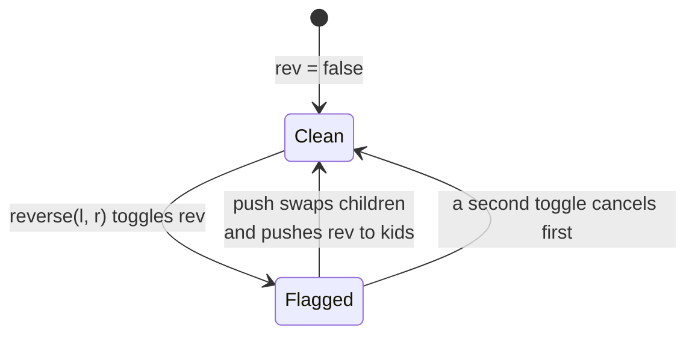
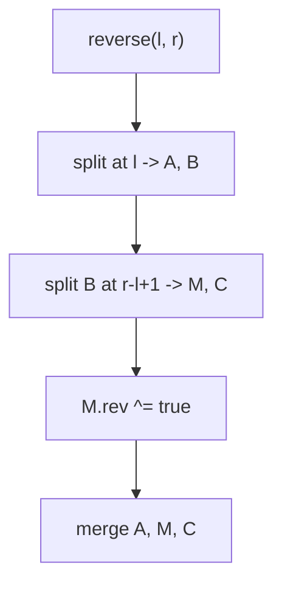
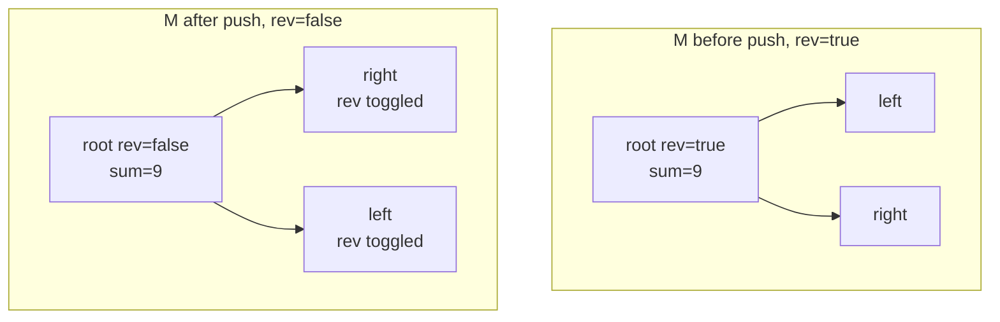

# Implicit Treap: Reverse a Subarray in Logarithmic Time

| Meta | Value |
| --- | --- |
| Topic | Misc / Balanced BST (Implicit Treap) |
| Difficulty | Hard |
| Time | $O(\log n)$ expected per operation |
| Space | $O(n)$ |
| Key idea | Range reverse = lazy swap-children flag |

## Problem Statement

Maintain a sequence under two interleaved operations:

- `reverse(l, r)` — reverse the order of elements at indices $l \dots r$ inclusive.
- `query(l, r)` — return the sum of elements at indices $l \dots r$ inclusive.

A naive reverse is $O(r - l)$, which is $O(n)$ per operation. We want **both** operations in $O(\log n)$, even when reverses and queries are mixed arbitrarily.

```text
start:          [1, 2, 3, 4, 5]
reverse(1, 3)   -> [1, 4, 3, 2, 5]
query(0, 4)     -> 1 + 4 + 3 + 2 + 5 = 15
reverse(0, 4)   -> [5, 2, 3, 4, 1]
query(1, 2)     -> 2 + 3 = 5
```

## Approach (WHY)

Reversing a contiguous block is exactly **swapping the left and right child of every node in that block** — but we do it **lazily**. Each node carries a boolean `rev` flag meaning "read my subtree in reversed order". Reversing a range is then just: isolate the segment with split-split, toggle `rev` on the segment's single root, and merge back.

$$
\text{reverse}(l, r) \;\equiv\; \text{toggle the swap-children flag on the segment root.}
$$

The flag is *paid off* by `push`, called before we descend into a node's children. `push` physically swaps the node's two children and XORs the flag into both, then clears its own:



Because subtree `sum` is symmetric (order-independent), reversing does **not** disturb the sum aggregate — `pull` still works unchanged. The discipline is strict: **`push` before recursing down, `pull` after coming back up**.



Correctness of the lazy swap: an in-order traversal that swaps children at a flagged node visits the right subtree first, the node, then the left subtree — exactly the reversed sequence. Toggling twice swaps twice, restoring the original, so XOR semantics are correct.

## Implementation

```python
import random

class Node:
    __slots__ = ("value", "prio", "size", "sum", "rev", "left", "right")
    def __init__(self, value):
        self.value = value
        self.prio = random.getrandbits(30)
        self.size = 1
        self.sum = value
        self.rev = False
        self.left = None
        self.right = None

def size(t):
    return t.size if t else 0

def sub_sum(t):
    return t.sum if t else 0

def pull(t):
    if t is None:
        return
    t.size = 1 + size(t.left) + size(t.right)
    t.sum = t.value + sub_sum(t.left) + sub_sum(t.right)

def push(t):
    if t is None or not t.rev:
        return
    t.left, t.right = t.right, t.left   # swap children
    if t.left:
        t.left.rev ^= True
    if t.right:
        t.right.rev ^= True
    t.rev = False

def split(t, k):
    if t is None:
        return None, None
    push(t)
    if size(t.left) >= k:
        l, t.left = split(t.left, k)
        pull(t)
        return l, t
    else:
        t.right, r = split(t.right, k - size(t.left) - 1)
        pull(t)
        return t, r

def merge(l, r):
    if l is None:
        return r
    if r is None:
        return l
    if l.prio > r.prio:
        push(l)
        l.right = merge(l.right, r)
        pull(l)
        return l
    else:
        push(r)
        r.left = merge(l, r.left)
        pull(r)
        return r

def reverse(root, l, r):
    a, b = split(root, l)
    m, c = split(b, r - l + 1)
    if m:
        m.rev ^= True
    return merge(a, merge(m, c))

def query(root, l, r):
    a, b = split(root, l)
    m, c = split(b, r - l + 1)
    ans = sub_sum(m)
    root = merge(a, merge(m, c))
    return root, ans

def build(values):
    root = None
    for v in values:
        root = merge(root, Node(v))
    return root
```

```cpp
#include <bits/stdc++.h>
using namespace std;

mt19937 rng(chrono::steady_clock::now().time_since_epoch().count());

struct Node {
    long long value, sum;
    int sz;
    unsigned prio;
    bool rev;
    Node *left, *right;
    Node(long long v)
        : value(v), sum(v), sz(1), prio(rng()), rev(false),
          left(nullptr), right(nullptr) {}
};

int size(Node* t) { return t ? t->sz : 0; }
long long sub_sum(Node* t) { return t ? t->sum : 0LL; }

void pull(Node* t) {
    if (t == nullptr) return;
    t->sz = 1 + size(t->left) + size(t->right);
    t->sum = t->value + sub_sum(t->left) + sub_sum(t->right);
}

void push(Node* t) {
    if (t == nullptr || !t->rev) return;
    swap(t->left, t->right);             // swap children
    if (t->left)  t->left->rev  ^= true;
    if (t->right) t->right->rev ^= true;
    t->rev = false;
}

void split(Node* t, int k, Node*& l, Node*& r) {
    if (t == nullptr) { l = r = nullptr; return; }
    push(t);
    if (size(t->left) >= k) {
        split(t->left, k, l, t->left);
        r = t;
    } else {
        split(t->right, k - size(t->left) - 1, t->right, r);
        l = t;
    }
    pull(t);
}

Node* merge(Node* l, Node* r) {
    if (l == nullptr) return r;
    if (r == nullptr) return l;
    if (l->prio > r->prio) {
        push(l);
        l->right = merge(l->right, r);
        pull(l);
        return l;
    } else {
        push(r);
        r->left = merge(l, r->left);
        pull(r);
        return r;
    }
}

Node* reverse_range(Node* root, int l, int r) {
    Node *a, *b, *m, *c;
    split(root, l, a, b);
    split(b, r - l + 1, m, c);
    if (m) m->rev ^= true;
    return merge(a, merge(m, c));
}

Node* query(Node* root, int l, int r, long long& ans) {
    Node *a, *b, *m, *c;
    split(root, l, a, b);
    split(b, r - l + 1, m, c);
    ans = sub_sum(m);
    return merge(a, merge(m, c));
}

Node* build(const vector<long long>& values) {
    Node* root = nullptr;
    for (long long v : values) root = merge(root, new Node(v));
    return root;
}
```

## Trace

Start `[1, 2, 3, 4, 5]`, do `reverse(1, 3)`.

```text
split at l=1      -> A=[1]           B=[2,3,4,5]
split B at 3      -> M=[2,3,4]       C=[5]
M.rev ^= true     -> M now "read reversed" lazily (no element moved yet)
merge A, M, C     -> logical array [1, 4, 3, 2, 5]
```

The flag sits on `M`'s root. It is only resolved when a later `split`/`query` descends into `M` and calls `push`, swapping children one level at a time:

```text
later query(0, 4) descends; push on M swaps its children:
  before push:  root=? (rev=true), reads as 2,3,4
  after push:   children swapped, flag XORed down, reads as 4,3,2
sum is unaffected by reversal: 2+3+4 = 4+3+2 = 9
```



`query(0, 4)` returns $1 + 4 + 3 + 2 + 5 = 15$, reading the root's `sum` of the isolated whole segment.

## Complexity

- **Time:** $O(\log n)$ expected per `reverse` and per `query`. Each is a constant number of split/merge operations, each an $O(\log n)$ root-to-leaf path. The lazy flag turns an $O(n)$ reversal into a single $O(1)$ tag plus the $O(\log n)$ split cost.
- **Space:** $O(n)$ nodes, $O(1)$ extra per node for the flag.

## Takeaway

Range reverse is the signature implicit-treap trick: instead of moving elements, mark the segment root with a **swap-children lazy flag** and let `push` unfold it lazily. Because the sum aggregate is order-independent, range-sum coexists with range-reverse for free.
