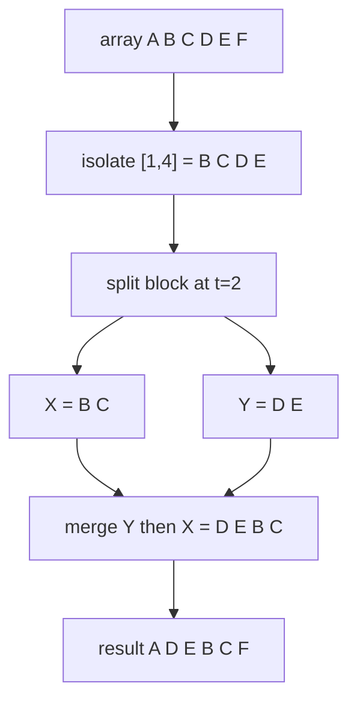
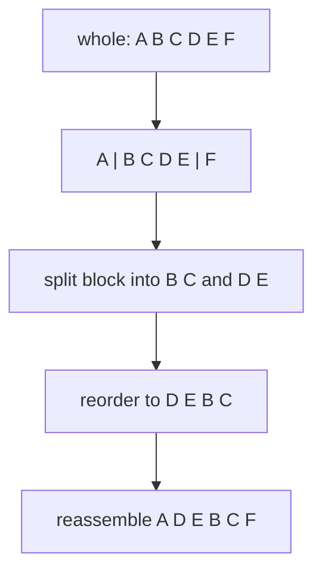

# Implicit Treap: Cyclically Rotate / Cut-and-Paste a Subarray

| Meta | Value |
| --- | --- |
| Topic | Misc / Balanced BST (Implicit Treap) |
| Difficulty | Hard |
| Time | $O(\log n)$ expected per operation |
| Space | $O(n)$ |
| Key idea | Block moves are pure split + merge, no per-element work |

## Problem Statement

Maintain a sequence supporting block-relocation operations in logarithmic time:

- `rotate_left(l, r, t)` — cyclically rotate the subarray at indices $l \dots r$ to the left by $t$ positions.
- `cut_paste(l, r, p)` — remove the block $l \dots r$ and reinsert it so it begins just before the element originally at index $p$ ($p$ lies outside $[l, r]$).

Both naively cost $O(\text{block length})$ because they shift many elements. With an implicit treap they cost $O(\log n)$ regardless of block size.

```text
start:                 [A, B, C, D, E, F]   (indices 0..5)
rotate_left(1, 4, 2)   -> [A, D, E, B, C, F]
cut_paste(1, 2, 5)     -> move [D, E] before original index 5
                          intermediate [A, B, C, F] + block [D, E]
                          result [A, B, C, D, E, F] depends on paste anchor
```

## Approach (WHY)

Every relocation is the **split-do-merge** skeleton with no per-element work — splits and merges relabel implicit indices automatically.

**Rotate left by $t$.** Isolate the segment $M$ for $[l, r]$, then split $M$ into its first $t$ elements $X$ and the remainder $Y$. Re-merge as $Y$ then $X$:

$$
[\,\underbrace{m_0 \dots m_{t-1}}_{X}\;\underbrace{m_t \dots m_{r-l}}_{Y}\,] \;\longrightarrow\; [\,Y\;X\,].
$$

Reduce $t$ modulo the block length first, since rotating by the length is a no-op.

**Cut-and-paste.** Split out the block, then split the remaining sequence at the paste anchor and merge the block in between. Because removing the block shifts later indices, compute the anchor against the *remaining* sequence.



Why $O(\log n)$? Each `rotate_left` is at most four splits and three merges; each `cut_paste` is a similar constant count. Every split/merge is one root-to-leaf path of expected length $O(\log n)$ thanks to the random priorities, whose ancestor probability $\frac{1}{|i-j|+1}$ bounds expected depth by $2H_n$.

## Implementation

```python
import random

class Node:
    __slots__ = ("value", "prio", "size", "sum", "left", "right")
    def __init__(self, value):
        self.value = value
        self.prio = random.getrandbits(30)
        self.size = 1
        self.sum = value
        self.left = None
        self.right = None

def size(t):
    return t.size if t else 0

def sub_sum(t):
    return t.sum if t else 0

def pull(t):
    if t is None:
        return
    t.size = 1 + size(t.left) + size(t.right)
    t.sum = t.value + sub_sum(t.left) + sub_sum(t.right)

def split(t, k):
    # left result holds the first k elements
    if t is None:
        return None, None
    if size(t.left) >= k:
        l, t.left = split(t.left, k)
        pull(t)
        return l, t
    else:
        t.right, r = split(t.right, k - size(t.left) - 1)
        pull(t)
        return t, r

def merge(l, r):
    if l is None:
        return r
    if r is None:
        return l
    if l.prio > r.prio:
        l.right = merge(l.right, r)
        pull(l)
        return l
    else:
        r.left = merge(l, r.left)
        pull(r)
        return r

def rotate_left(root, l, r, t):
    length = r - l + 1
    t %= length
    if t == 0:
        return root
    a, b = split(root, l)
    m, c = split(b, length)
    x, y = split(m, t)            # X = first t, Y = the rest
    rotated = merge(y, x)         # paste Y before X
    return merge(a, merge(rotated, c))

def cut_paste(root, l, r, p):
    length = r - l + 1
    a, b = split(root, l)
    block, rest = split(b, length)   # block = [l..r], rest = the tail
    remainder = merge(a, rest)       # sequence with block removed
    anchor = p if p < l else p - length
    head, tail = split(remainder, anchor)
    return merge(head, merge(block, tail))

def build(values):
    root = None
    for v in values:
        root = merge(root, Node(v))
    return root

def to_list(t, out):
    if t is None:
        return
    to_list(t.left, out)
    out.append(t.value)
    to_list(t.right, out)
```

```cpp
#include <bits/stdc++.h>
using namespace std;

mt19937 rng(chrono::steady_clock::now().time_since_epoch().count());

struct Node {
    long long value, sum;
    int sz;
    unsigned prio;
    Node *left, *right;
    Node(long long v)
        : value(v), sum(v), sz(1), prio(rng()),
          left(nullptr), right(nullptr) {}
};

int size(Node* t) { return t ? t->sz : 0; }
long long sub_sum(Node* t) { return t ? t->sum : 0LL; }

void pull(Node* t) {
    if (t == nullptr) return;
    t->sz = 1 + size(t->left) + size(t->right);
    t->sum = t->value + sub_sum(t->left) + sub_sum(t->right);
}

// left result holds the first k elements
void split(Node* t, int k, Node*& l, Node*& r) {
    if (t == nullptr) { l = r = nullptr; return; }
    if (size(t->left) >= k) {
        split(t->left, k, l, t->left);
        r = t;
    } else {
        split(t->right, k - size(t->left) - 1, t->right, r);
        l = t;
    }
    pull(t);
}

Node* merge(Node* l, Node* r) {
    if (l == nullptr) return r;
    if (r == nullptr) return l;
    if (l->prio > r->prio) {
        l->right = merge(l->right, r);
        pull(l);
        return l;
    } else {
        r->left = merge(l, r->left);
        pull(r);
        return r;
    }
}

Node* rotate_left(Node* root, int l, int r, int t) {
    int length = r - l + 1;
    t %= length;
    if (t == 0) return root;
    Node *a, *b, *m, *c, *x, *y;
    split(root, l, a, b);
    split(b, length, m, c);
    split(m, t, x, y);             // X = first t, Y = the rest
    Node* rotated = merge(y, x);   // paste Y before X
    return merge(a, merge(rotated, c));
}

Node* cut_paste(Node* root, int l, int r, int p) {
    int length = r - l + 1;
    Node *a, *b, *block, *rest;
    split(root, l, a, b);
    split(b, length, block, rest);    // block = [l..r]
    Node* remainder = merge(a, rest); // block removed
    int anchor = (p < l) ? p : p - length;
    Node *head, *tail;
    split(remainder, anchor, head, tail);
    return merge(head, merge(block, tail));
}

Node* build(const vector<long long>& values) {
    Node* root = nullptr;
    for (long long v : values) root = merge(root, new Node(v));
    return root;
}

void to_list(Node* t, vector<long long>& out) {
    if (t == nullptr) return;
    to_list(t->left, out);
    out.push_back(t->value);
    to_list(t->right, out);
}
```

## Trace

Start `[A, B, C, D, E, F]`, do `rotate_left(1, 4, 2)` (block `B C D E`, shift 2).

```text
split at l=1        -> A=[A]            b=[B,C,D,E,F]
split b at len=4    -> M=[B,C,D,E]      c=[F]
split M at t=2      -> X=[B,C]          Y=[D,E]
rotated = merge(Y, X) = [D, E, B, C]
merge(a, rotated, c) -> [A, D, E, B, C, F]
```

The tree shape changes only along the few paths touched by the splits and merges; the bulk of each subtree (the pointers `X`, `Y`, `a`, `c`) is re-attached in $O(1)$ each.



A subsequent `cut_paste(1, 2, 5)` on `[A, D, E, B, C, F]` removes `[D, E]`, leaving `[A, B, C, F]`, then re-inserts before the adjusted anchor `5 - 2 = 3`, producing `[A, B, C, D, E, F]`.

## Complexity

- **Time:** $O(\log n)$ expected per `rotate_left` and per `cut_paste` — a constant number of $O(\log n)$ split/merge calls each. Crucially, the cost is **independent of the block length**.
- **Space:** $O(n)$ nodes; the operations rewire existing nodes rather than allocating per element.

## Takeaway

Moving a block of a sequence — rotating it or cutting and pasting it elsewhere — is pure pointer surgery on an implicit treap. Splits and merges relabel positions implicitly, so relocating a thousand-element block costs the same $O(\log n)$ as relocating one.
