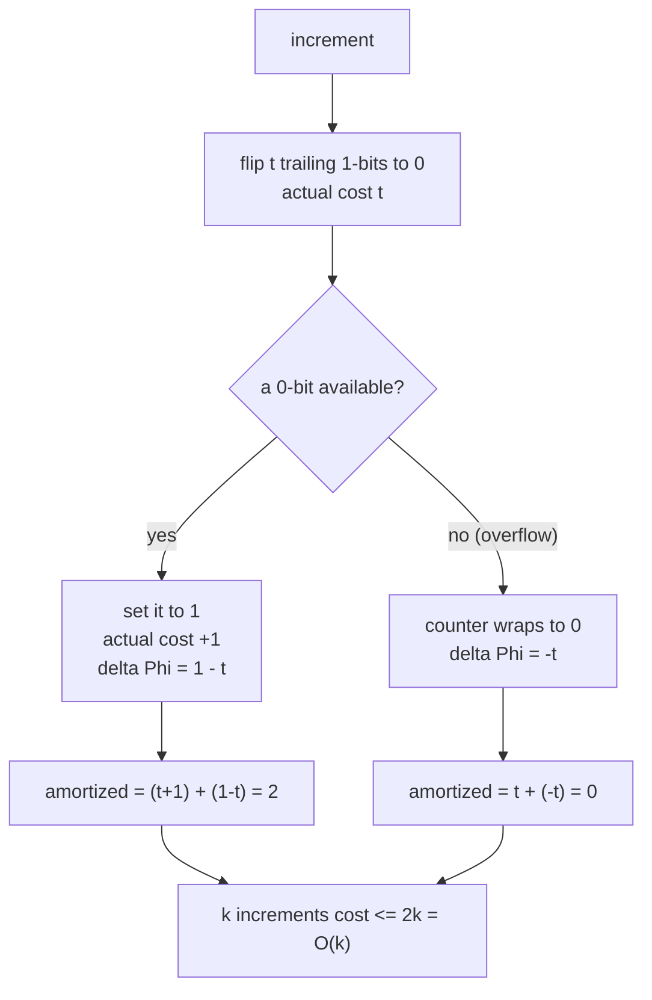
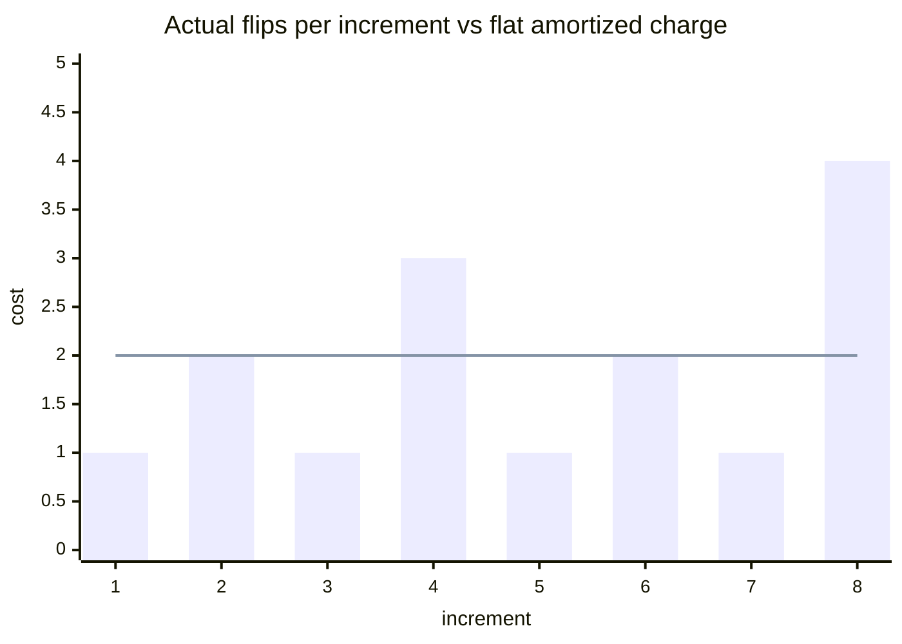

# Binary Counter Increment Costs O(k) for k Increments

| Meta | Value |
| --- | --- |
| Topic | Amortization &amp; Potential Arguments |
| Module | misc |
| Difficulty | Easy-Medium |
| Technique | Potential method + aggregate |
| Key idea | $\Phi = $ number of 1-bits |

## Problem Statement

A binary counter is an array of bits, least-significant first, initially all zero. The operation `increment` adds 1: it flips a run of trailing 1-bits to 0, then sets the first 0-bit to 1. The **actual cost** of an increment is the number of bits it flips. A single increment can flip up to $\Theta(b)$ bits (where $b$ is the counter width), so $k$ increments look like $O(kb)$. **Prove that performing $k$ increments starting from zero costs $O(k)$ total** — the amortized cost per increment is $O(1)$, independent of the width.

```text
Counter starts at 0000 (4 bits shown, LSB on the left of the value below).

value 0 = 000  increment -> 001   flips 1   (set bit 0)
value 1 = 001  increment -> 010   flips 2   (clear bit 0, set bit 1)
value 2 = 010  increment -> 011   flips 1   (set bit 0)
value 3 = 011  increment -> 100   flips 3   (clear bits 0,1, set bit 2)
value 4 = 100  increment -> 101   flips 1
value 5 = 101  increment -> 110   flips 2
value 6 = 110  increment -> 111   flips 1
value 7 = 111  increment -> 000   flips 4   (carry overflow within width)

Naive bound: k * b (each increment up to b flips)
Claim:       total flips < 2k = O(k)
```

## Approach (WHY)

**Potential method.** Let $\Phi = b_i$, the number of bits currently set to 1. Both requirements hold: $\Phi_0 = 0$ (counter starts at all zeros) and $\Phi_i \ge 0$ always.

Consider an increment that flips $t$ trailing 1-bits to 0 and then sets one 0-bit to 1 (this last set happens unless the whole counter overflows). The **actual cost** is

$$c_i = t + 1.$$

The number of set bits decreases by $t$ (the cleared ones) and increases by $1$ (the newly set bit), so

$$\Delta\Phi = \Phi_i - \Phi_{i-1} = 1 - t.$$

Therefore the **amortized cost** is

$$\hat{c}_i = c_i + \Delta\Phi = (t + 1) + (1 - t) = 2 = O(1).$$

Summing over $k$ increments and telescoping:

$$\sum_{i=1}^{k} c_i = \sum_{i=1}^{k} \hat{c}_i - \Phi_k + \Phi_0 \le 2k = O(k).$$

(If an overflow increment sets no new bit, then $c_i = t$ and $\Delta\Phi = -t$, giving $\hat{c}_i = 0 \le 2$ — still bounded, the inequality only gets stronger.)

**Aggregate cross-check.** Bit $0$ flips on every increment; bit $1$ flips every 2nd increment; bit $j$ flips every $2^j$-th increment. Total flips over $k$ increments:

$$\sum_{j \ge 0} \left\lfloor \frac{k}{2^j} \right\rfloor < k \sum_{j=0}^{\infty} \frac{1}{2^j} = 2k.$$

Both methods independently give $O(k)$.



## Implementation

```python
def increment(bits):
    """bits: list of 0/1, least significant first. Returns number of flips."""
    flips = 0
    i = 0
    while i < len(bits) and bits[i] == 1:
        bits[i] = 0            # clear a trailing 1
        flips += 1
        i += 1
    if i < len(bits):
        bits[i] = 1            # set the first available 0
        flips += 1
    return flips              # amortized cost is 2

def total_flips(width, k):
    """Run k increments on a fresh counter; return total actual flips."""
    bits = [0] * width
    total = 0
    for _ in range(k):
        total += increment(bits)
    return total             # guaranteed < 2 * k
```

```cpp
#include <bits/stdc++.h>
using namespace std;

long long increment(vector<int>& bits) {
    // bits: 0/1, least significant first. Returns number of flips.
    long long flips = 0;
    size_t i = 0;
    while (i < bits.size() && bits[i] == 1) {
        bits[i] = 0;          // clear a trailing 1
        flips += 1;
        i += 1;
    }
    if (i < bits.size()) {
        bits[i] = 1;          // set the first available 0
        flips += 1;
    }
    return flips;             // amortized cost is 2
}

long long total_flips(long long width, long long k) {
    // Run k increments on a fresh counter; return total actual flips.
    vector<int> bits(width, 0);
    long long total = 0;
    for (long long i = 0; i < k; ++i) total += increment(bits);
    return total;             // guaranteed < 2 * k
}
```

## Trace: Actual vs Amortized Cost

Eight increments on a 4-bit counter starting at 0. `flips` $= c_i$, $\Phi_i$ = set bits after, $\Delta\Phi = 1 - t$, amortized $\hat{c}_i = c_i + \Delta\Phi$:

| Increment | value before | bits flipped $t{+}1$ ($c_i$) | $\Phi_i$ (set bits) | $\Delta\Phi$ | amortized $\hat{c}_i$ | $\sum c$ | $\sum \hat{c}$ |
| --- | --- | --- | --- | --- | --- | --- | --- |
| 1 | 0000 | 1 | 1 | +1 | 2 | 1 | 2 |
| 2 | 0001 | 2 | 1 | 0  | 2 | 3 | 4 |
| 3 | 0010 | 1 | 2 | +1 | 2 | 4 | 6 |
| 4 | 0011 | 3 | 1 | -1 | 2 | 7 | 8 |
| 5 | 0100 | 1 | 2 | +1 | 2 | 8 | 10 |
| 6 | 0101 | 2 | 2 | 0  | 2 | 10 | 12 |
| 7 | 0110 | 1 | 3 | +1 | 2 | 11 | 14 |
| 8 | 0111 | 4 | 1 | -3 | 2 | 15 | 16 |

Total actual flips = 15 for $k = 8$, safely under $2k = 16$. Every amortized charge is exactly 2, and $\sum \hat{c} - \sum c = \Phi_k \ge 0$ at every step. The expensive increment 8 (flips 4) is fully paid by potential released from the three set bits it clears.



The bars (actual flips) spike whenever a long carry chain propagates; the flat line at 2 (amortized) always dominates the cumulative actual cost.

## Complexity

| Measure | Value |
| --- | --- |
| Single `increment` (worst case) | $O(b)$ ($b$ = counter width) |
| `increment` amortized | $O(1)$ (exactly 2) |
| $k$ increments total | $O(k)$ |
| Extra space | $O(b)$ for the bit array |

## Takeaway

Bit $j$ only flips once per $2^j$ increments, so high bits flip geometrically rarely. With $\Phi = $ number of set bits, every increment has amortized cost exactly 2 — the $t$ trailing clears are prepaid by the potential those bits banked when they were set. Hence $k$ increments cost $O(k)$ total regardless of counter width, and the aggregate geometric-series sum confirms the same $< 2k$ bound.
