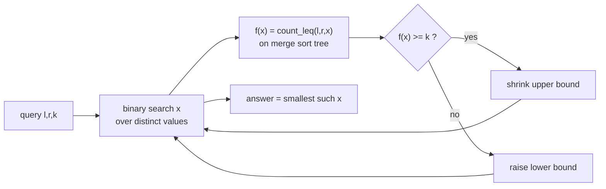
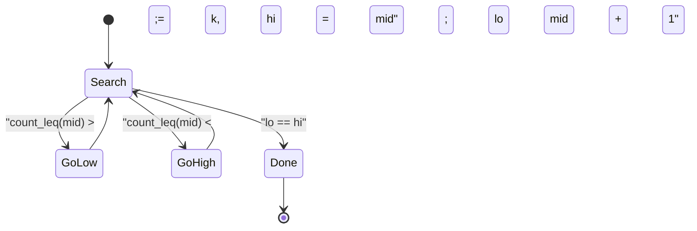
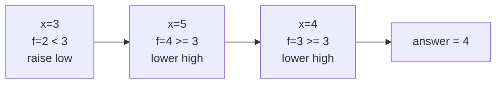

# K-th Smallest in a Range (Merge Sort Tree)

| Meta | Value |
| --- | --- |
| Topic | Merge sort tree |
| Technique | Segment tree of sorted lists + binary search on the answer |
| Queries | Online, no updates |
| Time | $O(n\log n)$ build, $O(\log V\,\log^2 n)$ per query |
| Space | $O(n\log n)$ |

## Problem Statement

You are given a static array `a` of length `n`. Answer many queries `(l, r, k)`: **return the k-th smallest value in `a[l..r]`** (1-indexed `k`, so `k = 1` is the minimum of the subarray). Indices are inclusive and 0-indexed; the array never changes.

```text
a = [5, 2, 6, 1, 4, 3]   (indices 0..5)

query (l=0, r=4, k=3): subarray [5,2,6,1,4] sorted = [1,2,4,5,6], 3rd -> 4
query (l=1, r=5, k=1): subarray [2,6,1,4,3] sorted = [1,2,3,4,6], 1st -> 1
query (l=0, r=5, k=6): full array sorted     = [1,2,3,4,5,6], 6th -> 6
```

## Approach (WHY)

Define $f(x) = $ the count of elements in `a[l..r]` that are `<= x`. As $x$ increases, $f$ never decreases, so $f$ is **monotone**. The k-th smallest value is the **smallest value $x$ for which $f(x) \ge k$**:

$$\text{kth}(l, r, k) = \min\{\, x : f(x) \ge k \,\}, \qquad f(x) = \big|\{\, i \in [l, r] : a_i \le x \,\}\big|.$$

We binary search $x$ over the sorted distinct values of the array. Each candidate $x$ is evaluated with a **count-leq query on a merge sort tree** (a segment tree whose nodes store sorted lists), which costs $O(\log^2 n)$. With $O(\log V)$ binary search steps over the $V$ distinct values, a query costs $O(\log V\,\log^2 n)$.





## Code

```python
from bisect import bisect_right

class KthMergeSortTree:
    def __init__(self, a):
        self.n = len(a)
        self.tree = [[] for _ in range(4 * self.n)]
        self.vals = sorted(set(a))         # distinct values for the search
        self._build(1, 0, self.n - 1, a)

    def _build(self, node, lo, hi, a):
        if lo == hi:
            self.tree[node] = [a[lo]]
            return
        mid = (lo + hi) // 2
        self._build(2 * node, lo, mid, a)
        self._build(2 * node + 1, mid + 1, hi, a)
        left, right = self.tree[2 * node], self.tree[2 * node + 1]
        merged, i, j = [], 0, 0
        while i < len(left) and j < len(right):
            if left[i] <= right[j]:
                merged.append(left[i]); i += 1
            else:
                merged.append(right[j]); j += 1
        merged.extend(left[i:]); merged.extend(right[j:])
        self.tree[node] = merged

    def _count_leq(self, node, lo, hi, l, r, x):
        if hi < l or lo > r:
            return 0
        if l <= lo and hi <= r:
            return bisect_right(self.tree[node], x)
        mid = (lo + hi) // 2
        return (self._count_leq(2 * node, lo, mid, l, r, x) +
                self._count_leq(2 * node + 1, mid + 1, hi, l, r, x))

    def kth_smallest(self, l, r, k):       # 1-indexed k
        lo, hi = 0, len(self.vals) - 1
        while lo < hi:
            mid = (lo + hi) // 2
            c = self._count_leq(1, 0, self.n - 1, l, r, self.vals[mid])
            if c >= k:
                hi = mid
            else:
                lo = mid + 1
        return self.vals[lo]

if __name__ == "__main__":
    t = KthMergeSortTree([5, 2, 6, 1, 4, 3])
    print(t.kth_smallest(0, 4, 3))  # 4
    print(t.kth_smallest(1, 5, 1))  # 1
    print(t.kth_smallest(0, 5, 6))  # 6
```

```cpp
#include <bits/stdc++.h>
using namespace std;

struct KthMergeSortTree {
    int n;
    vector<vector<long long>> tree;
    vector<long long> vals;                 // distinct values for the search

    KthMergeSortTree(const vector<long long>& a) {
        n = (int)a.size();
        tree.assign(4 * n, {});
        vals = a;
        sort(vals.begin(), vals.end());
        vals.erase(unique(vals.begin(), vals.end()), vals.end());
        build(1, 0, n - 1, a);
    }

    void build(int node, int lo, int hi, const vector<long long>& a) {
        if (lo == hi) {
            tree[node] = {a[lo]};
            return;
        }
        int mid = (lo + hi) / 2;
        build(2 * node, lo, mid, a);
        build(2 * node + 1, mid + 1, hi, a);
        const auto& left = tree[2 * node];
        const auto& right = tree[2 * node + 1];
        tree[node].resize(left.size() + right.size());
        merge(left.begin(), left.end(), right.begin(), right.end(),
              tree[node].begin());
    }

    long long count_leq(int node, int lo, int hi, int l, int r, long long x) {
        if (hi < l || lo > r) return 0;
        if (l <= lo && hi <= r)
            return upper_bound(tree[node].begin(), tree[node].end(), x)
                   - tree[node].begin();
        int mid = (lo + hi) / 2;
        return count_leq(2 * node, lo, mid, l, r, x) +
               count_leq(2 * node + 1, mid + 1, hi, l, r, x);
    }

    long long kth_smallest(int l, int r, long long k) {  // 1-indexed k
        int lo = 0, hi = (int)vals.size() - 1;
        while (lo < hi) {
            int mid = (lo + hi) / 2;
            long long c = count_leq(1, 0, n - 1, l, r, vals[mid]);
            if (c >= k) hi = mid;
            else lo = mid + 1;
        }
        return vals[lo];
    }
};

int main() {
    KthMergeSortTree t({5, 2, 6, 1, 4, 3});
    cout << t.kth_smallest(0, 4, 3) << "\n";  // 4
    cout << t.kth_smallest(1, 5, 1) << "\n";  // 1
    cout << t.kth_smallest(0, 5, 6) << "\n";  // 6
    return 0;
}
```

## Trace

`a = [5, 2, 6, 1, 4, 3]`, query `(l=0, r=4, k=3)`. Distinct values `vals = [1, 2, 3, 4, 5, 6]`, indices `0..5`.

Each evaluation of `count_leq(0, 4, x)` splits `[0,4]` into covering nodes `[0,2]` (sorted `[2,5,6]`) and `[3,4]` (sorted `[1,4]`).

| step | lo..hi | mid val `x` | `[0,2]` upper_bound(x) | `[3,4]` upper_bound(x) | f(x) | f(x) &gt;= 3 ? | move |
| --- | --- | --- | --- | --- | --- | --- | --- |
| 1 | 0..5 | vals[2]=3 | 1 | 1 | 2 | no | lo = 3 |
| 2 | 3..5 | vals[4]=5 | 2 | 2 | 4 | yes | hi = 4 |
| 3 | 3..4 | vals[3]=4 | 1 | 2 | 3 | yes | hi = 3 |

Now `lo == hi == 3`, so the answer is `vals[3] = 4`. ✔ (sorted subarray `[1,2,4,5,6]`, 3rd element is `4`.)



## Complexity

- **Build**: $O(n\log n)$ time and $O(n\log n)$ space.
- **Per query**: $O(\log V\,\log^2 n)$ — $O(\log V)$ binary search steps over distinct values, each an $O(\log^2 n)$ count-leq query. This is often written $O(\log^3 n)$.
- **Recursion stack**: $O(\log n)$.

## Takeaway

A range k-th smallest reduces to "find the smallest value whose count-leq reaches `k`". Because count-leq is monotone in the threshold, binary search the value and answer each candidate with a merge sort tree count query. It is a little slower than a persistent segment tree's $O(\log n)$ k-th, but far simpler to write — essentially a binary search wrapped around `bisect`.
