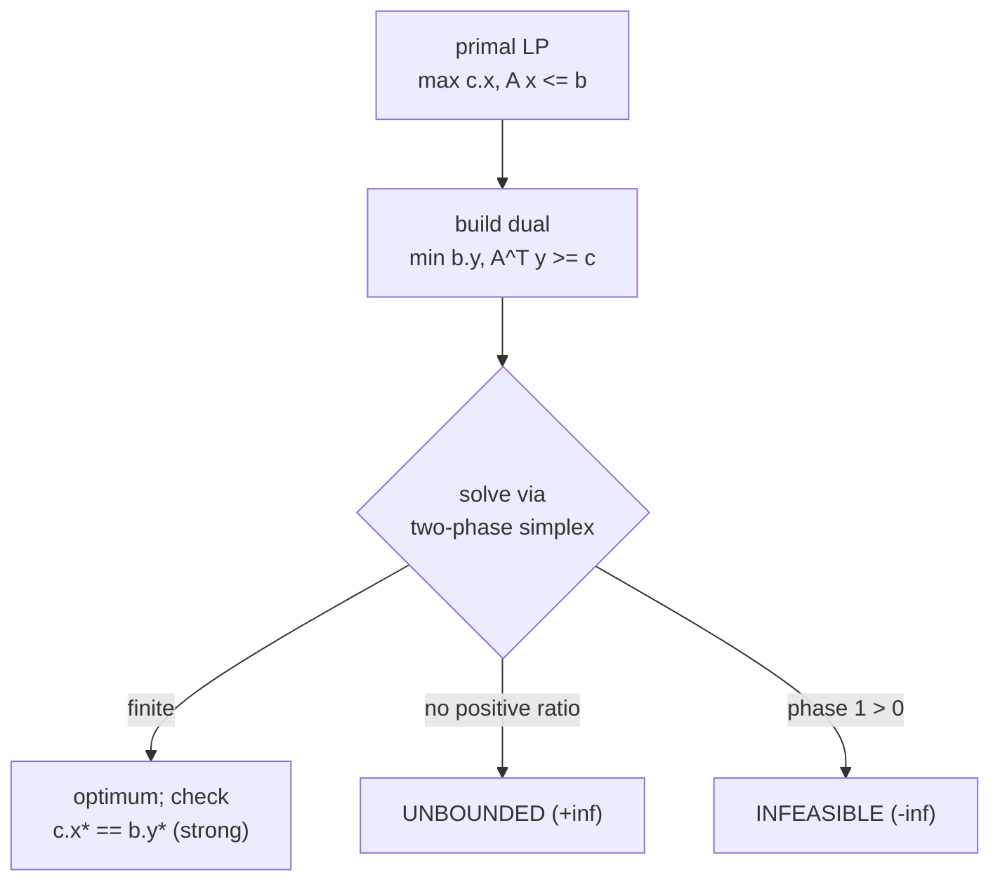
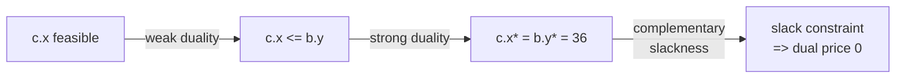

# LP Duality, Weak Duality, and Feasibility Detection

| Meta | Value |
| --- | --- |
| Topic | Linear programming / duality |
| Technique | Two-phase simplex, primal-dual, weak/strong duality |
| Status reported | optimal / unbounded / infeasible |
| Time | $O(m(n+m))$ per pivot |
| Space | $O(m(n+m))$ tableau |

## Problem Statement

Given the primal LP below, do three things: **(1)** write its dual; **(2)** solve both and verify weak duality numerically (and that strong duality holds at the optimum); **(3)** detect, on separate instances, an **unbounded** LP and an **infeasible** LP.

```text
PRIMAL (P):
maximize    z = 3*x1 + 5*x2
subject to        x1        <= 4
                       2*x2 <= 12
                  3*x1 + 2*x2 <= 18
                  x1, x2 >= 0

Expected primal optimum: z* = 36 at (x1, x2) = (2, 6)

UNBOUNDED instance:  max x1 + x2  s.t.  x1 - x2 <= 1,  x >= 0
INFEASIBLE instance: x1 + x2 <= 1  AND  x1 + x2 >= 3,  x >= 0
```

## Approach (WHY)

**Writing the dual.** For the canonical primal $\max c^\top x$ s.t. $A x \le b,\, x \ge 0$, the dual is $\min b^\top y$ s.t. $A^\top y \ge c,\, y \ge 0$. With

$$A = \begin{bmatrix} 1 & 0 \\ 0 & 2 \\ 3 & 2 \end{bmatrix}, \quad b = \begin{bmatrix} 4 \\ 12 \\ 18 \end{bmatrix}, \quad c = \begin{bmatrix} 3 \\ 5 \end{bmatrix},$$

the dual (one variable $y_i$ per primal constraint) is

$$\min \; 4 y_1 + 12 y_2 + 18 y_3 \quad \text{s.t.} \quad y_1 + 3 y_3 \ge 3, \;\; 2 y_2 + 2 y_3 \ge 5, \;\; y \ge 0.$$

**Weak duality** guarantees that for any primal-feasible $x$ and dual-feasible $y$,

$$c^\top x \;\le\; b^\top y.$$

So every dual-feasible objective is an *upper bound* on the primal. **Strong duality** says the two optima are equal: $z^\star = c^\top x^\star = b^\top y^\star = 36$. At the optimum **complementary slackness** holds — primal constraint 1 is slack ($x_1 = 2 < 4$) so $y_1 = 0$, while constraints 2 and 3 are tight so $y_2, y_3 > 0$; both dual constraints are tight because $x_1, x_2 > 0$. That yields $y^\star = (0, 1.5, 1)$ with $b^\top y^\star = 18 + 18 = 36$.

**Status detection.** A general two-phase simplex returns three outcomes: a finite optimum, $+\infty$ when an entering column has no positive ratio (**unbounded**), or $-\infty$ when Phase 1 cannot drive the artificial objective to $0$ (**infeasible**).





## Code

```python
EPS = 1e-9
INF = float("inf")

class LPSolver:
    """max c.x s.t. A x <= b, x >= 0. Two-phase, robust to any b.
    solve() returns (value, x): value is +inf (unbounded) or -inf (infeasible)."""
    def __init__(self, A, b, c):
        self.m, self.n = len(b), len(c)
        m, n = self.m, self.n
        self.N = [0] * (n + 1)
        self.B = [0] * m
        self.D = [[0.0] * (n + 2) for _ in range(m + 2)]
        for i in range(m):
            for j in range(n):
                self.D[i][j] = float(A[i][j])
        for i in range(m):
            self.B[i] = n + i
            self.D[i][n] = -1.0
            self.D[i][n + 1] = float(b[i])
        for j in range(n):
            self.N[j] = j
            self.D[m][j] = -float(c[j])
        self.N[n] = -1
        self.D[m + 1][n] = 1.0

    def pivot(self, r, s):
        D, n, m = self.D, self.n, self.m
        inv = 1.0 / D[r][s]
        for i in range(m + 2):
            if i != r and abs(D[i][s]) > EPS:
                inv2 = D[i][s] * inv
                for j in range(n + 2):
                    D[i][j] -= D[r][j] * inv2
                D[i][s] = D[r][s] * inv2
        for j in range(n + 2):
            if j != s:
                D[r][j] *= inv
        for i in range(m + 2):
            if i != r:
                D[i][s] *= -inv
        D[r][s] = inv
        self.B[r], self.N[s] = self.N[s], self.B[r]

    def simplex(self, phase):
        D, N, B = self.D, self.N, self.B
        m, n = self.m, self.n
        x = m + phase - 1
        while True:
            s = -1
            for j in range(n + 1):
                if N[j] != -phase:
                    if s == -1 or (D[x][j], N[j]) < (D[x][s], N[s]):
                        s = j
            if D[x][s] >= -EPS:
                return True
            r = -1
            for i in range(m):
                if D[i][s] <= EPS:
                    continue
                if r == -1 or (D[i][n + 1] / D[i][s], B[i]) < \
                              (D[r][n + 1] / D[r][s], B[r]):
                    r = i
            if r == -1:
                return False                 # unbounded
            self.pivot(r, s)

    def solve(self):
        D, N, B = self.D, self.N, self.B
        m, n = self.m, self.n
        r = 0
        for i in range(1, m):
            if D[i][n + 1] < D[r][n + 1]:
                r = i
        if D[r][n + 1] < -EPS:               # need Phase 1
            self.pivot(r, n)
            if not self.simplex(2) or D[m + 1][n + 1] < -EPS:
                return -INF, None            # infeasible
            for i in range(m):
                if B[i] == -1:
                    s = 0
                    for j in range(1, n + 1):
                        if (D[i][j], N[j]) < (D[i][s], N[s]):
                            s = j
                    self.pivot(i, s)
        ok = self.simplex(1)
        x = [0.0] * n
        for i in range(m):
            if B[i] < n:
                x[B[i]] = D[i][n + 1]
        return (D[m][n + 1] if ok else INF), x


if __name__ == "__main__":
    # (1) Primal
    A = [[1, 0], [0, 2], [3, 2]]
    b = [4, 12, 18]
    c = [3, 5]
    zp, xp = LPSolver(A, b, c).solve()
    print(f"primal optimum z* = {zp:.4f} at x = {[round(v, 4) for v in xp]}")

    # (2) Dual: min b.y s.t. A^T y >= c  ->  max (-b).y s.t. -(A^T) y <= -c
    AT_neg = [[-1, 0, -3], [0, -2, -2]]
    b_dual = [-3, -5]
    c_dual = [-4, -12, -18]
    zd_neg, y = LPSolver(AT_neg, b_dual, c_dual).solve()
    print(f"dual optimum b.y* = {-zd_neg:.4f} at y = {[round(v, 4) for v in y]}")
    print(f"strong duality holds: {abs(zp - (-zd_neg)) < 1e-6}")

    # weak duality with a chosen feasible pair
    x_feas, y_feas = [1.0, 1.0], [0.0, 2.0, 1.0]
    cx = sum(ci * xi for ci, xi in zip(c, x_feas))
    by = sum(bi * yi for bi, yi in zip(b, y_feas))
    print(f"weak duality: c.x = {cx} <= b.y = {by} -> {cx <= by + 1e-9}")

    # (3a) Unbounded
    zu, _ = LPSolver([[1, -1]], [1], [1, 1]).solve()
    print(f"unbounded instance -> value = {zu}")

    # (3b) Infeasible
    zi, _ = LPSolver([[1, 1], [-1, -1]], [1, -3], [1, 1]).solve()
    print(f"infeasible instance -> value = {zi}")
```

```cpp
#include <bits/stdc++.h>
using namespace std;
const double EPS = 1e-9;
const double INF = numeric_limits<double>::infinity();

// max c.x s.t. A x <= b, x >= 0. Two-phase simplex, robust to any b.
// solve() returns +inf (unbounded) or -inf (infeasible) or the optimum.
struct LPSolver {
    int m, n;
    vector<int> N, B;
    vector<vector<double>> D;

    LPSolver(const vector<vector<double>> &A, const vector<double> &b,
             const vector<double> &c)
        : m((int)b.size()), n((int)c.size()),
          N(n + 1), B(m), D(m + 2, vector<double>(n + 2, 0.0)) {
        for (int i = 0; i < m; i++)
            for (int j = 0; j < n; j++) D[i][j] = A[i][j];
        for (int i = 0; i < m; i++) { B[i] = n + i; D[i][n] = -1.0; D[i][n + 1] = b[i]; }
        for (int j = 0; j < n; j++) { N[j] = j; D[m][j] = -c[j]; }
        N[n] = -1;
        D[m + 1][n] = 1.0;
    }

    void pivot(int r, int s) {
        double inv = 1.0 / D[r][s];
        for (int i = 0; i < m + 2; i++)
            if (i != r && fabs(D[i][s]) > EPS) {
                double inv2 = D[i][s] * inv;
                for (int j = 0; j < n + 2; j++) D[i][j] -= D[r][j] * inv2;
                D[i][s] = D[r][s] * inv2;
            }
        for (int j = 0; j < n + 2; j++) if (j != s) D[r][j] *= inv;
        for (int i = 0; i < m + 2; i++) if (i != r) D[i][s] *= -inv;
        D[r][s] = inv;
        swap(B[r], N[s]);
    }

    bool simplex(int phase) {
        int x = m + phase - 1;
        for (;;) {
            int s = -1;
            for (int j = 0; j <= n; j++)
                if (N[j] != -phase)
                    if (s == -1 ||
                        make_pair(D[x][j], N[j]) < make_pair(D[x][s], N[s]))
                        s = j;
            if (D[x][s] >= -EPS) return true;
            int r = -1;
            for (int i = 0; i < m; i++) {
                if (D[i][s] <= EPS) continue;
                if (r == -1 ||
                    make_pair(D[i][n + 1] / D[i][s], B[i]) <
                    make_pair(D[r][n + 1] / D[r][s], B[r]))
                    r = i;
            }
            if (r == -1) return false;          // unbounded
            pivot(r, s);
        }
    }

    double solve(vector<double> &x) {
        int r = 0;
        for (int i = 1; i < m; i++) if (D[i][n + 1] < D[r][n + 1]) r = i;
        if (D[r][n + 1] < -EPS) {                // Phase 1
            pivot(r, n);
            if (!simplex(2) || D[m + 1][n + 1] < -EPS) return -INF;  // infeasible
            for (int i = 0; i < m; i++)
                if (B[i] == -1) {
                    int s = 0;
                    for (int j = 1; j <= n; j++)
                        if (make_pair(D[i][j], N[j]) < make_pair(D[i][s], N[s])) s = j;
                    pivot(i, s);
                }
        }
        bool ok = simplex(1);
        x.assign(n, 0.0);
        for (int i = 0; i < m; i++) if (B[i] < n) x[B[i]] = D[i][n + 1];
        return ok ? D[m][n + 1] : INF;
    }
};

int main() {
    // (1) Primal
    vector<vector<double>> A = {{1, 0}, {0, 2}, {3, 2}};
    vector<double> b = {4, 12, 18}, c = {3, 5}, xp;
    double zp = LPSolver(A, b, c).solve(xp);
    printf("primal optimum z* = %.4f at x = [%.4f, %.4f]\n", zp, xp[0], xp[1]);

    // (2) Dual: min b.y s.t. A^T y >= c -> max (-b).y s.t. -(A^T) y <= -c
    vector<vector<double>> ATneg = {{-1, 0, -3}, {0, -2, -2}};
    vector<double> bDual = {-3, -5}, cDual = {-4, -12, -18}, y;
    double zdNeg = LPSolver(ATneg, bDual, cDual).solve(y);
    printf("dual optimum b.y* = %.4f at y = [%.4f, %.4f, %.4f]\n",
           -zdNeg, y[0], y[1], y[2]);
    printf("strong duality holds: %d\n", (int)(fabs(zp - (-zdNeg)) < 1e-6));

    // weak duality with a chosen feasible pair
    double xf[2] = {1.0, 1.0}, yf[3] = {0.0, 2.0, 1.0};
    double cx = c[0] * xf[0] + c[1] * xf[1];
    double by = b[0] * yf[0] + b[1] * yf[1] + b[2] * yf[2];
    printf("weak duality: c.x = %.1f <= b.y = %.1f -> %d\n", cx, by, (int)(cx <= by + 1e-9));

    // (3a) Unbounded
    vector<double> du;
    double zu = LPSolver({{1, -1}}, {1}, {1, 1}).solve(du);
    printf("unbounded instance -> value = %.4f\n", zu);

    // (3b) Infeasible
    vector<double> di;
    double zi = LPSolver({{1, 1}, {-1, -1}}, {1, -3}, {1, 1}).solve(di);
    printf("infeasible instance -> value = %.4f\n", zi);
    return 0;
}
```

## Trace: Primal Vertices and the Dual Certificate

Primal vertices and objective values (simplex climbs to the best one):

```text
vertex (0,0) -> z = 0
vertex (4,0) -> z = 12
vertex (0,6) -> z = 30
vertex (4,3) -> z = 27
vertex (2,6) -> z = 36   <- OPTIMUM
```

Complementary slackness reading at $x^\star = (2,6)$:

```text
constraint 1: x1 = 2 < 4   (SLACK)  => y1 = 0
constraint 2: 2*x2 = 12    (TIGHT)  => y2 > 0
constraint 3: 3x1+2x2 = 18 (TIGHT)  => y3 > 0
dual constraint for x1 (x1>0): y1 + 3 y3 = 3  (TIGHT)
dual constraint for x2 (x2>0): 2 y2 + 2 y3 = 5 (TIGHT)
=> y* = (0, 1.5, 1),  b.y* = 4*0 + 12*1.5 + 18*1 = 36 = z*
```

```mermaid
stateDiagram-v2
  [*] --> Primal : "solve max c.x"
  Primal --> Dual : "build min b.y"
  Dual --> Weak : "c.x &lt;= b.y for all feasible"
  Weak --> Strong : "c.x* = b.y* = 36"
  Strong --> [*]
  Primal --> Unbounded : "no positive ratio (+inf)"
  Primal --> Infeasible : "phase 1 &gt; 0 (-inf)"
```

## Complexity

- **Per LP:** two-phase simplex, $O(m(n+m))$ per pivot, typically $O(m+n)$ pivots in practice.
- **Memory:** $O(m(n+m))$ for the dense tableau (the solver uses an $(m+2)\times(n+2)$ matrix).
- **Detection:** unboundedness and infeasibility are read off the same run as $+\infty$ and $-\infty$.

## Takeaway

The dual repackages the primal data ($A \to A^\top$, swap $b$ and $c$, flip the sense); **weak duality** makes every dual-feasible value an upper bound, **strong duality** closes the gap at optimum, and a two-phase simplex reports `optimal`, `+inf` (unbounded), or `-inf` (infeasible) from a single solve.
