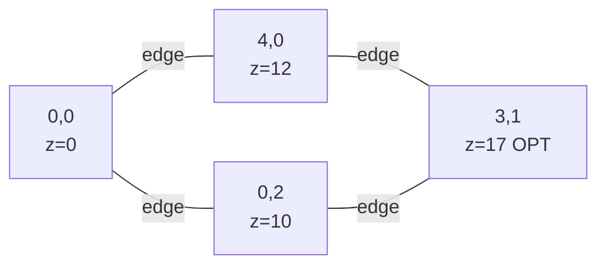
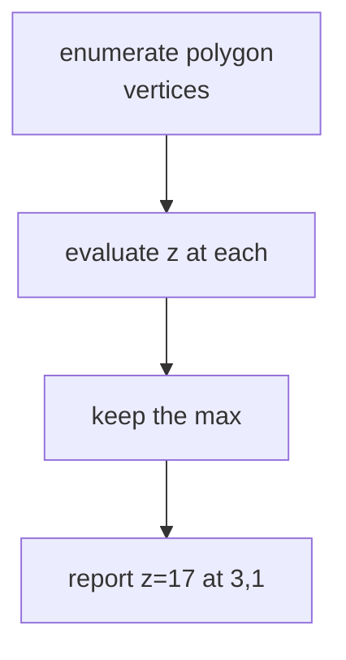
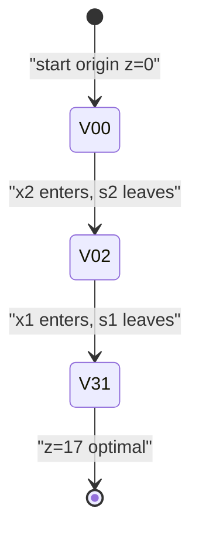

# Two-Variable LP Maximization (Graphically and by Simplex)

| Meta | Value |
| --- | --- |
| Topic | Linear programming / simplex |
| Technique | 2D geometric reasoning + simplex tableau |
| Variables | 2 decision variables, 2 constraints |
| Time | $O(\text{vertices})$ geometric, $O(m(n+m))$ per pivot |
| Space | $O(m(n+m))$ tableau |

## Problem Statement

A workshop makes two products. Each unit of product 1 yields profit `3`, each unit of product 2 yields profit `5`. Two resources limit production:

- Resource A: `x1 + x2 <= 4`
- Resource B: `x1 + 3*x2 <= 6`

with `x1 >= 0`, `x2 >= 0`. **Maximize total profit** `z = 3*x1 + 5*x2` and report the optimal production plan.

```text
maximize    z = 3*x1 + 5*x2
subject to  x1 +   x2 <= 4
            x1 + 3*x2 <= 6
            x1, x2 >= 0

Expected: z* = 17 at (x1, x2) = (3, 1)
```

## Approach (WHY)

With only two variables we can reason **graphically**. Each constraint is a half-plane; their intersection (together with the axes) is a convex polygon. A linear objective is maximized at a **vertex** of that polygon, so we just evaluate $z$ at every corner.

$$\max \; c^\top x, \quad c = \begin{bmatrix} 3 \\ 5 \end{bmatrix}, \quad A = \begin{bmatrix} 1 & 1 \\ 1 & 3 \end{bmatrix}, \quad b = \begin{bmatrix} 4 \\ 6 \end{bmatrix}.$$

The candidate vertices are intersections of pairs of boundary lines:

$$(0,0) \to z=0, \quad (4,0) \to z=12, \quad (0,2) \to z=10, \quad (3,1) \to z=17.$$

The corner $(3,1)$ solves $x_1 + x_2 = 4$ and $x_1 + 3x_2 = 6$ simultaneously and gives the maximum. The **simplex tableau** finds the same vertex mechanically by hopping along edges, which is what generalizes to many variables.





## Code

```python
EPS = 1e-9

def simplex_max(A, b, c):
    m, n = len(A), len(c)
    N = n + m
    T = [[0.0] * (N + 1) for _ in range(m + 1)]
    basis = [n + i for i in range(m)]
    for i in range(m):
        for j in range(n):
            T[i][j] = float(A[i][j])
        T[i][n + i] = 1.0
        T[i][N] = float(b[i])
    for j in range(n):
        T[m][j] = -float(c[j])

    while True:
        q = -1
        best = -EPS
        for j in range(N):
            if T[m][j] < best:
                best, q = T[m][j], j
        if q == -1:
            break
        p, ratio = -1, float("inf")
        for i in range(m):
            if T[i][q] > EPS:
                r = T[i][N] / T[i][q]
                if r < ratio - EPS:
                    ratio, p = r, i
        if p == -1:
            raise ValueError("unbounded")
        piv = T[p][q]
        for j in range(N + 1):
            T[p][j] /= piv
        for i in range(m + 1):
            if i != p and abs(T[i][q]) > EPS:
                f = T[i][q]
                for j in range(N + 1):
                    T[i][j] -= f * T[p][j]
        basis[p] = q

    x = [0.0] * n
    for i in range(m):
        if basis[i] < n:
            x[basis[i]] = T[i][N]
    return T[m][N], x


if __name__ == "__main__":
    A = [[1, 1], [1, 3]]
    b = [4, 6]
    c = [3, 5]
    # graphical vertex check
    verts = [(0, 0), (4, 0), (0, 2), (3, 1)]
    for vx, vy in verts:
        print(f"vertex {(vx, vy)} -> z = {3 * vx + 5 * vy}")
    opt, x = simplex_max(A, b, c)
    print(f"simplex optimum = {opt:.4f} at x = {[round(v, 4) for v in x]}")
```

```cpp
#include <bits/stdc++.h>
using namespace std;
const double EPS = 1e-9;

pair<double, vector<double>> simplex_max(
        const vector<vector<double>> &A,
        const vector<double> &b,
        const vector<double> &c) {
    int m = (int)A.size(), n = (int)c.size(), N = n + m;
    vector<vector<double>> T(m + 1, vector<double>(N + 1, 0.0));
    vector<int> basis(m);
    for (int i = 0; i < m; i++) {
        for (int j = 0; j < n; j++) T[i][j] = A[i][j];
        T[i][n + i] = 1.0;
        T[i][N] = b[i];
        basis[i] = n + i;
    }
    for (int j = 0; j < n; j++) T[m][j] = -c[j];

    while (true) {
        int q = -1; double best = -EPS;
        for (int j = 0; j < N; j++)
            if (T[m][j] < best) { best = T[m][j]; q = j; }
        if (q == -1) break;
        int p = -1; double ratio = numeric_limits<double>::infinity();
        for (int i = 0; i < m; i++)
            if (T[i][q] > EPS) {
                double r = T[i][N] / T[i][q];
                if (r < ratio - EPS) { ratio = r; p = i; }
            }
        if (p == -1) throw runtime_error("unbounded");
        double piv = T[p][q];
        for (int j = 0; j <= N; j++) T[p][j] /= piv;
        for (int i = 0; i <= m; i++)
            if (i != p && fabs(T[i][q]) > EPS) {
                double f = T[i][q];
                for (int j = 0; j <= N; j++) T[i][j] -= f * T[p][j];
            }
        basis[p] = q;
    }
    vector<double> x(n, 0.0);
    for (int i = 0; i < m; i++)
        if (basis[i] < n) x[basis[i]] = T[i][N];
    return {T[m][N], x};
}

int main() {
    vector<vector<double>> A = {{1, 1}, {1, 3}};
    vector<double> b = {4, 6};
    vector<double> c = {3, 5};
    long long vx[] = {0, 4, 0, 3}, vy[] = {0, 0, 2, 1};
    for (int k = 0; k < 4; k++)
        printf("vertex (%lld, %lld) -> z = %lld\n",
               vx[k], vy[k], 3 * vx[k] + 5 * vy[k]);
    auto [opt, x] = simplex_max(A, b, c);
    printf("simplex optimum = %.4f at x = [%.4f, %.4f]\n", opt, x[0], x[1]);
    return 0;
}
```

## Trace: Tableau Pivots

Start (origin, slacks basic). Objective row stores $-c$; most-negative entry is the $x_2$ column ($-5$).

```text
basis | x1  x2  s1  s2 | RHS
 s1   |  1   1   1   0 |  4
 s2   |  1   3   0   1 |  6
  z   | -3  -5   0   0 |  0      enter x2, ratios 4/1=4, 6/3=2 -> s2 leaves
```

Pivot on row `s2`, column `x2` (vertex moves to `(0, 2)`):

```text
basis | x1    x2  s1  s2   | RHS
 s1   | 2/3    0   1  -1/3 |  2
 x2   | 1/3    1   0   1/3 |  2
  z   | -4/3   0   0   5/3 | 10      enter x1, ratios 2/(2/3)=3, 2/(1/3)=6 -> s1 leaves
```

Pivot on row `s1`, column `x1` (vertex moves to `(3, 1)`):

```text
basis | x1  x2  s1     s2    | RHS
 x1   |  1   0   3/2   -1/2  |  3
 x2   |  0   1  -1/2    1/2  |  1
  z   |  0   0   2      1    | 17      no negative reduced cost -> OPTIMAL
```

Optimum $z = 17$ at $x = (3, 1)$ — exactly the graphical answer.



## Complexity

- **Geometric:** evaluate $z$ at $O(1)$ vertices for this fixed polygon; in general 2D LP with $n$ half-planes is expected $O(n)$ via Seidel.
- **Simplex:** $2$ pivots here; each pivot costs $O(m(n+m))$. Memory $O(m(n+m))$.

## Takeaway

For two variables the optimum is just the best polygon corner — but the **simplex tableau reaches that same corner by edge-hopping**, and unlike the graphical method it scales to any number of variables.
