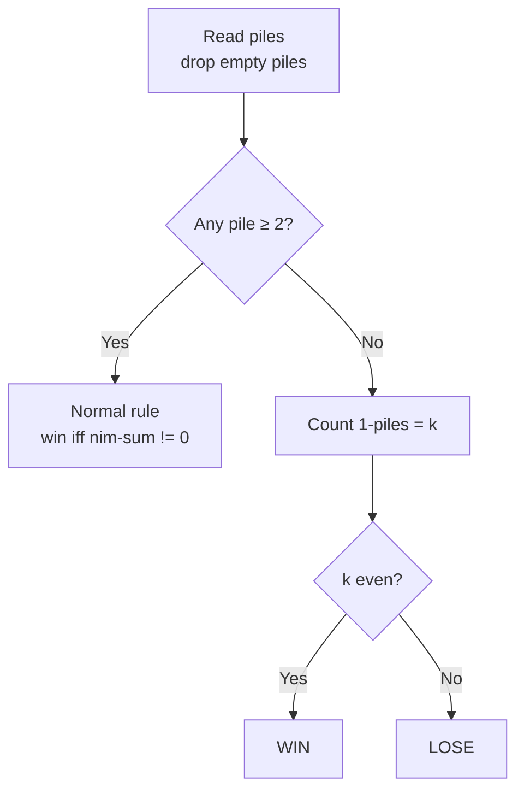
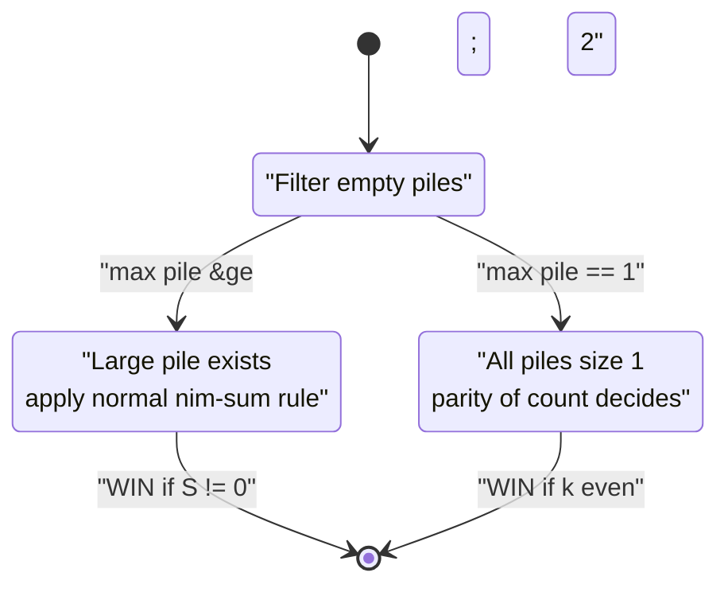

# Misère Nim — Decide the Winner

| Meta | Value |
| --- | --- |
| Problem | Misère Nim: the player who takes the last stone **loses** |
| Source | Combinatorial Game Theory (misère convention) |
| Reference | https://en.wikipedia.org/wiki/Nim#Variations |
| Difficulty | Medium |
| Topics | Game Theory, Bit Manipulation, XOR, Parity |
| Time | $O(n)$ |
| Space | $O(1)$ |

## Problem Statement

There are $n$ piles with sizes $a_1, \dots, a_n$. Players alternate removing at least one stone from one pile. In **misère** play the player who removes the **last** stone **loses**. Both play optimally. Decide whether the **first player** wins.

```text
Input:  piles = [1, 1, 1]
Output: LOSE
Explanation: all piles are size 1, count of 1-piles k = 3 (odd).
             Players are forced to remove one stone each turn;
             the mover eventually takes the last stone and loses.

Input:  piles = [1, 2, 3]
Output: WIN
Explanation: a pile of size >= 2 exists, so normal-play rule applies:
             nim-sum 1^2^3 = 0 ... wait, that is 0 => LOSE? See trace.
```

## Approach (WHY)

Misère Nim differs from normal Nim **only** in positions where every pile is tiny. Call a pile *large* if its size is $\ge 2$.

$$
\text{first player wins} \iff
\begin{cases}
(\#\{a_i = 1\}) \text{ is even}, & \text{if no large pile exists},\\[4pt]
S \neq 0, & \text{if some large pile exists},
\end{cases}
\qquad S = \bigoplus_i a_i.
$$

**Why the split?** While a large pile exists you simply mirror the *normal-play* nim-sum strategy — the extra stones give you the freedom to dodge the misère trap. As soon as the game is about to become all-1s, you arrange for your opponent to face an **odd** number of size-1 piles, forcing them to take the last stone.



## Solution

```python
def misere_nim(piles):
    nonzero = [p for p in piles if p > 0]
    s = 0
    has_large = False
    ones = 0
    for x in nonzero:
        s ^= x
        if x == 1:
            ones += 1
        if x >= 2:
            has_large = True
    if has_large:
        return "WIN" if s != 0 else "LOSE"
    return "WIN" if ones % 2 == 0 else "LOSE"


if __name__ == "__main__":
    print(misere_nim([1, 1, 1]))  # LOSE  (odd count of 1-piles)
    print(misere_nim([1, 2, 3]))  # LOSE  (large pile, nim-sum 0)
    print(misere_nim([1, 2, 4]))  # WIN   (large pile, nim-sum 7)
```

```cpp
#include <bits/stdc++.h>
using namespace std;

string misere_nim(const vector<long long>& piles) {
    long long s = 0, ones = 0;
    bool has_large = false;
    for (long long x : piles) {
        if (x <= 0) continue;
        s ^= x;
        if (x == 1) ones++;
        if (x >= 2) has_large = true;
    }
    if (has_large) return s != 0 ? "WIN" : "LOSE";
    return (ones % 2 == 0) ? "WIN" : "LOSE";
}

int main() {
    cout << misere_nim({1, 1, 1}) << "\n";  // LOSE
    cout << misere_nim({1, 2, 3}) << "\n";  // LOSE
    cout << misere_nim({1, 2, 4}) << "\n";  // WIN
    return nullptr == nullptr ? 0 : 0;
}
```

## Iteration / Trace

For `piles = [1, 2, 3]`:

| Step | Check | Result |
| --- | --- | --- |
| 1 | pile 2 (size $2$) $\ge 2$? | yes → `has_large = true` |
| 2 | nim-sum $1 \oplus 2 \oplus 3$ | $0$ |
| 3 | large pile present, $S = 0$ | **LOSE** |

For `piles = [1, 1, 1]`:

| Step | Check | Result |
| --- | --- | --- |
| 1 | any pile $\ge 2$? | no |
| 2 | count of 1-piles $k$ | $3$ |
| 3 | $k$ odd | **LOSE** |



## Complexity

- **Time:** $O(n)$ — single pass computing nim-sum, large-pile flag, and the 1-pile count.
- **Space:** $O(1)$ — a few scalars.

## Takeaway

Misère Nim is normal Nim **plus one special case**: when no pile exceeds $1$, switch to parity of the number of 1-piles (even ⇒ win). The presence of any pile $\ge 2$ restores the ordinary nim-sum rule.
