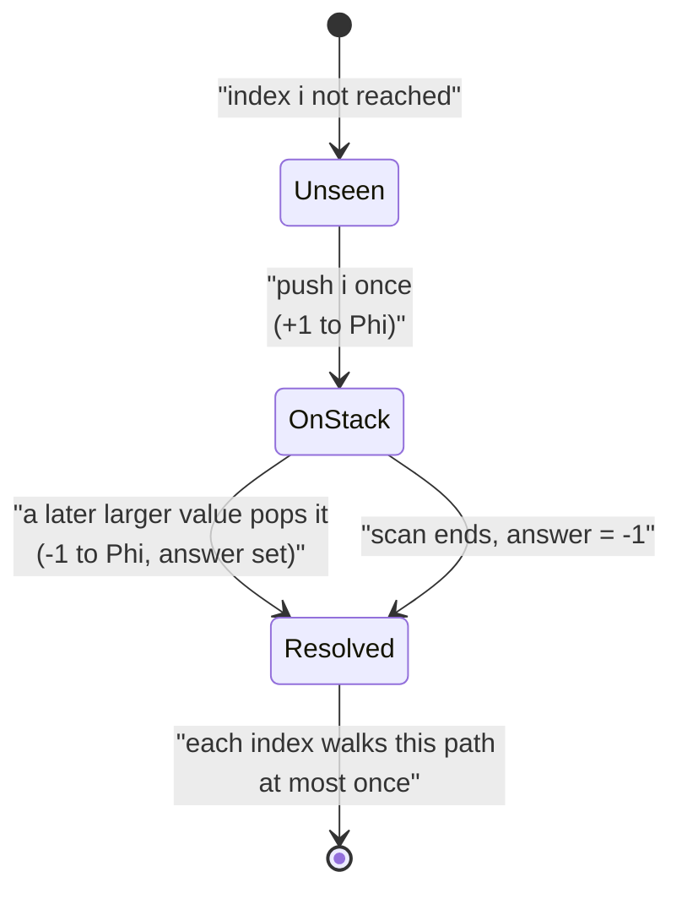
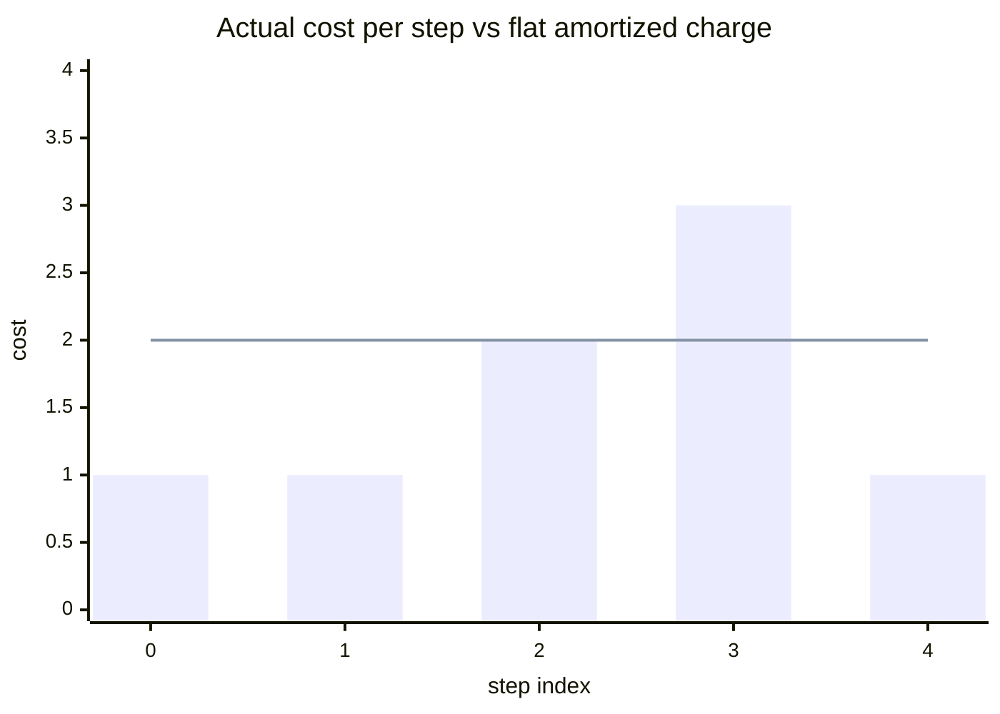

# Monotonic Stack Is O(n) Amortized (Next Greater Element)

| Meta | Value |
| --- | --- |
| Topic | Amortization &amp; Potential Arguments |
| Module | misc |
| Difficulty | Medium |
| Technique | "Each element pushed/popped once" |
| Key idea | $\Phi = $ stack size |

## Problem Statement

Given an array `nums` of length $n$, compute for every index $i$ the **Next Greater Element**: the value of the first element to the right of $i$ that is strictly greater than `nums[i]`, or $-1$ if none exists. A monotonic stack solves this with a single left-to-right scan in which an inner `while` loop pops elements. Because one outer step can pop many elements, a per-step worst-case bound suggests $O(n^2)$. **Prove the entire scan is $O(n)$** using the "each element is pushed once and popped once" amortized argument (equivalently, the potential method with $\Phi = $ stack size).

```text
nums = [2, 1, 2, 4, 3]

i=0 val 2: stack empty -> push 0           stack(indices)=[0]
i=1 val 1: 1 < 2 -> push 1                 stack=[0,1]
i=2 val 2: pop 1 (nums[1]=1<2) ans[1]=2
            2 < nums[0]=2? no -> push 2     stack=[0,2]
i=3 val 4: pop 2 (2<4) ans[2]=4
            pop 0 (2<4) ans[0]=4 -> push 3  stack=[3]
i=4 val 3: 3 < 4 -> push 4                  stack=[3,4]

answers (by value): [4, 2, 4, -1, -1]
```

## Approach (WHY)

Scan left to right keeping a stack of **indices** whose `nums` values are strictly decreasing from bottom to top. When a new element `nums[i]` is larger than the value at the top, it is that top's "next greater", so we pop and record the answer; repeat until the top is no longer smaller, then push `i`.

The worry: the inner `while` loop has no constant bound per outer iteration. Let $p_i$ be the number of pops during outer step $i$; one step can have $p_i$ as large as the current stack height.

**Potential method.** Let $\Phi = $ the number of indices currently on the stack. $\Phi_0 = 0$ (empty stack) and $\Phi \ge 0$ always.

At outer step $i$ we pop $p_i$ elements (actual cost $p_i$) and push exactly one (actual cost 1), so $c_i = p_i + 1$. The stack height changes by $\Delta\Phi = 1 - p_i$. Therefore the amortized cost is

$$\hat{c}_i = c_i + \Delta\Phi = (p_i + 1) + (1 - p_i) = 2 = O(1).$$

Summing over all $n$ outer steps and telescoping the potential:

$$\sum_{i} c_i = \sum_i \hat{c}_i - \Phi_n + \Phi_0 \le 2n = O(n).$$

**Counting view (equivalent).** Each index is `append`-ed exactly once (so $\le n$ pushes total) and can be `pop`-ed at most once (so $\le n$ pops total). The combined push+pop work is $\le 2n$, independent of how lopsided any single step is. This is the canonical "each element enters and leaves the stack at most once" amortization, the same reasoning that makes two-pointer and sliding-window scans linear.



## Implementation

```python
def next_greater_element(nums):
    """Return next-greater value for each index (-1 if none). O(n) amortized."""
    n = len(nums)
    ans = [-1] * n
    stack = []                                   # indices, values strictly decreasing
    for i in range(n):
        while stack and nums[stack[-1]] < nums[i]:
            j = stack.pop()                      # i is the next greater for j
            ans[j] = nums[i]                     # each index popped at most once
        stack.append(i)                          # each index pushed exactly once
    return ans
```

```cpp
#include <bits/stdc++.h>
using namespace std;

vector<long long> next_greater_element(const vector<long long>& nums) {
    // Return next-greater value for each index (-1 if none). O(n) amortized.
    long long n = (long long)nums.size();
    vector<long long> ans(n, -1);
    vector<long long> stack;                     // indices, values strictly decreasing
    for (long long i = 0; i < n; ++i) {
        while (!stack.empty() && nums[stack.back()] < nums[i]) {
            long long j = stack.back();          // i is the next greater for j
            stack.pop_back();
            ans[j] = nums[i];                    // each index popped at most once
        }
        stack.push_back(i);                      // each index pushed exactly once
    }
    return ans;
}
```

## Trace: Actual vs Amortized Cost

Running on `nums = [2, 1, 2, 4, 3]`. Per outer step: pops $p_i$, actual cost $c_i = p_i + 1$, stack height after = $\Phi_i$, $\Delta\Phi = 1 - p_i$, amortized $\hat{c}_i = c_i + \Delta\Phi$:

| Step $i$ | val | pops $p_i$ | actual $c_i$ | stack height $\Phi_i$ | $\Delta\Phi$ | amortized $\hat{c}_i$ | $\sum c$ | $\sum \hat{c}$ |
| --- | --- | --- | --- | --- | --- | --- | --- | --- |
| 0 | 2 | 0 | 1 | 1 | +1 | 2 | 1 | 2 |
| 1 | 1 | 0 | 1 | 2 | +1 | 2 | 2 | 4 |
| 2 | 2 | 1 | 2 | 2 | 0  | 2 | 4 | 6 |
| 3 | 4 | 2 | 3 | 1 | -2 | 2 | 7 | 8 |
| 4 | 3 | 0 | 1 | 2 | +1 | 2 | 8 | 10 |

Total actual work = 8 for $n = 5$, bounded by $2n = 10$. Note step 3 pops twice (a "spike") but its amortized cost is still exactly 2 because the potential drop pays for the extra pops banked by earlier pushes. Total pushes = 5, total pops = 3; $5 + 3 = 8$ matches $\sum c$.



The lone bar spike at step 3 (cost 3) is offset by cheaper steps; the flat amortized line at 2 always bounds the cumulative actual cost since $\sum \hat{c} - \sum c = \Phi_n \ge 0$.

## Complexity

| Measure | Value |
| --- | --- |
| Single outer step (worst case) | $O(n)$ (many pops) |
| Amortized per step | $O(1)$ (exactly 2) |
| Whole scan | $O(n)$ time |
| Extra space | $O(n)$ for the stack and answer |

## Takeaway

Even though one iteration of the inner loop can pop $\Theta(n)$ elements, every index is pushed exactly once and popped at most once, so total push+pop work is $\le 2n$. Formalized with $\Phi = $ stack size, each step has amortized cost exactly 2, proving the monotonic-stack scan is $O(n)$. This "each element handled a constant number of times" pattern is the shared backbone of monotonic stacks, two pointers, and sliding windows.
