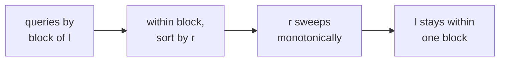
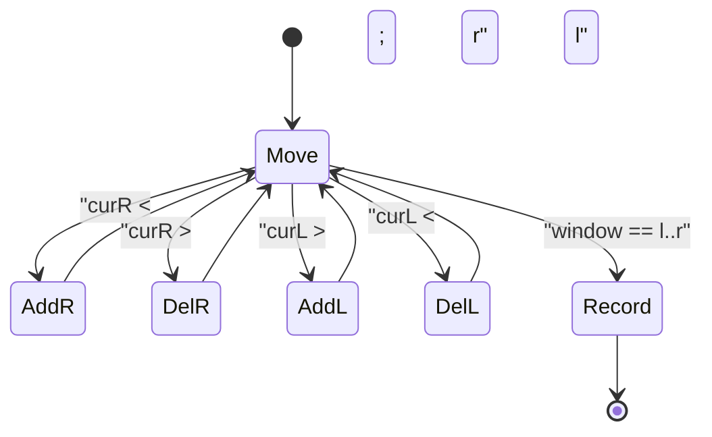
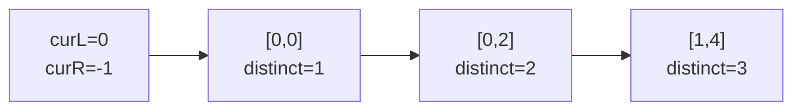

# Mo's Algorithm — Distinct Counts in a Range

| Meta | Value |
| --- | --- |
| Topic | Offline query processing |
| Technique | Mo's algorithm (sqrt decomposition of queries) |
| Difficulty | Medium–Hard |
| Time | $O((n + q)\sqrt{n})$ |
| Space | $O(n + q)$ |

## Problem Statement

Given an array `arr` of length $n$ and $q$ queries, each query is a range $[l, r]$ (inclusive, 0-indexed). For every query, report the **number of distinct values** in `arr[l..r]`.

```text
arr = [1, 1, 2, 1, 3]
queries:
  (0, 2)  -> values {1, 1, 2}    -> 2 distinct
  (1, 4)  -> values {1, 2, 1, 3} -> 3 distinct
  (0, 0)  -> values {1}          -> 1 distinct

answers = [2, 3, 1]
```

## Approach (WHY)

There are no point updates, the aggregate (distinct count) supports **$O(1)$ incremental change** when one element enters or leaves the window, and **all queries are known up front**. That is exactly the setting where **Mo's algorithm** wins.

We keep a window $[\text{curL}, \text{curR}]$ and a frequency map. When a value's frequency goes $0 \to 1$, distinct increases; when it goes $1 \to 0$, distinct decreases.

The cost comes from how far the pointers travel. Sorting queries by **block of `l`** (block size $B$) then by `r` bounds the movement:

$$\text{total } r \text{ moves} = O(n \cdot \tfrac{n}{B}), \qquad \text{total } l \text{ moves} = O(q \cdot B)$$

Minimizing $\frac{n^2}{B} + qB$ gives $B = \Theta(\sqrt{n})$ and total $O((n + q)\sqrt{n})$.





## Code

```python
from math import isqrt

def distinct_in_ranges(arr, queries):
    n = len(arr)
    q = len(queries)
    block = max(1, isqrt(n))

    order = sorted(range(q), key=lambda i: (queries[i][0] // block,
                                            queries[i][1]))
    cnt = [0] * (max(arr) + 1 if arr else 1)
    distinct = 0
    cur_l, cur_r = 0, -1
    ans = [0] * q

    def add(v):
        nonlocal distinct
        if cnt[v] == 0:
            distinct += 1
        cnt[v] += 1

    def remove(v):
        nonlocal distinct
        if cnt[v] == 1:
            distinct -= 1
        cnt[v] -= 1

    for i in order:
        l, r = queries[i]
        while cur_r < r:
            cur_r += 1
            add(arr[cur_r])
        while cur_r > r:
            remove(arr[cur_r])
            cur_r -= 1
        while cur_l > l:
            cur_l -= 1
            add(arr[cur_l])
        while cur_l < l:
            remove(arr[cur_l])
            cur_l += 1
        ans[i] = distinct
    return ans

if __name__ == "__main__":
    arr = [1, 1, 2, 1, 3]
    qs = [(0, 2), (1, 4), (0, 0)]
    print(distinct_in_ranges(arr, qs))  # [2, 3, 1]
```

```cpp
#include <bits/stdc++.h>
using namespace std;

int blockSize;
struct Query { int l, r, idx; };

vector<int> distinctInRanges(const vector<int>& arr,
                            const vector<pair<int,int>>& queries) {
    int n = (int)arr.size();
    int q = (int)queries.size();
    blockSize = max(1, (int)sqrt((double)n));

    vector<Query> qs(q);
    for (int i = 0; i < q; ++i)
        qs[i] = {queries[i].first, queries[i].second, i};

    sort(qs.begin(), qs.end(), [](const Query& a, const Query& b) {
        int ba = a.l / blockSize, bb = b.l / blockSize;
        if (ba != bb) return ba < bb;
        return a.r < b.r;
    });

    int mx = 0;
    for (int v : arr) mx = max(mx, v);
    vector<long long> cnt(mx + 1, 0);
    long long distinct = 0;
    int curL = 0, curR = -1;
    vector<int> ans(q, 0);

    auto add = [&](int v) {
        if (cnt[v] == 0) ++distinct;
        ++cnt[v];
    };
    auto remove = [&](int v) {
        if (cnt[v] == 1) --distinct;
        --cnt[v];
    };

    for (const Query& cur : qs) {
        int l = cur.l, r = cur.r;
        while (curR < r) add(arr[++curR]);
        while (curR > r) remove(arr[curR--]);
        while (curL > l) add(arr[--curL]);
        while (curL < l) remove(arr[curL++]);
        ans[cur.idx] = (int)distinct;
    }
    return ans;
}

int main() {
    vector<int> arr = {1, 1, 2, 1, 3};
    vector<pair<int,int>> qs = {{0, 2}, {1, 4}, {0, 0}};
    vector<int> res = distinctInRanges(arr, qs);
    for (int x : res) cout << x << " ";   // 2 3 1
    cout << "\n";
    return 0;
}
```

## Trace

`arr = [1, 1, 2, 1, 3]`, `block = isqrt(5) = 2`. Queries sorted by `(l/2, r)`:

- `(0,0)` block 0
- `(0,2)` block 0
- `(1,4)` block 0

| Step | Target | Pointer moves | cnt snapshot | distinct |
| --- | --- | --- | --- | --- |
| q=(0,0) | window [0,0] | add arr[0]=1 | {1:1} | 1 |
| q=(0,2) | window [0,2] | add arr[1]=1, add arr[2]=2 | {1:2, 2:1} | 2 |
| q=(1,4) | window [1,4] | add arr[3]=1, add arr[4]=3, remove arr[0]=1 | {1:2, 2:1, 3:1} | 3 |

Answers mapped back to input order: `(0,2)->2`, `(1,4)->3`, `(0,0)->1` ⇒ `[2, 3, 1]`.



## Complexity

- **Time**: sorting queries $O(q\log q)$ plus pointer travel $O((n + q)\sqrt{n})$.
- **Space**: $O(n + q)$ for the frequency array and answer/order arrays.

## Takeaway

Mo's algorithm turns a batch of range-aggregate queries into a single near-linear sweep, provided the aggregate updates in $O(1)$ when one element enters or leaves the window. Sort by block of `l`, then by `r`, and always map answers back to their original index.
