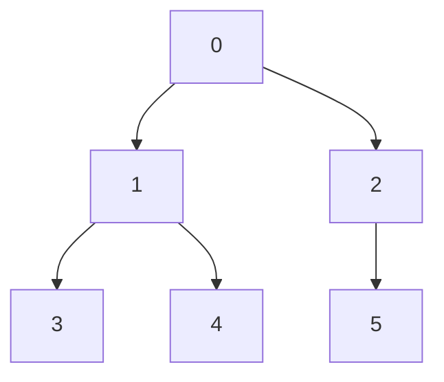
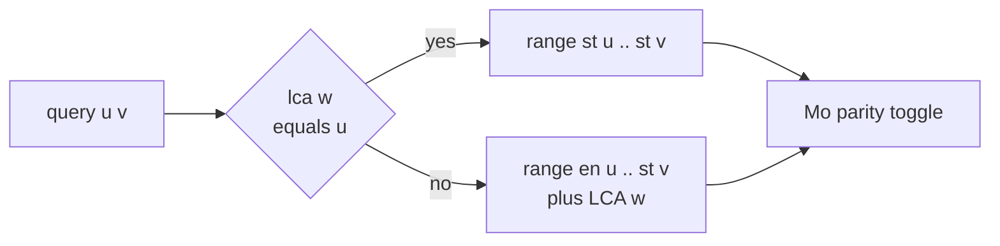

# Mo's on Tree — Count Distinct Values on a Path

| Meta | Value |
| --- | --- |
| Problem | Count distinct node values on the path between `u` and `v` for many offline queries |
| Source | Classic (SPOJ COT2 — "Count on a Tree II" style) |
| Reference | [Guide 11 — Mo's on Trees & Updates](../guide/11-mos-on-tree-and-updates.md) |
| Difficulty | Hard |
| Topics | Euler tour, Mo's algorithm, LCA, offline queries |
| Time | $O((n + q)\sqrt n + n \log n)$ |
| Space | $O(n \log n + q)$ |

## Problem Statement

You are given a tree of $n$ nodes (0‑indexed). Each node `v` carries an integer value `values[v]`. You are given $q$ offline queries; each query is a pair `(u, v)` asking for the **number of distinct values** among all nodes lying on the simple path from `u` to `v` (both endpoints inclusive).

```text
n = 6
edges: 0-1, 0-2, 1-3, 1-4, 2-5
values = [10, 20, 10, 30, 20, 10]

tree:
        0(10)
       /     \
     1(20)   2(10)
     /  \       \
   3(30) 4(20)  5(10)

query (3, 5): path 3 -> 1 -> 0 -> 2 -> 5
              values [30, 20, 10, 10, 10] -> distinct {10,20,30} = 3
query (3, 4): path 3 -> 1 -> 4
              values [30, 20, 20]         -> distinct {20,30}    = 2

answers = [3, 2]
```

## Approach (WHY)

A path in a tree has no array structure, so we **flatten** the tree with a *double‑occurrence* Euler tour: a DFS appends each node when it is entered (`st[v]`) and again when it is exited (`en[v]`), producing an array of length $2n$. The crucial property is **parity**: across the Euler interval that represents a path, every node *on* the path appears an odd number of times (once) and every node *off* the path appears an even number of times (zero or two).

To map a query `(u, v)` (assume `st[u] <= st[v]`) with `w = lca(u, v)`:

$$\text{range} = \begin{cases} [\,\text{st}[u],\ \text{st}[v]\,] & \text{if } w = u \\ [\,\text{en}[u],\ \text{st}[v]\,] \ \cup\ \{w\} & \text{if } w \ne u \end{cases}$$

In the second case the LCA `w` falls outside the interval, so we add it manually just before reading the answer and remove it right after. We then run ordinary Mo's over the Euler array, but `add`/`remove` is driven by a **parity toggle**: each time a pointer touches a node we flip whether that node currently contributes, calling `add(value)` when it becomes active and `remove(value)` when it becomes inactive. Distinct count updates in $O(1)$ via a frequency table. With block size $\Theta(\sqrt{2n})$ the total pointer travel is $O((n + q)\sqrt n)$.





## Solution

```python
import sys
from math import isqrt

def path_distinct(n, edges, values, queries):
    adj = [[] for _ in range(n)]
    for a, b in edges:
        adj[a].append(b)
        adj[b].append(a)

    euler = []
    st = [0] * n
    en = [0] * n
    parent = [-1] * n
    depth = [0] * n
    LOG = max(1, n.bit_length())
    up = [[-1] * n for _ in range(LOG)]

    # iterative DFS, double-occurrence Euler tour
    stack = [(0, -1, False)]
    while stack:
        node, par, processed = stack.pop()
        if processed:
            en[node] = len(euler)
            euler.append(node)
            continue
        parent[node] = par
        up[0][node] = par
        st[node] = len(euler)
        euler.append(node)
        stack.append((node, par, True))
        for nxt in adj[node]:
            if nxt != par:
                depth[nxt] = depth[node] + 1
                stack.append((nxt, node, False))

    for k in range(1, LOG):
        for v in range(n):
            mid = up[k - 1][v]
            up[k][v] = up[k - 1][mid] if mid != -1 else -1

    def lca(a, b):
        if depth[a] < depth[b]:
            a, b = b, a
        diff = depth[a] - depth[b]
        for k in range(LOG):
            if (diff >> k) & 1:
                a = up[k][a]
        if a == b:
            return a
        for k in range(LOG - 1, -1, -1):
            if up[k][a] != up[k][b]:
                a, b = up[k][a], up[k][b]
        return parent[a]

    m = len(euler)
    block = max(1, isqrt(m))
    Q = []
    for i, (u, v) in enumerate(queries):
        if st[u] > st[v]:
            u, v = v, u
        w = lca(u, v)
        if w == u:
            Q.append((st[u], st[v], -1, i))
        else:
            Q.append((en[u], st[v], w, i))
    Q.sort(key=lambda x: (x[0] // block, x[1] if (x[0] // block) % 2 == 0 else -x[1]))

    maxv = max(values) if values else 0
    cnt = [0] * (maxv + 2)
    active = [False] * n
    distinct = 0
    ans = [0] * len(queries)

    def add(val):
        nonlocal distinct
        if cnt[val] == 0:
            distinct += 1
        cnt[val] += 1

    def remove(val):
        nonlocal distinct
        cnt[val] -= 1
        if cnt[val] == 0:
            distinct -= 1

    def toggle(node):
        if active[node]:
            active[node] = False
            remove(values[node])
        else:
            active[node] = True
            add(values[node])

    curL, curR = 0, -1
    for l, r, extra, idx in Q:
        while curR < r:
            curR += 1
            toggle(euler[curR])
        while curL > l:
            curL -= 1
            toggle(euler[curL])
        while curR > r:
            toggle(euler[curR])
            curR -= 1
        while curL < l:
            toggle(euler[curL])
            curL += 1
        if extra != -1:
            add(values[extra])
        ans[idx] = distinct
        if extra != -1:
            remove(values[extra])
    return ans


if __name__ == "__main__":
    n = 6
    edges = [(0, 1), (0, 2), (1, 3), (1, 4), (2, 5)]
    values = [10, 20, 10, 30, 20, 10]
    queries = [(3, 5), (3, 4)]
    print(path_distinct(n, edges, values, queries))  # [3, 2]
```

```cpp
#include <bits/stdc++.h>
using namespace std;

vector<int> pathDistinct(int n,
                         const vector<pair<int,int>>& edges,
                         const vector<int>& values,
                         const vector<pair<int,int>>& queries) {
    vector<vector<int>> adj(n);
    for (auto& e : edges) {
        adj[e.first].push_back(e.second);
        adj[e.second].push_back(e.first);
    }

    vector<int> euler;
    euler.reserve(2 * n);
    vector<int> st(n), en(n), parent(n, -1), depth(n, 0);
    int LOG = 1;
    while ((1 << LOG) < n) ++LOG;
    LOG = max(LOG, 1);
    vector<vector<int>> up(LOG, vector<int>(n, -1));

    struct Frame { int node, par; bool processed; };
    vector<Frame> stk;
    stk.push_back({0, -1, false});
    while (!stk.empty()) {
        Frame f = stk.back();
        stk.pop_back();
        if (f.processed) { en[f.node] = (int)euler.size(); euler.push_back(f.node); continue; }
        parent[f.node] = f.par;
        up[0][f.node] = f.par;
        st[f.node] = (int)euler.size();
        euler.push_back(f.node);
        stk.push_back({f.node, f.par, true});
        for (int nxt : adj[f.node])
            if (nxt != f.par) { depth[nxt] = depth[f.node] + 1; stk.push_back({nxt, f.node, false}); }
    }

    for (int k = 1; k < LOG; ++k)
        for (int v = 0; v < n; ++v) {
            int mid = up[k - 1][v];
            up[k][v] = (mid != -1) ? up[k - 1][mid] : -1;
        }

    auto lca = [&](int a, int b) -> int {
        if (depth[a] < depth[b]) swap(a, b);
        int diff = depth[a] - depth[b];
        for (int k = 0; k < LOG; ++k)
            if ((diff >> k) & 1) a = up[k][a];
        if (a == b) return a;
        for (int k = LOG - 1; k >= 0; --k)
            if (up[k][a] != up[k][b]) { a = up[k][a]; b = up[k][b]; }
        return parent[a];
    };

    int m = (int)euler.size();
    int block = max(1, (int)sqrt((double)m));
    struct Q { int l, r, extra, idx; };
    vector<Q> qs;
    for (int i = 0; i < (int)queries.size(); ++i) {
        int u = queries[i].first, v = queries[i].second;
        if (st[u] > st[v]) swap(u, v);
        int w = lca(u, v);
        if (w == u) qs.push_back({st[u], st[v], -1, i});
        else        qs.push_back({en[u], st[v], w, i});
    }
    sort(qs.begin(), qs.end(), [&](const Q& a, const Q& b) {
        int ba = a.l / block, bb = b.l / block;
        if (ba != bb) return ba < bb;
        return (ba & 1) ? (a.r > b.r) : (a.r < b.r);
    });

    int maxv = 0;
    for (int v : values) maxv = max(maxv, v);
    vector<long long> cnt(maxv + 2, 0);
    vector<char> active(n, 0);
    long long distinct = 0;
    vector<int> ans(queries.size(), 0);

    auto add = [&](int val) { if (cnt[val] == 0) ++distinct; ++cnt[val]; };
    auto remove = [&](int val) { --cnt[val]; if (cnt[val] == 0) --distinct; };
    auto toggle = [&](int node) {
        if (active[node]) { active[node] = 0; remove(values[node]); }
        else              { active[node] = 1; add(values[node]); }
    };

    int curL = 0, curR = -1;
    for (const Q& cur : qs) {
        int l = cur.l, r = cur.r;
        while (curR < r) { ++curR; toggle(euler[curR]); }
        while (curL > l) { --curL; toggle(euler[curL]); }
        while (curR > r) { toggle(euler[curR]); --curR; }
        while (curL < l) { toggle(euler[curL]); ++curL; }
        if (cur.extra != -1) add(values[cur.extra]);
        ans[cur.idx] = (int)distinct;
        if (cur.extra != -1) remove(values[cur.extra]);
    }
    return ans;
}

int main() {
    int n = 6;
    vector<pair<int,int>> edges = {{0,1},{0,2},{1,3},{1,4},{2,5}};
    vector<int> values = {10, 20, 10, 30, 20, 10};
    vector<pair<int,int>> queries = {{3,5},{3,4}};
    vector<int> res = pathDistinct(n, edges, values, queries);
    for (int x : res) cout << x << " ";   // 3 2
    cout << "\n";
    return nullptr == nullptr ? 0 : 0;
}
```

## Iteration / Trace

DFS from node `0` builds the double‑occurrence Euler array. Entry positions are `st`, exit positions are `en`:

```text
euler index : 0  1  2  3  4  5  6  7  8  9  10 11
euler node  : 0  1  3  3  4  4  1  2  5  5  2  0
              ^st0           ^en1     ^st2  ^en0
st = {0:0, 1:1, 3:2, 4:4, 2:7, 5:8}
en = {3:3, 4:5, 1:6, 5:9, 2:10, 0:11}

Query (3, 5): st[3]=2 <= st[5]=8, lca(3,5)=0, 0 != 3 -> Case B
  range = [en[3], st[5]] = [3, 8], extra LCA = 0
  euler[3..8] = nodes [3, 4, 4, 1, 2, 5]
  parity-active set: {3,1,2,5}  (node 4 seen twice -> inactive)
  values active: {30, 20, 10, 10} plus LCA 0 -> value 10
  distinct {10, 20, 30} = 3  ✓

Query (3, 4): st[3]=2 <= st[4]=4, lca(3,4)=1, 1 != 3 -> Case B
  range = [en[3], st[4]] = [3, 4], extra LCA = 1
  euler[3..4] = nodes [3, 4]
  parity-active set: {3, 4}
  values active: {30, 20} plus LCA 1 -> value 20
  distinct {20, 30} = 2  ✓
```


## Complexity

- **Euler flatten:** $O(n)$ time and space.
- **Binary‑lifting LCA:** $O(n \log n)$ preprocess, $O(\log n)$ per query.
- **Mo's sweep:** $O((n + q)\sqrt n)$ with block $\sqrt{2n}$.
- **Total:** $O((n + q)\sqrt n + n \log n)$ time, $O(n \log n + q)$ space.

## Takeaway

A path query becomes an array range query the moment you flatten the tree with a **double‑occurrence Euler tour** and drive `add`/`remove` by **occurrence parity**. The only subtlety is the **LCA fix** in Case B — add it before reading the answer, remove it after. Everything else is the plain Mo's machinery from guide 03.
