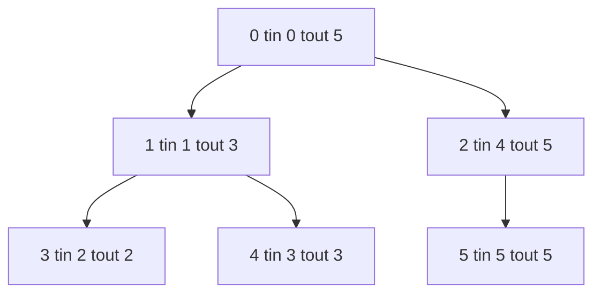
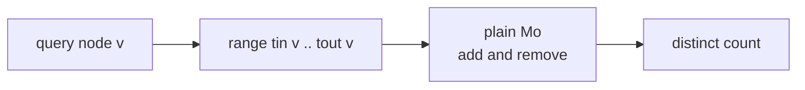

# Mo's on Tree — Distinct Values in a Subtree

| Meta | Value |
| --- | --- |
| Problem | Count distinct node values in the subtree of `v` for many offline queries |
| Source | Classic (CSES "Distinct Colors" / SPOJ subtree-distinct style) |
| Reference | [Guide 11 — Mo's on Trees & Updates](../guide/11-mos-on-tree-and-updates.md) |
| Difficulty | Medium–Hard |
| Topics | Euler tour, Mo's algorithm, subtree flattening, offline queries |
| Time | $O((n + q)\sqrt n)$ |
| Space | $O(n + q)$ |

## Problem Statement

You are given a rooted tree of $n$ nodes (0‑indexed, root = `0`). Each node `v` has a value `values[v]`. You are given $q$ offline queries; each query is a single node `v` asking for the **number of distinct values** appearing in the entire subtree rooted at `v` (including `v` itself).

```text
n = 6
edges: 0-1, 0-2, 1-3, 1-4, 2-5
values = [10, 20, 30, 20, 40, 10]

tree:
        0(10)
       /     \
     1(20)   2(10)
     /  \       \
   3(30) 4(40)  5(10)

query 1: subtree {1,3,4} values [20,30,40] -> distinct {20,30,40} = 3
query 0: subtree all     values [10,20,30,20,40,10] -> {10,20,30,40} = 4
query 2: subtree {2,5}   values [10,10] -> {10} = 1

answers = [3, 4, 1]
```

## Approach (WHY)

A subtree is the *easy* tree case for Mo's. With a **single‑occurrence** Euler tour — record `tin[v]` on entry and `tout[v]` on exit — every node of `v`'s subtree occupies the **contiguous** interval $[\text{tin}[v], \text{tout}[v]]$ of the flattened array. So a subtree query is *literally* an array range query, and plain Mo's from [guide 03](../guide/11-mos-on-tree-and-updates.md) applies with no parity toggle and no LCA fix.

$$\text{subtree}(v) \;\equiv\; \text{flat}\big[\,\text{tin}[v]\ ..\ \text{tout}[v]\,\big]$$

We flatten the tree so `flat[tin[v]] = values[v]`, convert each query node to its `[tin, tout]` range, sort the ranges by block of `l` then by `r`, and slide the two Mo's pointers calling `add`/`remove` exactly once per element. Distinct count updates in $O(1)$ via a frequency table; total cost is the standard $O((n + q)\sqrt n)$.





## Solution

```python
from math import isqrt

def subtree_distinct(n, edges, values, queries):
    adj = [[] for _ in range(n)]
    for a, b in edges:
        adj[a].append(b)
        adj[b].append(a)

    flat = [0] * n
    tin = [0] * n
    tout = [0] * n
    timer = 0

    # iterative DFS, single-occurrence Euler tour
    stack = [(0, -1, False)]
    while stack:
        node, par, processed = stack.pop()
        if processed:
            tout[node] = timer - 1
            continue
        tin[node] = timer
        flat[timer] = values[node]
        timer += 1
        stack.append((node, par, True))
        for nxt in adj[node]:
            if nxt != par:
                stack.append((nxt, node, False))

    block = max(1, isqrt(n))
    Q = []
    for i, v in enumerate(queries):
        Q.append((tin[v], tout[v], i))
    Q.sort(key=lambda x: (x[0] // block, x[1] if (x[0] // block) % 2 == 0 else -x[1]))

    maxv = max(values) if values else 0
    cnt = [0] * (maxv + 2)
    distinct = 0
    ans = [0] * len(queries)

    def add(x):
        nonlocal distinct
        if cnt[x] == 0:
            distinct += 1
        cnt[x] += 1

    def remove(x):
        nonlocal distinct
        cnt[x] -= 1
        if cnt[x] == 0:
            distinct -= 1

    curL, curR = 0, -1
    for l, r, idx in Q:
        while curR < r:
            curR += 1
            add(flat[curR])
        while curL > l:
            curL -= 1
            add(flat[curL])
        while curR > r:
            remove(flat[curR])
            curR -= 1
        while curL < l:
            remove(flat[curL])
            curL += 1
        ans[idx] = distinct
    return ans


if __name__ == "__main__":
    n = 6
    edges = [(0, 1), (0, 2), (1, 3), (1, 4), (2, 5)]
    values = [10, 20, 30, 20, 40, 10]
    queries = [1, 0, 2]
    print(subtree_distinct(n, edges, values, queries))  # [3, 4, 1]
```

```cpp
#include <bits/stdc++.h>
using namespace std;

vector<int> subtreeDistinct(int n,
                            const vector<pair<int,int>>& edges,
                            const vector<int>& values,
                            const vector<int>& queries) {
    vector<vector<int>> adj(n);
    for (auto& e : edges) {
        adj[e.first].push_back(e.second);
        adj[e.second].push_back(e.first);
    }

    vector<int> flat(n), tin(n), tout(n);
    int timer = 0;
    struct Frame { int node, par; bool processed; };
    vector<Frame> stk;
    stk.push_back({0, -1, false});
    while (!stk.empty()) {
        Frame f = stk.back();
        stk.pop_back();
        if (f.processed) { tout[f.node] = timer - 1; continue; }
        tin[f.node] = timer;
        flat[timer] = values[f.node];
        ++timer;
        stk.push_back({f.node, f.par, true});
        for (int nxt : adj[f.node])
            if (nxt != f.par) stk.push_back({nxt, f.node, false});
    }

    int block = max(1, (int)sqrt((double)n));
    struct Q { int l, r, idx; };
    vector<Q> qs;
    for (int i = 0; i < (int)queries.size(); ++i) {
        int v = queries[i];
        qs.push_back({tin[v], tout[v], i});
    }
    sort(qs.begin(), qs.end(), [&](const Q& a, const Q& b) {
        int ba = a.l / block, bb = b.l / block;
        if (ba != bb) return ba < bb;
        return (ba & 1) ? (a.r > b.r) : (a.r < b.r);
    });

    int maxv = 0;
    for (int v : values) maxv = max(maxv, v);
    vector<long long> cnt(maxv + 2, 0);
    long long distinct = 0;
    vector<int> ans(queries.size(), 0);

    auto add = [&](int x) { if (cnt[x] == 0) ++distinct; ++cnt[x]; };
    auto remove = [&](int x) { --cnt[x]; if (cnt[x] == 0) --distinct; };

    int curL = 0, curR = -1;
    for (const Q& cur : qs) {
        int l = cur.l, r = cur.r;
        while (curR < r) add(flat[++curR]);
        while (curL > l) add(flat[--curL]);
        while (curR > r) remove(flat[curR--]);
        while (curL < l) remove(flat[curL++]);
        ans[cur.idx] = (int)distinct;
    }
    return ans;
}

int main() {
    int n = 6;
    vector<pair<int,int>> edges = {{0,1},{0,2},{1,3},{1,4},{2,5}};
    vector<int> values = {10, 20, 30, 20, 40, 10};
    vector<int> queries = {1, 0, 2};
    vector<int> res = subtreeDistinct(n, edges, values, queries);
    for (int x : res) cout << x << " ";   // 3 4 1
    cout << "\n";
    return 0;
}
```

## Iteration / Trace

DFS from root `0` produces a single‑occurrence Euler tour. Each subtree is one contiguous slice:

```text
tin/tout per node:
  0: [0,5]   1: [1,3]   3: [2,2]   4: [3,3]   2: [4,5]   5: [5,5]

flat array (value at each tin slot):
  index : 0   1   2   3   4   5
  value : 10  20  30  40  10  10
  node  : 0   1   3   4   2   5

Query 1: range [tin1, tout1] = [1, 3] -> flat[1..3] = [20,30,40]
         distinct {20,30,40} = 3  ✓
Query 0: range [0, 5] -> flat[0..5] = [10,20,30,40,10,10]
         distinct {10,20,30,40} = 4  ✓
Query 2: range [tin2, tout2] = [4, 5] -> flat[4..5] = [10,10]
         distinct {10} = 1  ✓
```

After sorting by block of `l`, the right pointer `curR` sweeps monotonically inside each block while `curL` stays local:


## Complexity

- **Euler flatten:** $O(n)$ time and space.
- **Sort queries:** $O(q \log q)$.
- **Mo's sweep:** $O((n + q)\sqrt n)$ with block $\sqrt n$.
- **Total:** $O((n + q)\sqrt n)$ time, $O(n + q)$ space.

## Takeaway

Subtree queries are the friendliest tree variant: a **single‑occurrence** Euler tour turns each subtree into one contiguous `[tin, tout]` range, after which **plain Mo's** answers everything — no parity toggle, no LCA. Reach for the heavier path‑Mo's machinery only when queries are about paths rather than subtrees.
