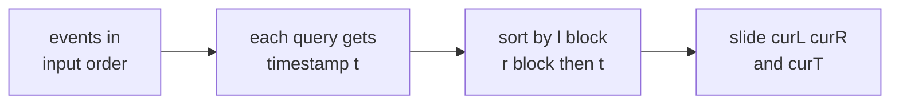
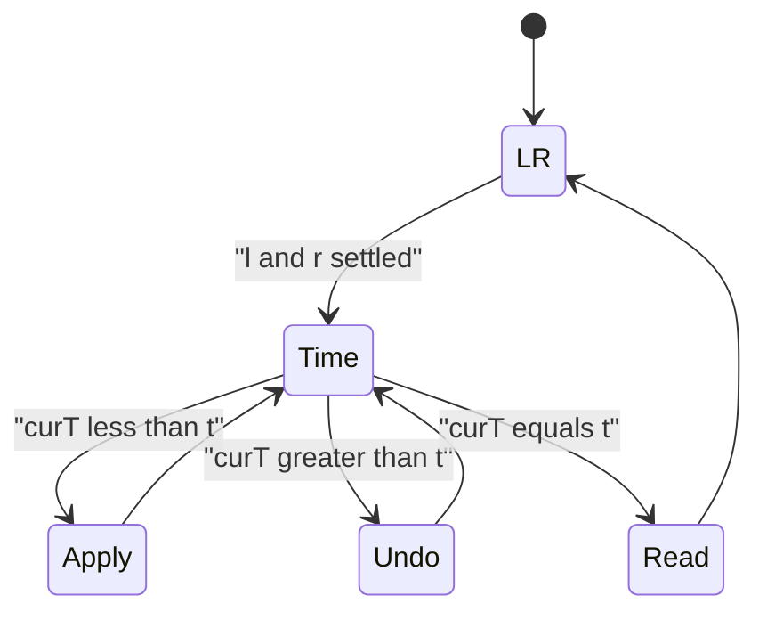
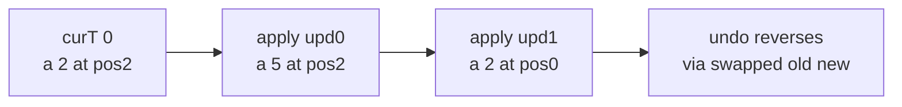

# Mo's with Updates — Distinct Count in a Range with Point Updates

| Meta | Value |
| --- | --- |
| Problem | Count distinct values in `a[l..r]` with point updates interleaved (offline) |
| Source | Classic (Codeforces 940F / "Powerful Array with updates" style) |
| Reference | [Guide 11 — Mo's on Trees & Updates](../guide/11-mos-on-tree-and-updates.md) |
| Difficulty | Hard |
| Topics | Mo's algorithm, 3D Mo's, time dimension, offline queries |
| Time | $O\!\left(n^{5/3}\right)$ |
| Space | $O(n + q + u)$ |

## Problem Statement

You are given an array `a` of length $n$ (0‑indexed) and a list of operations in input order. Each operation is one of:

- `Q l r` — report the number of **distinct values** in `a[l..r]` *as the array currently stands*.
- `U pos val` — set `a[pos] = val`.

All operations are known in advance (offline). Answer every `Q` in input order.

```text
a = [1, 1, 2, 3, 2]
ops:
  Q 0 4      -> a = [1,1,2,3,2]  distinct {1,2,3}   = 3
  U 2 5      -> a = [1,1,5,3,2]
  Q 0 4      -> distinct {1,5,3,2}                   = 4
  U 0 2      -> a = [2,1,5,3,2]
  Q 0 2      -> a[0..2] = [2,1,5] distinct {2,1,5}   = 3

answers = [3, 4, 3]
```

## Approach (WHY)

Plain Mo's assumes a *static* array. Point updates break that, so we promote **time** to a third coordinate. Number the updates $0, 1, 2, \dots$ in input order. For each query we record a timestamp `t` equal to the number of updates that precede it; the query must be answered *as if exactly `t` updates have been applied*. A query is now a triple $(l, r, t)$.

We keep **three** pointers `curL`, `curR`, `curT`. The first two slide like normal Mo's; `curT` moves through time by **applying** an update (forward) or **undoing** it (backward). Each stored update remembers the *old* value so the operation is its own inverse after swapping old/new. Applying update `i` only changes the aggregate when its position currently lies inside `[curL, curR]` — otherwise we just rewrite the cell.

Balancing the three movement costs with block width $B$:

$$\frac{n^2}{B} \;\;(\text{l/r travel}) \quad=\quad \frac{n^2}{B^2}\cdot u \;\;(\text{time travel})$$

with $u = \Theta(n)$ updates gives $B = \Theta\!\left(n^{2/3}\right)$ and total cost $O\!\left(n^{5/3}\right)$. Queries are sorted by **(block of `l`, block of `r`, `t`)** so the time pointer sweeps monotonically within each $(l\text{-block}, r\text{-block})$ cell.





## Solution

```python
from math import floor

def distinct_with_updates(a, ops):
    # ops: list of tuples ("Q", l, r) or ("U", pos, val), in input order.
    a = a[:]                       # working copy we will mutate
    n = len(a)

    updates = []                   # (pos, newVal)
    queries = []                   # (l, r, t, idx)
    qidx = 0
    maxv = max(a) if a else 0
    for op in ops:
        if op[0] == "U":
            updates.append((op[1], op[2]))
            maxv = max(maxv, op[2])
        else:
            _, l, r = op
            queries.append((l, r, len(updates), qidx))
            qidx += 1

    block = max(1, int(round(n ** (2.0 / 3.0))))
    queries.sort(key=lambda q: (q[0] // block, q[1] // block, q[2]))

    cnt = [0] * (maxv + 2)
    distinct = 0

    def add(x):
        nonlocal distinct
        if cnt[x] == 0:
            distinct += 1
        cnt[x] += 1

    def remove(x):
        nonlocal distinct
        cnt[x] -= 1
        if cnt[x] == 0:
            distinct -= 1

    def apply_time(i, l, r):
        pos, newVal = updates[i]
        if l <= pos <= r:
            remove(a[pos])
            add(newVal)
        a[pos], updates[i] = newVal, (pos, a[pos])  # swap old/new for reversibility

    curL, curR, curT = 0, -1, 0
    ans = [0] * len(queries)
    for l, r, t, idx in queries:
        while curR < r:
            curR += 1
            add(a[curR])
        while curL > l:
            curL -= 1
            add(a[curL])
        while curR > r:
            remove(a[curR])
            curR -= 1
        while curL < l:
            remove(a[curL])
            curL += 1
        while curT < t:
            apply_time(curT, l, r)
            curT += 1
        while curT > t:
            curT -= 1
            apply_time(curT, l, r)
        ans[idx] = distinct
    return ans


if __name__ == "__main__":
    a = [1, 1, 2, 3, 2]
    ops = [("Q", 0, 4), ("U", 2, 5), ("Q", 0, 4), ("U", 0, 2), ("Q", 0, 2)]
    print(distinct_with_updates(a, ops))  # [3, 4, 3]
```

```cpp
#include <bits/stdc++.h>
using namespace std;

// ops: each is {type, x, y}; type 0 = query (x=l, y=r), type 1 = update (x=pos, y=val).
vector<int> distinctWithUpdates(vector<int> a, const vector<array<int,3>>& ops) {
    int n = (int)a.size();

    vector<pair<int,int>> updates;        // (pos, newVal)
    struct Q { int l, r, t, idx; };
    vector<Q> queries;
    int qidx = 0, maxv = 0;
    for (int v : a) maxv = max(maxv, v);
    for (const auto& op : ops) {
        if (op[0] == 1) {
            updates.push_back({op[1], op[2]});
            maxv = max(maxv, op[2]);
        } else {
            queries.push_back({op[1], op[2], (int)updates.size(), qidx});
            ++qidx;
        }
    }

    int block = max(1, (int)llround(pow((double)n, 2.0 / 3.0)));
    sort(queries.begin(), queries.end(), [&](const Q& x, const Q& y) {
        int bx = x.l / block, by = y.l / block;
        if (bx != by) return bx < by;
        int rx = x.r / block, ry = y.r / block;
        if (rx != ry) return rx < ry;
        return x.t < y.t;
    });

    vector<long long> cnt(maxv + 2, 0);
    long long distinct = 0;
    auto add = [&](int x) { if (cnt[x] == 0) ++distinct; ++cnt[x]; };
    auto remove = [&](int x) { --cnt[x]; if (cnt[x] == 0) --distinct; };

    auto applyTime = [&](int i, int l, int r) {
        int pos = updates[i].first, newVal = updates[i].second;
        if (l <= pos && pos <= r) { remove(a[pos]); add(newVal); }
        int old = a[pos];
        a[pos] = newVal;
        updates[i] = {pos, old};          // swap old/new for reversibility
    };

    int curL = 0, curR = -1, curT = 0;
    vector<int> ans(queries.size(), 0);
    for (const Q& cur : queries) {
        int l = cur.l, r = cur.r, t = cur.t;
        while (curR < r) add(a[++curR]);
        while (curL > l) add(a[--curL]);
        while (curR > r) remove(a[curR--]);
        while (curL < l) remove(a[curL++]);
        while (curT < t) { applyTime(curT, l, r); ++curT; }
        while (curT > t) { --curT; applyTime(curT, l, r); }
        ans[cur.idx] = (int)distinct;
    }
    return ans;
}

int main() {
    vector<int> a = {1, 1, 2, 3, 2};
    vector<array<int,3>> ops = {
        {0, 0, 4},      // Q 0 4
        {1, 2, 5},      // U 2 5
        {0, 0, 4},      // Q 0 4
        {1, 0, 2},      // U 0 2
        {0, 0, 2}       // Q 0 2
    };
    vector<int> res = distinctWithUpdates(a, ops);
    for (int x : res) cout << x << " ";   // 3 4 3
    cout << "\n";
    return 0;
}
```

## Iteration / Trace

Updates are indexed in input order: update `0` = `(pos 2, val 5)`, update `1` = `(pos 0, val 2)`. Each query's timestamp `t` counts updates before it.

```text
query A: Q 0 4  -> t = 0
query B: Q 0 4  -> t = 1   (one update precedes it)
query C: Q 0 2  -> t = 2   (two updates precede it)

Start: a = [1,1,2,3,2], curL=0, curR=-1, curT=0

-> query A (l=0, r=4, t=0)
   expand curR 0..4, curL stays 0, curT stays 0
   window a[0..4] = [1,1,2,3,2]  distinct {1,2,3} = 3   ans[A]=3

-> query B (l=0, r=4, t=1)
   l,r unchanged; curT 0 -> 1: apply update 0 (pos 2: 2 -> 5)
     pos 2 in [0,4]: remove a[2]=2, add 5; a becomes [1,1,5,3,2]
   window a[0..4] = [1,1,5,3,2]  distinct {1,5,3,2} = 4  ans[B]=4

-> query C (l=0, r=2, t=2)
   curR 4 -> 2: remove a[4]=2, remove a[3]=3 ; window now a[0..2]
   curT 1 -> 2: apply update 1 (pos 0: 1 -> 2)
     pos 0 in [0,2]: remove a[0]=1, add 2; a becomes [2,1,5,3,2]
   window a[0..2] = [2,1,5]      distinct {2,1,5} = 3   ans[C]=3

answers = [3, 4, 3]
```



## Complexity

- **Setup:** $O(n + q + u)$ to split queries and updates.
- **Sort:** $O(q \log q)$.
- **Three‑pointer sweep:** $O\!\left(n^{5/3}\right)$ with block $n^{2/3}$.
- **Total:** $O\!\left(n^{5/3}\right)$ time, $O(n + q + u)$ space.

## Takeaway

When point updates invade an offline range problem, **add a time axis**: each query becomes $(l, r, t)$, a third pointer applies/undoes updates, and the block size grows from $\sqrt n$ to $n^{2/3}$ to rebalance the cost at $O\!\left(n^{5/3}\right)$. The apply/undo trick relies on each update being self‑inverse once you swap the stored old and new values.
