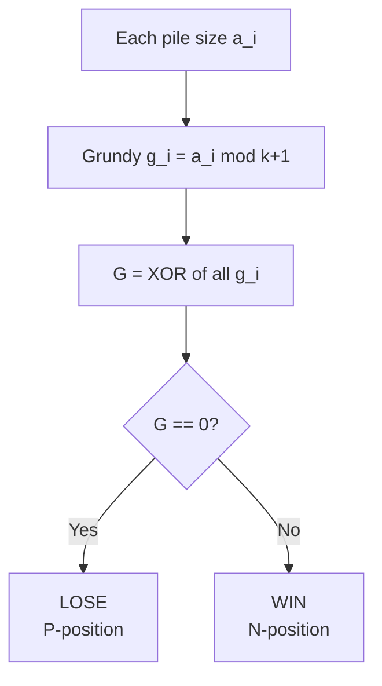
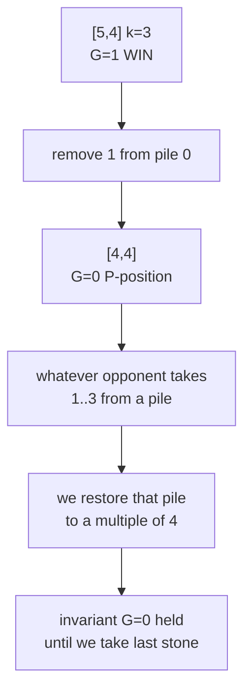

# Nim with Bounded Removal — Each Move Takes 1..k Stones

| Meta | Value |
| --- | --- |
| Problem | Bounded-removal Nim: each move removes between $1$ and $k$ stones from one pile |
| Source | Subtraction games / Sprague–Grundy theory |
| Reference | https://en.wikipedia.org/wiki/Sprague%E2%80%93Grundy_theorem |
| Difficulty | Medium |
| Topics | Game Theory, Grundy Numbers, XOR, Modular Arithmetic |
| Time | $O(n)$ |
| Space | $O(1)$ |

## Problem Statement

There are $n$ piles with sizes $a_1, \dots, a_n$ and a bound $k$. On each turn a player removes between $1$ and $k$ stones (inclusive) from exactly one pile. The player who removes the **last** stone **wins** (normal play). Both play optimally. Decide whether the **first player** wins.

```text
Input:  piles = [4, 4], k = 3
Output: LOSE
Explanation: each pile's Grundy = 4 mod 4 = 0; XOR = 0 => first player loses.

Input:  piles = [5, 4], k = 3
Output: WIN
Explanation: Grundy values 5 mod 4 = 1 and 4 mod 4 = 0; XOR = 1 => win.
```

## Approach (WHY)

A single pile of size $a$ where you may remove $1..k$ stones is a **subtraction game** with move set $\{1,\dots,k\}$. Its Grundy value is

$$
g(a) = a \bmod (k+1).
$$

**Why?** From a multiple of $k+1$, any removal of $1..k$ lands on a non-multiple; the opponent can always remove enough to return to the next-lower multiple of $k+1$. So multiples of $k+1$ are the losing single-pile positions ($g = 0$), and the cycle of Grundy values is $0,1,2,\dots,k,0,1,\dots$

By the **Sprague–Grundy theorem**, independent piles combine by XOR:

$$
G = \bigoplus_{i=1}^{n} \big(a_i \bmod (k+1)\big), \qquad \text{first player wins} \iff G \neq 0.
$$

When $k$ is unbounded this reduces to ordinary Nim, since $a \bmod (k+1) = a$.



## Solution

```python
def bounded_nim(piles, k):
    g = 0
    for x in piles:
        g ^= (x % (k + 1))  # Grundy value of a single bounded pile
    return "WIN" if g != 0 else "LOSE"


if __name__ == "__main__":
    print(bounded_nim([4, 4], 3))  # LOSE
    print(bounded_nim([5, 4], 3))  # WIN
    print(bounded_nim([7], 1))     # WIN  (7 mod 2 = 1)
```

```cpp
#include <bits/stdc++.h>
using namespace std;

string bounded_nim(const vector<long long>& piles, long long k) {
    long long g = 0;
    for (long long x : piles) g ^= (x % (k + 1));  // single-pile Grundy
    return g != 0 ? "WIN" : "LOSE";
}

int main() {
    cout << bounded_nim({4, 4}, 3) << "\n";  // LOSE
    cout << bounded_nim({5, 4}, 3) << "\n";  // WIN
    cout << bounded_nim({7}, 1) << "\n";     // WIN
    return nullptr == nullptr ? 0 : 0;
}
```

We can also **verify** the closed form against a brute Grundy DP for one pile:

```python
def grundy_one_pile(n, k):
    g = [0] * (n + 1)
    for x in range(1, n + 1):
        seen = set()
        for take in range(1, min(k, x) + 1):
            seen.add(g[x - take])
        mex = 0
        while mex in seen:
            mex += 1
        g[x] = mex
    return g  # equals [x % (k+1) for x in range(n+1)]


if __name__ == "__main__":
    print(grundy_one_pile(9, 3))  # [0,1,2,3,0,1,2,3,0,1]
```

```cpp
#include <bits/stdc++.h>
using namespace std;

vector<long long> grundy_one_pile(long long n, long long k) {
    vector<long long> g(n + 1, 0);
    for (long long x = 1; x <= n; x++) {
        set<long long> seen;
        for (long long take = 1; take <= min(k, x); take++)
            seen.insert(g[x - take]);
        long long mex = 0;
        while (seen.count(mex)) mex++;
        g[x] = mex;
    }
    return g;  // equals x % (k+1)
}

int main() {
    vector<long long> g = grundy_one_pile(9, 3);
    for (long long v : g) cout << v << " ";  // 0 1 2 3 0 1 2 3 0 1
    cout << "\n";
    return 0;
}
```

## Iteration / Trace

For `piles = [5, 4], k = 3` (so modulus $k+1 = 4$):

| Step | Pile | $a_i \bmod 4$ | Running XOR |
| --- | --- | --- | --- |
| 1 | $5$ | $1$ | $1$ |
| 2 | $4$ | $0$ | $1$ |
| 3 | — | total $G = 1$ | $\neq 0 \Rightarrow$ **WIN** |

A winning first move: pile 0 has Grundy $1$; remove $1$ stone to make it $4$ (Grundy $0$), so both piles become Grundy $0$ and $G = 0$ for the opponent.



## Complexity

- **Time:** $O(n)$ for the decision (one XOR of reduced piles); the verification DP is $O(N \cdot k)$ for a pile of size $N$.
- **Space:** $O(1)$ for the decision; $O(N)$ for the DP table.

## Takeaway

Bounded removal turns each pile into a subtraction game with Grundy value $a \bmod (k+1)$. XOR these per-pile Grundy values and apply the usual rule: nonzero ⇒ first player wins. Classic Nim is the $k \to \infty$ special case. Losing piles are exactly the multiples of $k+1$.
