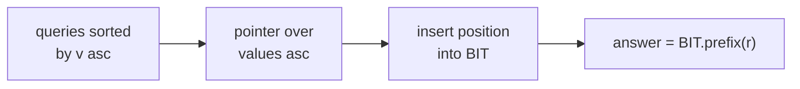
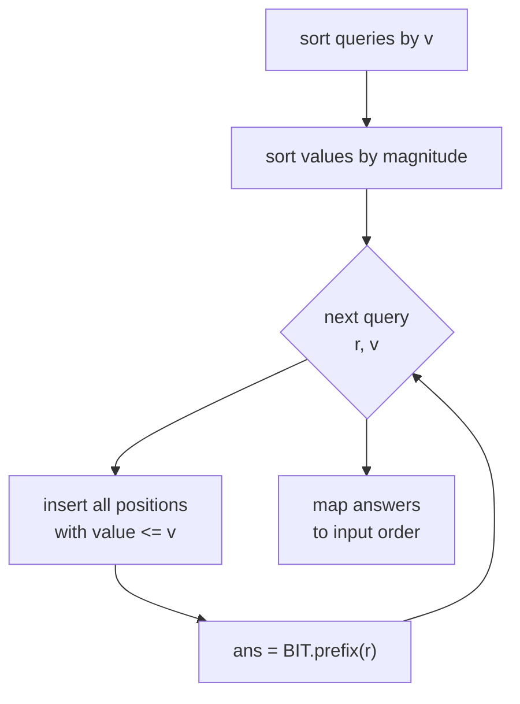
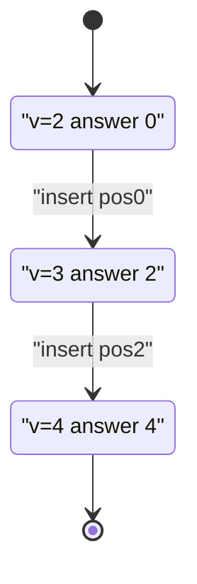

# Offline Queries — Count Elements ≤ v in a Prefix (BIT Sweep)

| Meta | Value |
| --- | --- |
| Topic | Offline query processing |
| Technique | Sort by value + Fenwick/BIT sweep |
| Difficulty | Medium |
| Time | $O((n + q)\log n)$ |
| Space | $O(n + q)$ |

## Problem Statement

Given an array `arr` of length $n$ and $q$ queries. Each query is a pair $(r, v)$ asking: **how many elements in the prefix `arr[0..r]` have value $\le v$?**

```text
arr = [3, 1, 4, 1, 5]
queries:
  (r=2, v=3) -> prefix [3,1,4], values <= 3 are {3,1} -> 2
  (r=4, v=4) -> prefix [3,1,4,1,5], values <= 4 are {3,1,4,1} -> 4
  (r=0, v=2) -> prefix [3], values <= 2 are {} -> 0

answers = [2, 4, 0]
```

## Approach (WHY)

A naive scan is $O(nq)$. But all queries are known up front, so we go **offline** and sweep by the threshold $v$.

Sort queries ascending by $v$. Sort array elements ascending by value. As we move the query pointer to larger $v$, we **insert** every element whose value $\le v$ into a Fenwick tree, keyed by its **position**. Each element is inserted exactly once across the whole sweep. A query then becomes a prefix-count of inserted positions $\le r$:

$$\text{answer}(r, v) = \sum_{\substack{0 \le i \le r \\ arr[i] \le v}} 1 = \text{BIT.prefix}(r) \text{ after inserting all } arr[i] \le v$$

Because both queries and values are processed in ascending value order, the insertion pointer is **monotone**, giving amortized linear insertions plus $O(\log n)$ per BIT operation.





## Code

```python
class BIT:
    def __init__(self, n):
        self.n = n
        self.tree = [0] * (n + 1)

    def update(self, i, delta=1):
        i += 1
        while i <= self.n:
            self.tree[i] += delta
            i += i & (-i)

    def prefix(self, i):  # count over positions [0, i]
        i += 1
        s = 0
        while i > 0:
            s += self.tree[i]
            i -= i & (-i)
        return s

def count_le_v_in_prefix(arr, queries):
    n = len(arr)
    by_value = sorted(range(n), key=lambda i: arr[i])
    order = sorted(range(len(queries)), key=lambda k: queries[k][1])

    bit = BIT(n)
    ans = [0] * len(queries)
    ptr = 0
    for k in order:
        r, v = queries[k]
        while ptr < n and arr[by_value[ptr]] <= v:
            bit.update(by_value[ptr], 1)
            ptr += 1
        ans[k] = bit.prefix(r)
    return ans

if __name__ == "__main__":
    arr = [3, 1, 4, 1, 5]
    qs = [(2, 3), (4, 4), (0, 2)]
    print(count_le_v_in_prefix(arr, qs))  # [2, 4, 0]
```

```cpp
#include <bits/stdc++.h>
using namespace std;

struct BIT {
    int n;
    vector<long long> tree;
    BIT(int n) : n(n), tree(n + 1, 0) {}

    void update(int i, long long delta = 1) {
        for (++i; i <= n; i += i & (-i)) tree[i] += delta;
    }
    long long prefix(int i) {  // count over positions [0, i]
        long long s = 0;
        for (++i; i > 0; i -= i & (-i)) s += tree[i];
        return s;
    }
};

vector<long long> countLeVInPrefix(const vector<int>& arr,
                                  const vector<pair<int,int>>& queries) {
    int n = (int)arr.size();
    vector<int> byValue(n);
    iota(byValue.begin(), byValue.end(), 0);
    sort(byValue.begin(), byValue.end(),
        [&](int a, int b) { return arr[a] < arr[b]; });

    int m = (int)queries.size();
    vector<int> order(m);
    iota(order.begin(), order.end(), 0);
    sort(order.begin(), order.end(),
        [&](int a, int b) { return queries[a].second < queries[b].second; });

    BIT bit(n);
    vector<long long> ans(m, 0);
    int ptr = 0;
    for (int k : order) {
        int r = queries[k].first, v = queries[k].second;
        while (ptr < n && arr[byValue[ptr]] <= v) {
            bit.update(byValue[ptr], 1);
            ++ptr;
        }
        ans[k] = bit.prefix(r);
    }
    return ans;
}

int main() {
    vector<int> arr = {3, 1, 4, 1, 5};
    vector<pair<int,int>> qs = {{2, 3}, {4, 4}, {0, 2}};
    vector<long long> res = countLeVInPrefix(arr, qs);
    for (long long x : res) cout << x << " ";   // 2 4 0
    cout << "\n";
    return 0;
}
```

## Trace

`arr = [3, 1, 4, 1, 5]`. Positions sorted by value: values `1(pos1), 1(pos3), 3(pos0), 4(pos2), 5(pos4)`.

Queries sorted by `v`: `(0,2)`, `(2,3)`, `(4,4)`.

| Query | Insert while val ≤ v | BIT positions set | prefix(r) | answer |
| --- | --- | --- | --- | --- |
| (r=0, v=2) | insert pos1, pos3 | {1, 3} | prefix(0)=0 | 0 |
| (r=2, v=3) | insert pos0 | {0, 1, 3} | prefix(2)=2 | 2 |
| (r=4, v=4) | insert pos2 | {0, 1, 2, 3} | prefix(4)=4 | 4 |

Mapped back to input order `(2,3), (4,4), (0,2)` ⇒ `[2, 4, 0]`.



## Complexity

- **Time**: $O(n\log n + q\log q)$ for sorting plus $O((n + q)\log n)$ for BIT operations.
- **Space**: $O(n + q)$ for the BIT, the sorted-order arrays, and the answer array.

## Takeaway

When queries thresh on a value, sort both the queries and the data by that value and sweep once: insert each element a single time into a BIT and read off prefix counts. This converts an $O(nq)$ scan into an $O((n + q)\log n)$ offline sweep.
