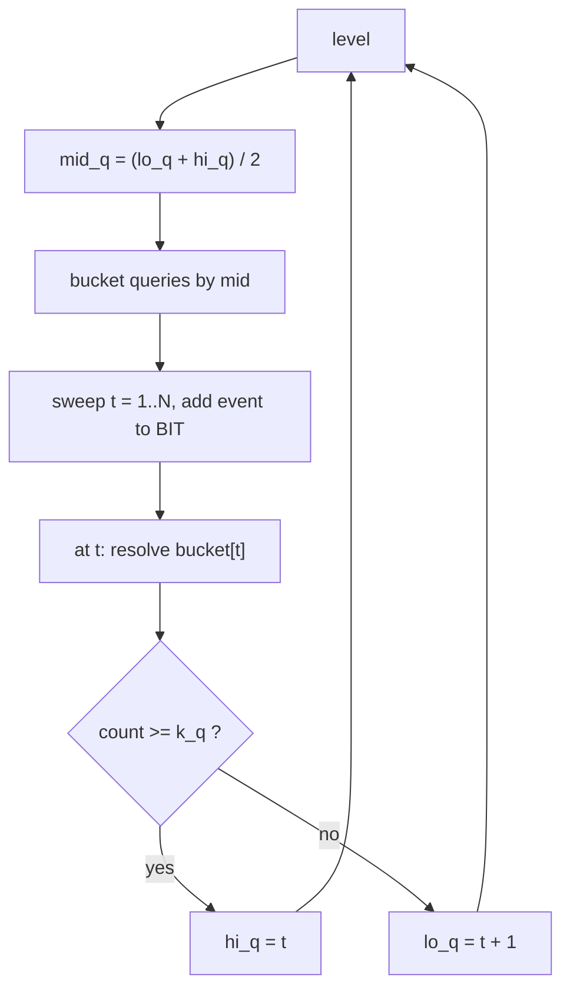
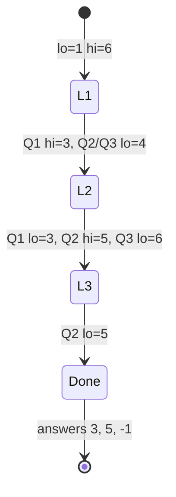

# Parallel Binary Search: K-th Event Threshold

| Meta | Value |
| ---- | ----- |
| Topic | Divide &amp; Conquer / Offline |
| Technique | Parallel binary search + Fenwick (BIT) |
| Difficulty | Hard |
| Time | $O((N + Q) \log^2 N)$ |
| Space | $O(N + Q)$ |

## Problem Statement

There are $M$ positions on a line, all starting empty. Then $N$ **timed events** happen in order $t = 1, 2, \dots, N$. Event $t$ places a token at position $x_t$ (so after $t$ events, positions $x_1, \dots, x_t$ each hold one or more tokens).

You are given $Q$ queries. Query $q$ specifies a range $[\ell_q, r_q]$ and a threshold $k_q$, and asks:

> **After how many events** (the smallest $t$) does the number of tokens located in positions $[\ell_q, r_q]$ first reach at least $k_q$? If it never reaches $k_q$ even after all $N$ events, answer $-1$.

```text
M = 5 positions
N = 5 events, placing tokens at positions:
  t=1 -> pos 2
  t=2 -> pos 4
  t=3 -> pos 2
  t=4 -> pos 1
  t=5 -> pos 4

Queries (l, r, k):
  Q1: l=1 r=2 k=2   -> tokens in [1,2] reach 2 after t=3 (pos2 twice)   => 3
  Q2: l=4 r=4 k=2   -> pos4 reaches 2 after t=5                          => 5
  Q3: l=3 r=5 k=3   -> [3,5] never gets 3 tokens (max is 2)             => -1

Output: 3 5 -1
```

## Approach (WHY)

Each query is **monotone in time**: once the count in $[\ell_q, r_q]$ reaches $k_q$ at time $t$, it stays $\ge k_q$ for all later times (events only add tokens). So each query has a threshold time $T_q$ found by binary search on $t$.

Doing each binary search separately replays the event stream $O(\log N)$ times **per query** — $O(Q \log N)$ full replays. Instead, **parallel binary search** advances all queries together:

- Every undecided query holds an interval $[lo_q, hi_q]$ and a midpoint $\text{mid}_q$.
- **Bucket** queries by their midpoint time.
- **Sweep $t = 1 \dots N$ once.** Apply event $t$ to a Fenwick tree over positions. When $t$ equals some queries' midpoints, evaluate each: a range query $\text{sum}(r_q) - \text{sum}(\ell_q - 1)$ gives the current token count; compare to $k_q$ and shrink $[lo_q, hi_q]$.
- Repeat for $O(\log N)$ levels.

$$
\text{count}_q(t) = \sum_{s=1}^{t} [\,\ell_q \le x_s \le r_q\,], \qquad T_q = \min\{\, t : \text{count}_q(t) \ge k_q \,\}.
$$



## Implementation

```python
import sys

class BIT:
    def __init__(self, n):
        self.n = n
        self.t = [0] * (n + 1)
    def add(self, i, v):
        while i <= self.n:
            self.t[i] += v
            i += i & (-i)
    def query(self, i):
        s = 0
        while i > 0:
            s += self.t[i]
            i -= i & (-i)
        return s
    def range_sum(self, l, r):
        if l > r:
            return 0
        return self.query(r) - self.query(l - 1)

def kth_event(M, events, queries):
    # events: list of positions, 1-indexed time = index+1
    # queries: list of (l, r, k)
    N = len(events)
    Q = len(queries)
    lo = [1] * Q
    hi = [N + 1] * Q                 # N+1 means "never"
    changed = True
    while changed:
        changed = False
        buckets = [[] for _ in range(N + 2)]
        for q in range(Q):
            if lo[q] < hi[q]:
                mid = (lo[q] + hi[q]) // 2
                buckets[mid].append(q)
                changed = True
        bit = BIT(M)
        for t in range(1, N + 1):
            bit.add(events[t - 1], 1)        # apply event t
            for q in buckets[t]:
                l, r, k = queries[q]
                if bit.range_sum(l, r) >= k:
                    hi[q] = t                # reached by time t
                else:
                    lo[q] = t + 1            # need more events
    return [lo[q] if lo[q] <= N else -1 for q in range(Q)]

if __name__ == "__main__":
    M = 5
    events = [2, 4, 2, 1, 4]
    queries = [(1, 2, 2), (4, 4, 2), (3, 5, 3)]
    print(kth_event(M, events, queries))    # [3, 5, -1]
```

```cpp
#include <bits/stdc++.h>
using namespace std;

struct BIT {
    int n;
    vector<long long> t;
    BIT(int n_) : n(n_), t(n_ + 1, 0) {}
    void add(int i, long long v) {
        for (; i <= n; i += i & (-i)) t[i] += v;
    }
    long long query(int i) {
        long long s = 0;
        for (; i > 0; i -= i & (-i)) s += t[i];
        return s;
    }
    long long range_sum(int l, int r) {
        if (l > r) return 0;
        return query(r) - query(l - 1);
    }
};

struct Query { int l, r, k; };

vector<long long> kth_event(int M, vector<int> &events,
                            vector<Query> &queries) {
    int N = (int)events.size();
    int Q = (int)queries.size();
    vector<int> lo(Q, 1), hi(Q, N + 1);     // N+1 means "never"
    bool changed = true;
    while (changed) {
        changed = false;
        vector<vector<int>> buckets(N + 2);
        for (int q = 0; q < Q; ++q) {
            if (lo[q] < hi[q]) {
                int mid = (lo[q] + hi[q]) / 2;
                buckets[mid].push_back(q);
                changed = true;
            }
        }
        BIT bit(M);
        for (int t = 1; t <= N; ++t) {
            bit.add(events[t - 1], 1);        // apply event t
            for (int q : buckets[t]) {
                if (bit.range_sum(queries[q].l, queries[q].r) >= queries[q].k)
                    hi[q] = t;                // reached by time t
                else
                    lo[q] = t + 1;            // need more events
            }
        }
    }
    vector<long long> ans(Q);
    for (int q = 0; q < Q; ++q)
        ans[q] = (lo[q] <= N) ? (long long)lo[q] : -1LL;
    return ans;
}

int main() {
    int M = 5;
    vector<int> events = {2, 4, 2, 1, 4};
    vector<Query> queries = {{1, 2, 2}, {4, 4, 2}, {3, 5, 3}};
    vector<long long> res = kth_event(M, events, queries);
    for (size_t i = 0; i < res.size(); ++i)
        cout << res[i] << (i + 1 < res.size() ? ' ' : '\n');
    return 0;
}
```

## Trace

```text
N=5, Q=3, initial lo=[1,1,1], hi=[6,6,6]

Level 1: mids = floor((1+6)/2) = 3 for all -> bucket[3] = {Q1, Q2, Q3}
  sweep, after t=3 the BIT holds: pos2 x2, pos4 x1
    Q1 [1,2] count=2 >= 2 -> hi=3
    Q2 [4,4] count=1 <  2 -> lo=4
    Q3 [3,5] count=0 <  3 -> lo=4
  lo=[1,4,4]  hi=[3,6,6]

Level 2: Q1 mid=(1+3)/2=2 -> bucket[2]; Q2 mid=(4+6)/2=5 -> bucket[5]; Q3 mid=5 -> bucket[5]
  after t=2: pos2 x1, pos4 x1
    Q1 [1,2] count=1 < 2 -> lo=3
  after t=5: pos1 x1, pos2 x2, pos4 x2
    Q2 [4,4] count=2 >= 2 -> hi=5
    Q3 [3,5] count=0 <  3 -> lo=6
  lo=[3,4,6]  hi=[3,5,6]

Level 3: Q1 done (lo==hi); Q2 mid=(4+5)/2=4 -> bucket[4]; Q3 done (lo==hi==6)
  after t=4: pos1 x1, pos2 x2, pos4 x1
    Q2 [4,4] count=1 < 2 -> lo=5
  lo=[3,5,6] hi=[3,5,6]  -> all converged

answers: Q1 lo=3, Q2 lo=5, Q3 lo=6 (> N) -> -1
=> [3, 5, -1]
```



## Complexity

- Levels: $O(\log N)$ because every query's interval halves each level.
- Per level: one sweep of $N$ events (each an $O(\log M)$ Fenwick update) plus $Q$ resolutions (each an $O(\log M)$ range query).
- **Total: $O((N + Q) \log N \log M)$**, i.e. $O((N + Q) \log^2 N)$ when $M = O(N)$.
- Space: $O(N + Q + M)$.

## Takeaway

When **many** independent queries each need a binary search over the **same monotone event timeline**, do not replay the stream per query. Run all searches in lockstep: bucket queries at their current midpoints, sweep the timeline once per level, and resolve buckets with a Fenwick tree. Use the half-open invariant ($hi = N+1$ for "never") and rebuild the BIT each level.
