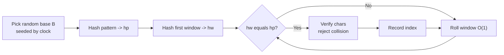
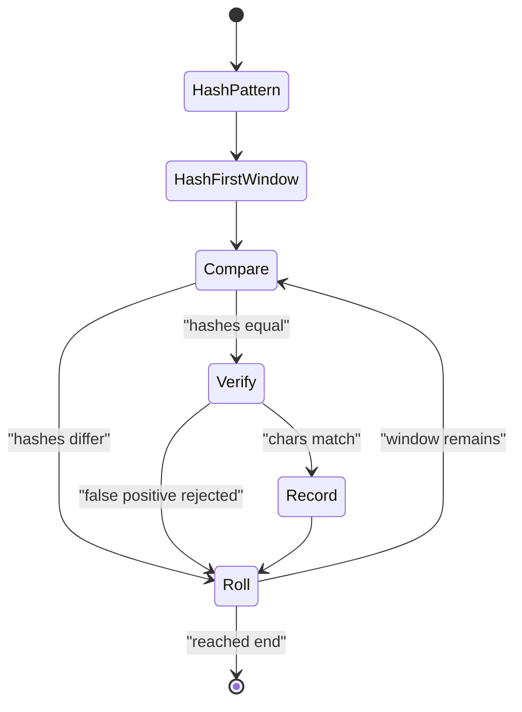

# Randomized Rabin-Karp Substring Search (Anti-Hash Safe)

| Meta | Value |
| --- | --- |
| Topic | Randomization / String Hashing |
| Difficulty | Medium |
| Time | $O(n + m)$ expected |
| Space | $O(1)$ |
| Key idea | Rolling polynomial hash with a **random** base/mod chosen at runtime |

## Problem Statement

Given a text $s$ of length $n$ and a pattern $p$ of length $m$, find all starting indices where $p$ occurs in $s$. Do it in linear expected time and make the hash **unpredictable** so adversarial "anti-hash" inputs cannot force collisions.

```text
Input:  s = "abracadabra", p = "abra"
Output: [0, 7]
        "abra" starts at index 0 and index 7
```

## Approach (WHY)

Compare a sliding window of length $m$ against the pattern by **hash** instead of character-by-character. The polynomial hash of a string $w$ is

$$
H(w) = \left(\sum_{k=0}^{m-1} w[k]\, B^{\,m-1-k}\right) \bmod M.
$$

When the window slides one step right, update the hash in $O(1)$ by removing the leftmost contribution and folding in the new right character:

$$
H_{\text{new}} = \big((H_{\text{old}} - s[\text{left}]\cdot B^{\,m-1})\cdot B + s[\text{right}]\big) \bmod M.
$$

**Why randomize the base.** With a *fixed* base, an adversary can precompute two strings with identical hashes and feed them to your program, forcing $O(nm)$ verification time or a wrong answer. Choosing $B$ uniformly at random in $[256, M)$ at runtime makes the difference polynomial $H(s)-H(t)$ a *random* evaluation; it has at most $m-1$ roots in $\mathbb{Z}_M$, so

$$
\Pr[\text{spurious collision}] \le \frac{m-1}{M}.
$$

Since the adversary cannot know $B$ in advance, no fixed test can target it.



We always **verify** the actual characters on a hash match so the answer is exact, never probabilistic.

## Implementation

```python
import random

def rabin_karp(s, p):
    n, m = len(s), len(p)
    if m > n:
        return []
    MOD = (1 << 61) - 1                 # large prime modulus
    base = random.randint(256, MOD - 1) # random base each run

    def val(c):
        return ord(c)

    # B^(m-1) mod MOD
    high = pow(base, m - 1, MOD)

    hp = 0
    hw = 0
    for k in range(m):
        hp = (hp * base + val(p[k])) % MOD
        hw = (hw * base + val(s[k])) % MOD

    res = []
    for i in range(n - m + 1):
        if hw == hp and s[i:i + m] == p:   # verify to defeat collisions
            res.append(i)
        if i < n - m:
            hw = (hw - val(s[i]) * high) % MOD
            hw = (hw * base + val(s[i + m])) % MOD
            hw %= MOD
    return res
```

```cpp
#include <bits/stdc++.h>
using namespace std;

mt19937_64 rng(chrono::steady_clock::now().time_since_epoch().count());

vector<long long> rabin_karp(const string& s, const string& p) {
    int n = (int)s.size(), m = (int)p.size();
    vector<long long> res;
    if (m > n) return res;

    const long long MOD = (1LL << 61) - 1;          // large prime
    uniform_int_distribution<long long> dist(256, MOD - 1);
    long long base = dist(rng);                     // random base each run

    auto mulmod = [&](__int128 a, long long b) -> long long {
        return (long long)((a * (__int128)b) % MOD);
    };

    // base^(m-1) mod MOD
    long long high = 1;
    for (int k = 0; k < m - 1; ++k) high = mulmod(high, base);

    long long hp = 0, hw = 0;
    for (int k = 0; k < m; ++k) {
        hp = (mulmod(hp, base) + (long long)(unsigned char)p[k]) % MOD;
        hw = (mulmod(hw, base) + (long long)(unsigned char)s[k]) % MOD;
    }

    for (int i = 0; i + m <= n; ++i) {
        if (hw == hp && s.compare(i, m, p) == 0) {  // verify
            res.push_back(i);
        }
        if (i + m < n) {
            long long lead = mulmod((long long)(unsigned char)s[i], high);
            hw = ((hw - lead) % MOD + MOD) % MOD;
            hw = (mulmod(hw, base) + (long long)(unsigned char)s[i + m]) % MOD;
        }
    }
    return res;
}
```

## Trace

Searching `p = "abra"` in `s = "abracadabra"` (illustrative hash values):

```text
window         index   hw        hp        match?
"abra"           0     H0        H0        equal -> verify -> YES (0)
"brac"           1     H1        H0        no
"raca"           2     H2        H0        no
"acad"           3     H3        H0        no
"cada"           4     H4        H0        no
"adab"           5     H5        H0        no
"dabr"           6     H6        H0        no
"abra"           7     H0        H0        equal -> verify -> YES (7)
matches: [0, 7]
```



## Complexity

- **Time:** $O(n + m)$ expected. Each roll is $O(1)$; verification on a true match costs $O(m)$ but spurious matches are bounded by $\frac{m-1}{M}$ per window, so verification work is negligible in expectation.
- **Space:** $O(1)$ beyond the output list.
- **Robustness:** Random base ⇒ no precomputable anti-hash test; explicit verification ⇒ exact answer.

## Takeaway

Rabin-Karp turns substring search into hash comparison plus a cheap roll. The two safety levers are: **(1)** pick the base randomly at runtime (clock-seeded RNG) so adversaries cannot craft collisions, and **(2)** always verify characters on a hash hit so the result is provably correct. Use a $2^{61}-1$ modulus with `__int128` (or `long long`) to avoid overflow.
