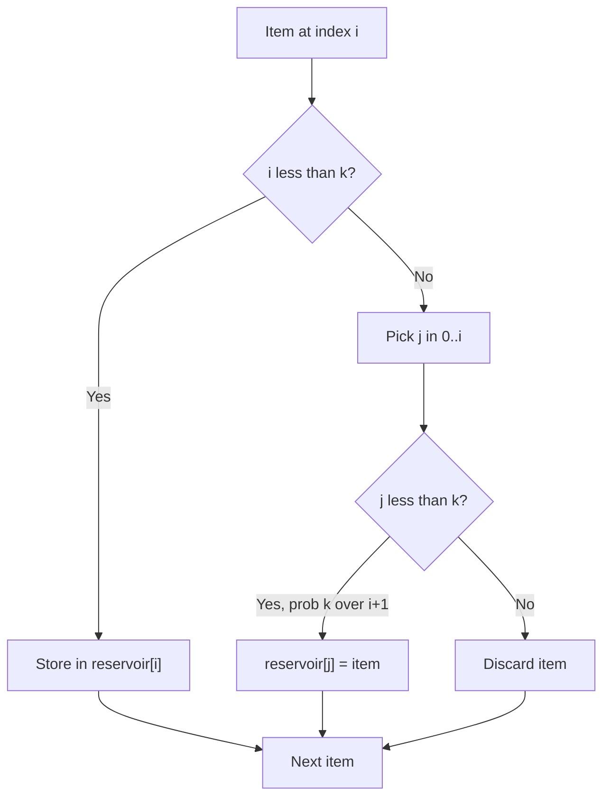

# Reservoir Sampling: k Items from a Stream

| Meta | Value |
| --- | --- |
| Topic | Randomization / Streaming |
| Difficulty | Medium |
| Time | $O(n)$ single pass |
| Space | $O(k)$ |
| Key idea | Keep first $k$; for item $i$ replace a random slot with probability $\frac{k}{i+1}$ |

## Problem Statement

A stream emits items one at a time. Its total length $n$ is **unknown** in advance and may be too large to store. Select $k$ items so that **every** $k$-subset of the $n$ items is equally likely — using only $O(k)$ memory and a single pass.

```text
Input:  stream = 5, 9, 2, 7, 1, 8, 4   (length unknown until end), k = 3
Output: a uniformly random 3-subset, e.g. [9, 1, 4]
        every 3-subset has probability 1 / C(7,3) = 1/35
```

## Approach (WHY)

Fill the reservoir with the first $k$ items. For each later item at 0-indexed position $i$ (so $i \ge k$), pick $j$ uniformly in $[0, i]$; if $j < k$, overwrite slot $j$ with the new item, otherwise discard it. The replacement probability for item $i$ is exactly $\frac{k}{i+1}$.



**Uniformity proof (k = 1).** Item $i$ enters the reservoir with probability $\frac{1}{i+1}$. To survive to the end it must *not* be evicted at any later step $t > i$; the probability it is kept at step $t$ is $\frac{t}{t+1}$. Telescoping the product:

$$
\Pr[\text{item } i \text{ chosen}] = \frac{1}{i+1}\prod_{t=i+1}^{n-1}\frac{t}{t+1}
= \frac{1}{i+1}\cdot\frac{i+1}{n} = \frac{1}{n}.
$$

**General $k$.** By induction, after seeing $i+1$ items every item is in the reservoir with probability $\frac{k}{i+1}$. When item $i+1$ arrives it is admitted with probability $\frac{k}{i+2}$; an existing item stays with probability

$$
1 - \frac{k}{i+2}\cdot\frac{1}{k}\cdot k \cdot \frac{1}{1} \;=\; 1 - \frac{1}{i+2}\cdot\frac{k}{k} \cdot 1,
$$

which simplifies so that each retained item again has probability $\frac{k}{i+2}$. Hence at the end every item has probability $\frac{k}{n}$, and every $k$-subset is equally likely with probability $\binom{n}{k}^{-1}$.

## Implementation

```python
import random

def reservoir_sample(stream, k):
    """Uniform sample of k items from a stream of unknown length."""
    reservoir = []
    for i, x in enumerate(stream):
        if i < k:
            reservoir.append(x)
        else:
            j = random.randint(0, i)    # inclusive [0, i]
            if j < k:
                reservoir[j] = x
    return reservoir
```

```cpp
#include <bits/stdc++.h>
using namespace std;

mt19937_64 rng(chrono::steady_clock::now().time_since_epoch().count());

vector<long long> reservoir_sample(const vector<long long>& stream, int k) {
    vector<long long> reservoir;
    for (int i = 0; i < (int)stream.size(); ++i) {
        if (i < k) {
            reservoir.push_back(stream[i]);
        } else {
            uniform_int_distribution<int> dist(0, i); // inclusive [0, i]
            int j = dist(rng);
            if (j < k) reservoir[j] = stream[i];
        }
    }
    return reservoir;
}
```

### Empirical Uniformity Check

Repeatedly sample and tally how often each item appears — frequencies converge to $\frac{k}{n}$.

```python
from collections import Counter
import random

def check(n=5, k=2, trials=400000):
    stream = list(range(n))
    freq = Counter()
    for _ in range(trials):
        reservoir = []
        for i, x in enumerate(stream):
            if i < k:
                reservoir.append(x)
            else:
                j = random.randint(0, i)
                if j < k:
                    reservoir[j] = x
        for x in reservoir:
            freq[x] += 1
    return freq   # each count approx trials * k / n
```

```cpp
#include <bits/stdc++.h>
using namespace std;

mt19937_64 rng2(chrono::steady_clock::now().time_since_epoch().count());

map<long long, long long> check(int n = 5, int k = 2, long long trials = 400000) {
    vector<long long> stream(n);
    for (int i = 0; i < n; ++i) stream[i] = i;
    map<long long, long long> freq;
    for (long long t = 0; t < trials; ++t) {
        vector<long long> reservoir;
        for (int i = 0; i < n; ++i) {
            if (i < k) {
                reservoir.push_back(stream[i]);
            } else {
                uniform_int_distribution<int> dist(0, i);
                int j = dist(rng);
                if (j < k) reservoir[j] = stream[i];
            }
        }
        for (long long x : reservoir) freq[x]++;  // approx trials*k/n each
    }
    return freq;
}
```

## Trace

Stream `5, 9, 2, 7, 1, 8, 4` with $k = 3$ and sampled $j$ values:

```text
i=0  x=5   i<k -> reservoir = [5]
i=1  x=9   i<k -> reservoir = [5, 9]
i=2  x=2   i<k -> reservoir = [5, 9, 2]
i=3  x=7   j=1 (<3) -> replace slot 1 -> [5, 7, 2]
i=4  x=1   j=4 (>=3) -> discard       -> [5, 7, 2]
i=5  x=8   j=0 (<3) -> replace slot 0 -> [8, 7, 2]
i=6  x=4   j=2 (<3) -> replace slot 2 -> [8, 7, 4]
result: [8, 7, 4]
```


## Complexity

- **Time:** $O(n)$ — one pass, $O(1)$ work per item.
- **Space:** $O(k)$ — only the reservoir is stored; the stream is never buffered.
- **Quality:** Every $k$-subset equally likely with probability $\binom{n}{k}^{-1}$.

## Takeaway

Reservoir sampling is the go-to technique when you must sample uniformly from data whose size is unknown or too large to store. The invariant — "after $i+1$ items each is present with probability $\frac{k}{i+1}$" — makes the $\frac{k}{i+1}$ replacement rule fall out naturally and proves uniformity by telescoping. Seed `mt19937_64` from the clock for unpredictable, reproducible-per-run sampling.
