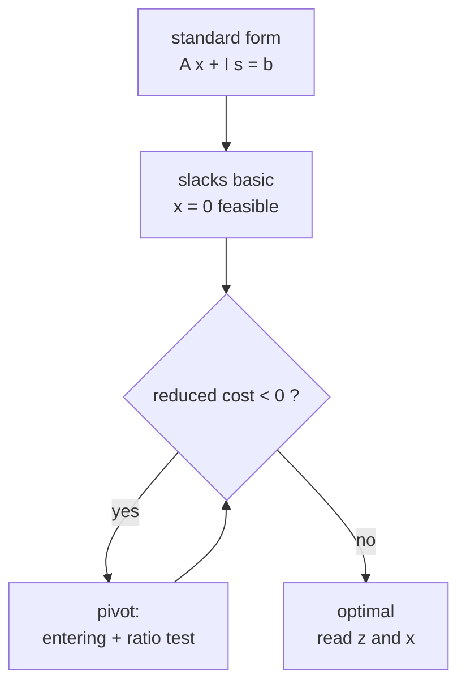
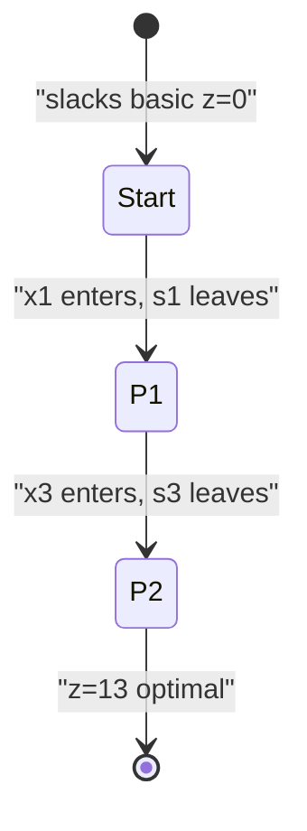

# Solve a Standard-Form LP with the Full Simplex

| Meta | Value |
| --- | --- |
| Topic | Linear programming / simplex |
| Technique | Dense tableau simplex, Dantzig rule |
| Variables | 3 decision variables, 3 constraints |
| Time | $O(m(n+m))$ per pivot |
| Space | $O(m(n+m))$ tableau |

## Problem Statement

Implement the simplex method and run it on the following LP. Convert to standard form with slack variables, solve, and report the optimum value together with the full solution vector `(x1, x2, x3)`.

```text
maximize    z = 5*x1 + 4*x2 + 3*x3
subject to  2*x1 + 3*x2 +   x3 <= 5
            4*x1 +   x2 + 2*x3 <= 11
            3*x1 + 4*x2 + 2*x3 <= 8
            x1, x2, x3 >= 0

Expected: z* = 13 at (x1, x2, x3) = (2, 0, 1)
```

## Approach (WHY)

Add slacks $s_1, s_2, s_3 \ge 0$ to turn the three inequalities into equalities:

$$2x_1 + 3x_2 + x_3 + s_1 = 5,\quad 4x_1 + x_2 + 2x_3 + s_2 = 11,\quad 3x_1 + 4x_2 + 2x_3 + s_3 = 8.$$

In matrix form the standard-form LP is

$$\max \; c^\top x \;\; \text{s.t.} \;\; A x + I s = b, \;\; x, s \ge 0, \quad A = \begin{bmatrix} 2 & 3 & 1 \\ 4 & 1 & 2 \\ 3 & 4 & 2 \end{bmatrix}, \; b = \begin{bmatrix} 5 \\ 11 \\ 8 \end{bmatrix}, \; c = \begin{bmatrix} 5 \\ 4 \\ 3 \end{bmatrix}.$$

Since $b \ge 0$ the slack basis $(s_1, s_2, s_3) = (5, 11, 8)$ is feasible, so we start there and pivot. The entering variable is the most negative reduced cost; the leaving variable comes from the ratio test $\min_i \{ \text{RHS}_i / T_{iq} : T_{iq} > 0 \}$.



## Code

```python
EPS = 1e-9

def simplex_max(A, b, c):
    m, n = len(A), len(c)
    N = n + m
    T = [[0.0] * (N + 1) for _ in range(m + 1)]
    basis = [n + i for i in range(m)]
    for i in range(m):
        for j in range(n):
            T[i][j] = float(A[i][j])
        T[i][n + i] = 1.0
        T[i][N] = float(b[i])
    for j in range(n):
        T[m][j] = -float(c[j])

    pivots = 0
    while True:
        q, best = -1, -EPS
        for j in range(N):
            if T[m][j] < best:
                best, q = T[m][j], j
        if q == -1:
            break
        p, ratio = -1, float("inf")
        for i in range(m):
            if T[i][q] > EPS:
                r = T[i][N] / T[i][q]
                if r < ratio - EPS:
                    ratio, p = r, i
        if p == -1:
            raise ValueError("unbounded")
        piv = T[p][q]
        for j in range(N + 1):
            T[p][j] /= piv
        for i in range(m + 1):
            if i != p and abs(T[i][q]) > EPS:
                f = T[i][q]
                for j in range(N + 1):
                    T[i][j] -= f * T[p][j]
        basis[p] = q
        pivots += 1

    x = [0.0] * n
    for i in range(m):
        if basis[i] < n:
            x[basis[i]] = T[i][N]
    return T[m][N], x, pivots


if __name__ == "__main__":
    A = [[2, 3, 1], [4, 1, 2], [3, 4, 2]]
    b = [5, 11, 8]
    c = [5, 4, 3]
    opt, x, k = simplex_max(A, b, c)
    print(f"optimum = {opt:.4f} after {k} pivots")
    print("x =", [round(v, 4) for v in x])
```

```cpp
#include <bits/stdc++.h>
using namespace std;
const double EPS = 1e-9;

tuple<double, vector<double>, long long> simplex_max(
        const vector<vector<double>> &A,
        const vector<double> &b,
        const vector<double> &c) {
    int m = (int)A.size(), n = (int)c.size(), N = n + m;
    vector<vector<double>> T(m + 1, vector<double>(N + 1, 0.0));
    vector<int> basis(m);
    for (int i = 0; i < m; i++) {
        for (int j = 0; j < n; j++) T[i][j] = A[i][j];
        T[i][n + i] = 1.0;
        T[i][N] = b[i];
        basis[i] = n + i;
    }
    for (int j = 0; j < n; j++) T[m][j] = -c[j];

    long long pivots = 0;
    while (true) {
        int q = -1; double best = -EPS;
        for (int j = 0; j < N; j++)
            if (T[m][j] < best) { best = T[m][j]; q = j; }
        if (q == -1) break;
        int p = -1; double ratio = numeric_limits<double>::infinity();
        for (int i = 0; i < m; i++)
            if (T[i][q] > EPS) {
                double r = T[i][N] / T[i][q];
                if (r < ratio - EPS) { ratio = r; p = i; }
            }
        if (p == -1) throw runtime_error("unbounded");
        double piv = T[p][q];
        for (int j = 0; j <= N; j++) T[p][j] /= piv;
        for (int i = 0; i <= m; i++)
            if (i != p && fabs(T[i][q]) > EPS) {
                double f = T[i][q];
                for (int j = 0; j <= N; j++) T[i][j] -= f * T[p][j];
            }
        basis[p] = q;
        pivots++;
    }
    vector<double> x(n, 0.0);
    for (int i = 0; i < m; i++)
        if (basis[i] < n) x[basis[i]] = T[i][N];
    return {T[m][N], x, pivots};
}

int main() {
    vector<vector<double>> A = {{2, 3, 1}, {4, 1, 2}, {3, 4, 2}};
    vector<double> b = {5, 11, 8};
    vector<double> c = {5, 4, 3};
    auto [opt, x, k] = simplex_max(A, b, c);
    printf("optimum = %.4f after %lld pivots\n", opt, k);
    printf("x = [%.4f, %.4f, %.4f]\n", x[0], x[1], x[2]);
    return 0;
}
```

## Trace: Tableau Pivots

Initial tableau (slacks basic, objective row $= -c$):

```text
basis | x1  x2  x3  s1 s2 s3 | RHS
 s1   |  2   3   1   1  0  0 |  5
 s2   |  4   1   2   0  1  0 | 11
 s3   |  3   4   2   0  0  1 |  8
  z   | -5  -4  -3   0  0  0 |  0   enter x1 (-5); ratios 5/2, 11/4, 8/3 -> min 2.5 row s1
```

After pivot 1 (x1 enters, s1 leaves), vertex moves off the origin:

```text
basis | x1  x2    x3    s1    s2 s3 | RHS
 x1   |  1  3/2   1/2   1/2   0  0 | 2.5
 s2   |  0  -5    0    -2     1  0 |  1
 s3   |  0  -1/2  1/2  -3/2   0  1 | 0.5
  z   |  0  7/2  -1/2   5/2   0  0 | 12.5  enter x3; ratios 2.5/0.5=5, 0.5/0.5=1 -> row s3
```

After pivot 2 (x3 enters, s3 leaves):

```text
basis | x1  x2  x3  s1  s2 s3 | RHS
 x1   |  1   2   0   2   0 -1 |  2
 s2   |  0  -5   0  -2   1  0 |  1
 x3   |  0  -1   1  -3   0  2 |  1
  z   |  0   3   0   1   0  1 | 13   no negative reduced cost -> OPTIMAL
```

Optimum $z = 13$ at $x = (2, 0, 1)$, with slack $s_2 = 1$ (constraint 2 is not tight).



## Complexity

- **Pivots:** 2 for this instance; each pivot is $O(m(n+m))$ row work.
- **Memory:** $O(m(n+m))$ for the dense tableau ($m=3$, $n=3$, so a $4 \times 7$ matrix).

## Takeaway

Standard form + slacks gives an instant feasible start when $b \ge 0$; the simplex loop then walks two edges to the optimal vertex, and the answer is read straight from the **objective-row RHS** and the basic rows.
