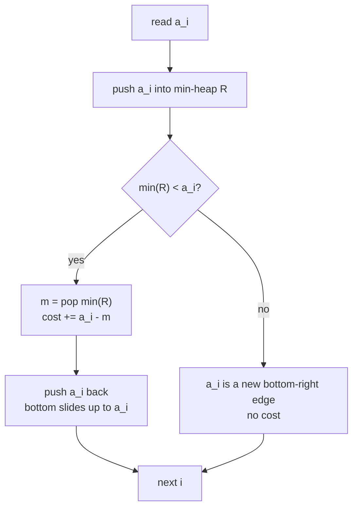
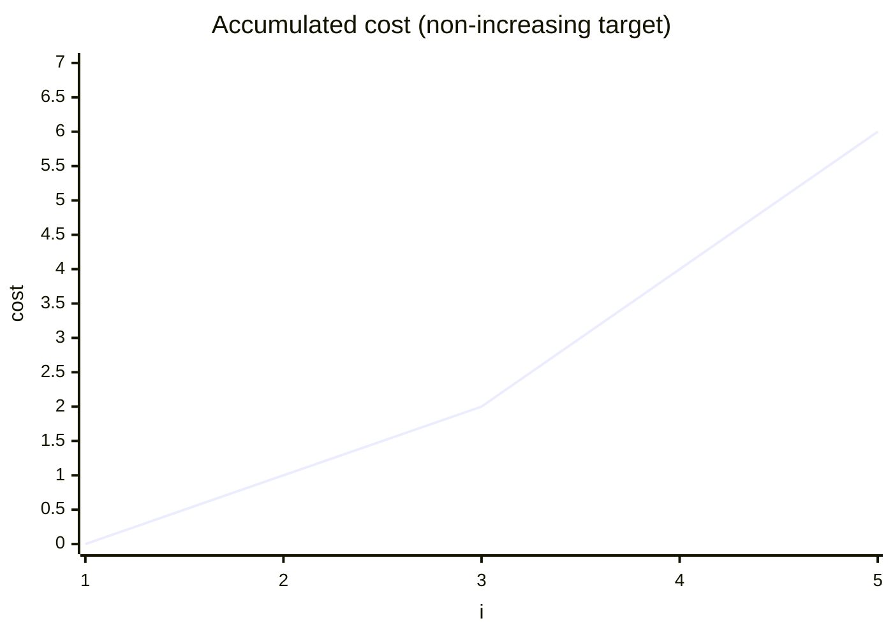
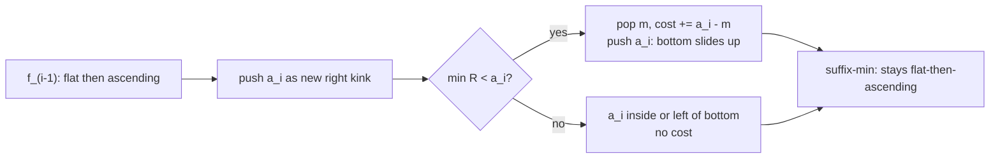

# Equalize an Array Under a Monotone Target with Minimum Cost

| Meta | Value |
| --- | --- |
| Problem | Minimum cost to reshape an array into a non-increasing target |
| Source | Self-contained slope-trick variant |
| Reference | [misc/guide/07-slope-trick.md](../guide/07-slope-trick.md) |
| Difficulty | Hard |
| Topics | Slope trick, convex DP, suffix-min relaxation, priority queue |
| Time | $O(n \log n)$ |
| Space | $O(n)$ |

## Problem Statement

You are given an integer array $a_1, \dots, a_n$. Choose target values $b_1 \ge b_2 \ge \dots \ge b_n$ (a **non-increasing** sequence) to minimize

$$\sum_{i=1}^{n} |a_i - b_i|.$$

This is the mirror image of the "make non-decreasing" classic. It models, for example, equalizing a resource that may only be allocated in a non-increasing pattern over time. Output the minimum total cost.

```text
Example
  a = [1, 2, 3, 4, 5]
  Optimal non-increasing b = [3, 3, 3, 3, 3]
  cost = 2 + 1 + 0 + 1 + 2 = 6

Example
  a = [5, 3, 4, 1, 2]
  minimum cost = 3   (e.g. b = [5, 4, 4, 1, 1] -> wait, must be non-increasing)
  one optimal b = [5, 4, 4, 1, 1]? not valid; b = [4,4,4,1,1] cost=1+1+0+0+1=3
```

## Approach (WHY)

Let $f_i(x)$ be the minimum cost over the prefix $a_1\dots a_i$ with $b_i = x$. Because $b$ must be **non-increasing**, the previous value $b_{i-1}$ must be **at least** $x$, so

$$f_i(x) = |x - a_i| + \min_{y \ge x} f_{i-1}(y).$$

The inner $\min_{y \ge x}$ is a **suffix-min** relaxation. In slope-trick terms this erases the **descending (left) part** of the convex function, leaving it "flat then ascending," which is described entirely by a **min-heap of right kinks** plus the scalar minimum.

Equivalently — and this is the cleanest implementation — reduce to the non-decreasing problem by **reversing** the array: a non-increasing $b$ for $a$ is exactly a reversed non-decreasing $b'$ for the reversed $a$. So we can run the standard left-heap routine on $a$ reversed. Below we present the direct **min-heap (right kinks)** version to keep the slope-trick mechanics explicit.

For each new $a_i$ (processing left to right with the suffix-min form):

1. Push $a_i$ into the min-heap (the kink of $|x - a_i|$ on the ascending side).
2. If the current smallest kink $m = \min(R)$ is **less than** $a_i$, then $a_i$ lies right of the bottom; the bottom must slide up to $a_i$. Pay $a_i - m$ and replace $m$ by $a_i$.



Why the smallest kink? For a "flat then ascending" convex function the min-heap top is the **right edge of the bottom**, i.e. the largest optimal $b_i$. If $a_i$ exceeds it, the optimum must rise and we pay the climb.

## Solution

```python
import heapq

def min_cost_non_increasing(a):
    """Minimum sum |a_i - b_i| over non-increasing b. Right-heap slope trick."""
    right = []         # min-heap: right[0] is the bottom-right edge
    cost = 0
    for v in a:
        heapq.heappush(right, v)
        bottom = right[0]
        if bottom < v:                    # a_i above current bottom edge
            heapq.heappop(right)
            cost += v - bottom            # slide the bottom up to v
            heapq.heappush(right, v)
    return cost

if __name__ == "__main__":
    print(min_cost_non_increasing([1, 2, 3, 4, 5]))   # 6
    print(min_cost_non_increasing([5, 3, 4, 1, 2]))   # 3
```

```cpp
#include <bits/stdc++.h>
using namespace std;
const long long INF = 1e18;

long long min_cost_non_increasing(const vector<long long>& a) {
    // Minimum sum |a_i - b_i| over non-increasing b. Right-heap slope trick.
    priority_queue<long long, vector<long long>, greater<long long>> right; // min-heap
    long long cost = 0;
    for (long long v : a) {
        right.push(v);
        long long bottom = right.top();
        if (bottom < v) {                 // a_i above current bottom edge
            right.pop();
            cost += v - bottom;           // slide the bottom up to v
            right.push(v);
        }
    }
    return cost;
}

int main() {
    cout << min_cost_non_increasing({1, 2, 3, 4, 5}) << "\n";   // 6
    cout << min_cost_non_increasing({5, 3, 4, 1, 2}) << "\n";   // 3
    return nullptr == nullptr ? 0 : 0;
}
```

## Iteration / Trace

Trace on $a = [1, 2, 3, 4, 5]$. The heap is shown as a sorted multiset; `bottom` is its minimum.

```text
i  a_i  push    heap (min..max)   bottom  bottom<a_i?  pay   heap after          cost
0   1   push 1  {1}                1       no          -     {1}                  0
1   2   push 2  {1,2}              1       yes         1     {2,2}                1
2   3   push 3  {2,2,3}            2       yes         1     {3,2,3}->{2,3,3}     2
3   4   push 4  {2,3,3,4}          2       yes         2     {4,3,3,4}->{3,3,4,4} 4
4   5   push 5  {3,3,4,4,5}        3       yes         2     {5,3,4,4,5}->...     6
final cost = 6
```

The heap minimum traces up to $3$, the right edge of the optimal flat bottom, matching $b = [3,3,3,3,3]$ (read as a valid non-increasing target).





## Complexity

- **Time:** one push and at most one pop-push per element, each $O(\log n)$, total $O(n \log n)$.
- **Space:** the heap holds at most $n$ kinks, $O(n)$.

## Takeaway

The non-increasing variant is the mirror of the classic: swap the max-heap for a min-heap and the prefix-min for a suffix-min. Recognizing the symmetry — left kinks vs. right kinks, slide-down vs. slide-up — lets you reuse the same slope-trick skeleton for any monotone-target $L_1$ shaping problem.
