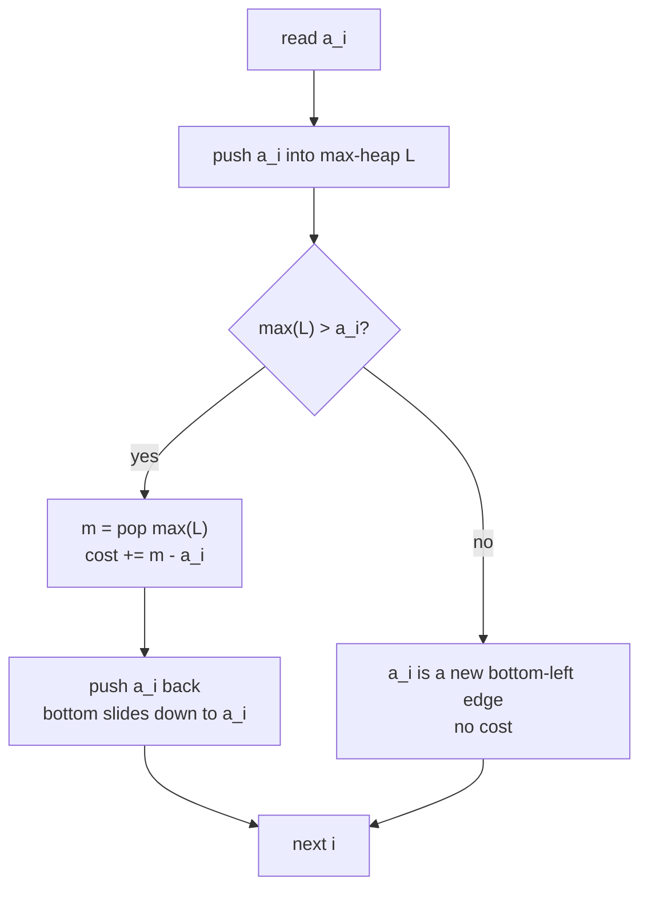
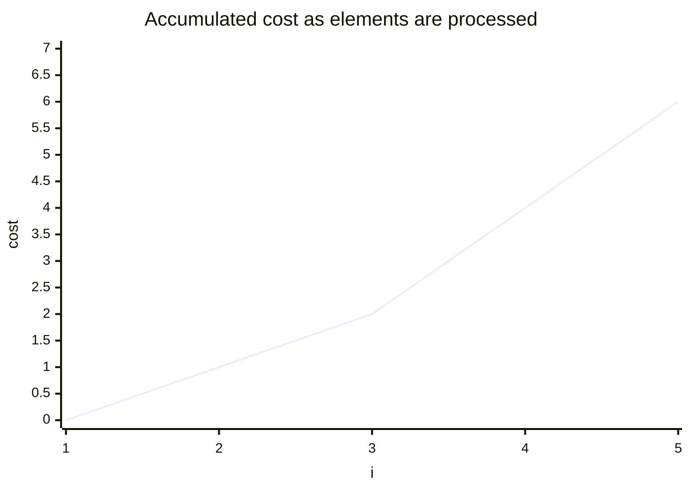

# Minimum Cost to Make an Array Non-Decreasing

| Meta | Value |
| --- | --- |
| Problem | Make an array non-decreasing with minimum total adjustment cost |
| Source | Classic (CF 713C "Sonya and Problem Without a Legend" family) |
| Reference | [misc/guide/07-slope-trick.md](../guide/07-slope-trick.md) |
| Difficulty | Hard |
| Topics | Slope trick, convex DP, priority queue, median |
| Time | $O(n \log n)$ |
| Space | $O(n)$ |

## Problem Statement

You are given an integer array $a_1, a_2, \dots, a_n$. You may change each $a_i$ to any integer $b_i$. Choose the $b_i$ so that the array $b$ is **non-decreasing** ($b_1 \le b_2 \le \dots \le b_n$) and the **total cost**

$$\sum_{i=1}^{n} |a_i - b_i|$$

is minimized. Output that minimum total cost.

```text
Example
  a = [5, 4, 3, 2, 1]
  One optimal b = [3, 3, 3, 3, 3]
  cost = |5-3| + |4-3| + |3-3| + |2-3| + |1-3|
       = 2 + 1 + 0 + 1 + 2 = 6

Example
  a = [2, 1, 5, 11, 5, 9, 11, 8]
  minimum cost = 9
```

(If "strictly increasing" is required, subtract $i$ from $a_i$ first to reduce to the non-decreasing case; this write-up solves the non-decreasing version.)

## Approach (WHY)

Process elements left to right. Let $f_i(x)$ be the minimum cost to fix the prefix $a_1\dots a_i$ given that the last chosen value $b_i = x$. The recurrence is

$$f_i(x) = |x - a_i| + \min_{y \le x} f_{i-1}(y).$$

The inner $\min_{y \le x}$ encodes the constraint $b_{i-1} \le b_i$: the previous value may be anything at most $x$, so we take the running prefix-minimum of $f_{i-1}$. Adding $|x - a_i|$ keeps the function convex and piecewise-linear, and the prefix-min keeps it **descending then flat**. By the structural argument in the guide, such a function is fully described by a **max-heap of its left kinks** plus a scalar minimum.

For each new $a_i$:

1. Push $a_i$ into the max-heap (introduce the kink of $|x - a_i|$).
2. If the current largest kink $m = \max(L)$ exceeds $a_i$, then $a_i$ lies left of the bottom; the bottom must slide down to $a_i$. Pay $m - a_i$ and replace $m$ by $a_i$.

The accumulated payment is the answer. The largest element of the heap behaves like a **running weighted median** of the "clamped" prefix — paying $m - a_i$ is the cost of pulling the median down to respect monotonicity.



Why $\max(L)$ and not the smallest? The left heap stores the descending kinks; its top is the **left edge of the flat bottom**, i.e. the smallest optimal $b_i$. If $a_i$ is below that edge, the optimum must move down and we incur cost equal to the drop.

## Solution

```python
import heapq

def min_cost_non_decreasing(a):
    """Minimum sum |a_i - b_i| over non-decreasing b. O(n log n) slope trick."""
    left = []          # max-heap via negation: -left[0] is the bottom-left edge
    cost = 0
    for v in a:
        heapq.heappush(left, -v)
        top = -left[0]
        if top > v:                       # a_i below current bottom edge
            heapq.heappop(left)
            cost += top - v               # slide the bottom down to v
            heapq.heappush(left, -v)
    return cost

if __name__ == "__main__":
    print(min_cost_non_decreasing([5, 4, 3, 2, 1]))                 # 6
    print(min_cost_non_decreasing([2, 1, 5, 11, 5, 9, 11, 8]))      # 9
```

```cpp
#include <bits/stdc++.h>
using namespace std;
const long long INF = 1e18;

long long min_cost_non_decreasing(const vector<long long>& a) {
    // Minimum sum |a_i - b_i| over non-decreasing b. O(n log n) slope trick.
    priority_queue<long long> left;       // max-heap: top is the bottom-left edge
    long long cost = 0;
    for (long long v : a) {
        left.push(v);
        long long top = left.top();
        if (top > v) {                    // a_i below current bottom edge
            left.pop();
            cost += top - v;              // slide the bottom down to v
            left.push(v);
        }
    }
    return cost;
}

int main() {
    cout << min_cost_non_decreasing({5, 4, 3, 2, 1}) << "\n";              // 6
    cout << min_cost_non_decreasing({2, 1, 5, 11, 5, 9, 11, 8}) << "\n";   // 9
    return nullptr == nullptr ? 0 : 0;
}
```

## Iteration / Trace

Trace on $a = [5, 4, 3, 2, 1]$. The heap is shown as a sorted multiset; `top` is its maximum.

```text
i  a_i  push    heap (max..min)   top  top>a_i?  pay   heap after        cost
0   5   push 5  {5}                5     no       -    {5}                 0
1   4   push 4  {5,4}              5     yes      1    {4,4}               1
2   3   push 3  {4,4,3}            4     yes      1    {3,4,3}->{4,3,3}    2
3   2   push 2  {4,3,3,2}          4     yes      2    {2,3,3,2}->{3,3,2,2} 4
4   1   push 1  {3,3,2,2,1}        3     yes      2    {1,3,2,2,2}->...    6
final cost = 6
```

The top of the heap traces the value $3$ at the end — the left edge of the optimal flat bottom, consistent with $b = [3,3,3,3,3]$.



## Complexity

- **Time:** each element triggers at most one push and one pop-push, each $O(\log n)$, for $O(n \log n)$ overall.
- **Space:** the heap holds at most $n$ kinks, $O(n)$.

## Takeaway

The constraint "make it non-decreasing at minimum $L_1$ cost" collapses to a single max-heap: push each value, and whenever it lands below the current bottom edge, pay the drop and pull the edge down. This is slope trick stripped to its essence — the right (ascending) half of the convex function is never needed because the next prefix-min would erase it anyway.
