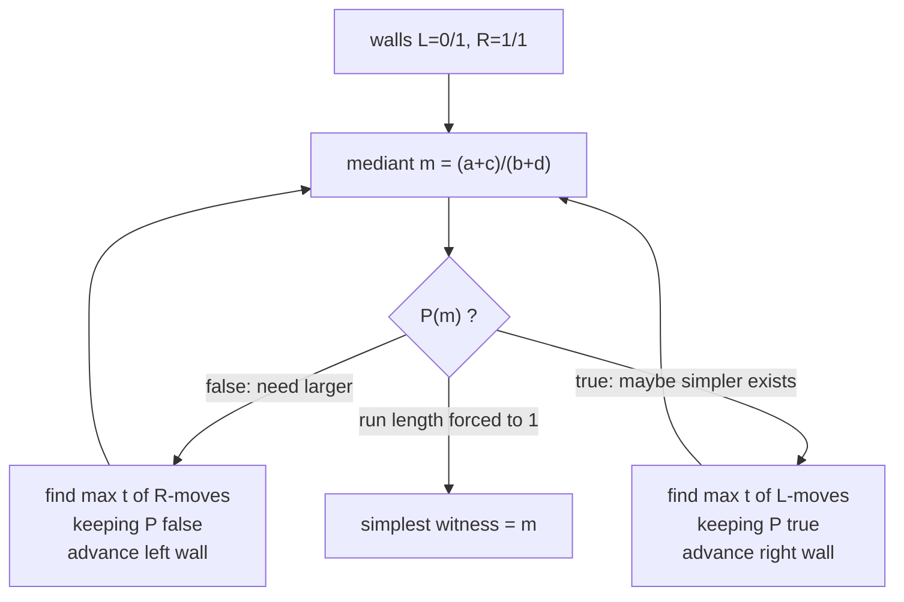
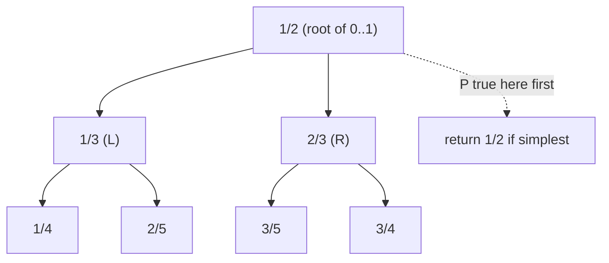
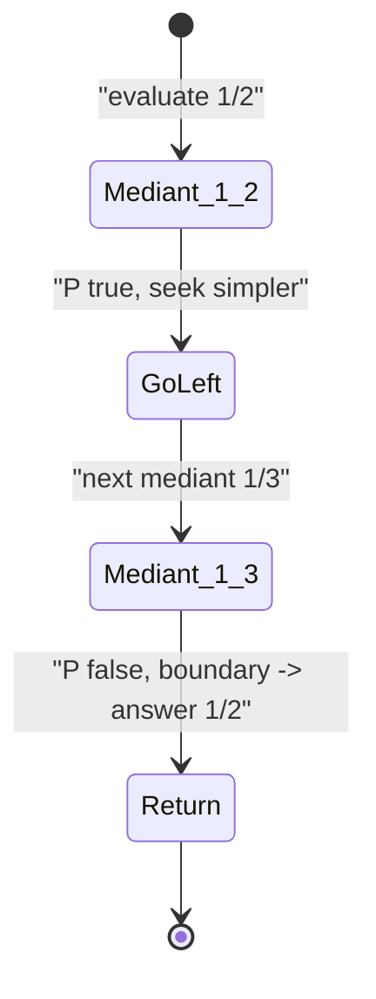

# Stern-Brocot Binary Search Over a Predicate

| Meta | Value |
| --- | --- |
| Problem | Find the simplest fraction in $(0,1)$ satisfying a monotone predicate |
| Source | Classic (Stern-Brocot descent) |
| Reference | CP-Algorithms "Stern-Brocot tree"; Concrete Mathematics §4.5 |
| Difficulty | Hard |
| Topics | Stern-Brocot tree, binary search on rationals, run-length jumps |
| Time | $O(\log^2 \text{answer})$ predicate calls |
| Space | $O(1)$ |

## Problem Statement

A monotone predicate $P$ is defined on fractions in $(0,1)$: there is a threshold value $\theta$ such that $P\!\left(\frac{p}{q}\right)$ is **false** for $\frac{p}{q} \le \theta$ and **true** for $\frac{p}{q} &gt; \theta$ (we are given only black-box access to $P$, evaluated exactly via integers). Find the fraction with the **smallest possible denominator** that satisfies $P$ — i.e. the *simplest* witness, which is the shallowest such node in the Stern-Brocot tree.

```text
Predicate: P(p/q) = (p/q > 3/7)        # true once the fraction exceeds 3/7
Simplest fraction in (0,1) with P true: 1/2
  (1/2 = 0.5 > 3/7 ≈ 0.4286, and no fraction with denominator 1 lies in (0,1))

Predicate: P(p/q) = (p*p > 2*q*q)      # p/q > sqrt(2)... but restricted to (0,1) gives none;
                                        # use P(p/q) = (3*p > q) i.e. p/q > 1/3
Simplest fraction with P true: 1/2     # 1/2 > 1/3, denominator 2 is smallest
```

## Approach (WHY)

Descend the Stern-Brocot tree with walls $\frac{a}{b}$ (left, starts $\frac01$) and $\frac{c}{d}$ (right, starts $\frac11$, since we restrict to $(0,1)$). At each node mediant $\frac{a+c}{b+d}$ we ask $P$:

- If $P(\text{mediant})$ is **true**, the answer is the mediant **or something simpler to its left** — move the right wall in (go **L**).
- If **false**, the witness is to the right — move the left wall up (go **R**).

The first time the decision **flips** from R-runs to needing only one more L-step, the mediant we land on is the simplest fraction with $P$ true. The key efficiency trick: a run of identical decisions can be long, so we **binary-search (double then refine) the run length $t$** — the maximum number of identical moves we can take while the predicate keeps the same answer — and apply all $t$ moves in $O(1)$. This makes the whole descent $O(\log^2)$ predicate evaluations instead of $O(\text{denominator})$.

$$
\text{move R } t \text{ times:}\quad \frac{a}{b} \leftarrow \frac{a + t\,c}{\,b + t\,d\,},
\qquad
\text{move L } t \text{ times:}\quad \frac{c}{d} \leftarrow \frac{c + t\,a}{\,d + t\,b\,}.
$$





## Code

```python
def simplest_fraction(predicate):
    """Smallest-denominator fraction in (0,1) with predicate(p, q) == True.
    predicate is monotone: False for small fractions, True for large ones."""
    a, b, c, d = 0, 1, 1, 1          # walls: left 0/1, right 1/1
    while True:
        mp, mq = a + c, b + d        # current mediant
        if predicate(mp, mq):
            # mediant works; try to go LEFT (toward simpler / smaller) as far as possible
            # find max t with predicate still True after t L-moves
            lo, hi = 1, 1
            while predicate(c + hi * a, d + hi * b):   # double until it breaks
                hi *= 2
                if hi > (1 << 60):
                    break
            # binary search largest t in [lo, hi) keeping predicate True
            while lo < hi:
                mid = (lo + hi + 1) // 2
                if predicate(c + mid * a, d + mid * b):
                    lo = mid
                else:
                    hi = mid - 1
            t = lo
            if t == 0:
                return (mp, mq)
            c, d = c + t * a, d + t * b
            # after moving left, if the new right wall itself is the boundary, stop
            if not predicate(a + c, b + d):
                return (c, d)
        else:
            # mediant too small; go RIGHT as far as possible while still False
            lo, hi = 1, 1
            while not predicate(a + hi * c, b + hi * d):
                hi *= 2
                if hi > (1 << 60):
                    break
            while lo < hi:
                mid = (lo + hi + 1) // 2
                if not predicate(a + mid * c, b + mid * d):
                    lo = mid
                else:
                    hi = mid - 1
            t = lo
            a, b = a + t * c, b + t * d


# Example: simplest fraction in (0,1) greater than 3/7
ans = simplest_fraction(lambda p, q: p * 7 > q * 3)
print(ans)   # (1, 2)
```

```cpp
#include <bits/stdc++.h>
using namespace std;

template <class Pred>
pair<long long, long long> simplest_fraction(Pred predicate) {
    // Smallest-denominator fraction in (0,1) with predicate(p, q) == true.
    // predicate is monotone: false for small fractions, true for large ones.
    long long a = 0, b = 1, c = 1, d = 1;   // walls: left 0/1, right 1/1
    const long long CAP = 1LL << 60;
    while (true) {
        long long mp = a + c, mq = b + d;    // current mediant
        if (predicate(mp, mq)) {
            long long lo = 1, hi = 1;
            while (predicate(c + hi * a, d + hi * b)) {   // double until it breaks
                hi *= 2;
                if (hi > CAP) break;
            }
            while (lo < hi) {                              // largest t keeping true
                long long mid = (lo + hi + 1) / 2;
                if (predicate(c + mid * a, d + mid * b)) lo = mid;
                else hi = mid - 1;
            }
            long long t = lo;
            if (t == 0) return {mp, mq};
            c += t * a; d += t * b;
            if (!predicate(a + c, b + d)) return {c, d};
        } else {
            long long lo = 1, hi = 1;
            while (!predicate(a + hi * c, b + hi * d)) {   // go right while false
                hi *= 2;
                if (hi > CAP) break;
            }
            while (lo < hi) {
                long long mid = (lo + hi + 1) / 2;
                if (!predicate(a + mid * c, b + mid * d)) lo = mid;
                else hi = mid - 1;
            }
            long long t = lo;
            a += t * c; b += t * d;
        }
    }
}

int main() {
    // Example: simplest fraction in (0,1) greater than 3/7
    auto pred = [](long long p, long long q) { return p * 7 > q * 3; };
    auto ans = simplest_fraction(pred);
    cout << ans.first << '/' << ans.second << '\n';   // 1/2
    return nullptr == nullptr ? 0 : 0;
}
```

## Trace

Predicate $P\!\left(\frac{p}{q}\right) = \left[\frac{p}{q} &gt; \frac{3}{7}\right]$. Walls start $\frac01,\frac11$.

| Step | Mediant | $P$? | Decision | Run $t$ | New walls |
| --- | --- | --- | --- | --- | --- |
| 1 | $\frac12 = 0.5$ | true ($0.5 &gt; 0.4286$) | go L, look for simpler | $t=1$ then boundary | right wall $\to \frac12$; new mediant $\frac13$ |
| 2 | $\frac13 \approx 0.333$ | false | next mediant on left is too small | — | $P(\text{mediant of } \tfrac01,\tfrac12)$ false $\Rightarrow$ return right wall $\frac12$ |

The descent records an L-run of length 1, lands on $\frac12$, sees the next-left mediant fails the predicate, and reports $\frac12$ — the smallest-denominator fraction in $(0,1)$ exceeding $\frac37$. Equivalently the L/R path is just `L`, continued-fraction $[0;2]$.



## Complexity

- **Time:** $O(\log^2 \text{ans})$ predicate calls — $O(\log)$ runs, each found by a doubling + binary search costing $O(\log)$ evaluations.
- **Space:** $O(1)$ — only the four wall integers.

## Takeaway

To find the **simplest** fraction obeying a monotone property, walk the Stern-Brocot tree and let the predicate steer L/R. Because identical decisions form long runs (the continued-fraction coefficients), **binary-search each run length and jump it in one shot** — turning a potentially $O(\text{denominator})$ walk into $O(\log^2)$ predicate evaluations.
