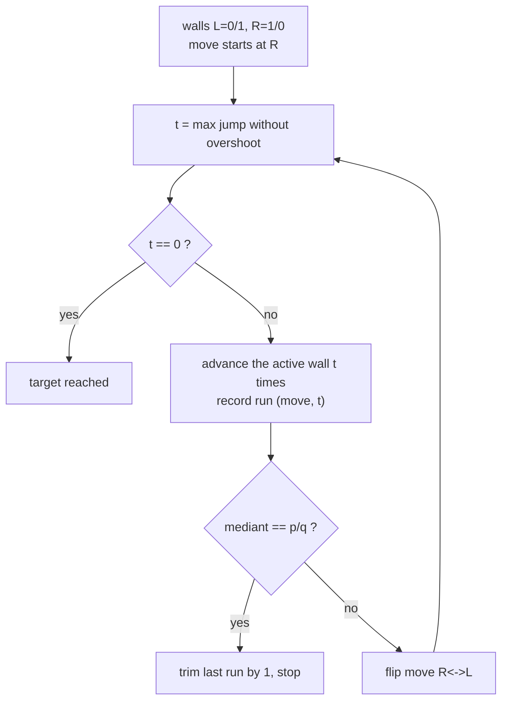
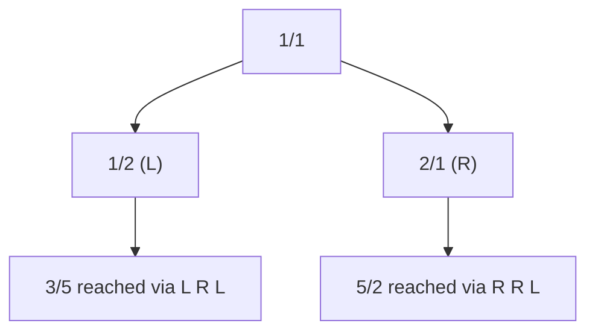
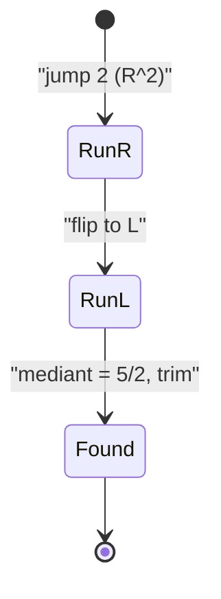

# Stern-Brocot: Locate a Fraction (L/R Path)

| Meta | Value |
| --- | --- |
| Problem | Output the L/R path of a reduced fraction $p/q$ in the Stern-Brocot tree |
| Source | Classic (Stern-Brocot / continued fractions) |
| Reference | Concrete Mathematics §4.5; CP-Algorithms "Stern-Brocot tree" |
| Difficulty | Medium |
| Topics | Number theory, continued fractions, binary search tree of rationals |
| Time | $O(\log(p+q))$ |
| Space | $O(\log(p+q))$ |

## Problem Statement

Given a positive **reduced** fraction $\frac{p}{q}$ (so $\gcd(p,q)=1$), output the unique sequence of **L** and **R** moves that walks from the root $\frac11$ of the Stern-Brocot tree to $\frac{p}{q}$. Because a path can contain millions of identical moves, also output it in **run-length form** — which, as we will see, is exactly the continued-fraction expansion.

```text
Input:  p = 3, q = 5
Path (expanded):     L R L
Path (run-length):   L^1 R^1 L^1
CF of 3/5:           [0; 1, 1, 2]   -> directions L,R,L with the last run trimmed by 1

Input:  p = 5, q = 2
Path (expanded):     R R L
Path (run-length):   R^2 L^1
CF of 5/2:           [2; 2]
```

## Approach (WHY)

Keep two **walls**: a left wall $\frac{a}{b}$ (starts $\frac01$) and a right wall $\frac{c}{d}$ (starts $\frac10$). The current node is their mediant $\frac{a+c}{b+d}$. Compare the target with the mediant using **integer cross-multiplication** (never floats):

$$\frac{p}{q} \;?\; \frac{a+c}{b+d} \quad\Longleftrightarrow\quad p\,(b+d) \;?\; (a+c)\,q.$$

If the target is larger we move **R** (push the left wall up to the mediant); if smaller we move **L** (push the right wall down). The catch: a run of identical moves can be astronomically long. Instead of stepping once, we compute the **largest jump count $t$** that keeps us from overshooting and apply it in $O(1)$:

$$\frac{a + t\,c}{b + t\,d} \le \frac{p}{q} \quad\Longrightarrow\quad t = \left\lfloor \frac{p\,b - q\,a}{\,q\,c - p\,d\,} \right\rfloor \text{ (for an R-run).}$$

These jump counts are precisely the continued-fraction coefficients of $\frac{p}{q}$ — the run-length encoding of the path **equals** $[a_0; a_1, a_2, \dots]$.





## Code

```python
def locate_fraction(p, q):
    """Return the Stern-Brocot path to reduced p/q as a list of (move, run_length)."""
    a, b, c, d = 0, 1, 1, 0          # left wall a/b, right wall c/d
    runs = []
    move = 'R'                       # first run heads toward larger values
    while True:
        if move == 'R':
            den = q * c - p * d      # how far right before reaching/overshooting
            t = (p * b - q * a) // den if den != 0 else 0
        else:
            den = p * d - q * c
            t = (q * a - p * b) // den if den != 0 else 0
        if t <= 0:
            break
        if move == 'R':
            a, b = a + t * c, b + t * d
            reached = (a == p and b == q)
        else:
            c, d = c + t * a, d + t * b
            reached = (c == p and d == q)
        runs.append((move, t))
        if reached:
            runs[-1] = (move, t - 1)   # last mediant is the target itself
            if runs[-1][1] == 0:
                runs.pop()
            break
        move = 'L' if move == 'R' else 'R'
    return runs


def expand(runs):
    """Flatten run-length pairs into the full L/R string."""
    return ''.join(mv * cnt for mv, cnt in runs)


runs = locate_fraction(3, 5)
print(runs)            # [('R', 1), ('L', 1), ...]
print(expand(runs))    # full path string
```

```cpp
#include <bits/stdc++.h>
using namespace std;

vector<pair<char, long long>> locate_fraction(long long p, long long q) {
    // Return the Stern-Brocot path to reduced p/q as (move, run_length) pairs.
    long long a = 0, b = 1, c = 1, d = 0;   // left wall a/b, right wall c/d
    vector<pair<char, long long>> runs;
    char move = 'R';                         // first run heads toward larger values
    while (true) {
        long long t = 0;
        if (move == 'R') {
            long long den = q * c - p * d;
            t = (den != 0) ? (p * b - q * a) / den : 0;
        } else {
            long long den = p * d - q * c;
            t = (den != 0) ? (q * a - p * b) / den : 0;
        }
        if (t <= 0) break;
        bool reached = false;
        if (move == 'R') {
            a += t * c; b += t * d;
            reached = (a == p && b == q);
        } else {
            c += t * a; d += t * b;
            reached = (c == p && d == q);
        }
        runs.push_back({move, t});
        if (reached) {
            runs.back().second -= 1;          // last mediant is the target itself
            if (runs.back().second == 0) runs.pop_back();
            break;
        }
        move = (move == 'R') ? 'L' : 'R';
    }
    return runs;
}

string expand(const vector<pair<char, long long>> &runs) {
    string s;
    for (auto &r : runs) s.append(r.second, r.first);
    return s;
}

int main() {
    auto runs = locate_fraction(3, 5);
    for (auto &r : runs) cout << r.first << r.second << ' ';
    cout << '\n' << expand(runs) << '\n';
    return 0;
}
```

## Trace

Locating $\frac{5}{2}$ starting from walls $\frac01,\frac10$ (mediant $\frac11$):

| Step | Move | Jump $t$ | New walls | Mediant | Note |
| --- | --- | --- | --- | --- | --- |
| 1 | R | 2 | left $=\frac21$, right $=\frac10$ | $\frac31$ | $\frac52 &gt; \frac11$, jump 2 R's |
| 2 | L | 1 | left $=\frac21$, right $=\frac31$ | $\frac52$ | mediant equals target; trim |

Run-length path: $R^2\,L^1$. Continued fraction of $\frac52$ is $[2;2]$, and indeed the run lengths are $2$ and $2$ (the final $L$-run is the trimmed last coefficient). The expanded path is `R R L`.



## Complexity

- **Time:** $O(\log(p+q))$ — the number of runs equals the number of continued-fraction coefficients, each handled in $O(1)$.
- **Space:** $O(\log(p+q))$ for the run-length output.

## Takeaway

Locating a fraction in the Stern-Brocot tree is the Euclidean algorithm in disguise: the **run-length encoding of the L/R path is the continued fraction**. Jump whole runs at once to stay $O(\log)$ even when a coefficient — and hence a literal run of moves — is enormous.
