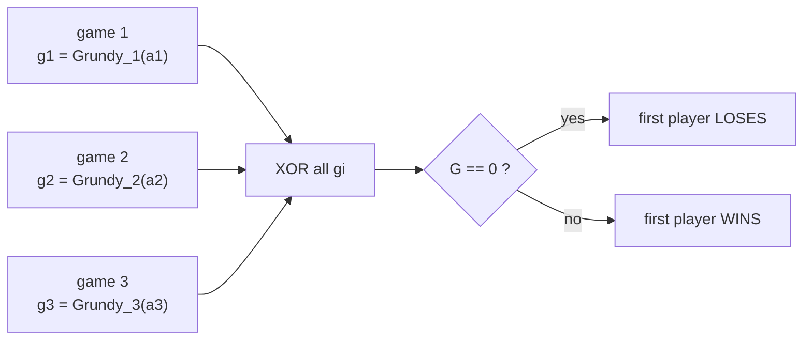
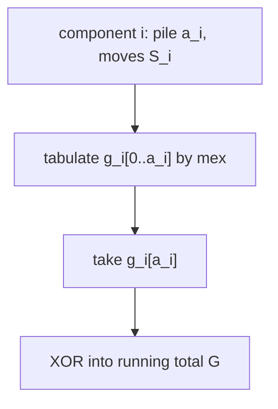
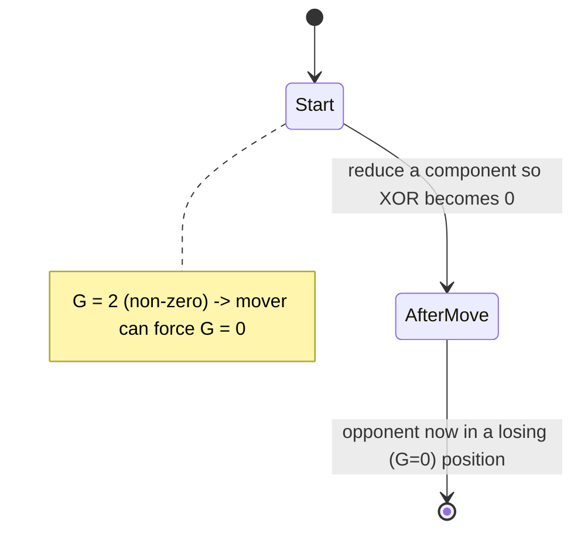
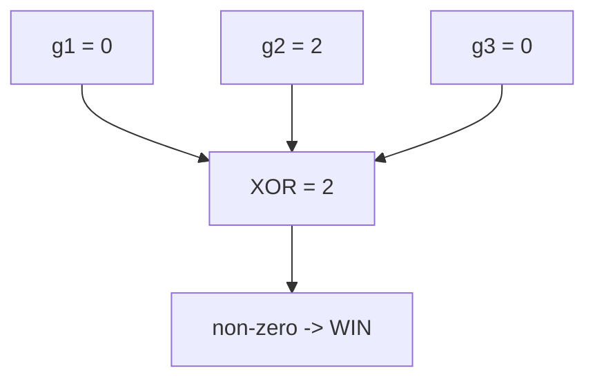

# Stone Game — Sum of Independent Games via XOR of Grundy Values

| Meta | Value |
|------|-------|
| Problem | Several independent stone games run in parallel; combine by XOR of Grundy values |
| Source | Classic Sprague-Grundy "sum of games" exercise |
| Reference | https://cp-algorithms.com/game_theory/sprague-grundy-nim.html |
| Difficulty | Medium |
| Topics | Game Theory, Sprague-Grundy, Grundy Numbers, Game Sum, XOR |
| Time | $O(\sum N_i\,\lvert S_i\rvert)$ |
| Space | $O(\max N_i)$ |

---

## Problem Statement

You are given `k` **independent** stone games played simultaneously. A turn consists of making one
legal move in **exactly one** of the games (your choice). Game `i` is a single pile of `a_i` stones
with its own move set `S_i` (allowed removals). The player who **cannot move in any game loses**
(normal play). Determine whether the **first player wins**.

```text
Input:
  game 1: a = 6 , S = [1, 2]        # subtract 1 or 2
  game 2: a = 4 , S = [2, 4]        # subtract 2 or 4
  game 3: a = 7 , S = [1, 4, 5]     # subtract 1, 4 or 5
Output:
  first player WINS
```

---

## Approach (WHY)

This is the textbook **sum of games**. By the Sprague-Grundy theorem each game `i` is equivalent to
a Nim pile of size `g_i = Grundy_i(a_i)`. A move touches exactly one component, so the combined game
**is Nim** on the values `g_1, ..., g_k`, and the position is losing for the mover iff their XOR is
zero:

$$
G = g_1 \oplus g_2 \oplus \dots \oplus g_k, \qquad
g_i = \operatorname{mex}\{\, g_i(a_i - s) : s \in S_i,\; s \le a_i \,\}.
$$

First player wins $\iff G \neq 0$.



Each component's Grundy value is built independently with its own move set:



```python
def mex(values):
    seen = set(values)
    n = 0
    while n in seen:
        n += 1
    return n


def grundy_pile(a, S):
    """Grundy value of a single pile of size a under move set S."""
    g = [0] * (a + 1)
    for n in range(1, a + 1):
        g[n] = mex(g[n - s] for s in S if s <= n)
    return g[a]


def first_player_wins(games):
    """games: list of (a_i, S_i). Returns True if the first player wins."""
    total = 0
    for a, S in games:
        total ^= grundy_pile(a, S)          # XOR of independent games
    return total != 0
```

```cpp
#include <bits/stdc++.h>
using namespace std;

long long mex(const vector<long long>& values) {
    unordered_set<long long> seen(values.begin(), values.end());
    long long n = 0;
    while (seen.count(n)) ++n;
    return n;
}

long long grundy_pile(long long a, const vector<long long>& S) {
    // Grundy value of a single pile of size a under move set S.
    vector<long long> g(a + 1, 0);
    for (long long n = 1; n <= a; ++n) {
        vector<long long> reach;
        for (long long s : S) if (s <= n) reach.push_back(g[n - s]);
        g[n] = mex(reach);
    }
    return g[a];
}

bool first_player_wins(const vector<pair<long long, vector<long long>>>& games) {
    // games: list of (a_i, S_i). Returns true if the first player wins.
    long long total = 0;
    for (const auto& [a, S] : games) total ^= grundy_pile(a, S);  // XOR of independent games
    return total != 0;
}
```

---

## Trace

```text
game 1: a=6, S={1,2}
  g:  n  0 1 2 3 4 5 6
         0 1 2 0 1 2 0      (period 3)   -> g1 = g[6] = 0
game 2: a=4, S={2,4}
  g:  n  0 1 2 3 4
         0 0 1 1 2          -> g2 = g[4] = 2
game 3: a=7, S={1,4,5}
  g:  n  0 1 2 3 4 5 6 7
         0 1 0 1 2 3 2 0    -> g3 = g[7] = 0

G = g1 XOR g2 XOR g3 = 0 XOR 2 XOR 0 = 2 != 0  -> first player WINS
```

A winning first move sets `G` to 0: here lower game 2's component from Grundy 2 to Grundy 0 (remove
4 stones, reaching pile size 0 with Grundy 0), making the XOR `0 XOR 0 XOR 0 = 0`.





---

## Complexity

- Each component `i`: $O(N_i\,\lvert S_i\rvert)$ time, $O(N_i)$ space to tabulate Grundy values.
- Combining: $O(k)$ XOR operations.
- Total: $O\big(\sum_i N_i\,\lvert S_i\rvert\big)$ time, $O(\max_i N_i)$ space if tables are reused.

---

## Takeaway

A **sum of independent impartial games** reduces to **Nim on Grundy values**: compute each
component's Grundy number with `mex`, **XOR** them all, and the first player wins iff the result is
non-zero. The winning move is always "drive the global XOR to zero" by adjusting a single component.
